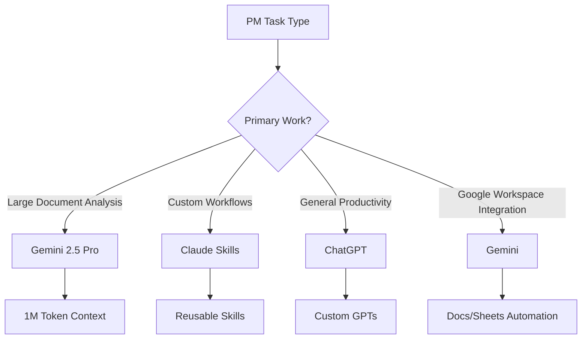
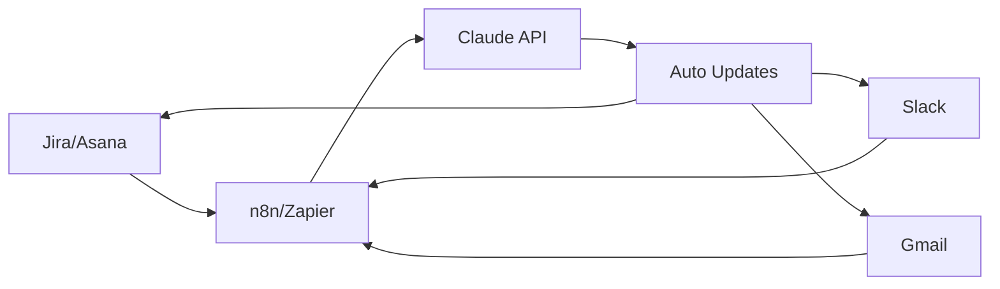
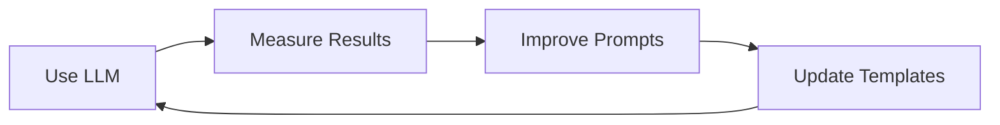

## Introduction

A project manager's day is packed with meetings, status updates, risk management, and stakeholder communication. In 2025, the advancement of LLM (Large Language Model) technology has made it possible to automate these repetitive tasks, allowing PMs to <strong>focus on strategic decision-making and team leadership</strong>.

This post explores how to leverage cutting-edge LLM tools like ChatGPT, Claude, and Gemini to streamline PM workflows, backed by real-world case studies and implementation strategies.

## Why PM Workflow Automation Matters

### Current Challenges Facing PMs

Recent research shows that <strong>60-70% of a PM's time is spent on repetitive administrative tasks</strong>:

- Writing and summarizing meeting notes
- Creating progress reports
- Responding to emails and Slack messages
- Updating project documentation
- Tracking risks and issues

### Benefits of LLM Adoption

Organizations that have implemented LLMs report impressive results:

- <strong>14,976 hours saved annually</strong> (Asana Intelligence case study)
- <strong>65% reduction in planning effort</strong>
- <strong>60% improvement in forecast accuracy</strong>
- 30% faster customer response time

## Comparing Major LLM Tools

### 1. ChatGPT (OpenAI)

<strong>Strengths</strong>:
- Most versatile and user-friendly interface
- Fast response with GPT-4o and multimodal capabilities
- Custom GPTs for PM-specific workflows
- Large community and plugin ecosystem

<strong>PM Use Cases</strong>:
```markdown
Example Prompt:
"Summarize the following meeting notes and extract action items:
[Paste meeting notes]

Format:
- Key Decisions
- Action Items (with assignee and deadline)
- Items Requiring Follow-up"
```

<strong>Limitations</strong>:
- Context window limit (GPT-4o: 128K tokens)
- Limited real-time web search

### 2. Claude (Anthropic)

<strong>Strengths</strong>:
- <strong>200K token context window</strong> for processing large documents
- Claude Skills for PM-specific customization
- Artifacts feature for structured outputs
- Safe and ethical AI responses

<strong>PM Use Cases</strong>:
```markdown
Claude Skills Example: "PRD Generator"

Input: Project overview, objectives, constraints
Output:
1. Project Background and Goals
2. Functional Requirements (with priorities)
3. Non-Functional Requirements
4. Success Metrics (KPIs)
5. Risks and Dependencies
6. Timeline Draft
```

<strong>Limitations</strong>:
- No image generation capability
- Smaller plugin ecosystem than ChatGPT

### 3. Gemini (Google)

<strong>Strengths</strong>:
- <strong>1M token context window</strong> (Gemini 2.5 Pro)
- Google Workspace integration (Docs, Sheets, Gmail)
- Multimodal capabilities (text, image, code, audio, video)
- Fast Gemini Flash model for real-time processing

<strong>PM Use Cases</strong>:
```python
# Automate project risk analysis with Gemini API
import google.generativeai as genai

genai.configure(api_key='YOUR_API_KEY')
model = genai.GenerativeModel('gemini-2.5-pro')

prompt = """
Analyze the following project status report and identify potential risks:
[Status Report]

Output Format:
1. High Risks (Impact: High, Probability: High)
2. Medium Risks (Impact: Medium, Probability: Medium)
3. Low Risks (Impact: Low, Probability: Low)
4. Mitigation Strategies for Each Risk
"""

response = model.generate_content(prompt)
print(response.text)
```

<strong>Limitations</strong>:
- Not as widely adopted as ChatGPT
- Some features require paid Google Workspace subscription

### Tool Selection Guide



## Automatable PM Daily Tasks

### 1. Meeting Management

<strong>Before Automation</strong>:
- Manual note-taking: 30 min
- Organizing action items: 15 min
- Sending follow-up emails: 10 min
- <strong>Total: 55 min/meeting</strong>

<strong>After Automation (Claude + n8n)</strong>:
```javascript
// n8n workflow example
{
  "nodes": [
    {
      "name": "Zoom Webhook",
      "type": "n8n-nodes-base.webhook",
      "position": [250, 300]
    },
    {
      "name": "Claude API",
      "type": "n8n-nodes-base.httpRequest",
      "parameters": {
        "url": "https://api.anthropic.com/v1/messages",
        "method": "POST",
        "body": {
          "model": "claude-sonnet-4.5",
          "messages": [{
            "role": "user",
            "content": "Summarize meeting transcript and extract action items: {{$json.transcript}}"
          }]
        }
      },
      "position": [450, 300]
    },
    {
      "name": "Send Email",
      "type": "n8n-nodes-base.gmail",
      "position": [650, 300]
    }
  ]
}
```

<strong>Result</strong>: Post-meeting processing time reduced from <strong>55 min → 5 min (91% reduction)</strong>

### 2. Progress Report Creation

<strong>Prompt Template</strong>:
```markdown
Role: You are an experienced project manager.

Input Data:
- Last week's completed tasks: [Extract from Jira/Asana]
- This week's planned tasks: [Reference roadmap]
- Risks and issues: [Risk register]
- Team resource status: [Resource management tool]

Output Format:
## Weekly Progress Report (Week XX, 2025)

### 📊 Summary
- Overall Progress: X%
- Completed Tasks: X
- In-Progress Tasks: X
- Risk Status: 🟢 Low / 🟡 Medium / 🔴 High

### ✅ This Week's Completions
1. [Task name] - [Assignee]
2. ...

### 🚀 Next Week's Plan
1. [Task name] - [Assignee] - [Due date]
2. ...

### ⚠️ Risks and Blockers
1. [Risk description] - [Impact] - [Mitigation plan]
2. ...

### 💡 Key Decisions Needed
1. ...
```

<strong>Time Savings</strong>: <strong>2 hours → 15 min (87.5% reduction)</strong>

### 3. Email and Slack Response Automation

<strong>Gmail + Claude Integration</strong>:
```python
# Auto-generate email drafts with Gmail API + Claude
from googleapiclient.discovery import build
import anthropic

def draft_email_response(email_content, context):
    client = anthropic.Anthropic(api_key="YOUR_API_KEY")

    prompt = f"""
    Draft a professional response to the following email.

    Original Email:
    {email_content}

    Project Context:
    {context}

    Response Tone: Professional, friendly, and concise
    """

    message = client.messages.create(
        model="claude-sonnet-4.5",
        max_tokens=1024,
        messages=[{"role": "user", "content": prompt}]
    )

    return message.content[0].text

# Usage example
email = "Can we move the project deadline up by 2 weeks?"
context = "Currently in sprint 2/5, team at 80% capacity"
draft = draft_email_response(email, context)
print(draft)
```

### 4. Project Risk Monitoring

<strong>Gemini + BigQuery Integration</strong>:
```sql
-- Extract project metrics from BigQuery
SELECT
  task_id,
  task_name,
  assigned_to,
  due_date,
  status,
  estimated_hours,
  actual_hours,
  CASE
    WHEN actual_hours > estimated_hours * 1.5 THEN 'High Risk'
    WHEN actual_hours > estimated_hours * 1.2 THEN 'Medium Risk'
    ELSE 'Low Risk'
  END AS risk_level
FROM project_tasks
WHERE due_date BETWEEN CURRENT_DATE() AND DATE_ADD(CURRENT_DATE(), INTERVAL 7 DAY)
```

```python
# Generate risk analysis and recommendations with Gemini
import google.generativeai as genai

def analyze_project_risks(task_data):
    genai.configure(api_key='YOUR_API_KEY')
    model = genai.GenerativeModel('gemini-2.5-pro')

    prompt = f"""
    Analyze the following project task data to:
    1. Identify tasks with high deadline risk
    2. Recommend resource reallocation
    3. Draft key messages for stakeholders

    Data:
    {task_data}
    """

    response = model.generate_content(prompt)
    return response.text
```

## Implementation Strategy: Step-by-Step Roadmap

### Phase 1: Pilot Project (1-2 weeks)

<strong>Goal</strong>: Validate LLM tool effectiveness and assess team acceptance

**Steps**:
1. <strong>Tool Selection</strong>: Subscribe to ChatGPT Plus or Claude Pro
2. <strong>Use Case Selection</strong>: Start with meeting note summarization (most time-consuming task)
3. <strong>Prompt Template Development</strong>: Create 3-5 standard prompts
4. <strong>Measurement</strong>: Evaluate time savings and quality

**Success Metrics**:
- 50%+ reduction in meeting note creation time
- Team satisfaction rating of 4/5 or higher
- Zero action item miss rate

### Phase 2: Workflow Integration (2-4 weeks)

<strong>Goal</strong>: Integrate LLM with existing PM tools

**Tool Stack Example**:


**Integration Scenarios**:
1. <strong>Jira → Claude → Slack</strong>
   - Auto-analyze context when Jira issue created
   - Send priority and impact analysis to Slack

2. <strong>Gmail → Claude → Calendar</strong>
   - Auto-extract deadlines from emails
   - Create Google Calendar events automatically

3. <strong>Zoom → Claude → Notion</strong>
   - Auto-summarize meeting transcripts
   - Update Notion project pages

### Phase 3: Advanced Automation (1-2 months)

<strong>Goal</strong>: Build AI agent-based autonomous workflows

**Claude Skills Utilization**:
```markdown
# Skill: Sprint Retrospective Analyzer

## Purpose
Analyze sprint retro data to derive team productivity improvement insights

## Input
- Sprint number
- Completed story points
- Incomplete items
- Team member feedback (Keep, Problem, Try format)

## Processing
1. Analyze quantitative metrics (velocity, completion rate)
2. Extract qualitative feedback themes
3. Identify recurring issues
4. Generate improvement action items

## Output
- Sprint summary dashboard
- Team productivity trend charts
- Top 3 improvement recommendations
- Next sprint objectives
```

### Phase 4: ROI Measurement & Optimization (Ongoing)

<strong>Measurement Metrics</strong>:

| Metric | Before Automation | After Automation | Improvement |
|--------|-------------------|------------------|-------------|
| Meeting note time | 30 min/meeting | 3 min/meeting | 90% ↓ |
| Weekly report | 2 hours | 15 min | 87.5% ↓ |
| Email response | 10 min/email | 2 min/email | 80% ↓ |
| Risk identification | Weekly manual | Real-time auto | 100% ↑ |
| PM strategic work | 20% | 60% | 200% ↑ |

**ROI Calculation**:
```python
# Assuming PM hourly rate of $100
hourly_rate = 100  # USD

# Weekly hours saved
weekly_hours_saved = 15  # hours

# Annual savings
annual_savings = hourly_rate * weekly_hours_saved * 52
# = $78,000

# LLM tool costs
claude_pro_cost = 20 * 12  # $20/month
chatgpt_plus_cost = 20 * 12
total_cost = claude_pro_cost + chatgpt_plus_cost
# = $480

# ROI
roi = (annual_savings - total_cost) / total_cost * 100
# = 16,150%
```

## Best Practices

### 1. Prompt Engineering

<strong>Effective Prompt Structure</strong>:
```markdown
[Role Definition] + [Context] + [Task Description] + [Output Format] + [Constraints]

Example:
Role: You are an agile project manager with 10 years of experience.

Context:
- Project: E-commerce platform renewal
- Team: 5 members (2 frontend, 2 backend, 1 QA)
- Sprint: 2-week cycles
- Current: Sprint 3/8

Task: Review the following sprint plan and identify risks.
[Paste sprint plan]

Output Format:
1. Sprint goal achievability (High/Medium/Low)
2. Top 3 risks
3. Mitigation strategies for each risk
4. Resource reallocation recommendations

Constraints:
- Team's average velocity is 25 story points per sprint
- One backend developer will be on vacation next week
```

### 2. Data Security and Privacy

<strong>Guidelines</strong>:
- ❌ Never input customer PII directly into LLMs
- ❌ Prohibit use of public LLMs for company confidential information
- ✅ Anonymize or mask sensitive data
- ✅ Use enterprise LLM APIs (Azure OpenAI, Anthropic Enterprise)
- ✅ Check data retention policies (Claude default: 30 days)

**Data Masking Example**:
```python
import re

def mask_sensitive_data(text):
    # Mask email addresses
    text = re.sub(r'\b[A-Za-z0-9._%+-]+@[A-Za-z0-9.-]+\.[A-Z|a-z]{2,}\b',
                  '[EMAIL]', text)

    # Mask phone numbers
    text = re.sub(r'\d{3}-\d{3}-\d{4}', '[PHONE]', text)

    # Mask names (common patterns)
    text = re.sub(r'\b[A-Z][a-z]+ [A-Z][a-z]+\b',
                  '[NAME]', text)

    return text

# Usage
meeting_notes = """
John Smith said to contact jane.doe@company.com at 555-123-4567.
"""
masked_notes = mask_sensitive_data(meeting_notes)
# "[NAME] said to contact [EMAIL] at [PHONE]."
```

### 3. Team Training and Change Management

<strong>Adoption Checklist</strong>:
- [ ] Kickoff meeting: Share LLM tool benefits and usage
- [ ] Hands-on workshop: Practice with real PM tasks
- [ ] Prompt library: Build team-shared templates
- [ ] Designate champions: Train LLM experts in each team
- [ ] Regular review: Monthly effectiveness measurement and improvement

### 4. Continuous Improvement

<strong>Feedback Loop</strong>:


**Improvement Methods**:
- Add effective prompts to team library
- Share weekly LLM tips (Slack channel)
- Discover new use cases (team brainstorming)

## Pitfalls to Avoid

### 1. Over-Reliance

❌ <strong>Wrong Usage</strong>:
```markdown
"Create the entire project plan for me"
```

✅ <strong>Correct Usage</strong>:
```markdown
"Review the following project plan draft and point out missing elements:
[Paste plan draft]
"
```

**Principle**: LLMs are <strong>assistive tools</strong>, not replacements.

### 2. Lack of Context

❌ <strong>Poor Prompt</strong>:
```markdown
"Analyze risks"
```

✅ <strong>Improved Prompt</strong>:
```markdown
"Analyze project risks based on the following information:
- Project: [Project name]
- Current phase: [Phase]
- Team composition: [Members]
- Deadline: [Date]
- Current issues: [Issue list]
"
```

### 3. Skipping Output Validation

<strong>Checklist</strong>:
- [ ] Does LLM output match project context?
- [ ] Are dates, numbers, and names accurate?
- [ ] Does tone and style fit organizational culture?
- [ ] Are there any legal/ethical concerns?

## Real-World Success Stories

### Case Study 1: Asana Intelligence

<strong>Organization</strong>: Global financial services company

<strong>Background</strong>:
- Research pipeline management bottleneck
- Delays due to manual work
- Inefficient resource allocation

<strong>Solution</strong>:
- Workflow automation with Asana Intelligence
- AI-based task prioritization
- Auto status updates and notifications

<strong>Results</strong>:
- <strong>14,976 hours saved annually</strong>
- 35% improvement in project completion rate
- Won 2025 AI Visionary Work Innovation Award

### Case Study 2: ClickUp Brain

<strong>Organization</strong>: Startup product team (30 members)

<strong>Background</strong>:
- Demand for rapid product launches
- Limited PM resources
- Multiple concurrent projects

<strong>Solution</strong>:
- Auto-generate project briefs with ClickUp Brain
- Auto-configure RACI matrix
- Share context with AI knowledge manager

<strong>Results</strong>:
- 70% reduction in project kickoff time
- Improved team alignment (NPS +25 points)
- PM can allocate 60% time to strategic work

## 2025 Trends and Outlook

### 1. Rise of Agentic AI

<strong>Agentic AI</strong> means:
- AI that <strong>autonomously performs tasks</strong> beyond Q&A
- Connects multiple tools to execute complex workflows
- Takes real actions with human approval

**Example**: Claude Computer Use
```markdown
PM: "Create next week's sprint plan in Jira and notify the team"

Claude:
1. Create sprint via Jira API
2. Select backlog items based on story priority
3. Auto-assign team members to each item
4. Send sprint kickoff message to Slack
5. Schedule sprint review meeting on calendar

PM: [Approve each step before execution]
```

### 2. Multimodal PM Tools

<strong>Text + Image + Voice Integration</strong>:
- <strong>Analyze meeting videos directly</strong> with Gemini 2.5's multimodal capabilities
- Photograph whiteboards and auto-convert to Miro/Figma
- Update projects via voice commands

### 3. Real-Time Collaborative AI

<strong>Real-Time Context Awareness</strong>:
- <strong>Real-time suggestions during document writing</strong> with Google Workspace + Gemini
- Auto-generate action items by analyzing Slack conversation flow
- Real-time technical documentation references during code reviews

## Getting Started: First Week Action Plan

### Day 1: Tool Selection and Setup
- [ ] Subscribe to ChatGPT Plus or Claude Pro
- [ ] First prompt experiment: Summarize recent meeting notes
- [ ] Evaluate results and provide feedback

### Day 2-3: Prompt Template Development
- [ ] Identify 3 most time-consuming tasks
- [ ] Create prompt templates for each task
- [ ] Test with real data and improve

### Day 4-5: Team Sharing and Feedback
- [ ] Demo LLM at team meeting
- [ ] Share prompt library (Notion/Confluence)
- [ ] Collect team feedback

### Day 6-7: Workflow Integration Planning
- [ ] Identify existing PM tools (Jira, Asana, Slack)
- [ ] Select 3 automatable scenarios
- [ ] Plan pilot project for next sprint

## Conclusion

PM workflow automation with LLMs is no longer futuristic—it's happening now. Tools like ChatGPT, Claude, and Gemini are already <strong>boosting PM productivity by 3x or more</strong>, with even more powerful features coming in 2025.

The key is to <strong>start small and scale progressively</strong>. Begin with simple tasks like meeting note summarization, iterate based on team feedback, and eventually build autonomous AI agent workflows.

LLMs don't replace PMs—they <strong>free them from repetitive tasks to focus on strategic decision-making and team leadership</strong>. Start today and revolutionize your PM workflow.

## References

- [Anthropic Claude Skills Official Documentation](https://www.anthropic.com/claude-skills)
- [Asana Intelligence Success Stories](https://asana.com/ai)
- [n8n AI Workflows Guide](https://n8n.io/workflows/ai)
- [ClickUp Brain Usage](https://clickup.com/features/ai)
- [HBR: Why Agentic AI Projects Fail](https://hbr.org/2025/10/why-agentic-ai-projects-fail)
