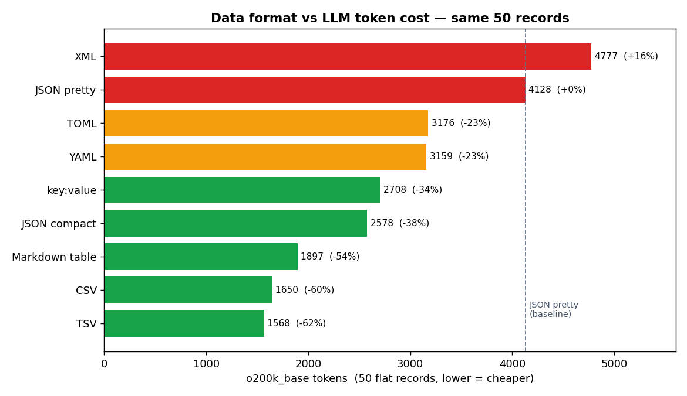

I needed to hand an agent a 50-row product catalog as context. Out of habit I dumped it with `json.dumps(records, indent=2)`, and the token counter read past 4,000. The data itself was tiny. I started to suspect the indentation and quotes were eating close to half my tokens. So I serialized the exact same data into nine formats and counted the real tokens.

Up front: **for flat data, TSV is 62% cheaper than pretty JSON.** But the moment the data nests, that conclusion reverses entirely. I went looking for where that boundary actually sits.

## The setup: count with tiktoken, don't guess

Token cost gets tossed around as "roughly chars × 0.75," but that heuristic completely misses per-format differences. So I used OpenAI's own [tiktoken](https://github.com/openai/tiktoken). I ran two encodings side by side: `o200k_base` (GPT-4o, the o-series, the GPT-5 family) and the older `cl100k_base` (GPT-4 and 3.5).

The test data mimics a realistic "tool result." Fifty product records, each a flat object with nine fields: `id`, `sku`, `name`, `category`, `price`, `stock`, `warehouse`, `status`, `rating`.

```python
import json, io, csv, yaml, tomli_w, tiktoken

records = json.load(open("records.json"))  # 50 flat records
enc = tiktoken.get_encoding("o200k_base")  # GPT-4o / GPT-5 family

def tok(s): return len(enc.encode(s))

print("pretty :", tok(json.dumps(records, indent=2)))
print("compact:", tok(json.dumps(records, separators=(",",":"))))
print("csv    :", tok(to_csv(records)))
```

I ran the sandbox in a throwaway `mktemp -d` directory outside the repo, kept only the result logs and the chart, then wiped the environment. The habit of isolating one-off experiments like this hardened during the stretch where I [ran eight agents and tracked their real cost](/en/blog/en/ai-agent-cost-reality). Cutting tokens is, in the end, one line in that same ledger.

## Flat data: TSV wins by a mile

Here are the measured results for serializing 50 flat records nine ways. On `o200k_base`, pretty JSON (4,128 tokens) is the 0% baseline.

| Format | Chars | o200k tokens | cl100k tokens | vs pretty JSON |
|---|---|---|---|---|
| TSV | 3,742 | **1,568** | 1,663 | −62.0% |
| CSV | 3,742 | 1,650 | 1,650 | −60.0% |
| Markdown table | 4,766 | 1,897 | 1,897 | −54.0% |
| JSON (compact) | 7,985 | 2,578 | 2,593 | −37.5% |
| key: value lines | 6,982 | 2,708 | 2,708 | −34.4% |
| YAML | 7,834 | 3,159 | 3,159 | −23.5% |
| TOML | 8,533 | 3,176 | 3,191 | −23.1% |
| JSON (pretty) | 10,986 | 4,128 | 4,143 | 0.0% |
| XML | 13,654 | 4,777 | 4,778 | +15.7% |



The thing that jumps out is the 2.6x gap between pretty JSON and TSV. Same information. Not one fact the model receives changes. And yet two-space indents, repeated key names, quotes, and braces inflate the token count 2.6 times. XML goes further still, writing every field twice thanks to closing tags, landing 16% above even pretty JSON. I think using XML as an LLM input format is a near-guaranteed loss.

Why CSV, TSV, and Markdown tables are cheap is simple. **They write the field names once in a header row, then list only values across the 50 rows.** JSON-family formats repeat a key like `"warehouse":` 50 times, once per record. The more fields and the more rows, the worse that repetition tax gets.

Break it down per record and it's starker. Pretty JSON's 4,128 tokens spread across 50 records is about 82 tokens each. Strip TSV's header row (~18 tokens) and 1,550 tokens over 50 rows is about 31 tokens per record. The same nine fields on one line, and one side spends 82 tokens while the other spends 31. The difference isn't the data. It's nine key names repeated 50 times, plus the quotes and braces wrapping them. To the model, `"category":"books"` and `books` are the same fact, but the former spends three or four times the tokens to convey it.

## It's not the repeated keys that cost, it's the boilerplate

I want to correct a likely misread here. The accurate framing isn't "JSON is slow," it's "structural punctuation is expensive." Compact JSON beats pretty JSON by 37.5% not because it has fewer keys. The keys still repeat 50 times. What disappears is the indentation whitespace and the line breaks.

```text
2-space indent "  "  -> 1 token (id 220)
3 commas       ",,,"  -> 1 token
```

On `o200k_base`, a two-space indent is itself a single token (id 220). When 50 records each indent nine fields, that whitespace token alone gets laid down hundreds of times. Add a newline per line and an opening and closing brace per object. To a human that's readability; to the model it's pure cost. So I've made "no pretty-printing unless a human is going to read it" my default.

## With nested data, the conclusion flips

If I'd stopped here I'd have walked away with the wrong lesson, "always CSV." So I measured a differently shaped dataset. Twenty orders, where each order holds a customer object (with a nested address) and a variable-length array of line items.

| Format | o200k tokens | vs pretty JSON |
|---|---|---|
| JSON (compact) | **1,538** | −45.7% |
| YAML | 1,958 | −30.9% |
| TOML | 2,021 | −28.7% |
| JSON (pretty) | 2,835 | 0.0% |

CSV, TSV, and Markdown tables drop out of the running entirely. There's no way to cram variable-length item arrays and nested objects into a two-dimensional grid. And compact JSON, which sat mid-pack at −34% on flat data, takes first place at −45.7% on nested data. YAML, flat or nested, was never as cheap as I'd assumed, thanks to its indentation cost. The folk wisdom that "YAML is both human-readable and token-light" did not hold up, at least not in this measurement.

So the boundary is this. **Uniform rows, use a tabular format (CSV/TSV/Markdown); nested structure, use compact JSON.** That one line is the most useful rule I pulled out of today's experiment.

## In an agent loop, this compounds

A few thousand tokens sounds like nothing, but an agent resends the same context every turn. Say you pin a 50-item catalog into the system prompt as pretty JSON and run a 30-turn conversation. Switching the format to TSV alone drops about 2,560 tokens per turn (4,128 → 1,568). Over 30 turns that's 76,000 tokens. On a model with a tight context window, that's the difference between fitting and not; on a metered model, it's input-token cost, dollar for dollar.

Here's a likely objection: "Doesn't prompt caching make the same context cheap anyway?" It does. If the catalog is pinned in the system prompt, a cache hit cuts the cost sharply. But caching doesn't reduce the token count itself. Cached tokens still occupy the full context window, and caches usually expire after a short TTL and then refill at full price. On top of that, tool results that change every turn can't be cached in the first place. Trimming tokens via format isn't a technique that competes with caching, it's one that complements it. Turn both on and you win twice.

This matters most when an MCP tool returns a large result. When a [server you built with FastMCP](/en/blog/en/fastmcp-python-mcp-server-build-guide-2026) returns a DB query as raw JSON, that format is the model's input cost. One small decision on the server side, serializing a flat result as CSV or TSV, shifts the token ledger of the whole agent.

The limits are real, of course. I only measured token counts; **I did not measure whether the model understands each format equally well.** That's as far as I could reproduce without API calls. My intuition is that a format like CSV, where the header sits far from the values, could confuse the model on field-heavy data. With the header only once at the top, the model has to count by position to know what the 7th value in the 30th row means. Save tokens and lose accuracy and you haven't gained anything. So before applying this for real, run token savings and response quality together as an A/B at least once. I'm deferring that check to the next experiment.

## What I'm applying starting tomorrow

Today's measurements changed my defaults to this.

- Flat record arrays going into context: CSV or a Markdown table. No pretty JSON.
- Nested structures: `json.dumps(x, separators=(",",":"))`, compact. `indent=2` only when a human is debugging.
- No XML as LLM input. It spends the most tokens on the same information.
- If a format change cut tokens significantly, verify once that model accuracy holds in that format.

Data format is a value your code picks almost automatically, so you rarely think about it. But the moment it enters an LLM context, that thoughtless `indent=2` can become half your token bill. Until I measured it myself, I was underestimating the size of it too.

## References

- [tiktoken (OpenAI)](https://github.com/openai/tiktoken) — OpenAI's official BPE tokenizer. The library used for all token counts here, including the `o200k_base` and `cl100k_base` encodings.
- [JSON specification (json.org)](https://www.json.org/json-en.html) — The canonical reference for the JSON interchange format, the baseline format in this experiment.
- [YAML 1.2.2 specification (yaml.org)](https://yaml.org) — The official YAML spec, useful for understanding the indentation rules that drive its token cost.
- [TOML specification (toml.io)](https://toml.io) — The official TOML spec, one of the nine formats measured.

> The measurement code and full logs were run once in the sandbox and preserved in `docs/evidence/llm-token-cost-data-format-experiment.md`. Measured on tiktoken 0.12.0, Python 3.12.8.
