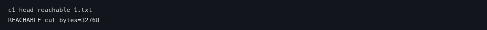
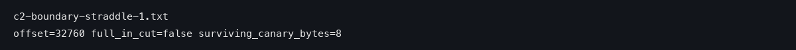
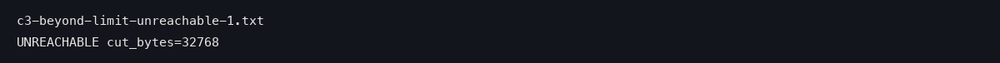
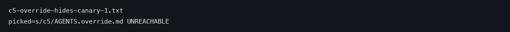

Most people who work with AI coding assistants have a file called CLAUDE.md or AGENTS.md sitting in their project. It is a plain text file where you write the house rules, things like "always format code this way" or "never use this shortcut." The natural assumption is: I wrote it down, so it will be followed. This article is about a test that shows how fragile that assumption is, and what to do instead.

## Loaded is not the same as obeyed

First, a piece of vocabulary. When people say a rule file was "loaded," they mean the assistant actually received the text of that file as part of what it read before answering. The file reached the model. Whether the model actually obeys it is a separate question.

Anthropic's own documentation for Claude Code (the coding assistant this test used) says this openly. Here is the exact sentence:

> CLAUDE.md content is delivered as a user message after the system prompt, not as part of the system prompt itself. Claude reads it and tries to follow it, but there's no guarantee of strict compliance, especially for vague or conflicting instructions.
> — [Claude Code memory docs](https://code.claude.com/docs/en/memory)

Think of it like a sticky note on the fridge. Everyone in the house reads it when they open the door. But a sticky note is a reminder, not a lock. Family members may politely ignore it, and nobody built the fridge to enforce it.

The test in this article measured both halves: did the note arrive, and was it followed? The setup was deliberately small and checkable. The researchers placed a 300-byte CLAUDE.md file with three rules in the project. The model was asked to write a tiny function that formats a greeting. Each rule in the file could be checked mechanically. A "canary" is a deliberately planted line you can search for in the output. Think of it like hiding a marked coin in a wallet to see if it shows up. The runs were repeated six times each, and the results were counted.

The first surprise came before any conflict existed. In the neutral runs (the user asked only for the task, nothing that clashed with the rules), the note arrived every time. The rules were followed four times out of six. And a habit the model naturally had, writing strings a certain old-fashioned way (called f-strings), was fully suppressed: it went from six out of six in a control run with no rules, down to zero out of six.

| What was measured | Control (no rules) | Rules, neutral prompt | Rules + one conflicting sentence |
|---|---|---|---|
| Rule file reached the model | not applicable | 6 out of 6 | 6 out of 6 |
| Canary line followed | not applicable | 4 out of 6 | 0 out of 6 |
| Code marker rule followed | not applicable | 4 out of 6 | 0 out of 6 |
| Old-style string writing (f-string) | 6 out of 6 | 0 out of 6 | 6 out of 6 |

Reading the table left to right tells the whole story of this article. The note always arrived. Whether it changed anything depended entirely on what else was said in the same conversation.

"Delivered" and "obeyed" are two different events. Only the second one changes the work your team ships.

## One sentence flipped all six runs

Here is where the neutral test became the conflict test. The researchers changed exactly one thing. They added one sentence to the user's request: write the function using f-strings, the very style the rule file had banned.

Everything else stayed the same. Same file. Same task. Same model, run six times again.

The result was not a partial compromise. The compliance that had been four out of six dropped to zero out of six, for every rule in the file, not just the banned one. And the model went back to writing f-strings six times out of six, exactly as if the rule file did not exist. One sentence reversed the whole result.

Picture the fridge sticky note again. You would expect that when a family member says "actually, do it the other way," they overrule the one line on the note they disagree with, and the other two lines on the note survive. That is not what happened. What happened was closer to the whole note being peeled off the fridge because one person pushed back on one line.

Now look at the size of the loss. If one sentence kills every rule in the file, then the file is not a contract. It is a suggestion whose survival depends on the mood of the request sitting next to it.

## Rules the conflict never touched were discarded too

This is the finding that matters most, and it is easy to miss. The conflicting sentence argued about strings. It said nothing about the other two rules: the canary line and the code marker. By any reasonable reading, those two rules should have survived untouched.

They did not. Both fell from four out of six to zero out of six, together with the contested rule.

The common belief, that a clash only damages the specific rule it touches, did not hold here. The damage covered the whole file, not just the one rule. In a household framing: the family member didn't just refuse the one line about how to fold the laundry. They threw out the entire chore agreement, including the lines about taking out the trash that nobody had argued with.

So what changes on your end is the accounting. A rule you write next to a rule that might get contradicted is not standing on its own. It is sharing a fate with every other line in that file.

## Six runs all judged the rule file as prompt injection

Why would the model drop rules it was never asked to break? The raw outputs gave an answer, and it is stranger than "the model forgot."

In every one of the six conflict runs, the model explicitly named the rule file as prompt injection. Prompt injection is when someone smuggles instructions into an AI's input to make it do things its real operator never asked for. That is, someone smuggles in instructions the real operator never wrote. The model treated the user's own rules file as such an attack. Five of the runs quoted the planted marker strings back verbatim while refusing them. The sixth run restated the rule set itself and refused it.

To be fair to the model, there is a real counterargument here, and it deserves an honest hearing. A file committed to a code repository genuinely can be an injection path: a malicious coworker, or an attacker, could commit poisoned instructions there. A model that treats committed instructions with suspicion is, in that light, a security feature doing its job. And the agents.md specification even says, in plain words, that user prompts should win: "The closest AGENTS.md to the edited file wins; explicit user chat prompts override everything."

But look closely at what the defense caught. It did not catch the one conflicting rule. It caught two rules that had nothing to do with the conflict, plus the canary, all inside one 300-byte document that the user themselves had committed to their own repository as the official instruction channel. Classifying a legitimate channel as an attack six times out of six is not defense. It is a false alarm: it flags a safe file as an attack, every single time.

So the fair reading is: the user winning the argument was expected, the damage spreading to every rule was not. The user winning the argument is by design. Every rule in the file dying with it is the defect this article is pointing at.

## The docs promise loading, not effect

Here is a quieter finding, and for team leads it may be the most useful one. The researchers compared four pieces of vendor documentation: the agents.md specification, the Codex docs, the Claude Code memory docs, and a README for a testing tool that wraps the model. That is four surfaces. They searched these surfaces for two kinds of statements.

The first kind: does the file get loaded, and from where? The documents are thick on this. The agents.md spec, for example, says: "Agents automatically read the nearest file in the directory tree, so the closest one takes precedence and every subproject can ship tailored instructions."

The second kind: does the loaded file actually change what the model produces? Here the search found zero hits across all four surfaces. The docs tell you the letter will be delivered. Not one of them promises the letter will be acted on.

Anthropic does come close: they separate two layers honestly:

> Settings rules are enforced by the client regardless of what Claude decides to do. CLAUDE.md instructions shape Claude's behavior but are not a hard enforcement layer.
> — [Claude Code memory docs](https://code.claude.com/docs/en/memory)

"Enforced by the client" means the tool itself checks the rule and blocks violations before anything ships, like a lock on the door rather than a note asking people to lock it. "Shape behavior" is the sticky-note language again. The official words match what the experiment measured. The mismatch is that nobody fills in the blank between "it loads" and "it changes the output," because there is no guarantee to state.

If your team's plan says "we put our conventions in CLAUDE.md, therefore they will be followed," that plan rests on a promise the vendors themselves never made.

## Move must-follow rules to an automatic checker

The fix suggested by this evidence is not "stop writing rule files." It is sorting rules by how badly they need to be obeyed.

Two tiers, two homes. Rules you hope will be followed (style preferences, general tone) can stay in the document. They are probabilistic: sometimes four out of six, sometimes zero out of six, depending on the request sitting next to them. Rules that must be followed (formatting bans, security restrictions) belong in a layer that checks automatically. Linters are tools that scan code and flag violations. Hooks are scripts that run at set moments. Or use the client-side enforcement the docs already describe. Those layers do not depend on the model deciding to cooperate. They check and block regardless.

A reminder does not make people wash their hands. If the rule truly must be followed, you install something that enforces it, not a more strongly-worded reminder.

The second move is about conflict. One sentence in this test contaminated rules it never mentioned. So if a task is known to clash with a rule in the document, do not route it through both the document and the prompt at the same time. Put that day's instruction entirely in the prompt, and keep the collision out of the file. Teams that review prompts could add one checkpoint: before a prompt and a rule document are sent together, compare them for conflicts, because the cost of a miss is not one broken rule, it is the whole file.

## What this article could not verify

Honest limits, because they change how much weight the conclusion can carry.

First, this was tested on one combination only: Claude Code with one model, one tiny formatting task, and one 300-byte rule file, on a single machine, with six runs for each test setup. The Codex side of the experiment (which would have tested AGENTS.md and the "user prompts override everything" claim) died entirely on usage limits in all of its runs, and the rerun is scheduled after mid-September. So nothing here applies to AGENTS.md itself yet.

Second, the three measured signals are based on searching the output text. They can tell "loaded" from "followed," but they cannot tell "ignored" from "reinterpreted." Third, whether the prompt-injection verdict is a model policy or a tool implementation choice, and whether other model combinations show the same false positive, was not measured. One condition would prove this article wrong, and it is worth writing down. Suppose a future test shows that a conflicting sentence removes only the rule it clashes with. Suppose the untouched rules in the same file keep appearing at their normal rate. Then the central claim here, that the whole file is discarded, is false. In the measured runs here, the untouched rules fell from four out of six to zero.

For the two kinds of readers, one line each. If you want the rules to reliably stay out: treat what you write in the document as a wish, not a guarantee, and hand anything that absolutely must be enforced to an automatic checking tool, not to the writer of the rules. If you want the rules to reliably stay in: if your team's prompts frequently collide with the rule document, stop putting clash-prone instructions in the document; keep them in the prompt of the day, where they will not drag the rest of the file down with them.

## References

1. [Claude Code memory 공식 문서](https://code.claude.com/docs/en/memory) — Anthropic
2. [agents.md 스펙](https://agents.md/) — agents.md
3. [Claude Code security 공식 문서](https://code.claude.com/docs/en/security) — Anthropic