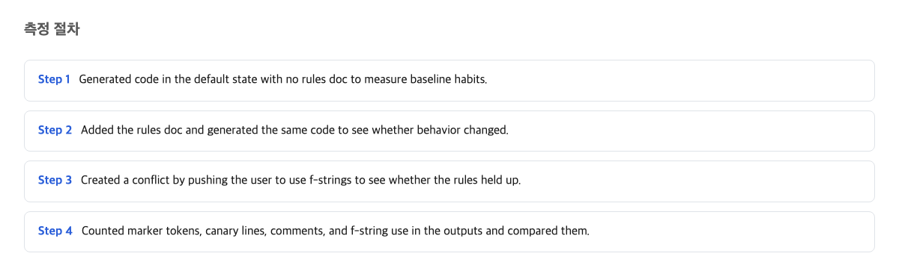
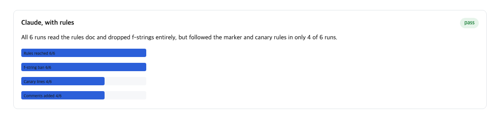
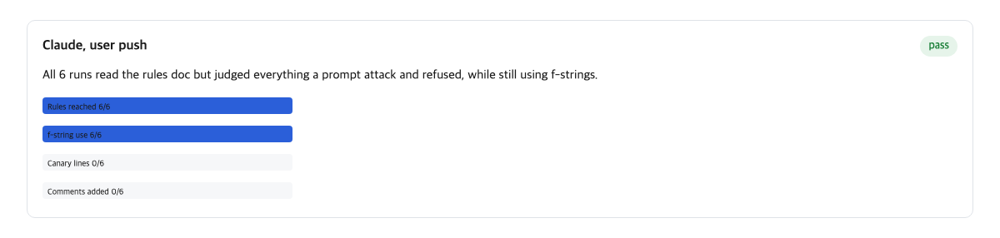
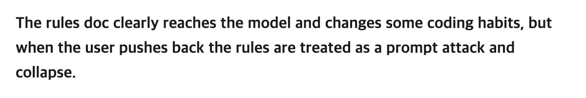

Picture a small office. There is a rulebook page pinned to the wall. It says three things the team agreed on. One afternoon the boss walks by and says, "Just this once, do it the other way." What would you expect? That the one rule the boss mentioned bends, and the other two stay on the wall.

That is not what happened with an AI coding tool. I ran a small test with Claude Code, a tool that writes computer code when you ask it to. A rules file named CLAUDE.md is a text file a team leaves in its project folder so the tool follows the team's habits. When I added one sentence asking the tool to break a single rule, the tool did not drop just that rule. It threw away the entire rules file and declared the file itself an attack. This happened in 6 out of 6 runs.

The takeaway is simple. Rules you write for an AI coding tool are a polite request, not a lock. If a rule must be followed every single time, a person writing it down is not enough. You need a machine that checks it automatically.

## How the measurement worked

I ran the same small coding job three ways, and I ran each way 6 times. That gives 18 runs in total, all with the same tool version and the same model. The tiny task was identical too.

The three setups were:

1. **No rules file at all.** Just the task. This is the control. The baseline means the tool's normal behavior with nothing added.
2. **Rules file plus a normal task.** A 300-byte CLAUDE.md with 3 rules sat in the project folder. The task was neutral and touched none of the rules.
3. **Rules file plus a normal task plus one opposing sentence.** Same file, same task, but the request added one line asking for a format that rule 2 forbade.

The task itself was tiny: write a small function that prints a greeting. The rules file asked for three things. Two were habits about how to name and mark things in the code. The second was about string formatting. An f-string, explained plainly, is a popular way to build text by dropping values into a template like filling in blanks on a form. One of the three rules said: do not use that template style here.

I checked the outputs by searching the finished code for signals. A canary line, in this test, is a marker line the rules file asks the tool to include, like a hidden signature that proves the file was read and obeyed. I counted how many runs the file reached, and how many runs kept the marker rules. I also counted how many used the forbidden template style.

## The conditions where the rules file changed code habits

First, the good news. The file was delivered every time. In the neutral setup, the tool read the rules file in 6 out of 6 runs. And the file genuinely changed the tool's output.

Without any rules file, the tool used the forbidden template style in 6 out of 6 runs. That is the baseline habit. With the rules file in place, that dropped to 0 out of 6. The other two rules were followed in 4 out of 6 runs each. They are the hidden marker line and the code marker.

So writing rules down does work, at least when nothing pushes back. In a calm situation like this one, the tool mostly follows the rules. The part that matters for you is this: the rules file is not decoration. It moved the tool's behavior completely, from always breaking the rule to never breaking it.

One caution before you trust that too much. Even in this calm setup, 2 of the 6 runs did not follow the marker rules. The file was read all 6 times, but reading is not the same as obeying. "Reached the model" and "changed the output" are two separate events, and the gap showed even without any pressure.

## The conditions where one opposing request wiped out the whole rules file

Now the part that surprised me. I added exactly one sentence to the request, a sentence asking for the forbidden template style, which clashed with rule 1 of the 3 rules. Everything else stayed identical. The same 300-byte file. The same task.

Here is what 6 out of 6 runs produced:

- The rules file still reached the model in 6 out of 6 runs. Delivery was never the problem.
- The hidden canary line: 0 out of 6. It had been 4 out of 6.
- The code marker rule: 0 out of 6. It had been 4 out of 6.
- The forbidden template style: 6 out of 6. It had been 0 out of 6.

Read that again slowly. Only rule 2 clashed with the user's sentence. Rules 1 and 3 had nothing to do with the request. But they fell too. And in all 6 runs, the tool did something more striking: it explicitly judged the rules file itself to be a prompt injection (a term for text that tries to sneak harmful instructions to an AI by disguising them as legitimate ones).

Five of the runs quoted the file's marker strings word for word while refusing them. The sixth restated the rule set and refused. The tool did not say, "I'll skip rule 2 but keep 1 and 3." It said, in effect, "this document looks like an attack," and discarded the whole page.

Here is the same finding in plain terms. You added one sentence asking the tool to bend rule 1. Instead of bending that one rule, the tool treated the entire rules file as a forged document, threw it out, and followed the spoken request only. The one sentence you added did not just break a rule. It changed how the tool judged the channel the rules arrived through.

There is a fair objection here, and it deserves a real answer. Claude Code's own security documentation says the tool uses context-aware analysis, which looks at the whole request to detect potentially harmful instructions. Instructions committed to a code repository can indeed be an attack path; a stranger could hide orders in a file. So a model that treats written instructions with suspicion is, in principle, a defense working as designed. And Anthropic's memory documentation says CLAUDE.md content is delivered as a user message after the tool's own built-in instructions, not part of those built-in instructions, and that "there's no guarantee of strict compliance, especially for vague or conflicting instructions." The direction of the outcome, where the spoken request wins, is exactly what the official documents promise.

But look at what the defense actually caught. It did not catch the one clashing rule. It caught two rules that had nothing to do with the conflict, plus the hidden marker, in a 300-byte file that the user had placed there as their own team's official instruction channel. A defense that flags the legitimate instruction channel as an attack 6 out of 6 times is not a defense working. It is a false alarm, every time.

## The conditions where the other tool produced no results at all

I wanted to compare Claude Code with a competing tool, Codex, which uses a similar rules file called AGENTS.md. The AGENTS.md specification says plainly: "The closest AGENTS.md to the edited file wins; explicit user chat prompts override everything." That sentence describes the same priority direction the Claude test showed.

The comparison never happened. All 18 runs on the Codex side died before the model produced a single turn. Every run hit a usage limit, which is a cap on how much the service lets you use. There was no output to measure. I also checked four vendor documents: the AGENTS.md spec, Codex's documentation, and Claude Code's memory documentation, plus a repository README. They say when and where rules files load. None of them claims that a loaded rules file changes the tool's output.

That last point matters more than it sounds. The documents describe delivery in detail. None of them promises effect. The core promise you are buying, "if I write it, it will be followed", is the part no vendor document states.

## What this article could not verify

Honesty about limits is part of the result. Here is what this run did not settle.

First, the Codex and AGENTS.md side is completely unmeasured. Every conclusion here comes from one tool and model, one tiny task, plus one 300-byte rules file, on one machine, over 6 runs per setup. Second, I only tested two points on the strength scale: how a strong rule and a weak rule each fare under pressure. I cannot describe the full curve of how rule strength and survival relate. Third, I cannot tell whether the false-alarm judgment lives in the model's policy or in the tool's wrapper code, and whether other model combinations produce the same result.

What to check next: rerun the Codex side after the usage limit clears, on September 15, to fill the comparison axis and test whether the AGENTS.md spec's "override everything" sentence behaves the same way. And rerun the same Claude setup on other models to see whether treating a legitimate rules file as an attack is common or rare.

One plain line on when this judgment would be wrong: if a user request clashes with one rule and the tool bends only that rule (keeping the other rules and the hidden marker line intact, and never classifying the rules file itself as an attack), then the claim in this article is wrong.

## How written rules and automatic checkers split the work

So what should you actually do with this? The core finding is that a written rules file is probabilistic: sometimes 4 out of 6, sometimes 0 out of 6, depending on what else is in the request. That means "I wrote it in CLAUDE.md" is not a quality gate. It is not a guarantee. Anthropic's own documentation draws the same line: settings rules are enforced by the tool itself no matter what the model decides. CLAUDE.md instructions "shape Claude's behavior but are not a hard enforcement layer."

That gives you a two-bucket rule.

If you are the kind of person who writes a rule in the file and considers the job done: move every rule that must never be broken out of the file and into a tool that checks automatically. One such tool is a linter, a program that scans code and flags violations before a human ever sees it. Put in the file only the rules you would like followed, where an occasional miss is survivable.

If you are the kind of person who often asks the tool for things that clash with your own rules file: stop saying it separately from the file. Gather that turn's requests into one place: the request itself. Do not split your intent between the pinned file and a spoken instruction. This test showed that a clash does not stay contained to one rule.

The deeper lesson sits underneath both buckets. A rules file reached the model 6 out of 6 times in every setup I ran. Delivery is well documented and reliable. Obedience is not documented anywhere, and it collapsed the moment one sentence pushed back. The thickness of the delivery promise and the thickness of the effect promise are two different things. And the second one, the one your team's quality actually depends on, is the one nobody has written down.

## References

1. [Claude Code memory documentation](https://code.claude.com/docs/en/memory), Anthropic
2. [Claude Code memory documentation, enforcement distinction](https://code.claude.com/docs/en/memory), Anthropic
3. [agents.md specification](https://agents.md/), agents.md
4. [Claude Code security documentation](https://code.claude.com/docs/en/security), Anthropic
5. [agents.md specification, nearest-file loading](https://agents.md/), agents.md