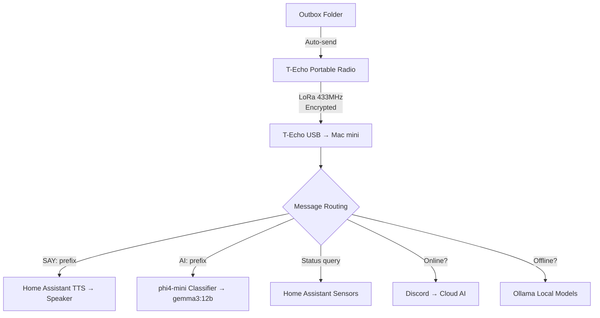
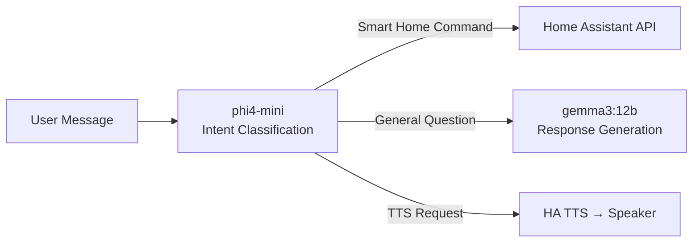

## Overview

When the internet goes down, smart homes stop working. Cloud-based voice assistants and IoT automations all become useless. But a developer has built a <strong>fully offline smart home</strong> using nothing more than a <strong>$30 LoRa radio</strong> and <strong>local LLMs running on a Mac mini</strong>.

Living in Ukraine during the war, where power outages and internet disruptions are frequent due to attacks on the power grid, this developer combined Meshtastic LoRa radios with Ollama local models to create a <strong>zero-internet</strong> smart home control system.

This article analyzes the project's architecture, tech stack, implementation costs, and the practical possibilities of edge AI.

## System Architecture

The overall system is surprisingly simple.



The key is <strong>dual routing</strong>. When internet is available, it leverages cloud AI. When it's not, it automatically switches to local models. Users don't need to notice the difference.

## Core Tech Stack

### LoRa Communication — Meshtastic + Lilygo T-Echo

<strong>Meshtastic</strong> is an open-source LoRa mesh network firmware. Since each node relays messages, deploying multiple units can create a communication network spanning several kilometers.

- <strong>Hardware</strong>: Lilygo T-Echo (~$30)
- <strong>Frequency</strong>: 433MHz LoRa
- <strong>Features</strong>: Encrypted channels, USB connection, mesh relay
- <strong>Limitation</strong>: 200-character per message limit (solved by auto-chunking AI responses)

### Local LLMs — Ollama

The core of offline AI is a <strong>two-stage model architecture</strong>.

| Model | Role | Size | Purpose |
|-------|------|------|---------|
| phi4-mini | Intent classifier | ~2B | Determines "smart home command or question?" |
| gemma3:12b | Response generator | 12B | Actual answers and reasoning |

By classifying intent with a lightweight model first and calling the larger model only when needed, <strong>real-time responses are achievable even on a Mac mini M4 with 16GB</strong>.

### Home Assistant Integration

Home Assistant handles smart home control and TTS (text-to-speech).

- Light control, sensor readings, presence detection
- <strong>SAY: prefix</strong> converts radio text messages to speech output on home speakers
- Ukrainian language TTS support

```
SAY: Привіт, я скоро буду вдома
→ Radio waves → Mac mini → HA TTS → Speaker plays voice message
```

A <strong>fully offline voice messaging system</strong> requiring zero internet connectivity.

## Implementation Cost Analysis

The most compelling aspect of this system is its cost.

| Item | Price | Notes |
|------|-------|-------|
| Lilygo T-Echo × 2 | ~$60 | Base station + portable |
| Mac mini M4 16GB | ~$500 | $0 if already owned |
| Home Assistant | Free | Open source |
| Ollama + Models | Free | Open source |
| Meshtastic Firmware | Free | Open source |
| HA Voice PE Speaker | ~$50 | For TTS output |
| <strong>Total Additional Cost</strong> | <strong>~$110</strong> | If Mac mini already owned |

Without any cloud AI service monthly subscriptions, a <strong>one-time $110 investment</strong> delivers a complete offline AI smart home.

## Practical Lessons from Edge AI

### 1. The Value of Offline-First Design

This project was born from the extreme circumstances of war, but the value of offline-first design is universal.

- <strong>Disaster scenarios</strong>: Communication independence during earthquakes, typhoons, blackouts
- <strong>Privacy</strong>: Voice data never leaves your local network
- <strong>Latency</strong>: Local processing improves response speed
- <strong>Cost</strong>: Zero monthly subscriptions

### 2. Strategic Use of Small Models

The architecture separating phi4-mini (2B) as router and gemma3:12b as executor is an <strong>exemplary pattern</strong> for leveraging LLMs on edge devices.



### 3. Mesh Network Scalability

Since Meshtastic is a mesh protocol, adding nodes extends communication range. The creator's vision of a <strong>neighborhood-scale AI network</strong> is a realistic scenario.

- Local LLMs on each node
- Mesh relay for multi-kilometer coverage
- Community AI infrastructure without internet

## How to Build It Yourself

Here are the minimum requirements to replicate this system.

1. <strong>Hardware</strong>: 2× Lilygo T-Echo, Mac mini (or any Apple Silicon Mac), HA-compatible speaker
2. <strong>Software</strong>: Meshtastic firmware, Ollama, Home Assistant
3. <strong>Models</strong>: `ollama pull phi4-mini`, `ollama pull gemma3:12b`
4. <strong>Listener daemon</strong>: Connect USB radio via Meshtastic CLI, build Python daemon for message routing
5. <strong>HA integration</strong>: Control Home Assistant via REST API or WebSocket

The entire stack is open source, so you can write the code yourself or delegate to an AI coding tool.

## Conclusion

<strong>$30 radio + local AI = internet-free smart home</strong>. This equation is simple, but it clearly demonstrates the practical future of edge AI.

AI systems that don't depend on the cloud are no longer theoretical. With a 16GB Mac mini and a $30 radio, this is something you can build today. As local LLM performance continues to improve, the <strong>edge AI × IoT</strong> combination is poised to become one of the most practical AI application domains.

## References

- [Reddit - I plugged a $30 radio into my Mac mini and told my AI "connect to this"](https://www.reddit.com/r/LocalLLaMA/comments/1r8ectu/)
- [Meshtastic Official Site](https://meshtastic.org/)
- [Ollama Official Site](https://ollama.ai/)
- [Home Assistant Official Site](https://www.home-assistant.io/)
- [Lilygo T-Echo](https://www.lilygo.cc/products/t-echo)
