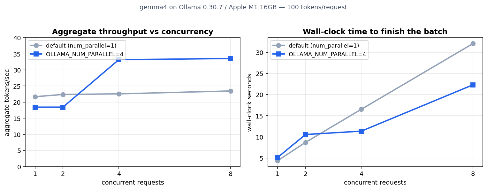

I was building a pipeline that runs a few sub-agents at once locally, and one assumption I had taken for granted snagged. Cloud APIs mostly finish faster when you fire requests in parallel. So I had vaguely believed that pointing eight agents at a local Ollama would let the GPU split the work and cut total time.

Then I actually pointed eight at it on an M1 MacBook, and it felt wrong. Running one and running eight produced almost the same total tokens per second. It just took longer. I couldn't tell whether this was my misconception or the real behavior, so I dropped the guessing and measured it on the spot.

## What I measured, and how

The setup is an Apple M1, 16GB of unified memory, Ollama 0.30.7. The model is a small gemma4 variant (about 4GB, showing 100% GPU offload in `ollama ps`). I picked a small model because the experiment had to finish in one pass even while running up to eight concurrent requests repeatedly.

The method is plain. Using Python's `ThreadPoolExecutor`, I fired the same number of requests concurrently at `/api/generate`, with `num_predict` pinned to 100 so each produced exactly 100 tokens. I cycled through eight different prompts so the prompt cache wouldn't skew the numbers. Raising concurrency across 1, 2, 4, and 8, I watched two things.

- Aggregate throughput (tokens/sec): how many tokens the whole batch emits per second.
- Wall-clock time: how many real seconds the batch takes to finish.

I read `eval_count` and `eval_duration` straight from the response JSON and logged each request's actual generation speed too. Here `eval_duration` holds pure generation time, not time spent waiting in a queue, which was decisive for telling apart "was it queued" from "was it generating slowly."

The core measurement code is all of this. If you want to reproduce it, copy it and run it on your own machine.

```python
import json, time, urllib.request, concurrent.futures, statistics

URL = "http://localhost:11434/api/generate"
MODEL = "gemma4:latest"   # swap in your model
NUM_PREDICT = 100

def one_request(idx):
    body = json.dumps({
        "model": MODEL,
        "prompt": PROMPTS[idx % len(PROMPTS)],  # 8 distinct prompts
        "stream": False,
        "options": {"num_predict": NUM_PREDICT, "seed": idx},
    }).encode()
    req = urllib.request.Request(URL, data=body,
                                headers={"Content-Type": "application/json"})
    with urllib.request.urlopen(req, timeout=600) as r:
        d = json.loads(r.read())
    return d["eval_count"], d["eval_duration"] / 1e9  # tokens, pure gen seconds

def bench(concurrency):
    t0 = time.perf_counter()
    with concurrent.futures.ThreadPoolExecutor(max_workers=concurrency) as ex:
        res = list(ex.map(one_request, range(concurrency)))
    wall = time.perf_counter() - t0
    total_tokens = sum(c for c, _ in res)
    return total_tokens / wall  # aggregate throughput (tok/s)
```

Pinning `num_predict` is the point. Leave it unset and each request generates a different length, which blurs the throughput comparison. Fix the length and you finally get the pure throughput of "the same job asked N ways at once."

## The default server queues your requests

First I threw the batch at my everyday default Ollama server (port 11434, no env vars set). Here is the summary.

| Concurrent | Wall-clock (s) | Aggregate (tok/s) | Per-request (tok/s) |
|---|---|---|---|
| 1 | 4.38 | 21.7 | 24.6 |
| 2 | 8.71 | 22.4 | 23.6 |
| 4 | 16.53 | 22.6 | 23.7 |
| 8 | 32.04 | 23.5 | 24.5 |

The numbers were so clean I thought it was a bug at first. Wall-clock time scales exactly with concurrency. Eight requests take precisely eight times what one takes. Meanwhile aggregate throughput is glued to 22–23 tokens per second and won't budge.

The third column is the key. Per-request generation speed stays near 24 tokens per second regardless of concurrency. That means each request generates at its solo top speed. Yet the total doesn't grow while wall-clock does, which says the requests aren't being computed together. They're handled one at a time, in order. The server put them in a queue and drained it serially. The parallel slot count was 1.

Check the arithmetic and it lines up. At eight concurrent, wall-clock is 32 seconds, and one request making 100 tokens at 24 tokens per second takes about 4.2 seconds. 4.2s × 8 = 33.6s, nearly the observed 32s. The eight requests didn't overlap; they ran one after another. The first arrival gets served right away, but the request that queued eighth just waits, purely idle, until the seven ahead finish, then spends its own 4.2 seconds last. That wait is what pushes each request's perceived latency straight up.

At this point I remembered [the experiment where num_ctx silently truncated instructions off long inputs](/en/blog/en/ollama-num-ctx-silent-truncation-experiment). That time too it was "not a dumb model, a config problem." Same smell here. The model can't do parallel? No, the server was configured not to.

## Why it was 1 — confirmed in the docs

Ollama's official FAQ had the answer. `OLLAMA_NUM_PARALLEL` sets the maximum requests a single model handles at once, and if you don't set it, the value auto-selects to 4 or 1 based on available memory ([Ollama FAQ](https://docs.ollama.com/faq)). And one more decisive line: parallel requests multiply the context size by the number of parallel slots. A 2K context with 4 parallel becomes an effective 8K and eats that much more memory.

So the 16GB M1, being memory-tight, had Ollama quietly drop parallelism to 1 on its own. Not laziness on my part; the machine decided. Which also means this is the default that applies to most people running local models on a laptop.

## What happens when you open four slots

To confirm the hypothesis, I launched a second server on a different port (11500) with `OLLAMA_NUM_PARALLEL=4`, leaving my existing server untouched. I checked the server log confirmed `OLLAMA_NUM_PARALLEL:4` had taken effect and ran the same bench.

```
model=gemma4(small) num_predict=100  OLLAMA_NUM_PARALLEL=4
concurrency=1  wall=5.15s  aggregate=18.4 tok/s  per_req=21.7 tok/s
concurrency=2  wall=10.57s aggregate=18.5 tok/s  per_req=9.8 tok/s
concurrency=4  wall=11.36s aggregate=33.2 tok/s  per_req=9.9 tok/s
concurrency=8  wall=22.30s aggregate=33.6 tok/s  per_req=10.0 tok/s
```

Here the picture flips. At four concurrent, aggregate throughput jumps from 18 to 33 tokens per second, about 1.8x the single stream. By wall-clock, four concurrent finish in 11.4s, clearly shorter than the 16.5s the default server took for the same four. The parallel batch actually worked.

But it isn't free. Per-request generation speed already halved from 22 to 10 tokens per second at just two concurrent. The requests really are computed together, but sharing one GPU means each is slower. So at two concurrent, amusingly, aggregate throughput doesn't rise (stuck at 18.5). Two of them split the pie in half, so the sum is unchanged. The gain only shows up once you fill all four slots.

What about eight? Aggregate throughput is 33.6, nearly identical to four. With only four slots, the other four wait in the queue. So wall-clock climbs again (22.3s), and the perceived latency for a request stuck behind the queue stretches to 22 seconds. Throughput already hit its ceiling at four.

Drawn as one figure it looks like this. Left is aggregate throughput, right is wall-clock time. Gray is the default (serial), blue is num_parallel=4.



## So how many agents do I attach?

This measurement immediately changed my [multi-agent orchestration](/en/blog/en/multi-agent-orchestration-improvement) design. To summarize:

First, at the default, concurrency doesn't raise throughput. With one slot, growing to eight agents only lengthens the queue and total time goes 8x. "I fired them in parallel, so it's fast" is the wrong intuition locally. Don't carry the cloud-API instinct over.

Second, if throughput is the goal, raising `OLLAMA_NUM_PARALLEL` is correct, and the gain only lands when you fill the slots. Send two requests into four slots and the gain is zero. You have to batch requests up to the slot count before firing.

Third, if latency is the goal, serial is actually better. For an interactive path where a user waits on one response, finishing requests one at a time at top speed returns each answer sooner. Batching many together halves each one's speed.

My conclusion: I moved background batch work (summarizing many documents, bulk classification) to raise num_parallel and fire in batches, while keeping the interactive path where a human waits serial. There was no single setting that satisfied both.

## First, find your machine's slot count

Before changing the design, you need to know how many parallel slots your server is standing up right now. This isn't something to guess; you can check it immediately. The terminal where you launched the server prints a `server config` line, and you can read `OLLAMA_NUM_PARALLEL` straight off it. If it auto-selected, confirm it empirically to be sure. Fire four concurrent with the script above: if wall-clock grows to 4x the single request, your slot count is 1; if it stays about flat, it's 4 or more.

To change the value, relaunch the server with the env var.

```bash
# open four parallel slots and run the server
OLLAMA_NUM_PARALLEL=4 ollama serve
```

If Ollama starts automatically as an app, you'll need to put this variable into the system service environment. And after changing it, always re-measure. Raising the slot count can push the model off memory and make things slower, so don't relax just because the setting reads right. I once skipped this check, figured "I set it to 4, so we're good," and only later found the slots weren't opening on a larger model.

## The limits of this measurement

To be honest about it: these are numbers for one specific setup, a small gemma4 on an M1 with 16GB. On a memory-rich machine or one with a discrete GPU, the default num_parallel would land at 4, and a large model has such a big KV cache per slot that you can only stand up a few parallel slots to begin with. Because parallel slots multiply context memory, the longer an agent's context, the harder it is to raise concurrency. So the weight of long inputs I saw in [the post measuring single-request prefill cost](/en/blog/en/local-llm-prefill-generation-latency-experiment) comes back to bite here.

One more thing. That 1.8x aggregate gain also means the GPU had idle headroom on this hardware. If the single stream had already been using 100% of the GPU, batching in parallel would have gained almost nothing. The size of the gain differs per machine, so the conclusion is singular: if you change the setting, always re-measure on your own machine. A 30-line script is enough.

Next I plan to rerun the same experiment with a large model (gemma4:12b) to measure how many parallel slots survive as the model grows, and where the GPU saturates at that point. As long as I run several agents locally, that boundary becomes the real ceiling of my pipeline.
