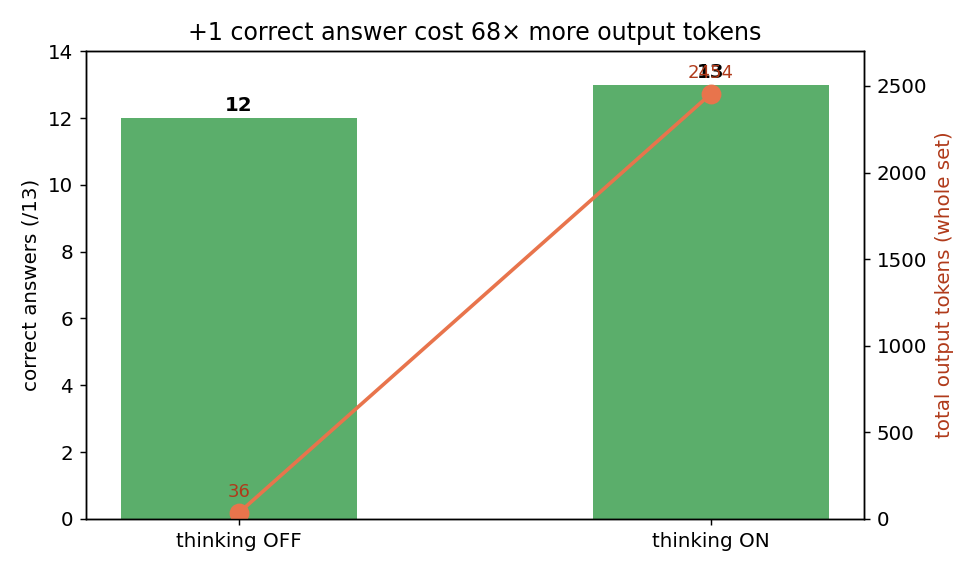

Last month, in [my post measuring output reproducibility with temperature and seed](/en/blog/en/llm-determinism-temperature-seed-experiment), I confidently wrote one paragraph that was wrong. I saw gemma4:12b-it-qat return a rising `eval_count` while `content` came back as an empty string, declared it "a packaging problem where tokens don't map to visible text," and dropped the model from my determinism table.

That wasn't it. While prepping a different experiment this week I hit the same empty reply, and this time I read the response JSON to the end. Inside `message`, alongside `content`, was another field: `thinking`. gemma4:12b is a reasoning model. The empty reply wasn't a bug. I had set `num_predict` too low, so the generation budget drained entirely into the reasoning channel and not a single token was left for the answer. I had misdiagnosed the whole thing.

Correcting the mistake left me with a sharper question. Does this reasoning actually earn its keep? If it returns the same answer 23× slower and burns 84× the tokens, do I turn it on in an agent or not? So I measured it.

## The real culprit behind the empty replies was the thinking field

First, reproduction. I sent the simplest arithmetic in both modes. Ollama's `/api/chat` lets you toggle reasoning with a `think` boolean at the top level of the request body (next to `model` and `messages`, not inside `options`).

```python
import json, urllib.request
def chat(msg, think, num_predict=512):
    body = {
        "model": "gemma4:12b-it-qat",
        "messages": [{"role": "user", "content": msg}],
        "stream": False,
        "think": think,                       # <- here. outside options
        "options": {"temperature": 0, "seed": 7,
                    "num_ctx": 2048, "num_predict": num_predict},
    }
    req = urllib.request.Request("http://localhost:11434/api/chat",
        data=json.dumps(body).encode(),
        headers={"Content-Type": "application/json"})
    r = json.load(urllib.request.urlopen(req, timeout=300))
    m = r["message"]
    return m.get("content", ""), m.get("thinking") or "", r.get("eval_count")
```

Here is the result for "A shirt costs 40 dollars after a 20% discount. What was the original price?"

| Mode | Time | Output tokens | thinking chars | Answer |
|------|------|---------------|----------------|--------|
| `think=true` | 37.0s | 252 | 551 | 50 (correct) |
| `think=false` | 1.6s | 3 | 0 | 50 (correct) |

Both produced exactly the same answer. The reasoning side was 23× slower and burned 84× the tokens. When I'd set `num_predict` to 24 in my earlier post, those 252 reasoning tokens got cut off before the answer "50" was ever generated. That's why `content` came back empty. Not the model, not packaging, my own setting. It is exactly the lesson from [the experiment where num_ctx silently truncated the instructions in long inputs](/en/blog/en/ollama-num-ctx-silent-truncation-experiment): when a model looks dumb, the culprit is usually my own options.

## So I changed the question: where does reasoning earn its keep?

"Same answer, so turn it off" is too quick. Arithmetic makes reasoning look like pure overhead, but reasoning models exist because deliberation rescues problems where the fast, intuitive answer is wrong. The textbook for "the intuitive answer is wrong" is the Cognitive Reflection Test (CRT). The three items Shane Frederick introduced in his 2005 paper (bat-and-ball, machines-and-widgets, lily pads) are engineered so the first answer that pops into your head is almost always wrong.

So I formed a hypothesis. **Turning reasoning on will raise accuracy on the CRT traps.** They are built to defeat intuition, so a deliberate mode should shine here.

I wrote 13 questions across three difficulty tiers. Every question has a single answer and demands a checkable format like "just the number."

| Tier | Intent | Examples |
|------|--------|----------|
| Easy (A1-A4) | Lookup / mental math | Capital of Japan, 7×8, days in a week |
| Medium (B1-B4) | Multi-step word problems | Reverse a 20% discount, 60km/45min to km/h, the apples problem |
| Hard (C1-C5) | CRT traps + on-the-spot procedure | Bat-and-ball, machines-and-widgets, lily pads, sort 6 numbers, count the r's in "strawberry" |

I ran each question once with `think=false` and once with `think=true`. With temperature=0 and a fixed seed, each mode reproduces. I logged time, output tokens, and correctness for every call, and saved the full reasoning trace for two CRT questions (bat-and-ball and lily pads).

## Result: I bought one extra answer at 19× the time

Summary of the 26 calls (13 questions × 2 modes).

| Metric | thinking OFF | thinking ON | Multiple |
|--------|-------------|------------|----------|
| Correct | 12 / 13 | 13 / 13 | +1 |
| Avg response time | 1.4s | 28.3s | 20× |
| Avg output tokens / question | 3 | 189 | 63× |
| Total output tokens (whole set) | 36 | 2,454 | 68× |
| Total time (whole set) | 19s | 368s | 19× |

Turning reasoning on bought exactly one correct answer. For that one answer the whole set spent 68× the output tokens and 19× the wall-clock. In the hero chart above, the blue bars (OFF) are nearly invisible. That's because they're 1-6 tokens per question. The orange bars (ON) climb from 46 to 399.



The heaviest thinker was machines-and-widgets (C2): 399 tokens and 59 seconds with reasoning on. Reasoning off solved the same problem in 2 tokens and 1.4 seconds. Correctly.

## What reasoning actually rescued wasn't a CRT question

This is where my hypothesis broke. The only question that needed reasoning to get right was C4. And C4 is not a CRT trap. It is an on-the-spot procedure: "Sort 17, 3, 29, 8, 21, 14 in descending order and tell me the third largest." Reasoning off answered 21 (mistaking 2nd for 3rd); reasoning on walked 29, 21, 17 and got 17.

The three CRT traps I expected to shine on were all correct with reasoning off.

| Question | Intuitive wrong answer | OFF | ON |
|----------|------------------------|-----|-----|
| C1 bat-and-ball (ball in cents?) | 10 | 5 ✓ | 5 ✓ |
| C2 machines-and-widgets (minutes?) | 100 | 5 ✓ | 5 ✓ |
| C3 lily pads (half-covered on day?) | 24 | 47 ✓ | 47 ✓ |

Why would that be? Honestly, there's a variable I can't see. These three appear so often in cognitive-science textbooks and LLM eval papers that the answers are probably baked into the training data. gemma4:12b may not be "reasoning" through them at all; it may be recalling them. C4's six numbers, by contrast, I picked on the spot, so there's nothing to memorize. The interpretation that fits my data best: reasoning only did real work on the procedure that can't be answered from memory.

One more surprise was C5. "How many r's in strawberry" is a classic trap where the tokenizer swallows the word whole, and LLMs have historically flubbed it. gemma4:12b answered 3 instantly even with reasoning off. That, too, looks like the question being so common that the answer hardened into the model. In other words, "famous LLM trap" has gone blunt as a yardstick for reasoning value. The model has memorized the trap as a trap.

So here's how I read it. **The value of reasoning mode comes not from "hard problems" but from "multi-step procedures the model hasn't seen."** Evaluate a reasoning model on famous trick questions and you'll see no difference, because both modes get them right. The gap opens when the model has to crunch concrete data it's encountering for the first time.

## What the reasoning trace shows when you open it

Here is the thinking gemma4 generated for bat-and-ball (C1), verbatim.

```
*   Total cost of bat + ball = $1.10.
*   Let x be the price of the ball.
*   The bat costs x + 1.00.
*   Equation: x + (x + 1.00) = 1.10
*   2x = 0.10  ->  x = 0.05
*   Convert to cents: 0.05 x 100 = 5.
*   Check: Ball 5 + Bat 105 = 110 cents. Correct.
ANSWER: 5
```

It sets up the equation and even checks its work. A textbook-correct derivation. The catch is that reasoning off answered 5 just as fast. This tidy 297-token derivation ties, on the result, with a 2-token snap answer. A pretty process didn't earn anything. The lily-pads trace (C3) is similar: it nails the key insight ("it doubles daily, so one day before full it was half"). But reasoning off already had that insight (instant 47). Reasoning didn't change the answer, it only showed the path. If you need that path logged for evals, debugging, or audit, the trace is the value. But in a pipeline that keeps only the final answer, 297 tokens is just cost.

## What I changed in my agent after this

Three changes to my local agent setup followed this run.

First, **I made `think=false` the default for lookup, classification, and format-conversion steps.** Routing ("which tool does this request go to?"), short extraction, JSON shaping. There's almost no room for intuition to fail here. Turning reasoning on at these steps donates 20× latency and 60× tokens per step. An agent passes through dozens of these light steps, so the cumulative loss is large. As I saw in [the post breaking down where tokens leak in a single agent run](/en/blog/en/ai-agent-cost-reality), cost leaks not in one big hit but in the repetition of small steps.

Put numbers on it and the call is easy. Say a routing/extraction step runs 10 times per request. Reasoning off: 1.4s each, 14s for ten. Reasoning on: 28s each, 280s for ten. The user stares at a blank screen for over four minutes. The accuracy gain in return, at least on these non-intuition steps, is near zero. A local model spends no cash per token, but time and power are real costs, so the math holds.

Second, **I only turn reasoning on for multi-step computation the model hasn't seen.** Steps that aggregate user data on the spot, satisfy several constraints at once, or carry intermediate state. C4 was exactly that shape. You don't flip it on to solve a famous puzzle; you flip it on when there's a procedure to run with no memorized answer.

Third, **I give reasoning steps a generous `num_predict`.** The empty reply I got at the start was precisely the result of not doing this. The reasoning channel eats ~189 tokens first, so the answer needs headroom above that. If you turn it on, raise the budget with it. I added this item to the recommended settings in [the determinism post](/en/blog/en/llm-determinism-temperature-seed-experiment).

## The limits of one model and 13 questions

To be straight: this is one model (gemma4:12b), 13 questions, one measurement each. It's closer to one person's notebook-day notes than a statistic. I can't verify whether the CRT questions were in the training data, so I can only say "likely." Bigger reasoning models or harder benchmarks would surely show a larger reasoning payoff. Don't read these numbers as "reasoning is useless." My conclusion isn't that. It's "reasoning isn't free, and you have to pick the spots where you turn it on."

What I originally set out to do was measure retrieval accuracy by position in a long context (the so-called lost-in-the-middle effect), but a 1.5k-token prefill took 26 seconds, so it wouldn't finish inside a single run. That waits for another day. Today, finding the real cause of the empty replies and measuring the value of reasoning was a good enough trade. At least I corrected one misdiagnosis from the earlier post.

## References

- [Ollama — Thinking (capabilities docs)](https://docs.ollama.com/capabilities/thinking) — official docs for the `think` parameter and the separate `thinking` field that holds the reasoning trace.
- [Ollama Blog — Thinking](https://ollama.com/blog/thinking) — the May 2025 post that introduced toggling reasoning on and off.
- [Ollama API reference](https://github.com/ollama/ollama/blob/main/docs/api.md) — `think` on `/api/chat` and `/api/generate`, accepted as a boolean or a level (low/medium/high/max).
- [Google Gemma documentation](https://ai.google.dev/gemma/docs) — official model docs for the Gemma family.
