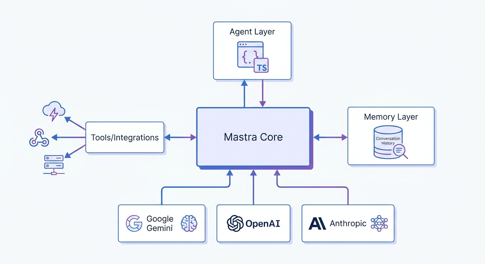

"If you're a TypeScript developer building AI agents, you're stuck with LangChain.js or Vercel AI SDK." I've heard that line a lot. It felt accurate enough that I never seriously questioned it. Then Mastra.ai popped up on my radar.

Mastra hit v1.0 in January 2026 after graduating from YC W25 with $13M in funding. By then it had already passed 22,000 GitHub stars and 300,000 weekly npm downloads. The Gatsby.js team built it, which means it comes from people who understand what "framework" should actually mean for JavaScript developers.

I had heard the name. Today I finally installed it, wired it to Google Gemini, and ran an actual agent with tool calls. This is the record of what worked, what didn't, and whether the "5-minute agent" claim holds up.

## What Mastra.ai Actually Is

Mastra is a TypeScript-first framework that bundles agents, workflows, memory, and observability into a single SDK. The pitch is simple: stop gluing packages together. Define your agent, its tools, and its memory in one place, and let the framework handle the plumbing.

It supports any LLM provider that Vercel AI SDK covers — OpenAI, Anthropic, Google Gemini, Meta Llama, and more. Mastra uses Vercel AI SDK as its underlying layer, so if you've built a streaming Claude agent with Vercel AI SDK before, you're already familiar with the foundation Mastra sits on.

### Why Now?

The Python agent ecosystem got mature fast. LangGraph, CrewAI, and PydanticAI accumulated years of production use, community plugins, and battle-tested patterns. The TypeScript side lagged. Mastra is an attempt to close that gap, and v1.42 (the version I installed today) suggests it's serious about catching up.

I expected to be disappointed. I wasn't.

## Installation: One Command

I followed the official quickstart. Node.js v22.22.0 on my machine.

```bash
npm create mastra@latest mastra-lab -- --components agents,tools --llm google --example
```

The flags: `--components agents,tools` pulls in the agent and tool scaffolding, `--llm google` sets Google Gemini as the provider, `--example` generates a working weather agent template.

Setup takes 2〜3 minutes. The CLI walks through each step:

```
◇  Project structure created
◇  npm dependencies installed
◇  Mastra CLI installed
◇  Mastra dependencies installed
◇  .gitignore added
└  Project created successfully

◇  Mastra initialized successfully!

   Rename .env.example to .env
   and add your GOOGLE_API_KEY
```

Core dependencies in the generated `package.json`:

```json
{
  "dependencies": {
    "@mastra/core": "^1.42.0",
    "@mastra/memory": "^1.20.3",
    "@mastra/libsql": "^1.13.0",
    "@mastra/observability": "^1.14.1",
    "zod": "^4.4.3"
  },
  "devDependencies": {
    "typescript": "^6.0.3"
  }
}
```

TypeScript 6.0.3 and Zod v4. Both bumped major versions in early 2026. The fact that Mastra ships with current versions of both is a good signal.

## Project Structure

```
mastra-lab/
├── src/
│   └── mastra/
│       ├── index.ts          # Mastra instance setup
│       ├── agents/
│       │   └── weather-agent.ts  # Agent definition
│       └── tools/
│           └── weather-tool.ts   # Tool definition
├── .env.example
├── package.json
└── tsconfig.json
```

The separation is clean. `agents/` holds agent definitions. `tools/` handles external API interfaces. `index.ts` wires everything together into a Mastra instance.

## The Code: Tools and Agents

Looking at the generated code reveals Mastra's design priorities.

### Tool Definition

```typescript
// src/mastra/tools/weather-tool.ts
import { createTool } from '@mastra/core/tools';
import { z } from 'zod';

export const weatherTool = createTool({
  id: 'get-weather',
  description: 'Get current weather for a location',
  inputSchema: z.object({
    location: z.string().describe('City name'),
  }),
  outputSchema: z.object({
    temperature: z.number(),
    feelsLike: z.number(),
    humidity: z.number(),
    windSpeed: z.number(),
    conditions: z.string(),
    location: z.string(),
  }),
  execute: async (inputData) => {
    return await getWeather(inputData.location);
  },
});
```

Zod schemas for I/O typing. If you've seen [PydanticAI's type-safe agent approach](/en/blog/en/pydantic-ai-type-safe-agent-tutorial-2026) in Python, this is structurally similar. Same idea: type definition as documentation and validation logic, just across different languages.

The weather tool uses Open-Meteo, which is free and needs no API key. It geocodes city names to coordinates, then fetches current weather data. Clean separation of concerns.

### Agent Definition

```typescript
// src/mastra/agents/weather-agent.ts
import { Agent } from '@mastra/core/agent';
import { Memory } from '@mastra/memory';
import { weatherTool } from '../tools/weather-tool';

export const weatherAgent = new Agent({
  id: 'weather-agent',
  name: 'Weather Agent',
  instructions: `You are a helpful weather assistant...`,
  model: 'google/gemini-2.5-pro',
  tools: { weatherTool },
  memory: new Memory(),
});
```

The model string `'google/gemini-2.5-pro'` is all Mastra needs to wire up the right provider. `@ai-sdk/google` handles the actual API calls underneath.

## Running It: Seoul vs Tokyo Weather

I ran the agent directly without going through the full Mastra server setup. Memory was excluded initially. More on why below.

```typescript
import { Agent } from '@mastra/core/agent';

const agent = new Agent({
  id: 'weather-agent',
  name: 'Weather Agent',
  instructions: 'Provide concise weather information.',
  model: 'google/gemini-2.5-flash',
  tools: { weatherTool },
});

const result = await agent.generate(
  'Compare the current weather in Seoul and Tokyo. Which city is hotter right now?'
);
console.log(result.text);
```

**Output (2026-06-14, response time: 5,866ms):**

```
It is 27.3°C and feels like 30.1°C in Seoul with mainly clear conditions.
In Tokyo, it is 25.6°C and feels like 27.1°C with overcast conditions.
Seoul is hotter right now.
```

The agent called `get-weather` twice (once for Seoul, once for Tokyo), synthesized the results, and answered the comparison question. Two external API calls plus LLM reasoning in under six seconds. Seoul was indeed hotter.

Location resolution worked correctly too. "Seoul" mapped to coordinates 37.566, 126.978 without any prompting.

### The Error I Hit: Memory Needs Storage

My first attempt included `memory: new Memory()` in the agent definition. This errored immediately:

```
MastraError: Memory requires a storage provider to function.
Add a storage configuration to Memory or to your Mastra instance.
https://mastra.ai/en/docs/memory/overview
```

The official example includes Memory, but Memory needs a storage backend, either LibSQL or DuckDB. The generated `index.ts` has this configured, but when running an agent standalone, that configuration is missing.

This is a real friction point for new users. The error message points to docs, but someone just trying to run the quickstart example will hit this and wonder what went wrong. Better scaffolding here would help.

## Architecture: Four Layers



Mastra organizes around four layers:

**1. Agent Layer**  
Calls the LLM and decides whether to invoke tools. A single `generate()` call can involve multiple internal LLM↔tool round trips.

**2. Tools/Integrations**  
Zod-typed interfaces to external APIs, databases, or any other service. The LLM fills in arguments according to the schema.

**3. Memory**  
Conversation history, semantic search, and working memory. Requires LibSQL or PostgreSQL as backing store.

**4. Observability**  
OpenTelemetry-based tracing, spans, and logging for every agent execution. `MastraStorageExporter` persists locally; `MastraPlatformExporter` sends to Mastra's cloud platform.

## Mastra Studio

Running `npm run dev` opens Mastra Studio at `http://localhost:4111`. It's a web UI for chatting with agents, inspecting tool call traces, and testing workflows. During development, it's genuinely useful. You can see exactly which tools fired and what they returned, without digging through logs.

## How It Compares

The closest comparison in TypeScript is Vercel AI SDK. Vercel AI SDK handles LLM calls and streaming well; Mastra adds agent lifecycle management, memory, and observability on top. It's not a replacement. It's a higher-level abstraction that uses AI SDK underneath.

Against the [Google ADK vs LangGraph comparison](/en/blog/en/google-adk-vs-langgraph-agent-framework-comparison-2026) I did earlier, both were Python-only. Mastra is occupying that same space in TypeScript.

| | Mastra | Vercel AI SDK | LangGraph.js |
|---|---|---|---|
| Language | TypeScript | TypeScript | TypeScript |
| Agent loop | ✅ Built-in | ⚠️ Manual | ✅ Built-in |
| Memory | ✅ Built-in (storage req'd) | ❌ | ⚠️ Manual |
| Workflows | ✅ Graph-based | ❌ | ✅ Graph-based |
| Observability | ✅ OpenTelemetry | ❌ | ⚠️ External tools |
| Learning curve | Medium | Low | High |

## What I'd Change

Two things stood out as friction:

The Memory setup barrier. New users following the official example will hit an error the first time they try to use Memory standalone. The error is informative but the setup path isn't obvious. A cleaner getting-started experience here would make a real difference.

Production deployment documentation is thin. Mastra Studio is a development tool, but the path from "working locally" to "deployed on my server" isn't well documented outside of the Vercel deployment guide. Docker and self-hosted setups require figuring things out yourself.

## Is It Worth Trying Right Now?

Yes, with caveats.

If you're starting a new TypeScript agent project, Mastra is worth a serious look. The setup is fast, the structure is sensible, and the core abstractions hold up. It took me about ten minutes from nothing to a working agent with real tool calls. The "5-minute" claim is close to accurate.

For production: I'd wait. Mastra v1.0 shipped in January 2026. Six months of production exposure is not much. The ecosystem is still thin compared to LangChain. API stability is not yet something I'd bet a production service on.

For a side project or internal tool: use it now. For a production service: revisit around v1.5.

```bash
# Get started
npm create mastra@latest my-agent-app -- --components agents,tools --llm google --example
cd my-agent-app
# Add GOOGLE_API_KEY to .env
npm run dev
# → Open http://localhost:4111 to chat with your first agent
```

The TypeScript AI agent ecosystem finally has a real contender. It's not fully there yet, but it's the most promising thing I've seen on the TypeScript side in a while.
