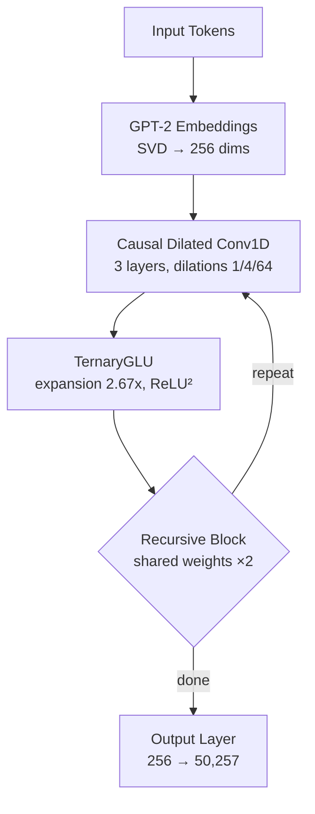
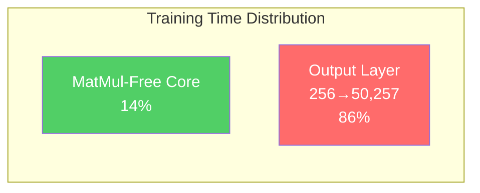

## Overview

What if you could train a language model without a GPU? Recently, a project on Reddit's r/LocalLLaMA community demonstrated <strong>training a 13.6M parameter language model on CPU alone in just 1.2 hours</strong>. Called FlashLM v3, this model uses an architecture that completely eliminates matrix multiplication (MatMul), relying only on additions and subtractions during inference.

This article examines the core principles of MatMul-Free architecture, the structure of FlashLM v3, and its implications for edge AI and low-cost training.

## What Is MatMul-Free Architecture?

### The Problem with Matrix Multiplication

In traditional Transformer models, the most compute-intensive operations are the <strong>matrix multiplications</strong> in Attention and FFN (Feed-Forward Network) layers. These operations have O(n²d) or O(nd²) complexity and heavily depend on GPU parallel processing capabilities.

In 2024, a research team at UC Santa Cruz published <strong>"Scalable MatMul-free Language Modeling"</strong> (arXiv:2406.02528), demonstrating that matrix multiplications can be completely eliminated from LLMs while maintaining competitive performance at billion-parameter scales.

### Ternary Weights

The core idea of MatMul-Free models is restricting weights to just three values: <strong>{-1, 0, +1}</strong>. This enables:

- <strong>No multiplication needed</strong>: Weight of -1 means sign flip, 0 means skip, +1 means direct addition
- <strong>Memory savings</strong>: Only 2 bits per weight (8x reduction vs FP16)
- <strong>Energy efficiency</strong>: Integer addition is orders of magnitude more efficient than floating-point multiplication

```python
# Ternary weight operation example
# Traditional: output = weight * input  (floating-point multiply)
# MatMul-Free: output = sign(weight) * input  (add/subtract only)

def ternary_linear(x, weights):
    """Ternary weight linear transform — no multiplication"""
    result = torch.zeros_like(x[..., :weights.shape[1]])
    result += x[..., weights == 1].sum(dim=-1)   # +1: add
    result -= x[..., weights == -1].sum(dim=-1)   # -1: subtract
    # weights == 0: do nothing
    return result
```

## FlashLM v3 Architecture in Detail

FlashLM v3 is an open-source model that implements the MatMul-Free concept in practice.

### Key Components



| Component | Details |
|-----------|---------|
| Parameters | 13.6M |
| Model dimension | 256 |
| Token mixer | Causal Dilated Conv1D (dilations 1/4/64) |
| FFN | TernaryGLU (expansion 2.67x, ReLU² activation) |
| Embeddings | GPT-2 pretrained → SVD projection (256 dims) |
| Tokenizer | GPT-2 (50,257 vocab) |
| Recursions | 2 (shared weights) |

### Training Setup

- <strong>Dataset</strong>: 32M tokens from FineWeb-Edu (30K documents)
- <strong>Hardware</strong>: CPU with 2 threads (Deepnote environment)
- <strong>Training time</strong>: ~1.2 hours
- <strong>Steps</strong>: 4,050 (sequence length 64→128→256 progressive)
- <strong>Optimizer</strong>: NorMuon (2D weights) + AdamW (embeddings, biases)
- <strong>Validation loss</strong>: 6.80

## A Surprising Discovery: The Output Layer Bottleneck

The most surprising finding shared by the developer was that <strong>86% of training time was spent on the output layer</strong>.



The softmax output layer projecting 256 dimensions to 50,257 vocabulary consumed the vast majority of compute. In other words, the "efficient" ternary core was essentially starved of training signal by the inefficient softmax head.

Version 4 plans to replace the softmax with a <strong>hierarchical tree structure</strong> to resolve this bottleneck, potentially enabling 5-10x more effective training within the same wall clock time.

## Relationship with the Scalable MatMul-free LM Paper

FlashLM v3 was inspired by the UC Santa Cruz MatMul-Free paper but differs in several ways:

| Aspect | Paper (2024) | FlashLM v3 |
|--------|-------------|------------|
| Scale | Up to 2.7B parameters | 13.6M parameters |
| Hardware | GPU | CPU only |
| Token mixer | MatMul-free Attention variant | Causal Dilated Conv1D |
| Weights | Ternary | Ternary (STE training) |
| Memory savings | 61% training, 10x inference | CPU-viable level |
| Goal | Prove large-scale efficiency | Prove ultra-small CPU training |

## Implications for Edge AI and Low-Cost Training

### 1. AI Development Without GPUs

MatMul-Free architecture opens possibilities for AI development in GPU-constrained environments:

- <strong>Education</strong>: Students can train language models directly on laptops
- <strong>Developing countries</strong>: Local AI model development without expensive GPUs
- <strong>Prototyping</strong>: Quick idea validation without waiting for GPU access

### 2. Edge Device Inference

The biggest advantage of ternary weights is <strong>inference efficiency on edge devices</strong>:

- <strong>IoT devices</strong>: Language models running on microcontrollers
- <strong>Mobile</strong>: On-device inference with minimal battery drain
- <strong>Neuromorphic chips</strong>: According to the paper, asynchronous processing achieves 4x throughput with 10x less energy than edge GPUs

### 3. Practical Limitations

Of course, there are clear limitations at the current stage:

- Validation loss of 6.80 falls short of practical utility
- Grammatically plausible but lacking semantic coherence
- Limited long-range context handling without Attention mechanism
- Scaling remains difficult unless the output layer bottleneck is resolved

## Future Outlook

MatMul-Free architecture is still in its early stages, but several development directions are promising:

1. <strong>Output layer optimization</strong>: Hierarchical softmax, adaptive softmax to resolve the bottleneck
2. <strong>Scale-up</strong>: The paper validated up to 2.7B parameters, suggesting CPU training may reach mid-scale
3. <strong>Hardware optimization</strong>: Custom hardware or FPGA acceleration specialized for ternary operations
4. <strong>Hybrid approaches</strong>: MatMul-Free for core layers, traditional methods for output

## Conclusion

FlashLM v3 is a fascinating project that demonstrates the possibility of training language models without a GPU. While currently at research prototype stage, the maturation of MatMul-Free architecture could become a key pillar of <strong>AI democratization</strong>.

The discovery of the output layer bottleneck, in particular, provides valuable insights for future efficient architecture design. The road to GPU-free AI is still long, but the first steps have already been taken.

## References

- [FlashLM v3 Model (Hugging Face)](https://huggingface.co/changcheng967/flashlm-v3-13m)
- [Reddit Discussion (r/LocalLLaMA)](https://www.reddit.com/r/LocalLLaMA/comments/1r7mscr/i_trained_a_language_model_on_cpu_in_12_hours/)
- [Scalable MatMul-free Language Modeling (arXiv:2406.02528)](https://arxiv.org/abs/2406.02528)
