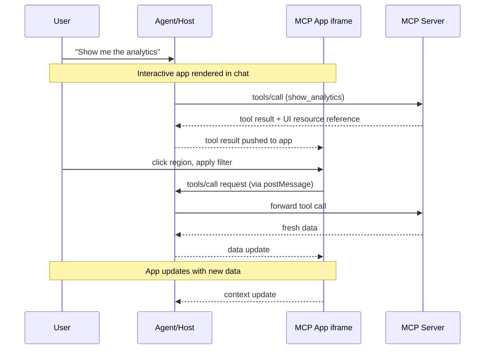

On January 26, 2026, the Model Context Protocol team quietly announced a feature that is reshaping the paradigm of AI agent UX: **MCP Apps**. Instead of text responses, AI can now deliver interactive dashboards, forms, and data visualizations that operate directly inside the AI chat window.

From an Engineering Manager's perspective, the importance in one sentence: previously, when an AI agent "showed data," users had to read the text and then manually interact with their tools. MCP Apps eliminates that gap.

## What Are MCP Apps?

MCP Apps is the first official extension to MCP (Model Context Protocol)—<strong>a protocol that enables tool calls to return interactive HTML UIs as responses</strong>.

Traditional MCP tools returned text, images, and structured data. With MCP Apps, the same tool call can return:

- A clickable regional sales map
- A real-time updating system monitoring dashboard
- A deployment configuration form showing all options at once
- A PDF viewer, 3D model viewer, or sheet music renderer

And this UI <strong>operates inside the chat window, within the conversation context</strong>.

## Why This Differs From Just Sending a Web App Link

You might think, "Why not just send a link?" There are four fundamental reasons MCP Apps differs from separate web apps.

<strong>1. Context Preservation</strong>

The UI exists within the conversation. Users don't need to switch tabs or remember which chat thread had that dashboard. The UI is naturally woven into the conversation flow.

<strong>2. Bidirectional Data Flow</strong>

An MCP App can call any tool on the MCP server, and the host can push fresh results to the app. A separate web app would need its own API, authentication, and state management—MCP Apps leverages existing MCP patterns directly.

<strong>3. Host Capability Integration</strong>

Apps can delegate actions to the host. When an app sends "schedule this meeting" to the host, the host processes it through the calendar integration the user has already connected. Apps don't need to implement every external integration themselves.

<strong>4. Security Guarantees</strong>

MCP Apps run inside a sandboxed iframe. They can't access the parent page, steal cookies, or escape their container. Hosts can safely render third-party apps without fully trusting the server developer. For broader MCP ecosystem security threats and enterprise hardening, see [MCP Security Crisis — 30 CVEs in 60 Days: Enterprise Hardening Guide](/en/blog/en/mcp-security-crisis-30-cves-enterprise-hardening).

## How It Works: Architecture Deep Dive

MCP Apps combines two MCP primitives: a tool that declares a UI resource, and a UI resource that renders data as an interactive HTML interface.



### Step-by-Step Flow

<strong>Step 1: UI Preloading</strong>

The tool description includes a `_meta.ui.resourceUri` field pointing to a `ui://` resource. The host can preload this resource before the tool is even called, enabling features like streaming tool inputs to the app.

<strong>Step 2: Resource Fetch</strong>

The host fetches the UI resource from the server. This resource is an HTML page, typically bundled with its JavaScript and CSS.

<strong>Step 3: Sandboxed Rendering</strong>

The host renders the HTML inside a sandboxed iframe within the conversation. The sandbox restricts the app's access to the parent page.

<strong>Step 4: Bidirectional Communication</strong>

The app and host communicate through a JSON-RPC protocol with `ui/` method name prefixes. The app can make tool call requests, send messages, update model context, and receive data from the host.

## Practical Implementation: Building an MCP App Server

Let's build an MCP App server. Here's a simple sales analytics dashboard example.

### 1. Install Dependencies

```bash
npm install @modelcontextprotocol/sdk @modelcontextprotocol/ext-apps express
```

### 2. MCP Server with UI Declaration

```typescript
import { McpServer } from "@modelcontextprotocol/sdk/server/mcp.js";
import { StdioServerTransport } from "@modelcontextprotocol/sdk/server/stdio.js";

const server = new McpServer({
  name: "analytics-dashboard",
  version: "1.0.0",
});

// Tool definition declaring a UI resource
server.tool(
  "show_sales_dashboard",
  "Displays regional sales data as an interactive dashboard",
  {
    region: {
      type: "string",
      description: "Region to analyze (all, kr, jp, us, cn)",
      default: "all",
    },
    period: {
      type: "string",
      description: "Analysis period (7d, 30d, 90d)",
      default: "30d",
    },
  },
  // _meta.ui: Core of MCP Apps — declare the UI resource reference
  {
    _meta: {
      ui: {
        resourceUri: "ui://analytics-dashboard/sales",
      },
    },
  },
  async ({ region, period }) => {
    // Fetch actual data
    const salesData = await fetchSalesData(region, period);

    return {
      content: [
        {
          type: "text",
          text: `Loaded sales data for ${region} over the last ${period}.`,
        },
        {
          type: "resource",
          resource: {
            uri: "ui://analytics-dashboard/sales",
            mimeType: "text/html",
          },
        },
      ],
      // Pass initial data to the UI app
      _meta: {
        ui: {
          resourceUri: "ui://analytics-dashboard/sales",
          initialData: salesData,
        },
      },
    };
  }
);

// UI resource handler
server.resource("ui://analytics-dashboard/sales", async () => {
  const htmlContent = generateDashboardHTML();
  return {
    contents: [
      {
        uri: "ui://analytics-dashboard/sales",
        mimeType: "text/html",
        text: htmlContent,
      },
    ],
  };
});

async function main() {
  const transport = new StdioServerTransport();
  await server.connect(transport);
}

main();
```

### 3. MCP App UI Implementation (React Example)

```tsx
// dashboard-app/src/App.tsx
import { useEffect, useState } from "react";
import { App as McpApp, useToolCall, useHostData } from "@modelcontextprotocol/ext-apps";

interface SalesData {
  regions: { name: string; revenue: number; growth: number }[];
  total: number;
  period: string;
}

function SalesDashboard() {
  const [data, setData] = useState<SalesData | null>(null);
  const [selectedRegion, setSelectedRegion] = useState<string>("all");

  // Receive initial data from the host
  const hostData = useHostData<SalesData>();

  // Tool call hook — request fresh data from server on user interaction
  const { call: fetchRegionData, loading } = useToolCall("show_sales_dashboard");

  useEffect(() => {
    if (hostData) {
      setData(hostData);
    }
  }, [hostData]);

  const handleRegionClick = async (region: string) => {
    setSelectedRegion(region);
    // Call MCP tool directly from UI — no additional LLM turn needed!
    const result = await fetchRegionData({ region, period: "30d" });
    if (result?.data) {
      setData(result.data as SalesData);
    }
  };

  if (!data) return <div className="loading">Loading data...</div>;

  return (
    <div className="dashboard">
      <h2>Sales Dashboard</h2>
      <div className="region-filters">
        {["all", "kr", "jp", "us", "cn"].map((region) => (
          <button
            key={region}
            className={selectedRegion === region ? "active" : ""}
            onClick={() => handleRegionClick(region)}
            disabled={loading}
          >
            {region.toUpperCase()}
          </button>
        ))}
      </div>
      <div className="chart-area">
        {data.regions.map((r) => (
          <div key={r.name} className="region-bar">
            <span className="label">{r.name}</span>
            <div
              className="bar"
              style={{ width: `${(r.revenue / data.total) * 100}%` }}
            />
            <span className="value">
              ${r.revenue.toLocaleString()}
              <span className={r.growth > 0 ? "up" : "down"}>
                {r.growth > 0 ? "▲" : "▼"}{Math.abs(r.growth)}%
              </span>
            </span>
          </div>
        ))}
      </div>
      <div className="summary">
        Total: ${data.total.toLocaleString()} | Period: {data.period}
      </div>
    </div>
  );
}

// Wrap with McpApp to enable host communication
export default function App() {
  return (
    <McpApp>
      <SalesDashboard />
    </McpApp>
  );
}
```

### 4. Security Configuration (CSP and Permissions)

```typescript
// Explicitly declare security policy in tool declaration
{
  _meta: {
    ui: {
      resourceUri: "ui://analytics-dashboard/sales",
      permissions: [], // No additional permissions (basic sandbox only)
      csp: {
        // Explicitly list allowed external resource domains
        "script-src": ["'self'", "https://cdn.jsdelivr.net"],
        "connect-src": ["'self'", "https://api.yourcompany.com"],
        "style-src": ["'self'", "'unsafe-inline'"],
      },
    },
  },
}
```

## Current Client Support

As of March 2026, clients supporting MCP Apps include:

| Client | Support Status | Notes |
|---|---|---|
| Claude (claude.ai) | ✅ Supported | Web + Desktop |
| Claude Desktop | ✅ Supported | v3.5+ |
| VS Code Copilot | ✅ Supported | Insiders → Stable |
| Goose (Block) | ✅ Supported | |
| Postman | ✅ Supported | Useful for API testing |
| MCPJam | ✅ Supported | |
| ChatGPT | ⏳ Unknown | No official announcement |
| Cursor | ⏳ Unknown | Under roadmap discussion |

In VS Code, the `/mcp` chat command lets you enable/disable servers and manage OAuth authentication. For running MCP servers directly in the browser, see [WebMCP: Chrome 146 — Your Browser Becomes an AI Agent Tool Server](/en/blog/en/webmcp-chrome-146-ai-tool-server).

## Practical Application: Engineering Manager Perspective

Here are the key decision points for EMs when adopting MCP Apps.

### When MCP Apps Are a Good Fit

<strong>Repeated complex data exploration</strong>. If team members ask AI "summarize this month's incidents" and then open a separate dashboard to verify—embed the dashboard in chat with MCP Apps.

<strong>Multi-step configuration/approval workflows</strong>. Infrastructure deployments, cost approvals, and code review triage work far better with a form showing all options at once than a back-and-forth conversation.

<strong>Real-time monitoring</strong>. The experience of asking a question in chat and having a live metrics dashboard appear in-place is fundamentally different from the traditional approach.

### Key Considerations for Adoption

<strong>Bundle size management</strong>: UI resources load in chat, so initial load performance matters. Prefer Preact or vanilla JS over a full React bundle.

<strong>CSP (Content Security Policy) configuration</strong>: External scripts and API endpoints must be explicitly declared. Work with your security team to maintain the allowed domain list.

<strong>Fallback design</strong>: Always design tools to return useful text responses for clients that don't support MCP Apps.

<strong>User consent flow</strong>: When the UI initiates tool calls, the host will request user consent. Design this UX to be natural and non-disruptive.

### Client Implementation (For Teams Building Custom Hosts)

Teams building their own AI clients have two options:

```bash
# Option 1: @mcp-ui/client package (provides React components)
npm install @mcp-ui/client

# Option 2: Direct App Bridge implementation
# Leverage the SDK's App Bridge module for:
# - Sandboxed iframe rendering
# - Message passing
# - Tool call proxying
# - Security policy enforcement
```

## Use Case Gallery

Looking at the official repository examples gives a clear sense of what's possible:

- <strong>map-server</strong>: CesiumJS globe — "Show Asia logistics status" → 3D earth appears in chat
- <strong>cohort-heatmap-server</strong>: Cohort heatmap — user retention analysis dashboard
- <strong>pdf-server</strong>: PDF viewer — review contracts directly in chat
- <strong>system-monitor-server</strong>: Real-time system metrics monitoring
- <strong>scenario-modeler-server</strong>: Business scenario modeling tool
- <strong>budget-allocator-server</strong>: Budget allocation simulator

All examples are provided in React, Vue, Svelte, Preact, Solid, and vanilla JavaScript versions.

## Conclusion

MCP Apps solves a fundamental limitation of AI agent interfaces. AI that previously communicated only through text can now <strong>run live UI directly within the conversation</strong>.

The value from an Engineering Manager's perspective is clear: team members can ask AI a question, receive an interactive tool in response, and complete their work—all without switching to a separate dashboard tab or tool.

You don't need to add UI to every MCP server right now. But start by applying MCP Apps to one tool your team uses most. That experience will reshape how you design AI workflows going forward. For standardized agent skill systems that AI agents can leverage, also read [Anthropic Agent Skills Standard: Extending AI Agent Capabilities](/en/blog/en/anthropic-agent-skills-standard).

## References

- [MCP Apps Official Announcement (2026-01-26)](http://blog.modelcontextprotocol.io/posts/2026-01-26-mcp-apps/)
- [MCP Apps Official Documentation](https://modelcontextprotocol.io/extensions/apps/overview)
- [ext-apps GitHub Repository](https://github.com/modelcontextprotocol/ext-apps)
- [WorkOS: MCP Apps are here](https://workos.com/blog/2026-01-27-mcp-apps)
- [VS Code: MCP Apps Support](https://code.visualstudio.com/blogs/2026/01/26/mcp-apps-support)
- [Goose: From MCP-UI to MCP Apps](https://block.github.io/goose/blog/2026/01/22/mcp-ui-to-mcp-apps/)
