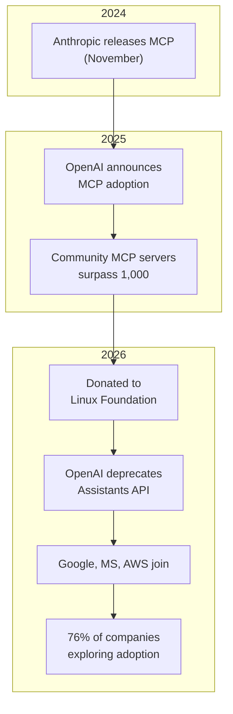
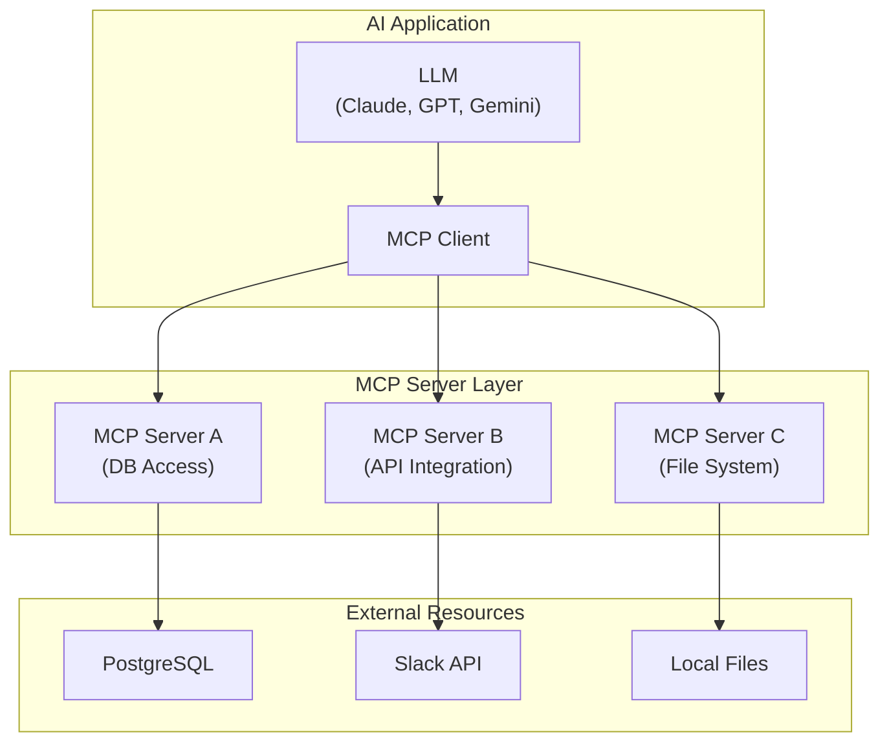
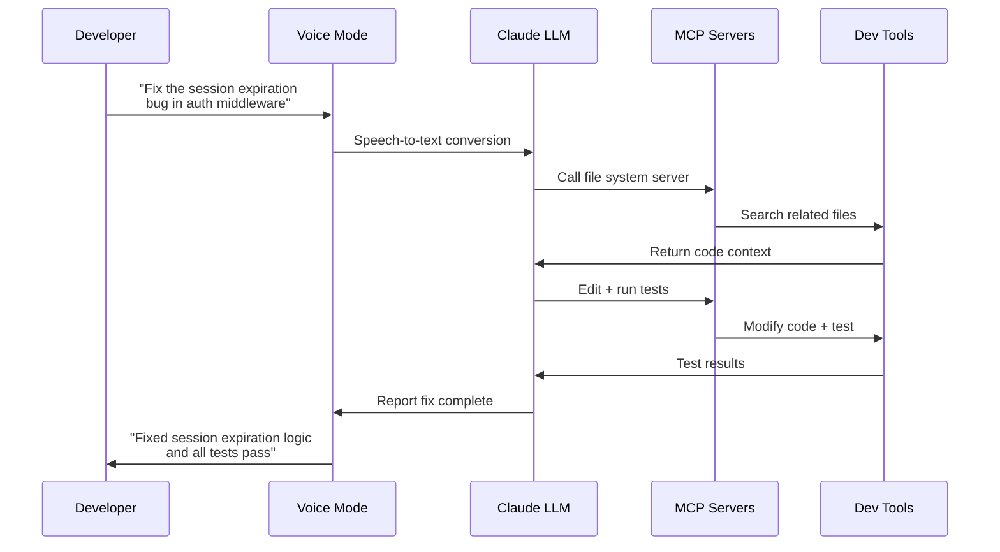
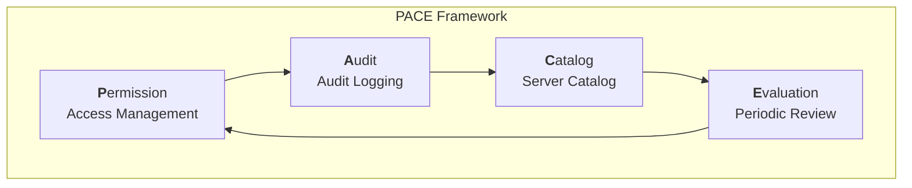
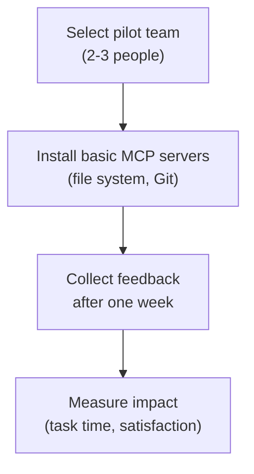

## MCP: How "the USB-C of AI" Became an Industry Standard

In November 2024, Anthropic released the <strong>Model Context Protocol (MCP)</strong>, and it was initially dismissed as "just another protocol." But in barely 16 months, the landscape shifted entirely.

In early 2026, Anthropic donated MCP to the <strong>Linux Foundation</strong>, and OpenAI (which deprecated its Assistants API in favor of MCP), Google DeepMind, Microsoft, AWS, and Cloudflare joined as founding members. A de facto single standard for "how AI models communicate with external tools" was born.

This article explores what MCP standardization means for engineering organizations and how <strong>EMs, VPoEs, and CTOs</strong> can prepare for adoption, complete with real-world examples.

## Why MCP, Why Now — 3 Inflection Points

### 1. The Protocol Wars Are Over

As recently as 2025, the AI tool integration landscape was fragmented:

- OpenAI: Function Calling + Assistants API
- Google: Vertex AI Extensions
- Anthropic: Tool Use + MCP
- Various frameworks: LangChain Tools, CrewAI Tools, etc.

In 2026, OpenAI officially deprecated the Assistants API and fully adopted MCP, effectively ending this fragmentation. The establishment of a single standard under Linux Foundation governance ranks among the most significant infrastructure standardizations since HTTP and REST.

### 2. 76% of Companies Are Already Moving

According to CData's 2026 survey, <strong>76% of software vendors</strong> are already exploring or implementing MCP. This signals a shift from "whether to adopt" to "how to adopt."

### 3. Security Controls Are Falling Behind Adoption

According to VentureBeat, <strong>enterprise MCP adoption is outpacing the development of security controls</strong>. This mirrors the early 2000s REST API boom — convenience outrunning security, with the bill coming due later.

## MCP Architecture Essentials — A 5-Minute Overview

For those new to MCP, here is a summary of the core architecture.

<strong>Core Concepts</strong>:

- <strong>MCP Host</strong>: The AI application (Claude Code, Cursor, Windsurf, etc.)
- <strong>MCP Client</strong>: Manages 1:1 connections with servers inside the host
- <strong>MCP Server</strong>: Provides access to specific resources (databases, APIs, files, etc.)
- <strong>Transport</strong>: stdio (local) or HTTP+SSE (remote) protocol

The USB-C analogy works because a single protocol lets any AI model connect to any tool.

## 3 Real-World Examples — How MCP Is Transforming Workflows

### Example 1: Perplexity Computer — Agentic Orchestration Across 19 Models

Released in February 2026, <strong>Perplexity Computer</strong> is the most striking example of MCP-based multi-model orchestration.

| Role | Model | Use Case |
|------|-------|----------|
| Core reasoning | Claude Opus 4.6 | Complex decision-making |
| Deep research | Gemini | Large-scale document analysis |
| Lightweight tasks | Grok | Fast responses |
| Long-context recall | ChatGPT 5.2 | Leveraging long conversation history |

Perplexity <strong>wraps each model as an MCP server</strong>, enabling sub-agents to work in parallel. When a user asks "Analyze this PDF, summarize it, and email the results," the system automatically selects the optimal model combination and distributes the work.

<strong>Takeaway for EMs</strong>: Multi-model strategies that avoid single-model lock-in are now feasible. Team-level AI tool selection evolves from "which model to use" to "which model to assign to which task."

### Example 2: Claude Code Voice Mode — 3.7x Productivity Gains

Released on March 3, 2026, <strong>Claude Code Voice Mode</strong> activates via the `/voice` command, allowing developers to describe bugs, make architectural decisions, and direct refactoring by voice while Claude writes and executes the code.

Early user data reports <strong>3.7x faster workflows</strong>. The key to this speed improvement is MCP-based tool connectivity — Voice Mode connects the file system, Git, test runners, and build systems as MCP servers, enabling full development pipeline control through a single voice command.

### Example 3: MCP Gateways for Platform Engineering Teams

<strong>MCP gateways</strong> from providers like MintMCP and Cloudflare Workers allow platform engineering teams to centrally manage MCP servers across the entire organization.

Reported benefits from real-world deployments:

- <strong>40% reduction in repetitive task time</strong>: Automating Jira issue creation, Slack notifications, and DB queries via MCP
- <strong>Faster onboarding</strong>: New team members gain immediate access to team tools through standardized MCP servers
- <strong>Less shadow IT</strong>: Unified tool access through standard MCP servers instead of personal scripts

## Security and Governance Considerations for EMs and VPoEs

### The Security Risk Reality

MCP's rapid adoption comes at a cost. According to Cisco's analysis, key risks include:

1. <strong>Prompt injection</strong>: Data returned by MCP servers may contain malicious prompts
2. <strong>Supply chain attacks</strong>: Quality control issues with community MCP servers (e.g., OpenClaw's 5,700+ skills)
3. <strong>Excessive permissions</strong>: Granting MCP servers more system access than necessary
4. <strong>Data exfiltration</strong>: Unintentional external transmission of internal data through AI models

### Governance Framework: The PACE Model

Here is a proposed MCP governance framework for engineering organizations.

<strong>Permission (Access Management)</strong>:
- Apply the principle of least privilege per MCP server
- Clearly separate read-only vs. write-capable servers
- Maintain team-level server whitelists

<strong>Audit (Audit Logging)</strong>:
- Log all MCP calls
- Detect anomalous patterns (bulk data access, off-hours calls, etc.)
- Auto-generate weekly audit reports

<strong>Catalog (Server Catalog)</strong>:
- Centrally manage the list of approved MCP servers
- Track version management and security patches
- Require code review for community server usage

<strong>Evaluation (Periodic Review)</strong>:
- Quarterly MCP server security audits
- Usage-based cleanup of unnecessary servers
- Impact assessment for newly discovered vulnerabilities

## Adoption Roadmap for Engineering Organizations

### Phase 1: Pilot (2-4 weeks)

- <strong>Target</strong>: 2-3 senior engineers interested in AI tools
- <strong>Servers</strong>: File system, Git, basic DB queries — low-risk servers only
- <strong>Metrics</strong>: Change in repetitive task time, developer satisfaction

### Phase 2: Team Expansion (1-2 months)

- <strong>Target</strong>: Full team (10-20 people)
- <strong>Additional servers</strong>: Slack, Jira, CI/CD integrations
- <strong>Governance</strong>: Begin applying the PACE framework
- <strong>Training</strong>: Share MCP fundamentals + security guidelines

### Phase 3: Organization-Wide Standardization (2-3 months)

- <strong>Deploy MCP gateway</strong>: Central management + unified auth and permissions
- <strong>Custom server development</strong>: Build MCP servers for internal systems
- <strong>CI/CD integration</strong>: Establish MCP server deployment pipelines
- <strong>KPI tracking</strong>: Formally track productivity metrics

### Phase 4: Optimization (ongoing)

- Develop multi-model strategy (see the Perplexity Computer example)
- Monitor MCP server performance
- Automate the evaluation and onboarding process for new servers

## The Key to Closing the "80/13 Gap"

According to McKinsey's 2026 survey, <strong>80% of companies have deployed GenAI, but only 13% are seeing meaningful impact</strong>. The root causes are "tool fragmentation" and "lack of workflow integration."

MCP standardization is the infrastructure layer that closes this gap:

| Problem | Before MCP | After MCP |
|---------|-----------|-----------|
| Tool connectivity | Custom integration per model | Unified via standard protocol |
| Switching costs | Rebuild all integrations on model change | Keep servers, swap clients only |
| Team collaboration | Proliferation of personal scripts | Shared standard server catalog |
| Security management | Individual audits per integration | Centralized management at gateway level |

## CTO Perspective: What Investment Trends Reveal

According to TechCrunch's March 2026 report, VCs are no longer investing in <strong>"thin workflow layer"</strong> SaaS. Instead, they are focused on <strong>AI-native infrastructure deeply embedded in mission-critical workflows</strong>.

This means MCP should be positioned not as "a simple tool connector" but as <strong>"the organization's AI infrastructure layer."</strong> Organizations that build out their MCP server ecosystem early will gain:

1. <strong>Model flexibility</strong>: Switching from Claude to GPT or open-source models without disrupting workflows
2. <strong>Vendor independence</strong>: Infrastructure that does not depend on any single AI provider
3. <strong>Continuous innovation</strong>: Expanding AI capabilities simply by adding new MCP servers

## Conclusion — Now Is the Right Time to Invest in MCP

MCP's entry into the Linux Foundation put the question "will this protocol survive?" to rest. OpenAI, Google, Microsoft, and AWS all sitting at the same table represents <strong>the most significant infrastructure consensus since HTTP</strong>.

As an engineering leader, there are three things to do right now:

1. <strong>Start a pilot</strong> — Begin with 2-3 senior engineers and basic MCP servers
2. <strong>Design governance first</strong> — Scaling without security controls will cost you later
3. <strong>Think multi-model</strong> — MCP enables architectures that are not locked into any single model

"Just as USB-C unified charging across all devices, MCP unifies how all AI connects to tools. The difference is — USB-C took 10 years, and MCP took less than two."

## References

- [How MCP will supercharge AI automation in 2026 — Hallam](https://hallam.agency/blog/how-mcp-will-supercharge-ai-automation-in-2026/)
- [Enterprise MCP adoption is outpacing security controls — VentureBeat](https://venturebeat.com/security/enterprise-mcp-adoption-is-outpacing-security-controls)
- [2026: The Year for Enterprise-Ready MCP Adoption — CData](https://www.cdata.com/blog/2026-year-enterprise-ready-mcp-adoption)
- [MCP Explained: How AI Agents Actually Work (2026) — DEV Community](https://dev.to/aristoaistack/mcp-explained-how-ai-agents-actually-work-2026-5p8)
- [Claude Code rolls out a voice mode — TechCrunch](https://techcrunch.com/2026/03/03/claude-code-rolls-out-a-voice-mode-capability/)
- [Best MCP Gateways for Platform Engineering Teams — MintMCP](https://www.mintmcp.com/blog/mcp-gateways-platform-engineering-teams)
