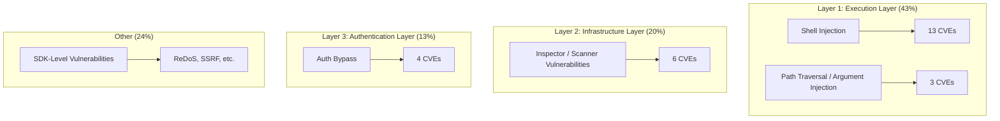
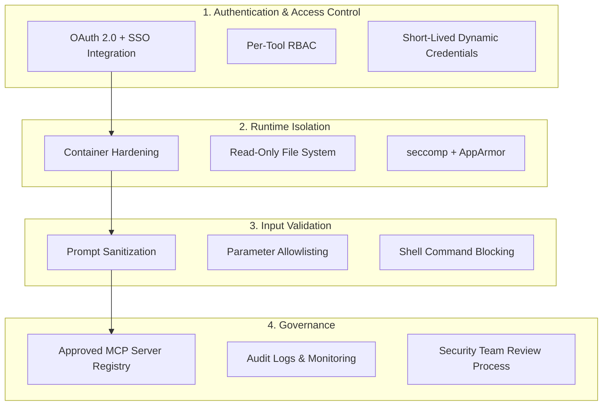

## MCP: The Cost of Becoming AI's USB Port

Model Context Protocol (MCP) has become the de facto standard for connecting LLMs to external tools and data. With its transition to open governance under the Linux Foundation and endorsement from major vendors like Anthropic, OpenAI, and Google, adoption has skyrocketed. But <strong>wherever convenience is established, attack surface inevitably follows.</strong>

Between January and February 2026, <strong>30 CVEs</strong> were reported across the MCP ecosystem in just 60 days, with 42,665 MCP server instances found exposed to the internet. Of the 560 servers scanned, 36% had no authentication whatsoever. It is no exaggeration to say that MCP is becoming the fastest-growing attack surface of the AI era.

This article analyzes the current MCP security landscape from an EM/VPoE/CTO perspective and presents a hardening guide that teams and organizations can implement immediately.

## The Three-Layer Attack Model Behind 30 CVEs

Classifying the 30 reported CVEs reveals that MCP's attack surface has evolved into <strong>three distinct layers</strong>.

### Layer 1 — Execution Layer (43%, 13+3 CVEs)

The most classic category, and still the most prevalent. A recurring pattern was discovered where MCP servers pass user input directly to shell commands.

<strong>Key example</strong>: Three vulnerabilities found in Anthropic's official Git MCP server (CVE-2025-68143 through 68145) allowed remote code execution (RCE) via prompt injection. Path validation bypass, unrestricted `git_init`, and argument injection worked in combination.

### Layer 2 — Infrastructure Layer (20%, 6 CVEs)

This is a new pattern where the vulnerability lies not in the MCP server itself, but in <strong>the tools used to manage and monitor MCP</strong>. Inspectors, scanners, and host applications — "meta-tools" — have become attack targets.

### Layer 3 — Authentication Layer (13%, 4 CVEs)

Authentication-related vulnerabilities were reported, including <strong>OAuth token refresh mechanism manipulation on macOS</strong> (CVE-2026-27487) and credentials stored in plaintext at `~/.openclaw/credentials/`.

## SDK-Level Threats — Supply Chain Contamination

Beyond individual servers, <strong>supply chain attacks threatening the entire MCP ecosystem</strong> have been detected.

### Official TypeScript SDK Vulnerabilities

Two critical vulnerabilities were confirmed in `@modelcontextprotocol/sdk` (the official TypeScript SDK):

- <strong>ReDoS</strong>: The regex used for resource URI matching in the `UriTemplate` class was susceptible to catastrophic backtracking. A specially crafted URI could hang the server process.
- <strong>SSRF</strong>: An SSRF vulnerability found in Microsoft's MarkItDown MCP server potentially exists in approximately 36.7% of all MCP servers.

### Skill Registry Poisoning

| Period | Scan Scope | Malicious Skills | Percentage |
|--------|-----------|-----------------|-----------|
| 2026-01-29 | 2,857 packages | 341 | 11.9% |
| 2026-02-16 | 10,700+ packages | 824+ | 7.7% |

Bitdefender Labs confirmed <strong>malicious payloads in approximately 20%</strong> of deeply analyzed samples. In effect, supply chain attacks from npm and PyPI have expanded into the MCP skill registry.

## Enterprise Hardening Checklist for EMs and CTOs

### 1. Authentication & Access Control

- <strong>OAuth 2.0 + SSO integration is mandatory</strong>: Place MCP endpoints behind SSO. Given that 36% of servers were exposed without authentication, this is the top priority.
- <strong>Per-tool RBAC</strong>: Apply role-based access control to every MCP tool. Ensure that a "file read" tool does not also carry "file delete" permissions.
- <strong>Dynamic credentials</strong>: Use short-lived tokens instead of static API keys. Implement automatic rotation.

### 2. Runtime Isolation

- <strong>Immutable infrastructure</strong>: Read-only container file systems with restricted Linux capabilities.
- <strong>Resource limits</strong>: Set CPU/memory quotas to mitigate resource exhaustion attacks such as ReDoS.
- <strong>Mandatory access control</strong>: Restrict at the system call level with seccomp profiles and AppArmor/SELinux.

### 3. Input Validation

- <strong>Prompt sanitization</strong>: Defend against prompt injection. Validate all user inputs and tool parameters against an allowlist.
- <strong>Block direct shell command execution</strong>: Transition to a structure that only permits predefined commands.

### 4. Governance

- <strong>Maintain an approved server registry</strong>: Establish a security team approval process so developers cannot install MCP servers arbitrarily.
- <strong>Audit logs</strong>: Maintain audit trails for all MCP tool invocations. Meet regulatory requirements (GDPR, HIPAA, SOC 2).
- <strong>SAST + SCA</strong>: Apply static analysis tools and software composition analysis to MCP server code.

## Practical Implementation — Three Stages of MCP Security Maturity

A phased approach to raising your security posture based on your organization's current state is the most realistic path forward.

### Stage 1: Immediate Actions (1–2 weeks)

- Immediately disable or block access to unauthenticated MCP endpoints
- Audit for plaintext credential storage (`~/.openclaw/credentials/`, `.env`)
- Verify MCP SDK versions in use and apply patches

### Stage 2: Foundation Building (1–2 months)

- Complete OAuth 2.0 + SSO integration
- Migrate to container-based MCP server deployments
- Build an approved MCP server/skill registry
- Include MCP server code in SAST/SCA pipelines

### Stage 3: Mature Operations (3–6 months)

- Real-time monitoring and anomaly detection
- Establish periodic security audit processes
- Internal training program on MCP security policies
- Include MCP scenarios in red team exercises

## OWASP's MCP Security Guide

OWASP published a practical guide for secure MCP server development in early 2026. The key recommendations are:

- <strong>Principle of least privilege</strong>: Grant each MCP tool only the minimum permissions it requires.
- <strong>Secrets management</strong>: Use a dedicated secrets manager instead of environment variables. Inject secrets dynamically at runtime.
- <strong>Component signing</strong>: Apply signatures to MCP server binaries and skill packages.
- <strong>DevSecOps integration</strong>: Automate MCP security as part of the CI/CD pipeline.

## Conclusion — Finding the Balance Between Convenience and Security

MCP is the protocol that has made it possible for AI agents to perform real work. However, the reality of 30 CVEs in 60 days is a stark reminder that <strong>"connectivity equals vulnerability"</strong> — a fundamental principle of security.

What matters for EMs and CTOs is not banning MCP, but <strong>building a framework for safe usage within a controlled environment</strong>. Removing unauthenticated servers, enforcing runtime isolation, and establishing an approval process — implementing just these three measures can mitigate over 76% of currently reported CVEs.

As AI agents embed themselves deeper into core business operations, MCP security is no longer optional — it is essential.

## References

- [Adversa AI — Top MCP Security Resources (March 2026)](https://adversa.ai/blog/top-mcp-security-resources-march-2026/)
- [30 CVEs Later: How MCP's Attack Surface Expanded Into Three Distinct Layers](https://dev.to/kai_security_ai/30-cves-later-how-mcps-attack-surface-expanded-into-three-distinct-layers-ihp)
- [OWASP — A Practical Guide for Secure MCP Server Development](https://genai.owasp.org/resource/a-practical-guide-for-secure-mcp-server-development/)
- [MCP Security Best Practices — Model Context Protocol Official](https://modelcontextprotocol.io/specification/draft/basic/security_best_practices)
- [Red Hat — Model Context Protocol: Understanding Security Risks and Controls](https://www.redhat.com/en/blog/model-context-protocol-mcp-understanding-security-risks-and-controls)
- [Practical DevSecOps — MCP Security Vulnerabilities](https://www.practical-devsecops.com/mcp-security-vulnerabilities/)
