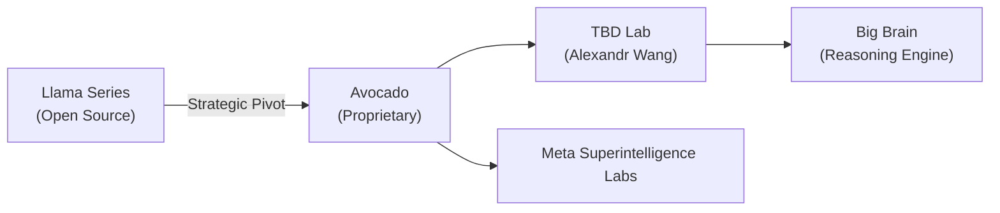
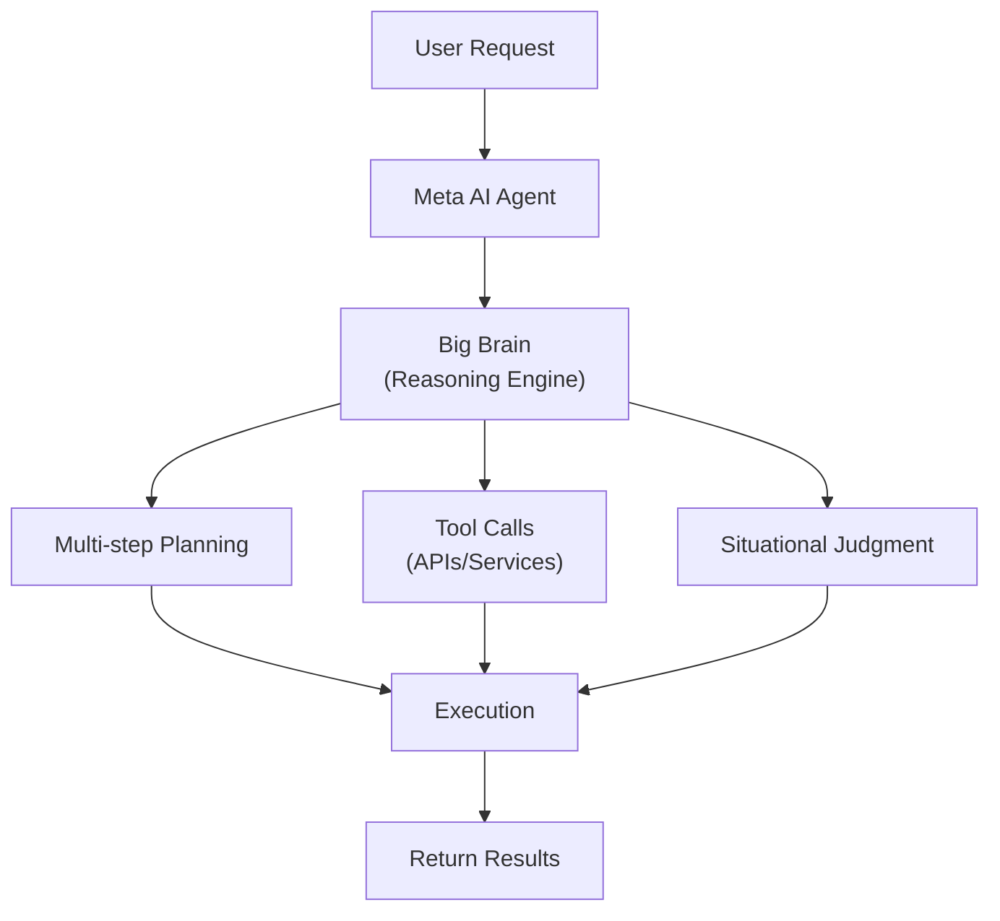
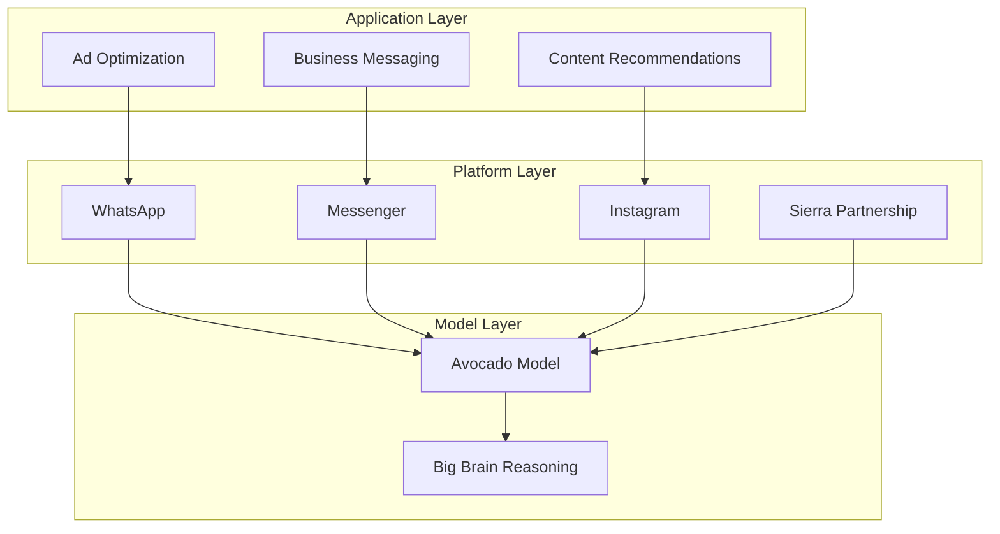

## Overview

Meta is attempting a major pivot from a social media company to an **AI agent platform company**. This strategy, which accelerated from late 2025, can be summarized in three key terms: **Sierra** for external agent partnerships, **Avocado** as the internal codename for the next-generation frontier model, and **Big Brain** representing advanced reasoning capabilities.

In this article, we analyze how Meta's AI strategy is evolving and what it means for developers and businesses.

## From Llama to Avocado — A Strategic Pivot

### From Open Source to Proprietary

Meta had long positioned itself as a leader in **open-source AI** through its Llama model series. In 2024, Mark Zuckerberg predicted that Llama would become "the most advanced in the industry."

However, the April 2025 release of Llama 4 fell short of developer expectations, triggering the strategic pivot. In July 2025, Zuckerberg stated, "We'll need to be careful about what we choose to open source," signaling a change in direction.

### Avocado — The Next-Generation Frontier Model

**Avocado** is the codename for Meta's next-generation frontier AI model. According to CNBC reporting, this model has the following characteristics:

- **Proprietary model**: Unlike previous Llama releases, weights may not be publicly available
- **Developed at TBD Lab**: An elite research organization led by Alexandr Wang, formerly of Scale AI
- **Planned for Q1 2026 release**: Intensifying competition with OpenAI, Google, and Anthropic

## Sierra — External Agent Partnership

### What is Sierra AI?

Sierra AI is an AI agent startup founded by **Bret Taylor**, former Salesforce co-CEO and OpenAI board chair. It provides an enterprise AI agent platform with extensible capabilities that enable complex, regulated businesses to deploy agents quickly.

### Meta × Sierra Synergy

Meta's pursuit of a Sierra partnership holds significant strategic value:

| Area | Meta's Strengths | Sierra's Strengths |
|------|-----------------|-------------------|
| **User Base** | 3B+ DAU | Enterprise customer network |
| **AI Models** | Avocado/Llama | Agent orchestration |
| **Channels** | WhatsApp, Messenger, Instagram | B2B communication |
| **Data** | Social graph | Business processes |

Meta is already processing over 1 million weekly conversations through **Business AI** on WhatsApp, with plans for further expansion.

## Big Brain — Advanced Reasoning Engine

### The Importance of Reasoning

**Big Brain** reportedly refers to Meta AI's advanced reasoning capabilities. As demonstrated by OpenAI's o1/o3 series and Google's Gemini 3, **deep reasoning** capabilities beyond simple text generation are a core competitive advantage for AI agents.

For agents to perform complex business tasks, they need:

1. **Multi-step planning**: Breaking down complex requests into stages
2. **Tool use**: Calling external APIs and services
3. **Situational judgment**: Appropriate decision-making in edge cases
4. **Self-verification**: Confirming accuracy of results

Big Brain embeds these reasoning capabilities into the Avocado model, elevating Meta's agent ecosystem to the next level.

## Meta's Agent Platform Strategy — The Full Picture

Meta's AI agent platform strategy consists of three layers:

### 1. Model Layer (Avocado + Big Brain)

- Achieving performance superiority over competitors with a next-gen frontier model
- Enhancing agent autonomy through reasoning capabilities

### 2. Platform Layer (Sierra + Business AI)

- Agent deployment through WhatsApp, Messenger, and Instagram
- Enterprise agent SDK and API offerings
- Global expansion of the Business AI assistant

### 3. Application Layer

- **Ad optimization**: AI-powered ad creative generation ($10B revenue run-rate for video generation tools in Q4 2025)
- **Content recommendations**: 7% lift in organic feed views
- **Business messaging**: Click-to-message ad revenue growth exceeding 50% YoY in the US

## Impact on Developers

### Key Takeaways

1. **Agent API ecosystem**: If Meta releases an agent SDK, it opens up agent development for 3 billion users
2. **WhatsApp Business Agents**: Business AI, already live in Mexico and the Philippines, is set to expand globally
3. **Avocado model capabilities**: With the proprietary shift, API-based access will likely be the primary integration method
4. **Sierra platform integration**: Enterprise agent development can leverage Sierra's orchestration layer

### Shifting Competitive Landscape

| Company | Agent Strategy | Core Model |
|---------|---------------|-----------|
| **Meta** | Social platform-based agents | Avocado |
| **OpenAI** | ChatGPT + Operator | o3/GPT-5 |
| **Google** | Gemini + Android integration | Gemini 3 |
| **Anthropic** | Claude + Agent Teams | Opus 4.6 |
| **Salesforce** | Agentforce + CRM | Einstein |

## Conclusion

Meta's AI agent platform transformation is not merely a technology shift — it's a **fundamental restructuring of its business model**. Built on the solid foundation of advertising revenue, this attempt to convert a platform with 3 billion users into agent infrastructure has the potential to reshape the AI industry.

If this triangulated strategy succeeds — strengthening enterprise agent capabilities through Sierra, securing model competitiveness with Avocado, and elevating reasoning with Big Brain — Meta could establish itself as a **powerhouse in AI agent platforms**, transcending its social media origins.

The Q1 2026 release of the Avocado model and the global expansion of Business AI will be the first test of this vision.

## References

- [CNBC: From Llamas to Avocados: Meta's shifting AI strategy](https://www.cnbc.com/2025/12/09/meta-avocado-ai-strategy-issues.html)
- [Meta: 2026 AI Drives Performance](https://about.fb.com/news/2026/01/2026-ai-drives-performance/)
- [Sierra AI: Year Two in Review](https://sierra.ai/blog/year-two-in-review)
- [Gadgets360: Meta AI Could Get New Avocado Models, AI Agents](https://www.gadgets360.com/ai/news/meta-ai-avocado-models-ai-agents)
