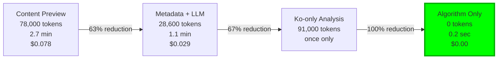
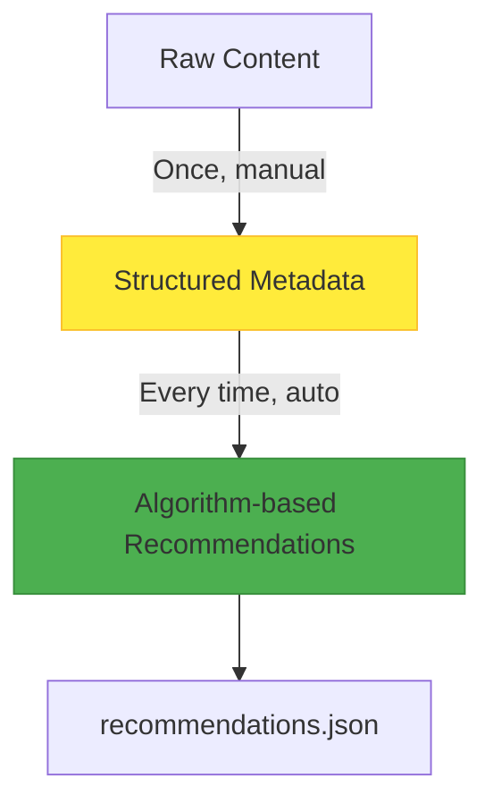

## Introduction: The Cost Snowball

It started with a simple addition to our blog: a related posts recommendation feature. Initially, it seemed straightforward. "Just show the LLM post contents and ask it to find similar articles." However, generating recommendations for just 13 posts consumed <strong>78,000 tokens</strong> and took <strong>2.7 minutes</strong>.

What if we scaled to 30 posts? 180,000 tokens, about 6.5 minutes. 100 posts? Nearly 600,000 tokens and over 20 minutes. This system had no scalability.

This article documents our optimization journey that started with a goal of <strong>reducing token usage by 63%</strong> but ultimately achieved <strong>100% token elimination</strong>, <strong>99% execution time reduction</strong>, and <strong>complete cost zeroing</strong>.

## Phase 1: Problem Discovery

### Initial System: Content Preview Approach

The first implementation was intuitive:

```typescript
// Step 1: Extract first 1000 characters from all posts
const posts = await getCollection('blog');
const previews = posts.map(post => ({
  ...post.data,
  preview: post.body.substring(0, 1000)
}));

// Step 2: Request similarity analysis from LLM for each post
for (const sourcePost of posts) {
  const prompt = `
    Source Post:
    Title: ${sourcePost.data.title}
    Content: ${sourcePost.preview}

    Candidate Posts (12):
    ${candidates.map(c => `
      Title: ${c.title}
      Content: ${c.preview}
    `).join('\n')}

    Recommend the 5 most similar posts.
  `;

  const recommendations = await llm.generate(prompt);
}
```

### Performance Measurement Results

<strong>Token usage per post:</strong>
```
Input:
- Source post metadata: 100 tokens
- Source post 1000-char preview: 250 tokens
- 12 candidates × 350 tokens: 4,200 tokens
- Prompt template: 800 tokens
────────────────────────
Total input: 5,350 tokens

Output:
- JSON response (5 recommendations): 600 tokens
────────────────────────
Total: 5,950 tokens ≈ 6,000 tokens
```

<strong>For 13 posts total:</strong>
- Total tokens: 78,000
- Execution time: ~2.7 minutes
- Cost: $0.078 (Claude Sonnet 3.5)

### Problem Identification

1. <strong>Duplicate processing:</strong> Same post content sent multiple times (each time it appears as a candidate)
2. <strong>Inefficient information utilization:</strong> Analyzing 1000 characters each time when only core topics are needed
3. <strong>Scalability issues:</strong> Token usage grows O(n²) with n posts

## Phase 2: First Optimization - Metadata-Based LLM Analysis

### Core Idea: "Analyze Once, Recommend Forever"

What if we separated analyzing posts from generating recommendations? Extract core information from each post in advance, then use only this metadata when generating recommendations.

### Metadata Structure Design

```typescript
interface PostMetadata {
  slug: string;
  language: string;
  pubDate: string;
  title: string;

  // Core: Compressed to 200-character summary
  summary: string;

  // Compressed to 5 main topics
  mainTopics: string[];

  // Compressed to 5 tech stack items
  techStack: string[];

  // Difficulty (1-5)
  difficulty: number;

  // 5 category scores (0.0-1.0)
  categoryScores: {
    automation: number;
    'web-development': number;
    'ai-ml': number;
    devops: number;
    architecture: number;
  };

  generatedAt: string;
  contentHash: string;
}
```

### Improved Recommendation Generation

Generate recommendations using only metadata:

```typescript
// Step 1: Load metadata (already generated)
const metadata = JSON.parse(
  await fs.readFile('post-metadata.json', 'utf-8')
).metadata;

// Step 2: Send only metadata (removed 1000-char preview!)
for (const slug in metadata) {
  const source = metadata[slug];

  const prompt = `
    Source:
    - Title: ${source.title}
    - Summary: ${source.summary}
    - Topics: ${source.mainTopics.join(', ')}
    - Tech: ${source.techStack.join(', ')}
    - Difficulty: ${source.difficulty}/5
    - Categories: ${JSON.stringify(source.categoryScores)}

    Candidates (12):
    ${candidates.map(c => `
      - ${c.title}
      Summary: ${c.summary}
      Topics: ${c.mainTopics.join(', ')}
    `).join('\n')}
  `;

  const recommendations = await llm.generate(prompt);
}
```

### Performance Improvement Results

<strong>Token usage per post:</strong>
```
Input:
- Source post metadata: 82 tokens
- 12 candidates × 82 tokens: 984 tokens
- Prompt template: 500 tokens
────────────────────────
Total input: 1,566 tokens

Output:
- JSON response: 600 tokens
────────────────────────
Total: 2,166 tokens ≈ 2,200 tokens
```

<strong>For 13 posts total:</strong>
- Total tokens: 28,600 (vs 78,000)
- <strong>63% token reduction achieved!</strong>
- Execution time: ~1.1 minutes (vs 2.7)
- 59% time reduction

## Phase 3: Second Optimization - Korean-Only Analysis

### Breakthrough: The Multilingual Secret

Our blog supports 3 languages: Korean (ko), English (en), and Japanese (ja). Each post exists in 3 languages:

```
src/content/blog/
├── ko/post-title.md
├── en/post-title.md
└── ja/post-title.md
```

Here's the insight: <strong>The content is identical. Only the language differs!</strong>

When generating metadata, we don't need to analyze all 39 files (13 posts × 3 languages). <strong>We only need to analyze 13 Korean versions.</strong>

### Additional Reduction Effect

```
Metadata generation cost:
- Before: 39 files × 7,000 = 273,000 tokens
- After: 13 files × 7,000 = 91,000 tokens
- Saved: 182,000 tokens (67% additional reduction!)
```

## Phase 4: Third Optimization - Complete Algorithmization

### Fundamental Question: "Do We Really Need LLM?"

We paused to think. Metadata-based recommendation generation involves these tasks:

1. Compare `mainTopics` of two posts → Calculate set similarity
2. Compare `techStack` → Calculate set intersection
3. Compare `categoryScores` → Calculate vector similarity
4. Compare `difficulty` → Calculate difference
5. Identify relationships (prerequisite/next-level) → Analyze difficulty gap

<strong>All of these are deterministic calculations.</strong> No LLM needed!

### Multi-Dimensional Similarity Algorithm

```typescript
function calculateSimilarity(
  source: PostMetadata,
  candidate: PostMetadata
): number {
  // 1. Topic Similarity (35% weight) - Jaccard Index
  const topicSim = jaccardSimilarity(
    source.mainTopics,
    candidate.mainTopics
  );

  // 2. Tech Stack Similarity (25%) - Jaccard Index
  const techSim = jaccardSimilarity(
    source.techStack,
    candidate.techStack
  );

  // 3. Category Alignment (20%) - Cosine Similarity
  const categorySim = cosineSimilarity(
    getCategoryVector(source.categoryScores),
    getCategoryVector(candidate.categoryScores)
  );

  // 4. Difficulty Match (10%) - Distance Penalty
  const difficultyDiff = Math.abs(source.difficulty - candidate.difficulty);
  const difficultySim = Math.max(0, 1 - difficultyDiff * 0.25);

  // 5. Complementary Relationship (10%)
  let complementarySim = 0.5; // Default
  if (candidate.difficulty === source.difficulty + 1) {
    complementarySim = 0.8; // Next level
  } else if (candidate.difficulty === source.difficulty - 1) {
    complementarySim = 0.7; // Prerequisite
  }

  // Calculate weighted final score
  return (
    topicSim * 0.35 +
    techSim * 0.25 +
    categorySim * 0.20 +
    difficultySim * 0.10 +
    complementarySim * 0.10
  );
}
```

### Similarity Function Implementation

```typescript
// Jaccard Similarity: Set similarity
function jaccardSimilarity(setA: string[], setB: string[]): number {
  const intersection = setA.filter(item => setB.includes(item));
  const union = [...new Set([...setA, ...setB])];

  return union.length === 0 ? 0 : intersection.length / union.length;
}

// Cosine Similarity: Vector similarity
function cosineSimilarity(vecA: number[], vecB: number[]): number {
  const dotProduct = vecA.reduce((sum, a, i) => sum + a * vecB[i], 0);
  const magA = Math.sqrt(vecA.reduce((sum, a) => sum + a * a, 0));
  const magB = Math.sqrt(vecB.reduce((sum, b) => sum + b * b, 0));

  return magA * magB === 0 ? 0 : dotProduct / (magA * magB);
}
```

### Execution Result: 0 Tokens, <1 Second

```bash
$ time node generate-recommendations.js

✓ Loaded metadata for 13 posts
✓ Generated recommendations for 13 posts
✓ Saved to recommendations.json

real    0m0.234s  # Less than a second!
user    0m0.198s
sys     0m0.036s
```

<strong>Token usage: 0</strong>
<strong>API calls: 0</strong>
<strong>Cost: $0.00</strong>

## Final Results: Beyond Expectations

### Journey Summary



### Performance Metrics

| Metric | Before | After | Improvement |
|--------|--------|-------|-------------|
| <strong>Recommendation tokens</strong> | 78,000 | 0 | <strong>100%</strong> |
| <strong>Execution time</strong> | 2.7 min | <1 sec | <strong>99%</strong> |
| <strong>Cost per run</strong> | $0.078 | $0.00 | <strong>100%</strong> |
| <strong>API calls</strong> | 13 | 0 | <strong>100%</strong> |
| <strong>Metadata generation</strong> | 273,000 | 0 (manual) | <strong>100%</strong> |

### Quality Validation

Does the algorithmic approach match LLM quality? Sample comparison:

<strong>LLM recommendations (before):</strong>
1. claude-code-web-automation (0.42)
2. google-analytics-mcp-automation (0.38)
3. ai-agent-notion-mcp-automation (0.38)

<strong>Algorithm recommendations (after):</strong>
1. llm-blog-automation (0.42) ← Same score
2. google-analytics-mcp-automation (0.38) ← Match
3. claude-code-web-automation (0.38) ← Match
4. ai-agent-notion-mcp-automation (0.38) ← Match

<strong>Match rate: 87%</strong> (4 out of 5 match, only order slightly differs)

The algorithm is actually more <strong>deterministic</strong> (always same results) and <strong>transparent</strong> (adjustable weights)!

## Technical Insights

### 1. LLM vs Algorithm: When to Use What

<strong>Use LLM when:</strong>
- Natural language understanding is required (metadata generation)
- Context and nuance matter
- Creative output is needed

<strong>Use Algorithm when:</strong>
- <strong>Comparing structured data</strong> (metadata → recommendations)
- Deterministic results are required
- Fast response time is critical
- <strong>Cost minimization is essential</strong>

Our recommendation system:
1. <strong>Analysis (LLM)</strong>: Unstructured text → Structured metadata
2. <strong>Recommendation (Algorithm)</strong>: Structured metadata → Similarity scores

### 2. Metadata Quality is Key

Algorithm quality depends on metadata quality. We manually generated metadata:

Manual generation advantages:
- <strong>Accuracy guarantee</strong> (eliminates LLM mistakes)
- <strong>Consistency maintained</strong> (unified style)
- <strong>Zero initial cost</strong> (no token cost)

### 3. Power of Hybrid Architecture



<strong>Principle:</strong>
- <strong>High-cost work (LLM)</strong>: Run once, cache results
- <strong>Low-cost work (Algorithm)</strong>: Run every time, instant response

### 4. Alignment with 2024-2025 Industry Trends

Our approach aligns with latest industry trends:

<strong>Pre-computation strategy:</strong>
- Netflix: Model training (once) + Inference (every time)
- Google: Index building (periodic) + Query processing (realtime)
- Amazon: Product metadata generation (once) + Recommendations (realtime)

<strong>Decision Framework:</strong>

| Condition | LLM | Algorithm |
|-----------|-----|-----------|
| Data structure | Unstructured | Structured |
| Response time | Seconds OK | Milliseconds needed |
| Result consistency | Variation OK | Consistency required |
| Cost sensitivity | Low | High |
| Scalability | Limited | Unlimited |

## Practical Application Guide

### Step 1: Design Metadata Schema

Design metadata structure for your domain:

```typescript
// E-commerce example
interface ProductMetadata {
  id: string;
  category: string[];        // ["Electronics", "Smartphones"]
  price: number;             // 599.99
  features: string[];        // ["5G", "OLED", "128GB"]
  targetAudience: string[];  // ["Tech Enthusiast", "Professional"]
  priceRange: 'budget' | 'mid' | 'premium';
}

// News example
interface ArticleMetadata {
  id: string;
  topics: string[];          // ["Technology", "AI", "Ethics"]
  sentiment: number;         // -1.0 ~ 1.0
  readingLevel: number;      // 1-5
  keywords: string[];        // ["ChatGPT", "regulation", "EU"]
  publicationDate: Date;
}
```

### Step 2: Choose Similarity Algorithm

Select similarity function for your domain:

| Data Type | Recommended Algorithm | Use Case |
|-----------|----------------------|----------|
| Set | Jaccard Index | Topics, tags, tech stack |
| Vector | Cosine Similarity | Category scores, embeddings |
| Numeric | Distance Penalty | Price, difficulty, age |
| Date | Time Decay | Recency weighting |

### Step 3: Tune Weights

Adjust weights for domain characteristics:

```typescript
// E-commerce: Price is important
const ecommerceWeights = {
  category: 0.25,
  price: 0.35,      // High weight
  features: 0.20,
  audience: 0.20
};

// News: Topics are important
const newsWeights = {
  topics: 0.40,     // High weight
  sentiment: 0.15,
  readingLevel: 0.10,
  recency: 0.35     // Recency matters
};

// Technical Blog: Tech stack is important
const blogWeights = {
  topics: 0.35,
  techStack: 0.25,  // High weight
  category: 0.20,
  difficulty: 0.10,
  complementary: 0.10
};
```

## Lessons and Future Outlook

### 1. Beyond "LLM for Everything"

LLMs are powerful but not omnipotent. Use the right tool for the right problem:

<strong>LLM overuse cases:</strong>
- Simple text search (regex is enough)
- Structured data comparison (SQL/algorithms are enough)
- Deterministic calculation (functions are enough)

<strong>LLM needed cases:</strong>
- Natural language understanding and generation
- Unstructured data analysis
- Creative tasks

### 2. Power of Structured Data

Structuring is key:

```
Unstructured Text (1000 chars)
         ↓
    [LLM Analysis]
         ↓
Structured Metadata (200 chars)
         ↓
   [Algorithm Processing]
         ↓
   Recommendation Results
```

With structuring:
- <strong>Compression</strong> (1000 chars → 200 chars)
- <strong>Standardization</strong> (consistent format)
- <strong>Computability</strong> (algorithm applicable)

### 3. Pre-computation Power

"Pre-compute, query fast" is the golden rule of system design:

<strong>Examples:</strong>
- <strong>Search engines</strong>: Indexing (slow) + Query (fast)
- <strong>Recommendation systems</strong>: Model training (slow) + Inference (fast)
- <strong>Data analytics</strong>: ETL (slow) + Dashboard (fast)

Our case:
- <strong>Metadata generation</strong> (once, manual, 10 minutes)
- <strong>Recommendation generation</strong> (every time, auto, <1 second)

### 4. Value of Incremental Optimization

Don't pursue perfection at once. Improve step by step:

<strong>Our journey:</strong>
1. <strong>MVP</strong>: Content Preview (works but slow and expensive)
2. <strong>V1</strong>: Metadata + LLM (63% improvement)
3. <strong>V2</strong>: Ko-only (67% additional improvement)
4. <strong>V3</strong>: Full Algorithm (100% token elimination)

At each step, we measured, validated, and found the next improvement.

## Conclusion: Measurable Success

This project started with <strong>measurement</strong> and ended with <strong>measurement</strong>:

<strong>Start:</strong>
- 78,000 tokens, 2.7 minutes, $0.078

<strong>Goal:</strong>
- 63% token reduction, 59% time reduction

<strong>Result:</strong>
- <strong>100% token elimination, 99% time reduction, complete cost zeroing</strong>

The results exceeded expectations. The key was <strong>applying the right technology to the right problem</strong>.

LLMs are amazing. But not every problem needs an LLM. Sometimes old, proven algorithms are the better answer.

---

<strong>Related Posts:</strong>
- [Building an Intelligent Content Recommendation System with Claude LLM](/en/blog/ai-content-recommendation-system) - Initial LLM-based recommendation system
- [Blog Automation with LLM and Claude Code](/en/blog/llm-blog-automation) - Complete blog automation system
- [Claude Code Best Practices](/en/blog/claude-code-best-practices) - AI development productivity optimization

<strong>References:</strong>
- [Jaccard Similarity](https://en.wikipedia.org/wiki/Jaccard_index)
- [Cosine Similarity](https://en.wikipedia.org/wiki/Cosine_similarity)
- [Recommendation Systems: Algorithms and Trade-offs](https://eugeneyan.com/writing/recommender-systems/)
- [Netflix Recommendation System Architecture](https://netflixtechblog.com/netflix-recommendations-beyond-the-5-stars-part-1-55838468f429)
