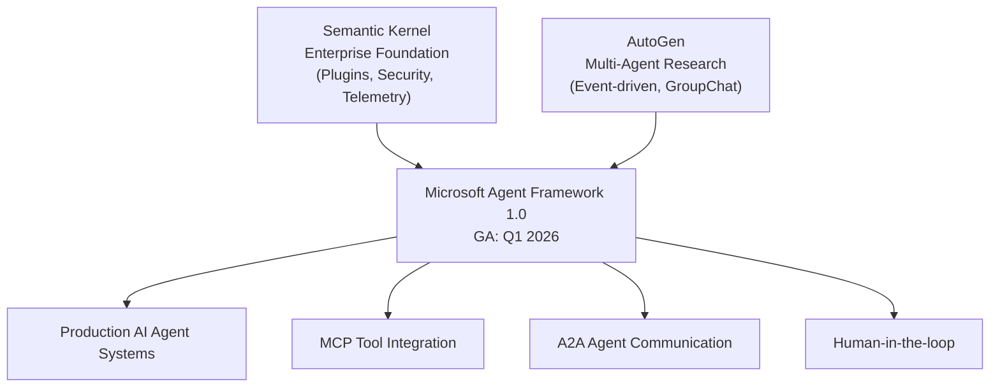
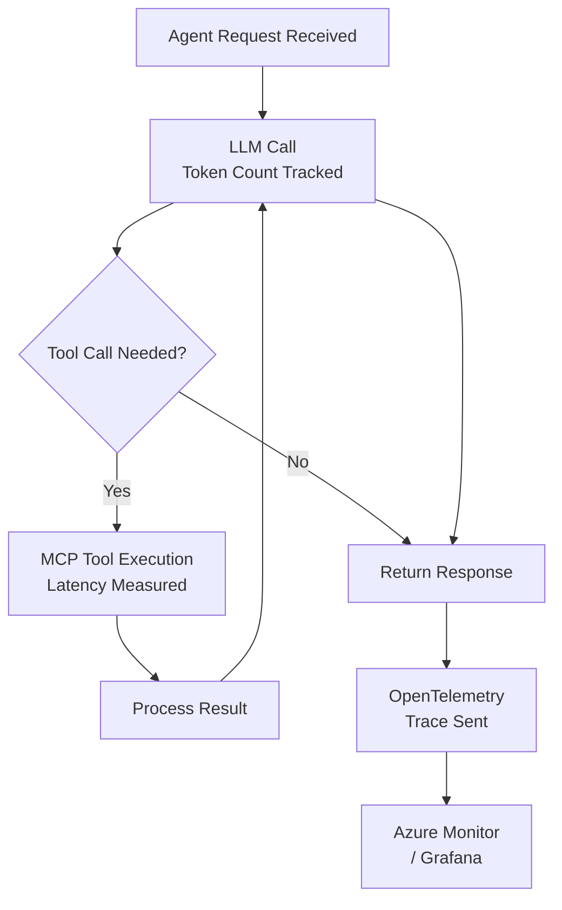
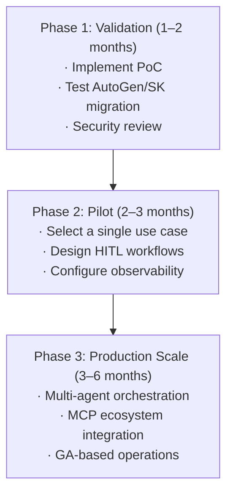

As of March 2026, the most significant shift in the AI agent framework landscape is nearing completion. Microsoft's two flagship frameworks — <strong>AutoGen</strong> and <strong>Semantic Kernel</strong> — which evolved separately over the years, have been unified into a single platform: <strong>Microsoft Agent Framework</strong>. Release Candidate 1.0 landed on February 19, 2026, with GA (General Availability) targeted for end of Q1 2026.

This post examines what this unification means from an Engineering Manager or CTO perspective, how existing teams should respond, and how to plan a production adoption roadmap.

## Why Unification? The End of Framework Fragmentation

AutoGen and Semantic Kernel were built on different philosophies within Microsoft:

- <strong>AutoGen</strong>: Led by Microsoft Research, an event-driven multi-agent framework emphasizing asynchronous agent-to-agent conversation.
- <strong>Semantic Kernel</strong>: Led by the Azure AI team, strong in plugin patterns and enterprise features (telemetry, security, memory).

For years, developers struggled with "which one should I use?" Both frameworks fragmented the ecosystem, forcing organizations to invest double the talent and learning overhead. Microsoft Agent Framework delivers a definitive answer: <strong>there is now just one.</strong>



## Key Features of Microsoft Agent Framework

### 1. Graph-Based Workflow Orchestration

Similar to LangGraph, it supports stateful graph-based workflows. Sequential execution, parallel execution, and conditional branching are all handled, while <strong>checkpointing</strong> enables pause and resume for long-running workflows.

```python
from microsoft.agents import AgentRuntime, Agent, tool
from microsoft.agents.workflows import SequentialWorkflow, ParallelWorkflow

# Define a basic agent
@tool
def get_customer_data(customer_id: str) -> dict:
    """Retrieve customer data from CRM"""
    return crm_client.get(customer_id)

# Create agent
analyst = Agent(
    name="customer_analyst",
    instructions="Analyze customer data and calculate risk scores.",
    tools=[get_customer_data],
    model="gpt-4o"
)

# Compose workflow (sequential + parallel)
workflow = SequentialWorkflow([
    analyst,
    ParallelWorkflow([risk_scorer, compliance_checker]),
    approval_agent  # Human-in-the-loop
])
```

### 2. Native MCP and A2A Protocol Support

Microsoft Agent Framework was designed from day one to support MCP (Model Context Protocol) and A2A (Agent-to-Agent) protocols. This means instant integration with hundreds of MCP servers including HubSpot, Salesforce, Slack, and Azure DevOps.

```python
from microsoft.agents.mcp import MCPToolServer

# Connect to an MCP server (e.g., GitHub MCP)
github_tools = MCPToolServer(
    name="github",
    transport="stdio",
    command=["npx", "@modelcontextprotocol/server-github"]
)

# Inject MCP tools into an agent
dev_agent = Agent(
    name="dev_assistant",
    instructions="Handle code reviews and PR management.",
    tools=[*github_tools.get_tools()],
    model="gpt-4o"
)
```

### 3. Human-in-the-Loop (HITL) Architecture

One of the most critical features for enterprise environments is the <strong>approval workflow</strong>. Microsoft Agent Framework can be configured so that agents must obtain human approval before executing actions that exceed certain thresholds.

```python
from microsoft.agents.human import HumanApprovalInterrupt

# Add Human-in-the-loop for high-risk actions
@tool(requires_approval=lambda result: result.get("risk_score", 0) > 0.8)
def execute_transaction(amount: float, account: str) -> dict:
    """Execute financial transaction (requires approval if risk score > 0.8)"""
    return finance_client.transact(amount, account)
```

### 4. Declarative YAML-Based Agent Definitions

Defining agents in YAML rather than code makes version control and team collaboration significantly easier.

```yaml
# agents/customer-support.yaml
name: customer_support_agent
instructions: |
  Handle customer inquiries and escalate to the appropriate department when necessary.
  Responses must always be friendly and clear.
model: gpt-4o
tools:
  - crm_lookup
  - ticket_create
  - email_send
escalation_policy:
  threshold: 3  # Escalate after 3 failed resolution attempts
  target: human_agent
```

### 5. Production-Grade Observability

Full telemetry based on OpenTelemetry is built in. Every agent action, tool invocation, and orchestration step is automatically traced.



## Strategic Points Every EM/CTO Should Know

### 1. If You're Already Using AutoGen or Semantic Kernel

Microsoft provides a clear migration guide. Both frameworks will continue to receive v1.x security patches, but <strong>new features will only be added to Microsoft Agent Framework</strong>. Migration within 6–12 months is recommended.

| Existing Framework | Key Changes |
|---|---|
| Semantic Kernel | Plugin → Tool, Kernel → AgentRuntime |
| AutoGen | AssistantAgent → Agent, GroupChat → Workflow |
| Both | Vector store integrations remain compatible |

### 2. Teams Starting from Scratch

For organizations deeply invested in the Microsoft ecosystem (Azure AI, Microsoft 365, Copilot Studio), Microsoft Agent Framework is the <strong>most natural choice</strong>. Full Azure AI Foundry integration, Entra ID authentication, and compliance support are enterprise capabilities that are difficult to replicate in other frameworks.

On the other hand, AWS or GCP-based organizations, or Python-native teams, may find LangGraph or CrewAI more suitable. <strong>The choice should be based on your organizational ecosystem, not the technology stack alone.</strong>

### 3. Caution Before Q1 2026 GA

Minor breaking changes are possible during the transition from RC to GA. It is safer to defer production deployments until after the official GA announcement. For now, focus on <strong>PoC (proof of concept) and internal experimentation.</strong>

### 4. Real-World Early Adopter Cases

Microsoft Agent Framework is already being validated by several global enterprises:

- <strong>KPMG</strong>: Audit automation — agents detect financial data anomalies, then integrate with HITL approval workflows
- <strong>BMW</strong>: Vehicle telemetry analysis — multi-agents process sensor data in parallel
- <strong>Commerzbank</strong>: Customer support automation — CRM/ERP integration via MCP
- <strong>Fujitsu</strong>: Enterprise IT operations automation — declarative YAML-based agent orchestration

## Team Adoption Roadmap (3 Phases)



<strong>Phase 1 — Validation (1–2 months)</strong>: Implement a simple PoC immediately after the GA announcement. Migrate existing AutoGen/SK code to verify compatibility. Review Azure AI Foundry integration and Entra ID connectivity with your security team.

<strong>Phase 2 — Pilot (2–3 months)</strong>: Select a single use case with measurable business impact (e.g., customer support escalation automation). Define HITL thresholds and set up an OpenTelemetry dashboard.

<strong>Phase 3 — Production Scale</strong>: Expand multi-agent architecture based on pilot results. Systematize integration with the MCP ecosystem (CRM, ERP, BI tools).

## Conclusion

Microsoft Agent Framework is not a simple framework upgrade. It is Microsoft's declaration of a <strong>single-platform strategy</strong> for the enterprise AI agent market.

If your team uses AutoGen or Semantic Kernel, now is the time to start migration planning. For teams starting fresh, Microsoft Agent Framework has become the de facto default within the Microsoft ecosystem.

What matters most is not the choice of technology, but the <strong>internalization of AI agent capabilities within your organization</strong>. Regardless of which framework you choose, the principles of HITL design, observability, and gradual rollout apply equally.

## References

- [Microsoft Agent Framework Official Announcement (Microsoft Foundry Blog)](https://devblogs.microsoft.com/foundry/introducing-microsoft-agent-framework-the-open-source-engine-for-agentic-ai-apps/)
- [Microsoft Agent Framework RC Release Notes (InfoQ)](https://www.infoq.com/news/2026/02/ms-agent-framework-rc/)
- [Semantic Kernel → Microsoft Agent Framework Migration Guide](https://devblogs.microsoft.com/semantic-kernel/migrate-your-semantic-kernel-and-autogen-projects-to-microsoft-agent-framework-release-candidate/)
- [Microsoft Learn: Agent Framework Overview](https://learn.microsoft.com/en-us/agent-framework/overview/)
- [AutoGen GitHub Discussion #7066](https://github.com/microsoft/autogen/discussions/7066)
