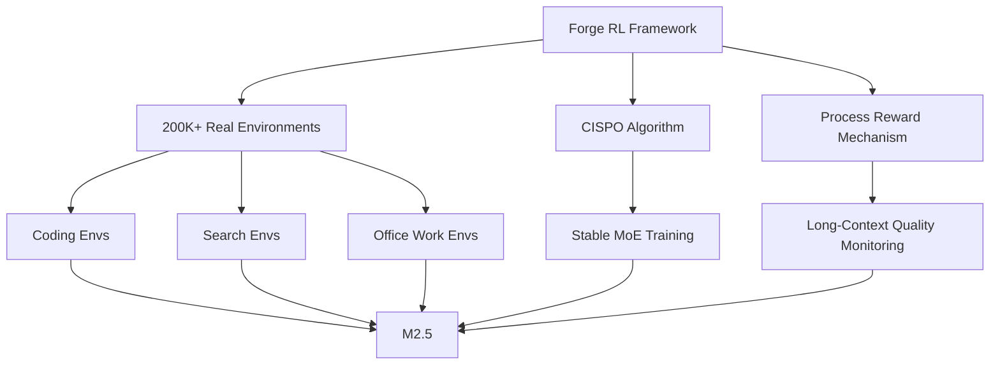
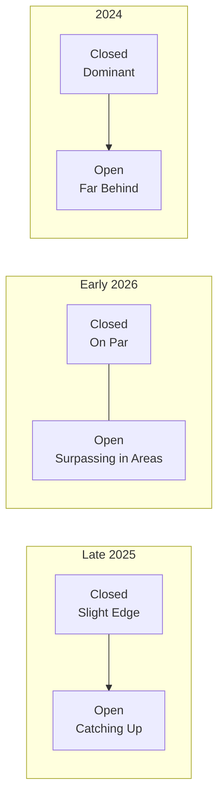

## The Open-Weight Counterattack Has Begun

In February 2026, a shockwave hit the AI industry. <strong>MiniMax M2.5</strong>, released by the Chinese AI startup MiniMax, scored <strong>higher than proprietary models</strong> across multiple benchmarks including coding, agentic tasks, and search.

The post gathered over 362 points on Reddit's r/LocalLLaMA, sparking active discussion about "open-weight models finally catching up to closed models." In this article, we analyze M2.5's specific performance data and the shifting landscape of open vs. closed models.

## MiniMax M2.5 Key Specifications

MiniMax M2.5 is a 229B parameter open-weight model freely available on HuggingFace.

- <strong>Parameters</strong>: 229B (MoE architecture)
- <strong>Training</strong>: Reinforcement learning across 200,000+ real-world environments
- <strong>Inference Speed</strong>: 100 tokens/second (Lightning version)
- <strong>Languages</strong>: Go, C, C++, TypeScript, Rust, Python, Java, and 10+ more
- <strong>Deployment</strong>: SGLang, vLLM, Transformers, KTransformers supported

## Benchmark Comparison: The Gap With Closed Models Approaches Zero

### SWE-Bench Verified (Coding)

SWE-Bench Verified measures the ability to resolve real GitHub issues.

| Model | Score | Type |
|-------|-------|------|
| <strong>MiniMax M2.5</strong> | <strong>80.2%</strong> | Open-weight |
| Claude Opus 4.6 | — | Proprietary |
| MiniMax M2.1 | — | Open-weight |

Results across different agent harnesses are particularly noteworthy:

- <strong>Droid harness</strong>: M2.5 (79.7%) > Opus 4.6 (78.9%)
- <strong>OpenCode harness</strong>: M2.5 (76.1%) > Opus 4.6 (75.9%)

In both environments, the open-weight model <strong>edged out the proprietary model</strong> — a historic result.

### Multi-SWE-Bench (Multi-Repository)

M2.5 achieved <strong>51.3%</strong> on tasks spanning multiple repositories, demonstrating strong performance in complex real-world scenarios.

### BrowseComp (Search & Tool Use)

On BrowseComp, which measures web search and tool-calling abilities, M2.5 scored <strong>76.3%</strong> (with context management), reaching industry-leading levels.

## The Cost Revolution: Dominance in Price, Not Just Performance

The impact of M2.5 extends beyond performance. The <strong>cost-performance ratio</strong> is in a different league.

| Metric | M2.5 Lightning | M2.5 Standard |
|--------|---------------|---------------|
| Input Price | $0.3/M tokens | $0.15/M tokens |
| Output Price | $2.4/M tokens | $1.2/M tokens |
| Inference Speed | 100 TPS | 50 TPS |
| 1-hour Continuous Cost | $1.0 | $0.3 |

Compared to Claude Opus, Gemini 3 Pro, and GPT-5, M2.5's output token cost is <strong>1/10th to 1/20th</strong> of the price.

## Why M2.5 Evolved So Rapidly

### Massive RL Scaling

MiniMax developed an in-house agent-native RL framework called <strong>Forge</strong>.

Key technical highlights:

- <strong>Async scheduling optimization</strong>: Balancing system throughput against sample off-policyness
- <strong>Tree-structured merge strategy</strong>: ~<strong>40x training speedup</strong> for sample combining
- <strong>CISPO algorithm</strong>: Ensuring MoE model stability during large-scale training
- <strong>Process rewards</strong>: Addressing credit assignment in long-context agent rollouts

### Emergent Spec-Writing Ability

A remarkable aspect of M2.5 is that the ability to <strong>design and plan like an architect before writing code</strong> emerged naturally during training. The model actively decomposes and plans project features, structure, and UI design before coding.

## The Shifting Open vs. Closed Landscape

### A Historic Turning Point

Until now, the AI industry operated under an implicit assumption: "the best-performing models are always proprietary." M2.5 is changing that.

### What This Means for Enterprises

1. <strong>Avoiding Vendor Lock-in</strong>: If open-weight models deliver frontier performance, dependency on specific API vendors can be reduced
2. <strong>Customization Freedom</strong>: Fine-tuning with proprietary data and domain specialization becomes possible
3. <strong>Cost Optimization</strong>: Self-hosting for cost control; even M2.5's API is 1/10th to 1/20th the cost
4. <strong>Data Privacy</strong>: No need to send sensitive data to external providers

## The Rapid Evolution of the M2 Series

In just 3.5 months (late October 2025 to February 2026), MiniMax released three generations: M2, M2.1, and M2.5.

| Version | Release | SWE-Bench Improvement | Notable |
|---------|---------|----------------------|---------|
| M2 | Late Oct 2025 | Baseline | 450K HuggingFace downloads |
| M2.1 | Dec 2025 | Major improvement | 86.7K downloads |
| M2.5 | Feb 2026 | 80.2% SOTA | 37% faster, 1/10 cost |

## Internal Production Adoption

MiniMax actively uses M2.5 within their own organization:

- <strong>30% of company-wide tasks</strong> autonomously completed by M2.5
- Spanning R&D, product, sales, HR, and finance
- <strong>80% of newly committed code</strong> generated by M2.5

## Conclusion: Three Key Takeaways

1. <strong>The Performance Gap Has Vanished</strong>: An open-weight model has surpassed closed models on SWE-Bench. This is not a fluke — it's the beginning of a structural shift

2. <strong>Cost Revolution</strong>: M2.5 delivers equal or better performance at 1/10th to 1/20th the cost of Opus. The "frontier model you don't have to worry about cost for" is now real

3. <strong>Expanding Choices</strong>: Enterprises no longer need to default to proprietary models. Self-hosting, customization, and cost optimization through open-weight models are practical options

For AI developers, 2026 may mark the dawn of a golden age for open-weight models.

## References

- [MiniMax M2.5 - HuggingFace](https://huggingface.co/MiniMaxAI/MiniMax-M2.5)
- [MiniMax Agent](https://agent.minimax.io/)
- [MiniMax API Platform](https://platform.minimax.io/)
- [Reddit r/LocalLLaMA Discussion](https://www.reddit.com/r/LocalLLaMA/)
