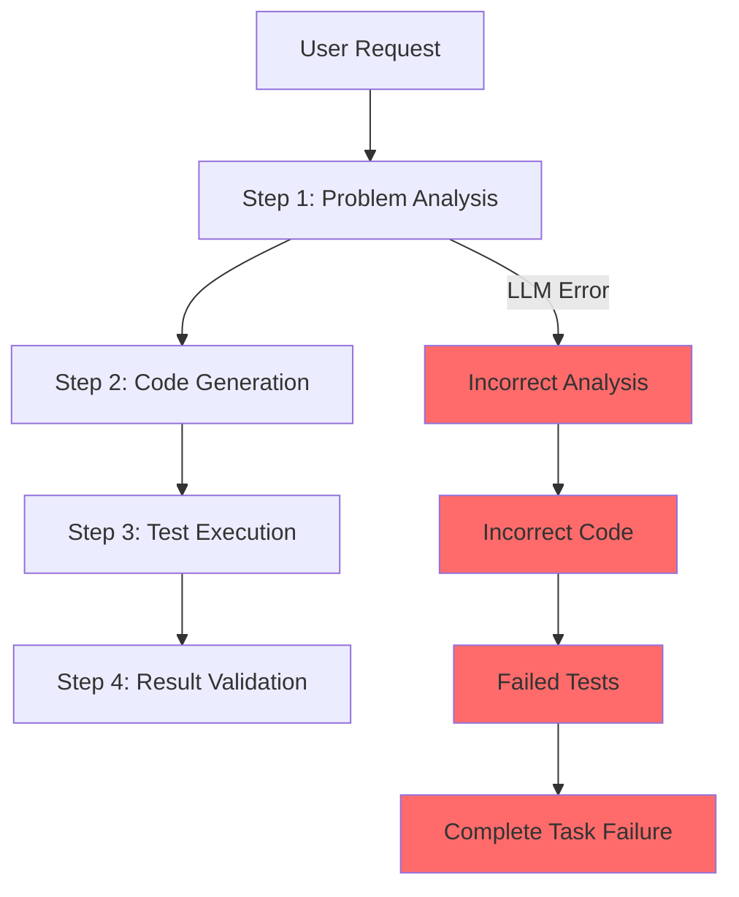
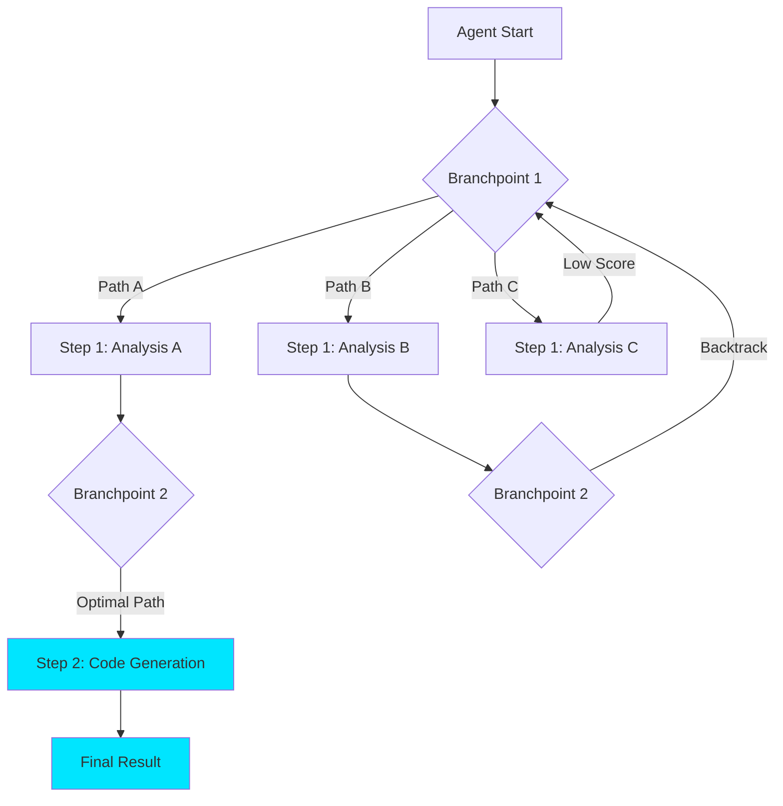
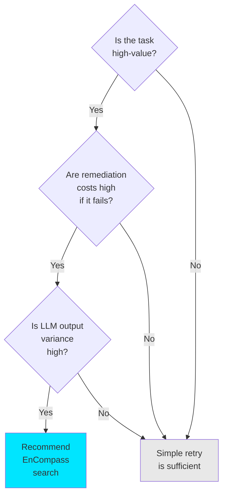

## Overview

In 2026, AI agents are taking on increasingly critical roles in production environments, yet <strong>reliability</strong> remains a fundamental unsolved challenge. Since LLM-based agents are inherently probabilistic, the same task can produce different results each time, and a mistake at one step cascades through all subsequent operations.

The <strong>EnCompass</strong> framework, developed by MIT CSAIL and Asari AI, presents a fundamentally different approach to this problem. By integrating <strong>search algorithms</strong> (Beam Search, Monte Carlo Tree Search, etc.) into the execution paths of agent programs, it enables agents to automatically backtrack and explore better paths when mistakes occur. The result: <strong>15〜40% accuracy improvements</strong>, while reducing the code required for implementation by 82%.

This article analyzes EnCompass's core concepts, how it works, and practical implementation strategies from an Engineering Manager's perspective.

## The Essence of AI Agent Reliability Issues

### Why Agents Fail

The fundamental cause of LLM-based AI agent failures in production is <strong>cascading error propagation</strong>.



Traditional agent systems follow only a <strong>single execution path</strong>. When the LLM makes an incorrect judgment at Step 1, all subsequent steps are built upon that flawed foundation. Even with retry logic, the system often repeats the same mistake in the same context.

### Limitations of Existing Approaches

Current industry strategies for agent reliability:

| Strategy | Strengths | Limitations |
|----------|-----------|------------|
| Simple Retry | Easy to implement | Can repeat same mistakes |
| Chain of Thought | Improved reasoning quality | Cannot fix incorrect reasoning chains |
| Self-Verification | Can detect errors | Cannot explore alternative paths |
| Multi-Agent | Multiple perspectives | High coordination costs |

The common limitation across all these approaches is that <strong>they cannot escape from an already-chosen path</strong>.

## EnCompass: Search-Based Agent Execution

### Core Idea — "Choose Your Own Adventure"

EnCompass's core idea is remarkably intuitive. If we compare agent program execution to storytelling:

- <strong>Traditional approach</strong>: A novel following a single narrative
- <strong>EnCompass approach</strong>: A "Choose Your Own Adventure" game with decision points at every branch

Developers add <strong>"branchpoint"</strong> annotations at specific locations in the agent code. EnCompass explores multiple possible LLM outputs at these branchpoints and automatically selects the path that produces the best results.



### How It Works

EnCompass operates in three stages.

<strong>Stage 1: Define Branchpoints</strong>

Developers mark locations in the agent code where LLM calls occur as branchpoints. This declares that "the LLM's output may vary here, and these variations affect the final result."

<strong>Stage 2: Define Evaluation Function</strong>

Define a function that evaluates how good each step's result is. For example, a coding agent might use "test pass rate" as its evaluation function.

<strong>Stage 3: Choose Search Strategy</strong>

EnCompass supports various search strategies:

- <strong>Beam Search</strong>: Maintain only the top N paths at each branchpoint
- <strong>Monte Carlo Tree Search (MCTS)</strong>: Combine random exploration with experience-based search
- <strong>Custom Strategies</strong>: Implement domain-specific search strategies

### Implementation Pattern at the Code Level

Here's the conceptual structure of agent code using EnCompass:

```python
# Traditional agent code (single path)
def coding_agent(task):
    analysis = llm.analyze(task)       # LLM call 1
    code = llm.generate_code(analysis) # LLM call 2
    result = run_tests(code)           # Evaluation
    return result

# EnCompass-based code (search-based)
def coding_agent_with_search(task):
    @branchpoint                        # Branchpoint annotation
    analysis = llm.analyze(task)

    @branchpoint
    code = llm.generate_code(analysis)

    @evaluate                           # Evaluation function
    score = run_tests(code)

    return code, score

# Apply search strategy
result = encompass.search(
    agent=coding_agent_with_search,
    strategy=BeamSearch(beam_width=4),
    budget=16  # Max 16x LLM calls
)
```

The key point is that <strong>you barely need to modify the existing agent logic</strong>—just add annotations. According to the MIT research team, this saves <strong>348 lines of code (approximately 82%) compared to manual search implementation</strong>.

## Performance Analysis

### Quantitative Results

Key findings reported in the EnCompass paper:

| Metric | Results |
|--------|---------|
| Accuracy Improvement | 15〜40% (across 5 repositories) |
| Code Reduction | 82% (348 lines saved) |
| Search Budget | 16x LLM calls vs. baseline agent |
| Optimal Strategy | 2-level Beam Search |

<strong>Notably</strong>, "2-level Beam Search" emerged as the optimal strategy. This means that <strong>structured search strategies are more effective than random attempts</strong>.

### Cost-Effectiveness Analysis

A 16x search budget means LLM API call costs also multiply by 16. Let's assess whether this makes sense in practice:

```
Baseline agent execution cost: $0.50/task (example)
EnCompass cost:                $8.00/task (16x)

Baseline agent success rate:   60%
EnCompass success rate:        85% (+25%p)

Actual cost per success:
  Baseline: $0.50 / 0.60 = $0.83/success
  EnCompass: $8.00 / 0.85 = $9.41/success
```

While EnCompass appears more expensive on surface, the equation changes when considering <strong>post-failure remediation costs</strong> (human manual fixes, rework, quality issues). For high-value tasks (code review, security analysis, etc.), the value of accuracy improvement easily justifies the additional cost.

## Practical Implementation Strategies

### Implementation Guide from an Engineering Manager's Perspective

Consider these factors when applying EnCompass to real-world scenarios.

<strong>1. Selective Application</strong>

You don't need to apply search to every agent task. Use these criteria for selection:



<strong>2. Phased Adoption Roadmap</strong>

| Phase | Duration | Goal | Search Budget |
|-------|----------|------|---------------|
| PoC | 2 weeks | Apply to single task, measure impact | 4x |
| Pilot | 1 month | Apply to 2〜3 team workflows | 8x |
| Scale | 3 months | Apply to critical production workflows | 16x |
| Optimize | Ongoing | Cost optimization, develop custom strategies | Dynamic |

<strong>3. Evaluation Function Design is Critical</strong>

EnCompass's effectiveness depends heavily on <strong>evaluation function quality</strong>. Characteristics of a good evaluation function:

- Must be automatable (score generation without human intervention)
- Must execute quickly (called thousands of times during search)
- Must correlate highly with final quality

Examples:

- Coding agents: Test pass rate, lint warning count
- Document generation agents: Structure completeness, keyword coverage
- Data analysis agents: Result consistency, statistical significance

### The 2026 Agent Reliability Ecosystem

Beyond EnCompass, several initiatives aim to improve agent reliability:

- <strong>Agent Definition Language (ADL)</strong>: An open-source agent definition standard from Moca. Declaratively define agent permissions, tools, and security boundaries for governance
- <strong>OpenAI Open Responses</strong>: A specification that standardizes agentic AI workflows to facilitate transitions between models
- <strong>GitHub Agentic Workflows</strong>: Describe automation goals in markdown and AI generates GitHub Actions workflows

The common direction across these initiatives is <strong>"making agents more predictable and controllable"</strong>.

## Conclusion

MIT EnCompass presents both a <strong>fundamental and practical solution</strong> to AI agent reliability challenges. The core insights are:

1. <strong>Search is an agent's "safety net"</strong>: Even if the LLM makes mistakes, backtracking and alternative exploration enable recovery
2. <strong>Structured search is more effective than random retries</strong>: 2-level Beam Search is the optimal strategy
3. <strong>82% code reduction</strong>: Dramatically simpler than implementing search logic manually
4. <strong>Cost vs. value tradeoff</strong>: For high-value tasks, 16x cost increase is justifiable

The most important takeaway for Engineering Managers is this: <strong>"AI agent performance isn't just a model problem—it's a harness problem"</strong>. The same LLM can produce vastly different results depending on the execution strategy employed.

If you're running production AI agents, rather than waiting for better models, <strong>improving the execution strategy itself</strong> often delivers faster, more concrete results.

## References

- [MIT CSAIL - Helping AI agents search to get the best results out of large language models](https://news.mit.edu/2026/helping-ai-agents-search-to-get-best-results-from-llms-0205)
- [EnCompass: Enhancing Agent Programming with Search Over Program Execution Paths (arXiv)](https://arxiv.org/pdf/2512.03571)
- [When agents backtrack, AI starts to scale](https://www.insights.onegiantleap.com/when-agents-backtrack-ai-starts-to-scale/)
- [Next Moca - Agent Definition Language (ADL)](https://www.nextmoca.com/blogs/agent-definition-language-adl-the-open-source-standard-for-defining-ai-agents)
- [GitHub Agentic Workflows (Technical Preview)](https://github.blog/changelog/2026-02-13-github-agentic-workflows-are-now-in-technical-preview/)
