## Overview

Reinforcement learning (RL) fine-tuning to enhance the reasoning capabilities of Large Language Models (LLMs) has attracted significant attention in recent years. However, a fundamental limitation exists: on <strong>extremely difficult problems with near-zero initial success rates</strong>, there is virtually no learning signal, causing RL training to plateau.

The paper <strong>"Teaching Models to Teach Themselves: Reasoning at the Edge of Learnability"</strong> by the MIT research team (Shobhita Sundaram et al.) presents an innovative solution. Enter <strong>SOAR (Self-improvement through Open-ended Automated Reasoning)</strong> — a framework where LLMs generate their own learning curriculum to progressively conquer previously unsolvable problems.

## The Core Problem: RL Learning Plateaus

The biggest challenge in conventional LLM reasoning reinforcement learning is as follows:

When a model fails all 128 attempts on the hardest subsets of math benchmarks, it receives zero feedback on what's right or wrong. This is the fundamental problem that arises at the <strong>Edge of Learnability</strong>.

## Core Architecture of the SOAR Framework

```mermaid
graph TB
    subgraph SOAR["SOAR Framework"]
        Teacher["🎓 Teacher<br/>(Model Copy)"] -->|Generate synthetic problems| Synthetic["📝 Synthetic Curriculum"]
        Synthetic -->|Train on| Student["📚 Student<br/>(Model Copy)"]
        Student -->|Evaluate on<br/>hard problems| Eval["📊 Evaluation"]
        Eval -->|Improvement as<br/>reward signal| Teacher
    end
```

SOAR is a self-improvement framework based on <strong>Meta-Reinforcement Learning (Meta-RL)</strong> that leverages a Teacher-Student architecture.

### Step 1: Teacher Generates Synthetic Problems

The Teacher model (a copy of the original LLM) generates intermediate-difficulty problems that serve as <strong>stepping stones</strong> toward the hard problems the Student currently cannot solve.

### Step 2: Student Learns from Synthetic Problems

The Student model performs RL training on the Teacher-generated curriculum, progressively building the capability to tackle increasingly difficult problems.

### Step 3: Evaluate on Actual Hard Problems

The Student's performance is measured on a <strong>small subset of originally unsolvable hard problems</strong>.

### Step 4: Reward Teacher Based on Measured Improvement

This is the critical differentiator. The Teacher receives <strong>the Student's actual improvement</strong> as its reward. This fundamentally differs from conventional intrinsic reward approaches.

## Three Core Findings

### Finding 1: Bi-level Meta-RL Is Achievable

SOAR demonstrates that pretrained models possess <strong>latent capacity</strong> that can be leveraged to generate useful stepping-stone problems even under sparse binary rewards. Even though a model cannot directly solve hard problems, it retains the ability to design learning pathways toward those problems.

### Finding 2: Grounded Rewards Outperform Intrinsic Rewards

<strong>Intrinsic rewards</strong> used in prior LLM self-play research frequently cause instability and diversity collapse. In contrast, SOAR's <strong>grounded rewards</strong> measure the Student's actual progress, reliably avoiding these failure modes.

### Finding 3: Structural Quality Matters More Than Answer Correctness

Analysis of the generated synthetic problems revealed that <strong>structural quality and well-posedness</strong> had the greatest impact on learning effectiveness. Surprisingly, the structure of the problem itself mattered more than the correctness of its solution.

This is an intuitive yet profound insight: <strong>the ability to craft good questions is independent of knowing the answers</strong>.

## Practical Implications and Future Outlook

### Escaping Reasoning Plateaus Without Additional Data

SOAR's greatest significance is providing a principled path for models to <strong>escape learning plateaus without additional curated data</strong>. This has the potential to solve the enormous cost problem of data collection and labeling.

### AI Learning from a Pedagogical Perspective

SOAR successfully applies the educational concept of <strong>scaffolding</strong> to AI training. Just as learners grow through problems slightly above their current level (Zone of Proximal Development, ZPD), LLMs expand their capabilities through self-generated progressive problems.

### The Possibility of Self-Evolving AI Systems

This research opens the door to <strong>autonomous self-improvement</strong> where AI designs and executes its own learning curriculum without external human supervision. While careful consideration of safety implications is necessary, the technical feasibility has been clearly demonstrated.

## Conclusion

MIT's SOAR framework elegantly solves the core bottleneck of LLM reasoning enhancement — the absence of learning signals on hard problems. The combination of Teacher-Student architecture and grounded rewards overcomes the instability issues of conventional self-play approaches, experimentally proving that "the ability to create good questions" is separate from "knowing the answers."

As this approach extends beyond mathematics to coding, scientific reasoning, and other domains, it could herald a new paradigm of <strong>self-teaching AI</strong>.

## References

- [Teaching Models to Teach Themselves: Reasoning at the Edge of Learnability (arXiv, 2026)](https://arxiv.org/search/?query=%22Teaching+Models+to+Teach+Themselves%22&searchtype=all)
- [Chris Laub's X Post — SOAR Explained](https://x.com/ChrisLaubAI/status/2020789996622664023)
