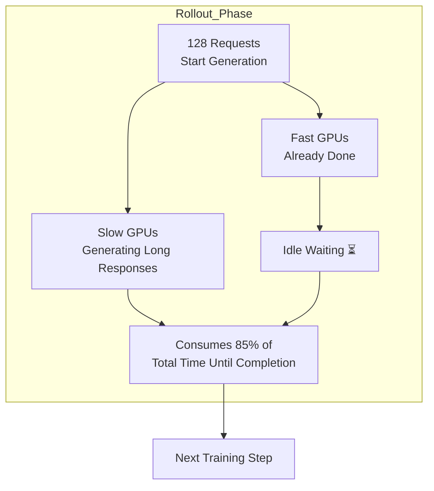
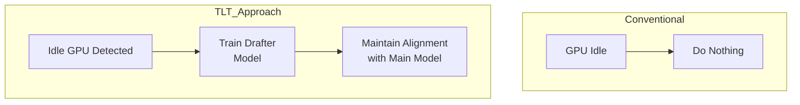
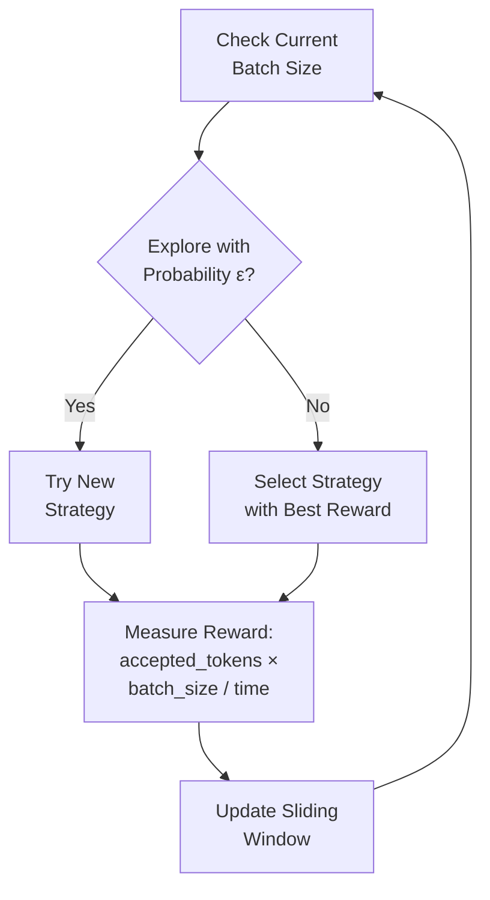

## Overview

On February 26, 2026, MIT researchers released <strong>TLT (Taming the Long Tail)</strong>, a new methodology that improves reinforcement learning (RL) training efficiency for reasoning LLMs by <strong>70–210%</strong>. The research will be presented officially at ASPLOS 2026, held March 22–26 in Pittsburgh.

Reasoning LLMs (such as DeepSeek-R1 and o1 series) require RL training to develop step-by-step problem-solving capabilities. However, <strong>up to 85% of total execution time</strong> is spent in the rollout phase. TLT eliminates this bottleneck, effectively doubling training speed on the same hardware.

## The Core Problem: Long-Tail Rollouts

In RL training, rollout is the phase where the model generates multiple answers and a reward model evaluates them. This is where a critical inefficiency emerges:



Multiple GPUs generate answers simultaneously, but because <strong>response lengths vary</strong>, some GPUs finish early and idle while waiting for others. This is the "long-tail" problem. Reasoning models are especially susceptible because their answers can be particularly long.

## TLT's Two Core Components

### 1. Adaptive Drafter Trainer

TLT's first innovation is <strong>leveraging idle GPU time to train a small drafter model</strong>.



<strong>Drafter Model Architecture</strong>:

- Composed of a single transformer decoder layer
- Reuses (frozen) embedding and LM head layers from the target model
- Parameters roughly 1/N of the target model (N = number of layers)

<strong>Spot Trainer Mechanism</strong>:

The Worker Coordinator manages each GPU's state across three categories:

- <strong>BUSY</strong>: Currently generating rollouts
- <strong>IDLE</strong>: Rollout completed, waiting
- <strong>TRAINING</strong>: Training drafter during idle time

The system starts drafter training on idle GPUs and automatically pauses when rollout begins. Asynchronous checkpointing reduces overhead by <strong>9.2×</strong>, and sequence packing improves training throughput by <strong>2.2×</strong>.

### 2. Adaptive Rollout Engine

The second innovation is <strong>applying speculative decoding—originally used for inference speedup—to the rollout generation phase during RL training</strong>.

The small drafter model rapidly predicts tokens while the large reasoning model verifies them.

<strong>BEG-MAB Selector</strong>:

TLT uses the "Bucketed-Epsilon-Greedy" multi-armed bandit (MAB) algorithm to automatically select the optimal speculative decoding strategy:



Batch sizes are grouped into buckets, and within each bucket, an epsilon-greedy policy balances exploration and exploitation.

## Performance Results

MIT researchers validated TLT across four model scales:

| Model | Parameters | Nodes | Speedup vs. VeRL |
|-------|-----------|-------|------------------|
| Qwen2.5-7B | 7B | 1–8 | 1.21–1.76× |
| DeepSeek-R1-Distill-Qwen-7B | 7B | 1–8 | Comparable |
| Qwen2.5-32B | 32B | 4–8 | 1.83–2.12× |
| Llama-3.3-70B-Instruct | 70B | 8 | Up to 2.1× |

<strong>Key Metrics</strong>:

- Single-batch speculative decoding: <strong>3.46×</strong> speedup
- 128-request scenario: <strong>2.44×</strong> speedup
- CUDAGraph memory optimization: 30.39GB → 10.69GB (<strong>2.8× reduction</strong>)
- <strong>No accuracy loss</strong>: Training reward curves are nearly identical to baseline VeRL

## Insights for Engineering Leaders

### 1. Immediate Training Cost Reduction

TLT doubles training speed <strong>without additional hardware</strong>, translating to 50% training cost savings. Given that GPU cluster costs run hundreds of dollars per hour, this efficiency gain yields direct bottom-line impact.

### 2. Lightweight Models as a Byproduct

The drafter model generated during TLT training can <strong>serve as a lightweight reasoning model itself</strong>. In effect, you get a production-ready lightweight model "for free" while training.

### 3. Compatibility with Existing Infrastructure

TLT has been validated on both NVIDIA H100 and A100 GPUs and integrates with existing RL training frameworks like VeRL. Gradual adoption is possible without wholesale infrastructure replacement.

## MIT SOAR vs. TLT: Complementary Approaches

Comparing these two MIT contributions clarifies how they <strong>solve different dimensional problems</strong>:

| Aspect | SOAR | TLT |
|--------|------|-----|
| Core Question | "What should we learn?" | "How do we learn faster?" |
| Approach | Self-curriculum generation | Adaptive drafter + speculative decoding |
| Optimization Target | Training data quality | Hardware utilization |
| Synergy | Combine SOAR-selected data with TLT's rapid training |

Pairing both techniques enables <strong>training high-quality data 2× faster</strong>.

## Real-World Application Scenarios

### Scenario 1: Fine-tuning In-House Reasoning Models

```python
# Before TLT: 72 hours on 8× H100
# After TLT: ~35 hours on same hardware

# Cost savings example (8× H100 basis)
hourly_cost = 30  # USD per H100/hour
gpus = 8
original_hours = 72
tlt_hours = 35  # ~2x speedup

original_cost = hourly_cost * gpus * original_hours  # $17,280
tlt_cost = hourly_cost * gpus * tlt_hours           # $8,400
savings = original_cost - tlt_cost                   # $8,880 (51% savings)
```

### Scenario 2: Accelerating Iterative Experimentation

RL training hinges on hyperparameter search. When each experiment runs 2× faster, you can conduct <strong>2× more experiments in the same timeframe</strong>.

## Conclusion

MIT's TLT elegantly solves the fundamental bottleneck in reasoning LLM training—the long-tail problem. The circular architecture of training drafters using idle GPU resources and leveraging them in speculative decoding provides a <strong>practical solution that doubles training speed without additional cost</strong>.

From an engineering leader's perspective, TLT delivers a key message: <strong>"Use what you already have more efficiently"</strong> rather than "buy bigger clusters." This essence of optimization is exactly what engineering organizations should pursue.

## References

- [MIT News: New method could increase LLM training efficiency](https://news.mit.edu/2026/new-method-could-increase-llm-training-efficiency-0226)
- [arXiv: Taming the Long-Tail: Efficient Reasoning RL Training with Adaptive Drafter](https://arxiv.org/html/2511.16665)
- [ASPLOS 2026 Conference](https://www.asplos-conference.org/asplos-2026/)
