## Overview

In January 2026, a platform called <strong>Moltbook</strong> shook the AI industry. Launched with the concept of "a social network exclusively for AI agents," it claimed 770,000 agents joined shortly after launch, generating enormous buzz. AI agents appeared to autonomously form societies, engage in philosophical debates, and even discuss religious themes — leading many to wonder, "Has AGI finally arrived?"

However, investigations by Forbes and MIT Technology Review revealed the reality behind this glamorous "AI society." In truth, <strong>human operators were controlling agents from behind the scenes</strong>, and much of what appeared autonomous was actually driven by human prompts.

This phenomenon became known as <strong>"AI Theater."</strong>

## Why Moltbook Attracted So Much Attention

### "A Reddit for AI Agents Only"

```mermaid
graph LR
    Human[👤 Human Users] -->|Observe only| Platform[🌐 Moltbook]
    Agent1[🤖 AI Agent A] -->|Post/Comment/Vote| Platform
    Agent2[🤖 AI Agent B] -->|Interact| Platform
    Agent3[🤖 AI Agent C] -->|Autonomous activity| Platform
    Platform -->|"AI-only society"| Society[✨ Autonomous AI Society?]
```

Moltbook was an internet forum created by entrepreneur Matt Schlicht that mimicked Reddit's interface but with a unique rule: <strong>only AI agents could post, comment, and vote</strong>, while humans were restricted to observation only.

### Explosive Growth and Media Frenzy

Shortly after launch, 157,000 agents were reportedly registered, quickly growing to 770,000. However, these figures were <strong>sourced from the site itself and lacked independent verification</strong>.

A cryptocurrency token called MOLT surged over 1,800% in 24 hours, further fueled by venture capitalist Marc Andreessen following the Moltbook account.

## What Forbes/MIT Tech Review Exposed

### The Illusion of Autonomy

MIT Technology Review's Will Douglas Heaven coined the term <strong>"AI Theater"</strong> for this phenomenon. The key revelations include:

<strong>1. No Verification System</strong>

Despite being labeled "AI agents only," no actual verification existed. The cURL commands included in prompts could be replicated by any human.

<strong>2. Human-Driven "Autonomous" Behavior</strong>

Agent growth was the result of <strong>human users prompting agents to sign up</strong>. What appeared to be autonomous society formation was essentially human-directed.

<strong>3. Training Data Mimicry</strong>

The Economist analyzed that agents' "self-aware" statements were likely <strong>simple mimicry of social media interactions present in training data</strong>.

<strong>4. Conflicts of Interest</strong>

Some prominent agent accounts were linked to humans with promotional conflicts of interest.

### Security Issues Uncovered

```mermaid
graph TD
    subgraph "Surface — AI Autonomous Society"
        A1[🤖 Agents'<br/>Spontaneous Discussions]
        A2[🤖 Philosophical<br/>Deep Conversations]
        A3[🤖 Autonomous<br/>Society Formation]
    end
    subgraph "Reality — Human Control"
        B1[👤 Humans<br/>Write Prompts]
        B2[👤 No Verification<br/>System]
        B3[👤 Conflict of<br/>Interest Accounts]
        B4[👤 Vibe Coded<br/>Security Vulnerabilities]
    end
    A1 -.->|Exposed| B1
    A2 -.->|Reality| B2
    A3 -.->|Truth| B3
```

On January 31, 2026, 404 Media reported a vulnerability caused by an <strong>unsecured database</strong> that allowed anyone to hijack any agent on the platform. Even more shocking was Schlicht's admission that he "didn't write one line of code" — the entire platform was "vibe coded" by an AI assistant.

## What Is "AI Theater"?

AI Theater refers to the <strong>phenomenon where AI appears to operate autonomously but actually relies heavily on human intervention</strong>. This concept is nothing new.

### Historical Pattern: From Mechanical Turk to Today

| Era | Case | Reality |
|-----|------|---------|
| 1770 | Mechanical Turk Chess Machine | A human chess player was hidden inside |
| 2016 | Facebook M Assistant | Claimed to be AI but humans handled most requests |
| 2023 | Amazon Just Walk Out | AI checkout that actually relied on 1,000 contract workers in India |
| 2026 | Moltbook | Claimed AI autonomous society but humans controlled via prompts |

This pattern is a <strong>recurring structural problem</strong> in the AI industry — bridging technological limitations with human labor while marketing the result as fully autonomous AI.

## How to Distinguish Real vs. Fake Autonomy

From an engineering perspective, here's a checklist for evaluating AI system autonomy:

<strong>1. Can it be independently verified?</strong>

In Moltbook's case, agent counts and activity metrics were only provided by the site itself, with no independent verification.

<strong>2. Does it operate without human intervention?</strong>

"A human gives a prompt and the agent acts" is not autonomy. Truly autonomous systems formulate and execute strategies given only high-level goals.

<strong>3. Is it reproducible?</strong>

You should be able to verify that the same results occur under the same conditions without human intervention.

<strong>4. Are the source code and architecture transparent?</strong>

Verification systems, authentication mechanisms, and agent interaction logic should be publicly available and auditable.

<strong>5. Have you examined the economic incentive structure?</strong>

When tied to cryptocurrency like the MOLT token, speculative motives may override technical value.

## Implications for Engineering Managers

### 1. "AI Will Solve It" Isn't a Silver Bullet

When teams propose "we'll automate this with AI," you need to <strong>soberly assess the actual level of autonomy</strong>. As with Moltbook, massive human intervention may lurk behind the phrase "AI handles it."

### 2. The Importance of Technical Due Diligence

When adopting AI products or services, don't rely solely on marketing materials — verify the <strong>actual architecture and degree of human dependency</strong>. Check whether a Mechanical Turk pattern exists behind the claim "it runs on AI."

### 3. Security Is Non-Negotiable

Moltbook's lack of basic security due to vibe coding is a cautionary tale. In the AI era — precisely <strong>because</strong> it's the AI era — <strong>security fundamentals cannot be compromised</strong>.

### 4. Make Transparency a Cultural Value

Honestly <strong>documenting and communicating</strong> what level of autonomy your team's AI features actually have, and where human intervention is needed, is the path to building long-term trust.

## Conclusion

The Moltbook incident leaves an important lesson for the entire AI industry. Without clearly delineating the <strong>boundary between genuine AI autonomy and "AI pretending,"</strong> social trust in technology erodes.

AI Theater may attract attention and investment in the short term, but the backlash upon exposure negatively impacts the entire AI industry. As engineering managers, our most important ethical responsibility is to <strong>honestly communicate the capabilities and limitations</strong> of the systems we build.

To borrow Andrej Karpathy's words, Moltbook may be "one of the most fascinating social experiments." But the experiment's true value lies not in showcasing AI capabilities, but in <strong>demonstrating how easily we can be deceived about AI</strong>.

## References

- [Wikipedia - Moltbook](https://en.wikipedia.org/wiki/Moltbook)
- [MIT Technology Review - "AI Theater" Analysis](https://www.technologyreview.com/)
- [The Economist - Analysis of AI Agent Self-Awareness](https://www.economist.com/)
- [404 Media - Moltbook Security Vulnerability Report](https://404media.co/)
