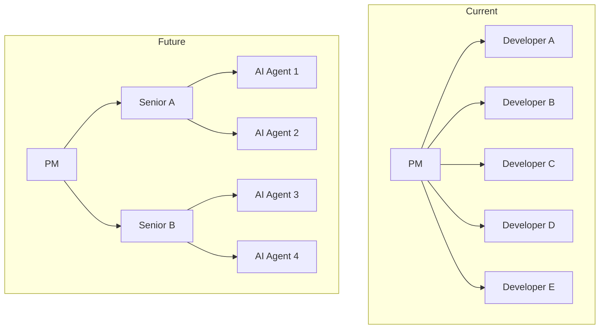
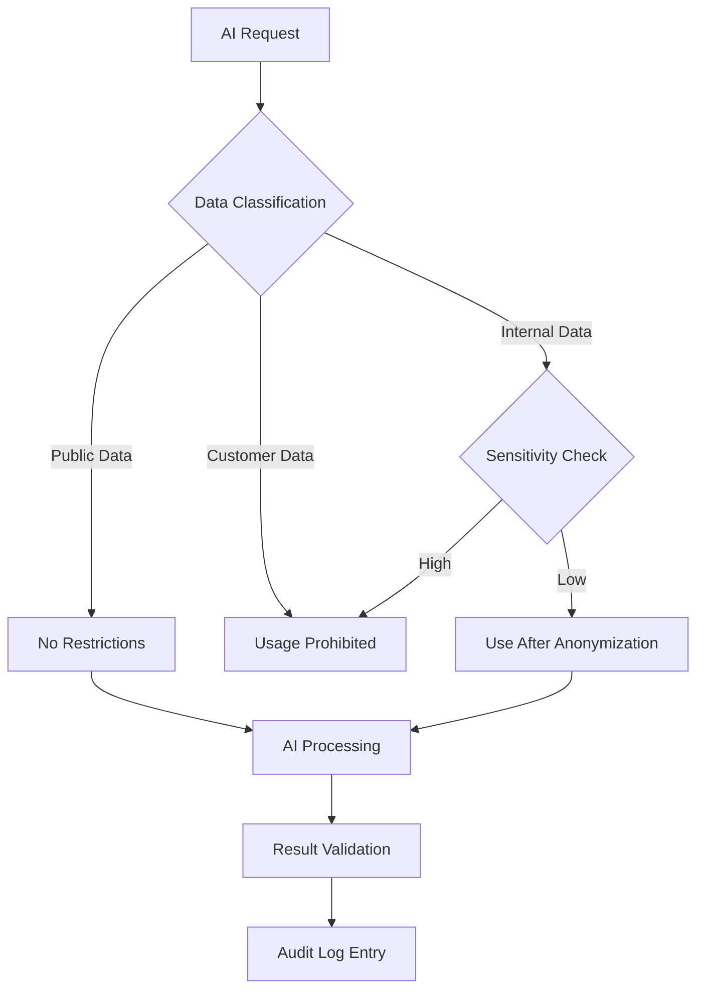
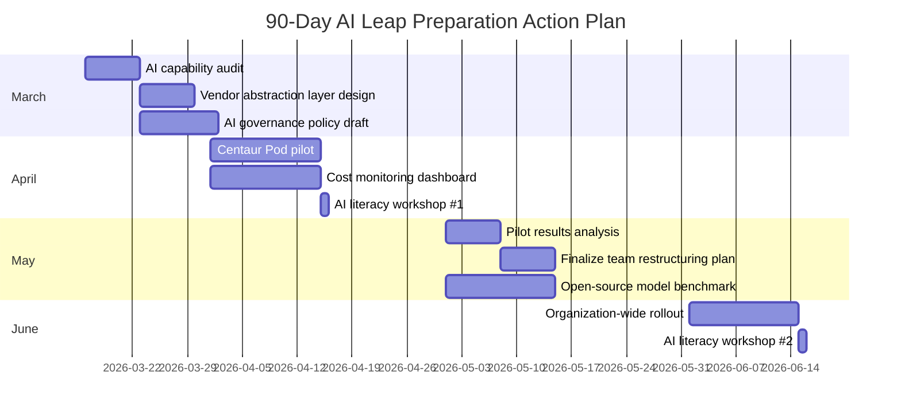

## Morgan Stanley's Warning: "The World Is Not Ready"

On March 13, 2026, Morgan Stanley published a report with a simple but striking core message:

> "A <strong>non-linear jump in AI capabilities</strong> will occur between April and June 2026, and most organizations are not prepared for it."

This is not marketing buzzword hype. According to Morgan Stanley's analysis, <strong>an unprecedented concentration of compute</strong> is being funneled into top-tier U.S. AI research labs, and the scaling law — where a 10x increase in compute doubles model "intelligence" — still holds true.

In fact, OpenAI's latest GPT-5.4 "Thinking" model scored <strong>83.0%</strong> on the GDPVal benchmark, reaching human expert-level performance. This is not just incremental improvement — it signals that AI is approaching a critical threshold where it can replace humans in economically valuable tasks.

As an engineering leader, whether this prediction proves right or wrong, <strong>failing to prepare is the biggest risk of all</strong>. In this post, I outline five strategies that CTOs, VPs of Engineering, and Engineering Managers should execute immediately.

## 1. Redesign Your AI Adoption Roadmap on a Quarterly Cycle

Most organizations plan AI adoption on an annual basis. But in an environment where model performance undergoes generational shifts every 3 - 6 months, annual plans are meaningless.

### Action Items

- <strong>Quarterly AI capability reassessment</strong>: At the start of each quarter, review the latest model benchmarks and re-identify areas in your current workflows that can be automated.
- <strong>"AI-Ready" backlog management</strong>: Maintain a separate list of tasks that are currently manual but could be automated as AI performance improves.
- <strong>Vendor lock-in avoidance</strong>: Design an abstraction layer to prevent dependency on a single AI vendor. Standards like MCP (Model Context Protocol) and [exchangeable frameworks like LangGraph, CrewAI, Dapr](/en/blog/en/ai-agent-framework-comparison-2026-langgraph-crewai-dapr-production) can help with this.

```typescript
// Example: AI vendor abstraction layer
interface AIProvider {
  complete(prompt: string, options: CompletionOptions): Promise<Response>;
  embed(text: string): Promise<number[]>;
}

class AIService {
  private providers: Map<string, AIProvider> = new Map();

  // Structure that enables easy vendor switching each quarter
  switchProvider(name: string): void {
    this.activeProvider = this.providers.get(name);
  }
}
```

## 2. Restructure Your Teams Around "AI Collaboration Units"

If Morgan Stanley's predicted AI leap materializes, current team structures will become inefficient. The key is not building <strong>teams that use AI as a tool</strong>, but transitioning to <strong>teams that collaborate with AI</strong>.

### Action Items

- <strong>Adopt the Centaur Pod model</strong>: A combination of 2 - 3 senior engineers plus AI agents can match the output of a traditional 5 - 6 person team.
- <strong>Create an AI Orchestrator role</strong>: Establish a dedicated role within each team responsible for designing [AI agent workflows](/en/blog/en/claude-code-agentic-workflow-patterns-5-types) and managing quality.
- <strong>Update your code review process</strong>: Define separate review criteria and processes for AI-generated code.



## 3. Fundamentally Rethink Your Infrastructure Cost Structure

Morgan Stanley's report references the <strong>"15-15-15" dynamic</strong>: 15-year data center leases, 15% returns, and $15 net value creation per watt. The explosion in demand for AI compute is fundamentally reshaping infrastructure cost structures.

### Action Items

- <strong>Hybrid AI infrastructure strategy</strong>: Don't put all AI workloads in the cloud. Consider a split strategy where inference runs locally or at the edge, and training runs in the cloud.
- <strong>Build a cost monitoring dashboard</strong>: Track [AI API call costs](/en/blog/en/llm-api-pricing-comparison-2026-gpt5-claude-gemini-deepseek) in real time and measure ROI by model and by feature.
- <strong>Plan for open-source model adoption</strong>: Continuously benchmark open-source alternatives like Mistral 3 and GLM-5 that achieve 92% of proprietary model performance at 15% of the cost.

| Strategy | Cost Reduction | Best-Fit Workloads |
|------|--------------|----------------|
| Local inference (Ollama + llama.cpp) | 70 - 90% | Repetitive code generation, document summarization |
| Cloud API (GPT-5.x, Claude) | Baseline | Complex reasoning, multimodal |
| Open-source fine-tuning | 50 - 70% | Domain-specific tasks |
| Batch processing optimization | 30 - 50% | Overnight analytics, bulk processing |

## 4. Build an AI Governance Framework Proactively

When AI capabilities surge, ungoverned AI usage becomes a real risk to the organization. The recent incident where Anthropic was classified as a "supply chain risk" after refusing to allow its AI to be used for mass surveillance and autonomous weapons by the U.S. Department of Defense demonstrates that AI governance is not just a compliance issue — it is a <strong>matter of business continuity</strong>.

### Action Items

- <strong>Establish an AI usage policy</strong>: Document what data can be fed to AI systems and what criteria must be met to validate AI outputs.
- <strong>Manage model dependencies</strong>: Prepare migration plans in advance for model retirements (as seen with the GPT-4o deprecation).
- <strong>Build an AI audit log system</strong>: Ensure traceability for decisions made and outputs generated by AI.



## 5. Systematically Raise Your Engineering Team's AI Literacy

The heart of Morgan Stanley's warning that "the world is not ready" is about <strong>organizational capability to leverage the technology, not the technology itself</strong>. Knowing how to use AI tools and strategically leveraging AI are two entirely different things.

### Action Items

- <strong>Prompt engineering workshops</strong>: Hold monthly sessions based on real work scenarios. The goal is not just "asking questions to AI" but reaching the level of "designing solutions with AI."
- <strong>AI code review skills</strong>: Develop the ability to evaluate AI-generated code for security vulnerabilities, performance issues, and architectural fit.
- <strong>Internal AI Champion program</strong>: Designate "AI Champions" within each team to discover and share AI use cases.

### AI Literacy Maturity Model

| Level | Name | Description | Key Activities |
|------|------|------|----------|
| L1 | Consumer | Basic AI tool usage | Asking questions via ChatGPT |
| L2 | Practitioner | Integrating AI into workflows | AI code generation + review |
| L3 | Architect | Designing AI workflows | Building agent pipelines |
| L4 | Strategist | Developing AI-driven organizational strategy | AI adoption ROI analysis, team restructuring |

Most engineers are still at L1 - L2. To stay competitive when Morgan Stanley's prediction materializes, <strong>elevating your key talent to L3 and above</strong> is the top priority.

## Timeline: Action Plan from Now Through June

There is not much time left until the April - June leap window that Morgan Stanley predicts. Here is a realistic 90-day action plan.



## Conclusion: Pragmatic Preparation — Neither Optimism Nor Pessimism

No one knows whether Morgan Stanley's prediction will prove exactly right. But the direction is clear. AI capabilities do not advance linearly, and a non-linear leap will inevitably occur at some point.

The essentials come down to three things:

1. <strong>Flexible architecture</strong>: A structure that allows rapid swapping of models and vendors
2. <strong>Adaptable teams</strong>: Talent equipped with the skills to collaborate with AI
3. <strong>Systematic governance</strong>: A balance between fast adoption and safe usage

If you have these three in place, whether the leap arrives in April or December, your organization will be ready.

## References

- [Morgan Stanley warns an AI breakthrough is coming in 2026](https://fortune.com/2026/03/13/elon-musk-morgan-stanley-ai-leap-2026/)
- [OpenAI GPT-5.4 "Thinking" Model Release](https://llm-stats.com/ai-news)
- [Anthropic Pentagon Supply Chain Risk Dispute](https://techcrunch.com/2026/03/09/openai-and-google-employees-rush-to-anthropics-defense-in-dod-lawsuit/)
- [MIT TLT Training Efficiency Method](https://news.mit.edu/2026/new-method-could-increase-llm-training-efficiency-0226)
- [Claude for Excel/PowerPoint Shared Context](https://claude.com/blog/claude-excel-powerpoint-updates)
