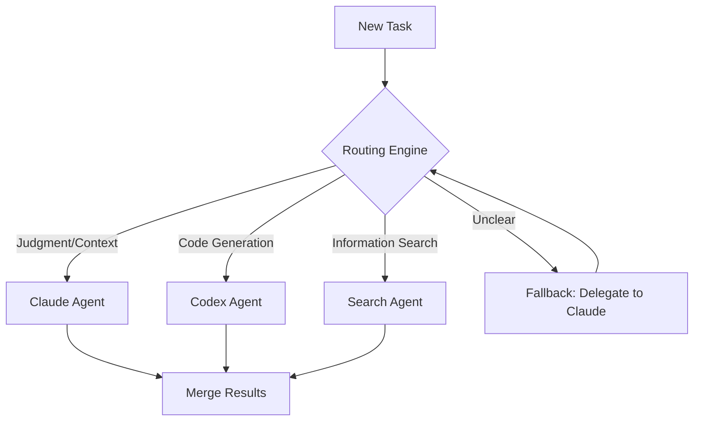
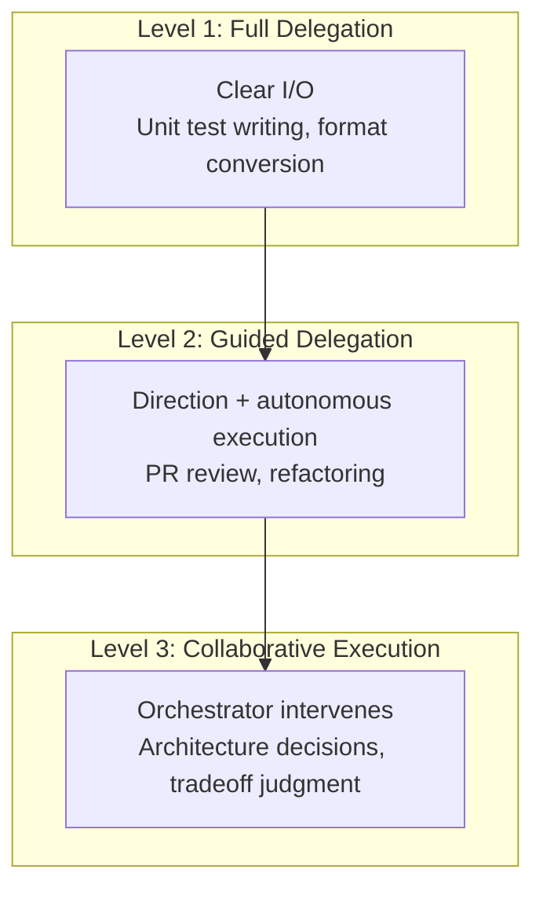
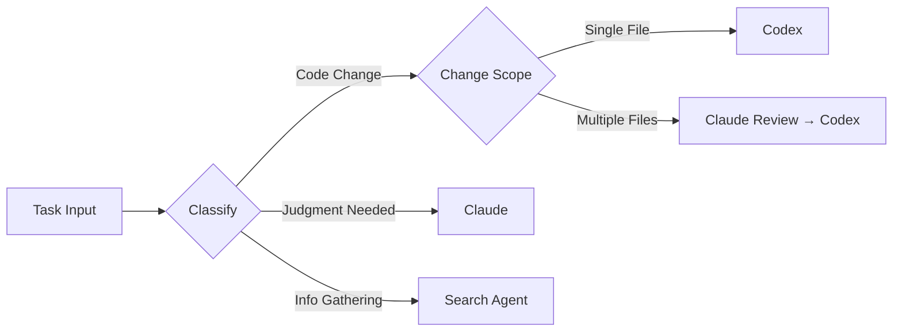

## Overview

The era of running multiple AI agents simultaneously has arrived. Claude excels at judgment and context understanding, while Codex shines at precise code generation. But the hardest problem is <strong>routing</strong> — deciding which agent should handle which task.

In this article, I examine multi-agent routing from an Engineering Manager's (EM) perspective, arguing that it shares the same structure as <strong>delegation in people management</strong>.

## Why Routing Is the Hardest Challenge

### The Limits of a Single Agent

Assigning everything to one agent leads to context window overflow, lack of specialization, and response delays. This naturally drives us to split agents by domain expertise.

### The Real Problem After Splitting

Splitting agents isn't the hard part. The real challenges are:

1. <strong>Task classification ambiguity</strong>: "Is this PR review about code quality or architecture judgment?"
2. <strong>Context transfer costs</strong>: Information loss when passing context between agents
3. <strong>Failure re-routing</strong>: Fallback strategies when an agent fails
4. <strong>Dependency management</strong>: Pipeline design where A's output feeds B's input



## The Same Structure as EM Delegation

### A Manager's Daily Routine

Think about what an Engineering Manager does every day:

| EM's Decision | Agent Routing |
|---------------|---------------|
| "Feature implementation → Engineer A" | "Code generation → Codex" |
| "Architecture review → Engineer B" | "Design judgment → Claude" |
| "Simple bug fix → Junior dev" | "Simple task → Lightweight model" |
| "Ambiguous? I'll handle it" | "Unclear? Orchestrator handles it" |

### Three Levels of Delegation

Applying a delegation framework from EM experience to agents:



<strong>Level 1 — Full Delegation</strong>: Tasks with clear inputs and outputs. Unit test generation, JSON format conversion. Just throw these at Codex.

<strong>Level 2 — Guided Delegation</strong>: Set the direction but let the agent handle the specifics. PR reviews, code refactoring. Claude writes the guidelines, Codex executes.

<strong>Level 3 — Collaborative Execution</strong>: Tasks where the orchestrator itself must be deeply involved. Architecture decisions, technology choices.

## Routing Design Lessons from Real Cases

### okash1n's Claude Code + Codex MCP Setup

[okash1n (super_bonochin)](https://x.com/okaboringcode) shared a setup connecting Codex to Claude Code via MCP. The key insight:

- <strong>Claude Code serves as the orchestrator</strong>, managing the overall flow
- <strong>Codex acts as an MCP server</strong>, specializing in code generation
- When Claude determines "this is a code generation task," it delegates to Codex

This is exactly the structure of an <strong>EM (Claude) delegating implementation to a senior engineer (Codex)</strong>.

### NabbilKhan's 8-Agent Operation

NabbilKhan demonstrated running 8 agents simultaneously. The biggest problem? <strong>Routing</strong>:

- The judgment cost of deciding "which of 8 agents handles this task"
- Splitting strategy when a task spans multiple agents' domains
- The difficulty of synchronizing context across agents

This is exactly what an <strong>EM managing 8 engineers</strong> faces.

## Core Principles of Routing Design

### 1. Clear Role Definition (Role Boundary)

Document each agent's scope of responsibility clearly — like writing a Job Description.

```yaml
# agents/codex.yaml
name: Codex Agent
role: Code generation specialist
capabilities:
  - Function/class implementation
  - Unit test writing
  - Refactoring execution
boundaries:
  - No architecture decisions
  - No external API design
escalation: Escalate to Claude Agent
```

### 2. Explicit Routing Criteria



### 3. Escalation Paths for Failures

Just as a stuck team member escalates to their manager, a failing agent escalates to the orchestrator.

```python
async def route_task(task: Task) -> Result:
    agent = classify(task)
    result = await agent.execute(task)

    if result.confidence < 0.7:
        # Escalation: orchestrator handles directly
        return await orchestrator.handle(task, context=result)

    return result
```

### 4. Feedback Loops for Routing Improvement

Just as a manager adjusts future delegation based on results, agent routing should improve based on outcomes:

- Track per-agent success/failure rates
- Identify patterns that frequently trigger re-routing
- Progressively refine routing rules

## Conclusion

The essence of multi-agent orchestration isn't technology — it's <strong>design philosophy</strong>. Just as an EM distributes work to team members, we distribute tasks to agents. The core principles:

1. <strong>Define role boundaries clearly</strong> — Agent responsibilities like Job Descriptions
2. <strong>Distinguish delegation levels</strong> — Full / Guided / Collaborative
3. <strong>Design escalation paths</strong> — Prepare fallbacks for failure scenarios
4. <strong>Continuously improve via feedback</strong> — Track routing outcomes and refine rules

Ultimately, just as a great manager builds a great team, a great orchestrator builds a great agent system.

## References

- [okash1n (super_bonochin)'s Claude Code + Codex MCP Setup](https://x.com/okaboringcode)
- [NabbilKhan's Multi-Agent Operation Case](https://x.com/NabbilKhan)
- [Anthropic - Building effective agents](https://docs.anthropic.com/en/docs/build-with-claude/agent-patterns)
- [OpenAI - Codex](https://openai.com/index/codex/)
