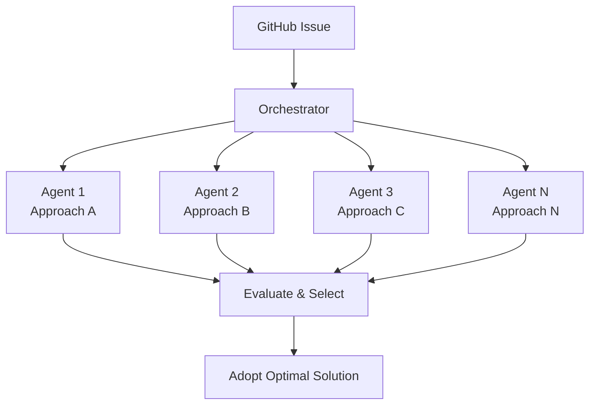

## Overview

In February 2026, an intriguing name appeared on the SWE-bench Verified leaderboard. **Verdent AI** recorded a **76.1%** resolution rate, entering the top ranks. What's remarkable is that this achievement was accomplished not with a single large model, but with a **multi-agent parallel execution architecture**.

This signals an important turning point in software engineering automation. It demonstrates that "better collaboration structures" rather than "bigger models" can be the key to superior performance.

## What Is SWE-bench Verified?

SWE-bench is a benchmark that evaluates AI's software engineering capabilities based on real GitHub issues. The Verified version consists of 500 human-filtered instances, created in collaboration with OpenAI as a high-reliability dataset.

The evaluation is straightforward: given real open-source project issues and test cases, it measures the rate at which AI can modify code to pass the tests.

## The Old Paradigm: Limits of Single Large Models

Until now, the top positions on SWE-bench have been dominated by single large models.

| Rank | System | Resolution Rate | Approach |
|------|--------|----------------|----------|
| - | Claude Opus 4 series | ~70%+ | Single model + tool use |
| - | GPT-5 series | ~70%+ | Single model + tool use |
| - | **Verdent AI** | **76.1%** | **Multi-agent parallel execution** |

The single-model approach depends on the model's size and capability. Better performance required bigger models and more compute. But this approach has fundamental limitations:

- **Single perspective constraint**: One model follows one interpretation path
- **Difficulty in error recovery**: Hard to backtrack once heading in the wrong direction
- **Context window limitations**: Difficult to grasp an entire complex codebase

## The New Paradigm: Multi-Agent Parallel Execution

Verdent AI's approach is fundamentally different.

### Core Mechanisms

1. **Parallel Analysis**: Multiple agents analyze the same problem simultaneously. Each agent can approach with different strategies.

2. **Diverse Solution Paths**: Even if one agent fails, another can find the correct path. This removes the "must get it right in one shot" pressure of single models.

3. **Optimal Result Selection**: The best solution that passes tests is selected from multiple candidates.

4. **Collective Intelligence**: The system's overall capability exceeds the sum of individual agent capabilities.

## Engineering Manager's Perspective: Team vs Individual

This result connects with a familiar debate in software engineering.

> **One exceptional individual vs a team of five average developers — which is more productive?**

The same question applies in the AI world.

| Aspect | Single Large Model (Individual) | Multi-Agent (Team) |
|--------|-------------------------------|-------------------|
| Strengths | Consistent context maintenance | Diverse perspectives, error compensation |
| Weaknesses | Single point of failure | Coordination cost, consistency management |
| Scalability | Depends on model size | Scales with agent count |
| Cost Efficiency | Large model = high cost | Multiple small models = flexible cost |

Just as code reviews, pair programming, and mob programming in real software teams transcend individual limitations, **collaborative architectures in the AI agent world are producing results that surpass individual capabilities**.

## Practical Implications

### 1. Changing Criteria for AI Tool Selection

If "which model to use" was the key question until now, going forward **"how to architect and combine agents"** becomes the more important question.

### 2. Cost-Performance Optimization

You don't necessarily need the most expensive large model. Running multiple mid-sized models in parallel may deliver better results per dollar.

### 3. Fault-Tolerant System Design

Multi-agent architecture is inherently **fault-tolerant**. Even if one agent fails, the overall system can still find the correct answer.

## Looking Ahead

Verdent AI's 76.1% achievement is just the beginning. As multi-agent architectures evolve, we can expect:

- **Specialized agent ecosystems**: Role-specific agents for debugging, refactoring, test writing, etc.
- **Dynamic team composition**: Automatically determining optimal agent combinations based on problem characteristics
- **Learning orchestrators**: Improving agent placement by learning from past success and failure patterns

## Conclusion

From single-model size competitions to multi-agent architecture competitions — the paradigm of software engineering automation is shifting. Verdent AI's 76.1% on SWE-bench Verified is concrete evidence of this transition.

As developers and engineering leaders, we've arrived at the point where we need to think beyond "which AI model to use" and consider **"what AI team to assemble."**

## References

- [SWE-bench Official Leaderboard](https://www.swebench.com/)
- [Verdent AI SWE-bench Results (X/Twitter)](https://x.com/hasantoxr/status/2020854332217049281)
- [Introducing SWE-bench Verified (OpenAI)](https://openai.com/index/introducing-swe-bench-verified/)
