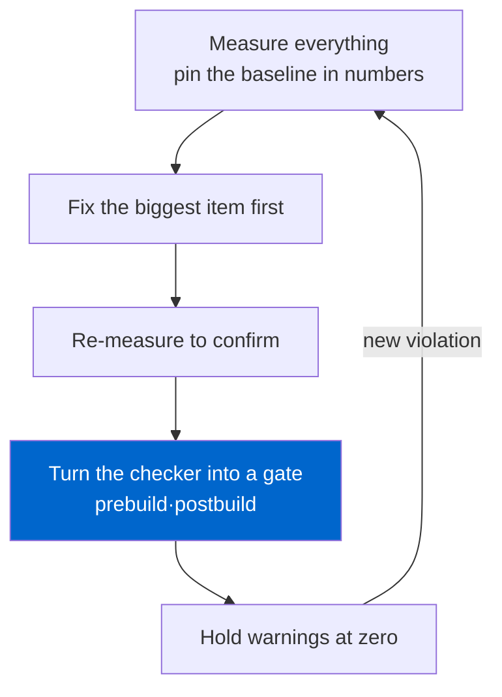

Plenty of SEO audits end with a single tool report. You run Lighthouse, screenshot Search Console coverage, save a "12 issues found" panel, and call it done. The trouble is that most audits finished that way silently revert within three months. Someone publishes a new post, refactors a component, swaps a font, and the issue quietly comes back. Nobody notices.

Over the last five days I actually audited my four-language blog (ko/ja/en/zh, 298 posts per language). Five items, all fixed. But what I really want to talk about isn't <em>what</em> I fixed. It's that the five fixes mattered less than the <strong>build gates</strong> that keep them from ever returning. An audit should be a loop, not an event.

## Why a one-report audit always comes back

Most technical SEO issues aren't "the code is wrong." They're "an invariant was never enforced anywhere." Take a clear rule: a published post must not link internally to a draft. Obvious enough. But if a human has to remember that every time, then the moment a recommendation generator pulls in one draft slug, a 404 is born. The report catches that 404 and shows it to you, but it does nothing to prevent the next one.

So I ran the audit as a three-step loop. Measure. Fix the biggest item first. Then <strong>turn that item into a checker and nail it to the build</strong>. Skip the third step and the first two become a chore you repeat every six months. Once a gate is in place, the same class of problem makes `npm run build` fail. A pipeline enforces the rule, not human memory.

This isn't a new invention. It's the same logic by which tests prevent bug regressions, applied to the content and markup layer. It's just oddly rare in SEO, where most teams leave "SEO checks" as a quarterly manual task.

The loop this post is about, in one picture:



## The five items I actually ran over five days

Measurement first. Each item got a before/after in numbers, not a vibe that "things feel better" but reproducible figures. (The raw log of all five lives on the [improvement history page](/en/improvement-history/) too.)

| Date | Item | Before | After | Gate |
|---|---|---|---|---|
| 07-02 | relatedPosts integrity | draft-referencing 404s: <strong>12</strong> | 0 | prebuild |
| 07-04 | hreflang reciprocity | home cluster broken pairs: <strong>4</strong> | 0 across 253 pages | postbuild |
| 07-05 | Performance critical path | render-blocking font CSS: <strong>405KB</strong> | render-blocking 0 | manual regression |
| 07-05 | Translation drift | mismatched slugs: <strong>21/50</strong> | 1 (accepted legacy) | prebuild |
| 07-06 | JSON-LD entity model | ld+json per post: <strong>7 blocks</strong> | 1 block, 6 linked nodes | single component |

On the surface, five separate fixes. In practice they share one viewpoint: every one is a problem in <strong>the markup crawlers read, not the pixels users see</strong>. hreflang, JSON-LD, draft links. None of them are visible to a human eye. That's exactly why visual QA never catches them and only an automated checker does.

I recorded before/after as numbers on purpose. "Feels better" isn't reproducible, and if it isn't reproducible you can't build a gate. A gate is ultimately a verdict: "if this number crosses a threshold, fail." If draft-referencing 404s were 12, the gate's condition becomes "fail the build on anything above 0." The moment you record a measurement as a number, that measurement becomes the baseline of a regression test. That's the first turn that converts an audit from an event into a loop. For context, of 298 published posts only 55 are indexable; the remaining 972 (summed across four languages) are drafts held out of the feed, a ratio that measurement itself surfaced. Without knowing it, you chase phantom bugs like "why are there so few posts in my sitemap."

Each of the five already has its own deep dive, so I won't repeat them. Why hreflang reciprocity has to be bidirectional is in [the post where I audited hreflang and found a homepage bug](/en/blog/en/hreflang-reciprocity-audit-multilingual-2026/); why I merge schema fragments into a single `@graph` is in [the JSON-LD @graph entity-linking post](/en/blog/en/json-ld-graph-entity-linking-2026/). This post's focus is the loop that runs through all five, not the individual techniques.

## Biggest item first, but I doubted the measurement first

Priority was simple: impact × likelihood of recurrence, largest first. By that rule, translation drift (21/50 slugs) was number one.

Here's a lesson I took away. <strong>Audit an outlier before you attack it.</strong> When I opened the "slug with the largest drift," the translation wasn't actually poor. A nested code fence had broken and the rendering itself was mangled. A three-backtick code block inside another three-backtick block in the Korean file made the parser read half of it as code and half as prose. The maximum the measurer flagged as "structural mismatch" wasn't a translation-quality problem; it was parsing contamination.

Had I trusted the number and gone straight to "let's re-translate," I'd have burned days in the wrong place. Auditing what the measurer counts first, the largest outlier of the 21 turned out to be the code-fence issue, and the rest resolved into restoring roughly 40 sections and 12 diagrams dropped during translation. When restoring, I didn't hand-carry each language; I fed a shared template and swapped only string parameters, which is what stops secondary drift.

The performance item was similar. Render-blocking font CSS was 405KB, but the first optimization question wasn't "how do I load it faster." It was "do I need to load this at all." I was shipping glyphs no language even used. Splitting Google Fonts into per-language subsets took 405KB down to 1–137KB depending on language, and making the font CSS async brought render-blocking to zero. As a side effect the accessibility score went from 91 to 100. How I pin accessibility to a number is in [the post where I ran a Lighthouse accessibility audit and fixed it](/en/blog/en/a11y-lighthouse-audit-fix-2026/).

## You don't fix it — you make it unable to return

The loop's third step is the campaign's real deliverable. Every fixed item got a checker.

Take the relatedPosts 404s. I didn't stop at fixing the generator filter. I enforced the invariant at the gate right before consumption. `validate-publishing.mjs`, which runs before the build, checks this rule.

```javascript
// Only indexable posts may recommend one another.
// Pointing at a draft/noindex/future/missing slug fails the build.
const indexableSlugsByLang = new Map(languages.map((lang) => [lang, new Set()]));
for (const post of posts.filter((item) => item.indexable)) {
  indexableSlugsByLang.get(post.lang).add(post.slug);
}

for (const post of posts.filter((item) => item.indexable)) {
  const related = Array.isArray(post.data.relatedPosts) ? post.data.relatedPosts : [];
  for (const rec of related) {
    if (!rec?.slug) continue;
    if (!indexableSlugsByLang.get(post.lang).has(rec.slug)) {
      errors.push(`${post.relPath}: relatedPosts references non-indexable post "${rec.slug}"`);
    }
  }
}
```

The point is that you block it at the <strong>consumption layer, not the generation layer</strong>. You could have a hundred pieces of recommendation code; the instant a post that actually ships points at a draft, exactly one place catches it. Since this gate went in, draft 404s are arithmetically zero and stay zero.

hreflang can't be judged from source. You have to crawl the final HTML and check that pages really point at one another, so this runs post-build. Google's official rule is explicit: if A designates B as an alternate, B must designate A back (reciprocity), and each page must reference itself (self-reference). I ported those two rules straight into code.

```javascript
for (const [url, targets] of annotations) {
  if (!targets.has(url)) missingSelf.push(url);        // missing self-reference
  for (const target of targets) {
    if (target === url) continue;
    const back = annotations.get(target);
    if (back && !back.has(url)) {
      brokenPairs.push(`${url} -> ${target} (no return link)`);  // broken reciprocity
    }
  }
}
```

Run the build and both checkers pass like this. Below is the log from the build I ran while writing this post.

```text
[publishing-check] posts by language: {"ko":{"total":298,"published":55,"indexable":55}, ...}
[publishing-check] past draft/noindex posts kept out of feeds: 972
[publishing-check] OK
...
[hreflang-check] annotated pages: 257
[hreflang-check] self-reference missing: 0
[hreflang-check] broken return-link pairs: 0
[orphan-check] pages: 260, orphans (excluding allowlist): 0
[hreflang-check] OK
```

`orphan-check` rides on the same post-build step. An orphan page (one no internal link reaches) is hard for crawlers to discover, and even when found it reads as an isolated signal. After the audit I linked one formerly-orphaned page from the Footer, then made this check permanent to stop it recurring. Accepting a limit is also part of the loop. I cut translation drift from 21 to 1, and I left that 1 on purpose: one very old legacy post has a different cross-language structure, and forcing it into line now would mean touching already-indexed URL structure at a risk larger than the payoff. So I registered that one slug explicitly in the checker's allowlist. Rather than "anything above 0 fails," the realistic stance is "exceptions you decide to accept pass, with their rationale left in code." The goal isn't zero on every metric; it's stopping unintended recurrence. How I control AI crawlers differently is covered in [the post on governing crawlers with robots.txt and llms.txt](/en/blog/en/ai-crawler-control-robots-txt-llms-txt-2026/).

## What Google does not guarantee

Here I have to draw an honest line. This campaign is <strong>not</strong> ranking work. Google Search Central's official docs are blunt: structured data grants rich-result <strong>eligibility</strong>, not placement or ranking. hreflang, too, is described as a routing device that "guides users to the right language/regional version," not a ranking signal. A mis-set hreflang won't manufacture ranking you didn't have, and a broken reciprocity simply gets the annotation ignored.

So the accurate way to state the value of these five items is this: they're <strong>hygiene that reduces the room for a crawler to misread your site</strong>. Broken links waste crawl budget, broken hreflang nullifies language targeting, fragmented JSON-LD severs the link between "this organization, this author, this post." Fix them and the crawler is more likely to read what you intended. Whether that turns into higher ranking depends on content quality and a hundred other variables, and I'm a web developer, not someone who knows the internals of the search algorithm. I won't assert that part.

Performance had its own limit. The lab figure (Lighthouse simulation) and the field figure (observed LCP 2.4s) diverged. Chase the lab score alone into over-optimization and you get more complex code with no felt difference for real users. Knowing the lab-vs-field gap is exactly what tells you where to stop.

## A checklist you can use today

Generalizing what I applied to my blog, any site can start this loop like this.

- <strong>Measure first, then doubt.</strong> When you spot an outlier, audit "what exactly is the measurer counting" before fixing. My largest drift wasn't a translation problem; it was code-fence parsing contamination.
- <strong>Prioritize by impact × recurrence.</strong> Start with what will quietly keep coming back, not with what's most visible.
- <strong>Block at the consumption layer.</strong> If there are many producers, don't fix each one; enforce the invariant in one place right before publishing.
- <strong>Prebuild if source suffices, postbuild if you need rendered output.</strong> Frontmatter and link references in prebuild; hreflang reciprocity and orphan pages in the postbuild that crawls final HTML.
- <strong>Every fix becomes a checker.</strong> A fix without a checker is a scheduled regression. One 30-line checker beats a quarterly manual audit.
- <strong>Don't promise ranking.</strong> This is hygiene, not magic. Reducing a crawler's room to misread is where the developer's job ends.

Looking back on the five days, the most valuable output wasn't the five fixes but the three checkers left in the repo. The five will be forgotten someday; the checkers remember for me every time I slip. Making an audit a loop instead of an event comes down to exactly that.

If you want to reliably emit structured data server-side, or audit a multilingual site's hreflang, JSON-LD, and performance for real and wire regression gates onto the fixes, I take consulting and implementation work privately. Controlling what the server actually sends a crawler, in code, is my area. If you'd like to see your site from the angle of the markup the server emits, [the post on emitting LocalBusiness structured data server-side](/en/blog/en/localbusiness-structured-data-server-side-vs-js-2026/) runs in the same vein.
