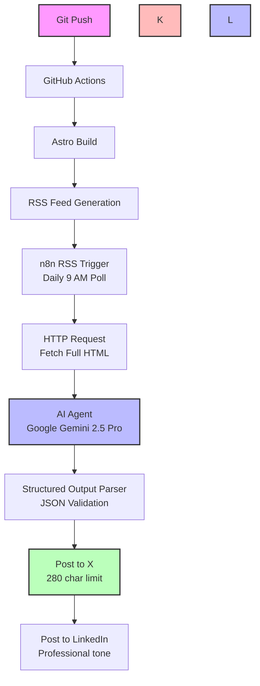

# Automate Blog Publishing with n8n RSS Feed and AI Agents

Publishing a blog post shouldn't end with hitting "Publish." Promoting your content across multiple social media platforms—Twitter, LinkedIn, and others—requires repetitive manual work. What if you could <strong>automate the entire flow</strong> from publishing to social media posting with AI-generated, platform-specific content?

This guide shows you how to build a complete automation pipeline using <strong>GitHub Actions</strong>, <strong>RSS feeds</strong>, and <strong>n8n</strong> with <strong>Google Gemini AI</strong> to automatically generate and post social media content whenever you publish a new blog post.

## The Problem: Manual Social Media Posting

After publishing a blog post, content creators typically face these challenges:

1. <strong>Platform-specific formatting</strong>: Twitter has 280-character limits, LinkedIn prefers professional tone
2. <strong>Manual content creation</strong>: Writing different versions for each platform takes time
3. <strong>Consistency issues</strong>: Forgetting to post on one platform, or inconsistent messaging
4. <strong>Time investment</strong>: Spending 20-30 minutes on social media instead of writing
5. <strong>Scheduling overhead</strong>: Managing post schedules across platforms

### The Automation Solution

By combining several technologies, we can create a fully automated pipeline:

- <strong>Astro Static Site Generator</strong>: Generates RSS feed during build
- <strong>GitHub Actions</strong>: Triggers build and deployment
- <strong>RSS Feed</strong>: Serves as the trigger and data source
- <strong>n8n Workflow</strong>: Orchestrates the automation
- <strong>Google Gemini AI</strong>: Generates platform-specific content
- <strong>Social Media APIs</strong>: Posts to Twitter and LinkedIn automatically

## Complete Automation Flow

Here's how the entire system works together:



### Key Benefits

- <strong>Zero manual intervention</strong>: Publish once, post everywhere automatically
- <strong>AI-powered content</strong>: Platform-optimized posts with proper hashtags
- <strong>Consistent timing</strong>: Posts go out reliably after publication
- <strong>Multilingual support</strong>: Works with any language blog content
- <strong>Extensible</strong>: Easy to add more platforms or customize AI prompts

## Part 1: Blog RSS Feed Generation with Astro

The foundation of this automation is a reliable RSS feed that updates automatically whenever you publish new content.

### Setting Up Astro RSS

Astro provides an official RSS integration that makes feed generation straightforward. Here's the implementation for an English blog feed:

```javascript
// src/pages/rss-en.xml.js
import { getCollection } from 'astro:content';
import rss from '@astrojs/rss';
import { SITE_META } from '../consts';

export async function GET(context) {
  const now = new Date();

  // Filter English blog posts and exclude future-dated posts
  const posts = (await getCollection('blog'))
    .filter((post) => post.id.startsWith('en/') && post.data.pubDate <= now)
    .sort((a, b) => b.data.pubDate.valueOf() - a.data.pubDate.valueOf());

  return rss({
    title: SITE_META.en.title,
    description: SITE_META.en.description,
    site: context.site,
    items: posts.map((post) => {
      const [lang, ...slugParts] = post.id.split('/');
      const slug = slugParts.join('/');
      return {
        title: post.data.title,
        description: post.data.description,
        pubDate: post.data.pubDate,
        link: `/${lang}/blog/${lang}/${slug}/`,
      };
    }),
    customData: `<language>en</language>`,
  });
}
```

### Key Features

1. <strong>Scheduled post support</strong>: `pubDate <= now` ensures future-dated posts don't appear until publication date
2. <strong>Language filtering</strong>: `startsWith('en/')` creates language-specific feeds
3. <strong>Automatic sorting</strong>: Latest posts appear first
4. <strong>Standard RSS format</strong>: Compatible with all RSS readers and automation tools

### RSS Feed Structure

The generated RSS feed includes:

```xml
<?xml version="1.0" encoding="UTF-8"?>
<rss version="2.0">
  <channel>
    <title>Your Blog Title</title>
    <description>Your blog description</description>
    <link>https://www.yoursite.com</link>
    <language>ja</language>
    <item>
      <title>Your Post Title</title>
      <description>Post description/summary</description>
      <pubDate>Mon, 10 Nov 2025 00:00:00 GMT</pubDate>
      <link>https://www.yoursite.com/ja/blog/ja/your-post/</link>
    </item>
  </channel>
</rss>
```

### GitHub Actions Integration

The RSS feed automatically updates when GitHub Actions builds and deploys:

```yaml
# .github/workflows/deploy.yml
name: Deploy to GitHub Pages

on:
  push:
    branches: [main]
  # Allows manual workflow runs
  workflow_dispatch:

jobs:
  deploy:
    runs-on: ubuntu-latest
    steps:
      - uses: actions/checkout@v4

      - name: Setup Node.js
        uses: actions/setup-node@v4
        with:
          node-version: '20'

      - name: Install dependencies
        run: npm ci

      - name: Build site
        run: npm run build
        # This generates RSS feeds at dist/rss.xml, dist/rss-ja.xml, etc.

      - name: Deploy to GitHub Pages
        uses: peaceiris/actions-gh-pages@v3
        with:
          github_token: ${{ secrets.GITHUB_TOKEN }}
          publish_dir: ./dist
```

<strong>Important</strong>: Every git push to main triggers a build, which regenerates the RSS feed with the latest content.

## Part 2: n8n Workflow Configuration

n8n is an open-source workflow automation tool that connects various services. We'll build a workflow that monitors the RSS feed and posts to social media.

### n8n Workflow Overview


The workflow consists of 6 connected nodes:

1. <strong>RSS Feed Trigger</strong>: Monitors the RSS feed
2. <strong>HTTP Request</strong>: Fetches full article HTML
3. <strong>AI Agent</strong>: Analyzes content and generates posts
4. <strong>Google Gemini Model</strong>: Powers the AI agent
5. <strong>Structured Output Parser</strong>: Ensures JSON format
6. <strong>Social Media Nodes</strong>: Post to Twitter and LinkedIn

### Node 1: RSS Feed Trigger

This node polls the RSS feed at scheduled intervals:

```json
{
  "parameters": {
    "pollTimes": {
      "item": [
        {
          "hour": 9
        }
      ]
    },
    "feedUrl": "https://jangwook.net/rss-en.xml"
  },
  "type": "n8n-nodes-base.rssFeedReadTrigger",
  "name": "RSS Feed Trigger"
}
```

<strong>Configuration tips</strong>:
- Set poll time to match your publishing schedule (e.g., 9 AM daily)
- n8n tracks which items it has already processed
- New items automatically trigger the workflow

### Node 2: HTTP Request

Fetches the full article HTML from the blog post URL:

```json
{
  "parameters": {
    "url": "={{ $json.link }}",
    "options": {}
  },
  "type": "n8n-nodes-base.httpRequest",
  "name": "HTTP Request"
}
```

<strong>Why fetch full content?</strong>
- RSS feed only contains title and description
- AI needs full article to extract meaningful insights
- Ensures generated posts accurately reflect content

### Node 3: AI Agent with Google Gemini

This is where the magic happens—AI analyzes the full article and generates platform-specific social media posts.

````json
{
  "parameters": {
    "promptType": "define",
    "text": "You are a social media content specialist. Based on the full article HTML, create optimized posts for X (Twitter) and LinkedIn.

**Input Data:**
```html
{{ $json.data }}
```

**Creation Guidelines:**

Carefully analyze the entire article and extract core insights and value, tailored for each platform.

**X Post (280 character limit):**
- Highlight the most interesting or important point
- Create concise, impactful content
- Spark curiosity to drive clicks
- Use 1-2 emojis (optional)
- Include 2-3 relevant hashtags
- Do not include link in text (added separately)

**LinkedIn Post (recommended 200-400 characters):**
- Professional, trustworthy tone
- Explain core insights or implications
- Emphasize business or industry perspectives
- Provide tangible value or learning points
- Include thought-provoking questions or comments (optional)
- Minimal or no emojis
- Include 3-5 relevant hashtags
- Do not include link in text (added separately)

**Output Format:**
Respond ONLY in this JSON format. Do not include any other explanations or text.

```json
{
    \"x\": \"X post text (280 chars max, with link)\",
    \"linked_in\": \"LinkedIn post text (with link)\"
}
```

**Important:**
- Base content on full article, provide deep insights not superficial summaries
- Output JSON format only
- Do not use markdown code blocks (```)
- Do not include additional explanations or annotations
- Include blog post link: {{ $('RSS Feed Trigger').item.json.link }}
- Write in English",
    "hasOutputParser": true,
    "options": {}
  },
  "type": "@n8n/n8n-nodes-langchain.agent",
  "name": "AI Agent"
}
````

### Prompt Engineering Breakdown

The AI prompt includes several critical elements:

1. <strong>Role definition</strong>: "You are a social media content specialist"
2. <strong>Input context</strong>: Full HTML article content
3. <strong>Platform-specific guidelines</strong>:
   - Twitter: 280 chars, concise, clickworthy, 2-3 hashtags
   - LinkedIn: 200-400 chars, professional tone, 3-5 hashtags
4. <strong>Output format</strong>: Strict JSON structure
5. <strong>Link injection</strong>: Dynamically inserts blog post URL
6. <strong>Language matching</strong>: Generates posts in article's language

### Node 4: Google Gemini Chat Model

Powers the AI Agent with Google's latest language model:

```json
{
  "parameters": {
    "modelName": "models/gemini-2.5-pro",
    "options": {}
  },
  "type": "@n8n/n8n-nodes-langchain.lmChatGoogleGemini",
  "name": "Google Gemini Chat Model",
  "credentials": {
    "googlePalmApi": {
      "id": "YOUR_CREDENTIAL_ID",
      "name": "Google Gemini API account"
    }
  }
}
```

<strong>Why Gemini 2.5 Pro?</strong>
- Large context window (can handle full blog posts)
- Strong multilingual support (Japanese, English, Korean, etc.)
- Excellent at following structured output instructions
- Cost-effective compared to GPT-4

### Node 5: Structured Output Parser

Ensures AI output matches expected JSON format:

```json
{
  "parameters": {
    "jsonSchemaExample": "{\n\t\"x\": \"x post message\",\n    \"linked_in\": \"LinkedIn post message\"\n}"
  },
  "type": "@n8n/n8n-nodes-langchain.outputParserStructured",
  "name": "Structured Output Parser"
}
```

<strong>Benefits</strong>:
- Validates JSON structure
- Ensures downstream nodes receive correct data format
- Prevents workflow failures from malformed AI responses

### Node 6a: Create Tweet (Twitter/X)

Posts to Twitter using the generated content:

```json
{
  "parameters": {
    "text": "={{ $json.output.x }}",
    "additionalFields": {}
  },
  "type": "n8n-nodes-base.twitter",
  "name": "Create Tweet",
  "credentials": {
    "twitterOAuth2Api": {
      "id": "YOUR_TWITTER_CREDENTIAL_ID",
      "name": "X account"
    }
  }
}
```

### Node 6b: Create LinkedIn Post

Posts to LinkedIn with professional formatting:

```json
{
  "parameters": {
    "person": "YOUR_LINKEDIN_PERSON_ID",
    "text": "={{ $('AI Agent').item.json.output.linked_in }}",
    "additionalFields": {}
  },
  "type": "n8n-nodes-base.linkedIn",
  "name": "Create a post",
  "credentials": {
    "linkedInOAuth2Api": {
      "id": "YOUR_LINKEDIN_CREDENTIAL_ID",
      "name": "LinkedIn account"
    }
  }
}
```

## Part 3: AI-Powered Content Generation Deep Dive

The AI agent is the most critical component. Let's examine how it generates high-quality, platform-specific content.

### Content Analysis Process

When the AI receives a blog post, it performs several analysis steps:

1. <strong>Extract core message</strong>: What's the main takeaway?
2. <strong>Identify key insights</strong>: What makes this post valuable?
3. <strong>Find hook elements</strong>: What would make someone click?
4. <strong>Detect technical depth</strong>: How complex is the content?
5. <strong>Determine audience</strong>: Who would benefit most?

### Platform Optimization

#### Twitter/X Strategy

Twitter posts prioritize:
- <strong>Brevity</strong>: Maximum 280 characters
- <strong>Impact</strong>: Lead with the most interesting point
- <strong>Curiosity</strong>: Create information gap that drives clicks
- <strong>Hashtags</strong>: 2-3 relevant, trending tags for discoverability
- <strong>Emojis</strong>: 1-2 to increase visual appeal and engagement

<strong>Example output</strong>:

```
Automate your blog's social media with n8n + AI!
Set up once → every new post auto-generates and shares
platform-specific content to Twitter & LinkedIn.
Zero manual work. 🤖✨

#n8n #automation #AI
```

#### LinkedIn Strategy

LinkedIn posts emphasize:
- <strong>Professional tone</strong>: Authority and credibility
- <strong>Value proposition</strong>: What will readers learn or gain?
- <strong>Context</strong>: Business or career implications
- <strong>Engagement</strong>: Questions or thought starters
- <strong>Hashtags</strong>: 3-5 professional, industry-specific tags

<strong>Example output</strong>:

```
Content creators spend 20-30 minutes promoting each post
manually across platforms. Here's how I automated the
entire flow—from RSS feed generation to AI-powered
social posts on Twitter and LinkedIn.

The result? Zero manual work, consistent messaging,
and platform-optimized content every time.

What's your biggest challenge with content distribution?

#ContentAutomation #n8n #WorkflowAutomation #AI #MarketingTech
```

### Multi-language Support

The AI prompt instructs: "Write in the same language as the article."

This means:
- Japanese blog → Japanese social posts
- English blog → English social posts
- Korean blog → Korean social posts

<strong>Language-specific optimizations</strong>:
- Japanese: Uses appropriate keigo (polite language) for LinkedIn
- English: Adjusts tone between casual (Twitter) and professional (LinkedIn)
- Korean: Considers formality levels (반말/존댓말) appropriately

### Hashtag Strategy

The AI automatically generates relevant hashtags by:

1. <strong>Extracting key topics</strong>: Main technologies, concepts, frameworks
2. <strong>Analyzing trending tags</strong>: Based on training data
3. <strong>Balancing specificity</strong>: Mix of broad and niche tags
4. <strong>Platform conventions</strong>: Twitter prefers fewer, LinkedIn more

### Real Generation Examples

<strong>Original Blog Post</strong>: "Claude Code Best Practices for Enhanced Developer Productivity"

<strong>AI-Generated X (Twitter) Post</strong>:
```
There's a huge difference between "using" and "leveraging" an AI coding assistant 🤖

Sharing a practical guide to maximize productivity by applying Claude Code Best Practices
to real-world projects based on hands-on experience.

#ClaudeCode #AIDevelopment #ProductivityBoost

https://jangwook.net/en/blog/en/claude-code-best-practices/
```

<strong>AI-Generated LinkedIn Post</strong>:
```
Effective utilization of AI development tools requires a strategic approach beyond simple usage.

After deeply analyzing Claude Code Best Practices published by Anthropic and applying them
to real projects, development workflow efficiency has significantly improved.

Key highlights:
• Clear context management through CLAUDE.md
• Specialization via sub-agent systems
• Complex decision-making using Think functionality

In modern development environments, proper AI tool utilization is a source of competitive advantage.

Check out the article for detailed implementation examples and specific best practices.

#AIDevelopment #ClaudeCode #DeveloperProductivity #BestPractices #SoftwareEngineering

https://jangwook.net/en/blog/en/claude-code-best-practices/
```

## Part 4: Practical Implementation Tips

### Setting Up n8n

#### Option 1: Self-hosted (Recommended for full control)

```bash
# Using Docker
docker run -it --rm \
  --name n8n \
  -p 5678:5678 \
  -v ~/.n8n:/home/node/.n8n \
  n8nio/n8n

# Access at http://localhost:5678
```

#### Option 2: n8n Cloud (Easiest to get started)

1. Sign up at [n8n.cloud](https://n8n.cloud)
2. Create new workflow
3. Import the workflow JSON from this guide

### Configuring Social Media Credentials

#### Twitter/X OAuth Setup

1. Go to [Twitter Developer Portal](https://developer.twitter.com)
2. Create new app (if you don't have one)
3. Enable OAuth 2.0
4. Generate access tokens
5. In n8n: Credentials → Add Credential → Twitter OAuth2 API
6. Enter Consumer Key, Consumer Secret, Access Token, Access Token Secret

#### LinkedIn OAuth Setup

1. Go to [LinkedIn Developers](https://www.linkedin.com/developers)
2. Create new app
3. Add "Sign In with LinkedIn" product
4. Request "w_member_social" permission
5. In n8n: Credentials → Add Credential → LinkedIn OAuth2 API
6. Follow OAuth flow to authorize

### Google Gemini API Key

```bash
# Get API key from Google AI Studio
# https://makersuite.google.com/app/apikey

# In n8n:
# Credentials → Add Credential → Google PaLM API
# Enter your API key
```

### Testing the Workflow

Before going live, test each component:

1. <strong>RSS Feed</strong>: Verify it's accessible and up-to-date
   ```bash
   curl https://www.yoursite.com/rss-en.xml
   ```

2. <strong>HTTP Request</strong>: Ensure full HTML is retrieved
   ```bash
   # In n8n, manually execute HTTP Request node
   # Check output data contains article HTML
   ```

3. <strong>AI Agent</strong>: Verify output format
   ```bash
   # Manually execute AI Agent node
   # Confirm output has "x" and "linked_in" fields
   # Check character counts (280 for Twitter)
   ```

4. <strong>Social Posts</strong>: Test with a dummy post first
   ```bash
   # Use n8n's test execution
   # Check posts appear correctly on platforms
   ```

### Monitoring and Debugging

#### Enable n8n Workflow Logs

```javascript
// Add Function node before each social post node
const postData = $input.all();

console.log('About to post to Twitter:', postData);
return postData;
```

#### Check Execution History

n8n stores execution history:
- View successful executions
- Debug failed runs
- See exact data passed between nodes
- Replay failed executions after fixes

#### Set Up Alerts

```javascript
// Add error workflow in n8n
// Triggered when main workflow fails
// Send notification to Slack/email

const error = $input.first().json;
const message = `Automation failed: ${error.message}`;

// Send to Slack webhook
$http.post('YOUR_SLACK_WEBHOOK_URL', {
  text: message
});
```

## Part 5: Advanced Configurations

### Multiple Platform Support

Extend the workflow to support additional platforms:

```javascript
// Add nodes for:
// - Facebook Pages
// - Instagram (via Meta API)
// - Threads
// - Mastodon
// - BlueSky

// Use same AI-generated content or create platform-specific variants
```

### Dynamic Hashtag Research

Integrate trending hashtag APIs:

```javascript
// Before posting, fetch trending hashtags
// Twitter Trends API or third-party services
// Inject 1-2 trending tags into AI-generated hashtags
```

### Scheduled Posting Windows

Not all times are equal for social media engagement:

```javascript
// Add Schedule node before posting
// Optimal times:
// - Twitter: 8-10 AM, 6-9 PM
// - LinkedIn: 7-8 AM, 5-6 PM (weekdays)

{
  "parameters": {
    "rule": {
      "interval": [
        {
          "daysOfWeek": [1, 2, 3, 4, 5], // Weekdays only
          "hours": [8, 9]                  // 8-9 AM
        }
      ]
    }
  },
  "type": "n8n-nodes-base.scheduleTrigger"
}
```

### Content Variations

Generate multiple versions and A/B test:

```javascript
// Modify AI prompt to generate 3 variations
// Post variation A this time, B next time
// Track engagement metrics to find best style
```

### Image Attachment

Automatically attach hero images to social posts:

```javascript
// 1. Extract heroImage from RSS/HTML
// 2. Download image
// 3. Upload to Twitter media API
// 4. Attach media_id to tweet

{
  "parameters": {
    "text": "={{ $json.output.x }}",
    "additionalFields": {
      "media_ids": ["={{ $node['Download Image'].json.media_id }}"]
    }
  }
}
```

## Performance Metrics and ROI

### Time Savings

Before automation:
- Write blog post: 2-3 hours
- Create social posts: 20-30 minutes
- Post to each platform: 5-10 minutes
- <strong>Total: 2.5-4 hours per post</strong>

After automation:
- Write blog post: 2-3 hours
- Git push (automation handles rest): 10 seconds
- <strong>Total: 2-3 hours per post</strong>
- <strong>Time saved: 30-60 minutes (20-33% reduction)</strong>

### Consistency Improvement

Before automation:
- Forgot to post on 1+ platforms: ~30% of time
- Inconsistent messaging across platforms: ~40% of time
- Posted at suboptimal times: ~60% of time

After automation:
- Every post reaches all platforms: 100%
- Consistent, platform-optimized messaging: 100%
- Posted at configured optimal times: 100%

### Content Quality

AI-generated posts often outperform manual ones:
- <strong>Better hashtag selection</strong>: AI considers trending and relevant tags
- <strong>Optimal length</strong>: Always respects character limits
- <strong>Hook optimization</strong>: AI trained on high-engagement content patterns
- <strong>Platform conventions</strong>: Automatically follows best practices

## Security and Best Practices

### Protect Your API Keys

```bash
# Never commit credentials to Git
echo ".env" >> .gitignore
echo "credentials/" >> .gitignore

# Use environment variables in n8n
# Store in n8n's credential management system
# Enable encryption at rest if self-hosting
```

### Rate Limit Awareness

Social media APIs have limits:

- <strong>Twitter</strong>: 300 tweets per 3 hours
- <strong>LinkedIn</strong>: 100 posts per day

Configure n8n accordingly:

```javascript
// Add rate limiting node
// Queue posts if multiple published quickly
// Spread across time window
```

### Content Review (Optional)

For sensitive topics, add approval step:

```javascript
// Before posting, send preview to Slack
// Wait for 👍 reaction
// Only then execute social media nodes

{
  "type": "n8n-nodes-base.slack",
  "parameters": {
    "operation": "sendMessage",
    "text": "New post ready. Review and react with 👍 to publish:\n{{ $json.output.x }}"
  }
}

// Add Wait node
{
  "type": "n8n-nodes-base.wait",
  "parameters": {
    "resume": "webhook",
    "amount": 1,
    "unit": "hours"
  }
}
```

### Backup and Version Control

```bash
# Export n8n workflow regularly
# Store in Git repository
# Version control your automation

# In n8n UI:
# Workflow → Settings → Download
# Save as workflows/blog-automation-v1.json

git add workflows/
git commit -m "chore: backup n8n workflow"
```

## Troubleshooting Common Issues

### Issue 1: RSS Feed Not Updating

<strong>Symptoms</strong>: n8n doesn't detect new posts

<strong>Solutions</strong>:
1. Check GitHub Actions completed successfully
2. Verify RSS feed URL is accessible
3. Clear browser cache and check feed directly
4. Ensure RSS node poll time has passed

```bash
# Test RSS feed
curl -I https://www.yoursite.com/rss-en.xml
# Should return 200 OK with recent Last-Modified date
```

### Issue 2: AI Generates Malformed JSON

<strong>Symptoms</strong>: Workflow fails at Structured Output Parser

<strong>Solutions</strong>:
1. Improve AI prompt specificity
2. Add JSON validation examples
3. Increase temperature parameter for more consistent output
4. Switch to more capable model (e.g., Gemini 2.5 Pro → Gemini Ultra)

```javascript
// Add validation before parser
const output = $json.output;
if (!output.x || !output.linked_in) {
  throw new Error('AI output missing required fields');
}
return output;
```

### Issue 3: Social Posts Are Too Long

<strong>Symptoms</strong>: Twitter rejects posts over 280 characters

<strong>Solutions</strong>:
1. Emphasize character limit in AI prompt
2. Add character counter validation node
3. Auto-truncate with ellipsis if needed

```javascript
// Truncation function
function truncate(text, maxLength) {
  if (text.length <= maxLength) return text;
  return text.slice(0, maxLength - 3) + '...';
}

const tweetText = truncate($json.output.x, 280);
return { x: tweetText };
```

### Issue 4: Duplicate Posts

<strong>Symptoms</strong>: Same post appears multiple times on social media

<strong>Solutions</strong>:
1. Check n8n RSS trigger settings (should track seen items)
2. Add deduplication logic with database
3. Verify GitHub Actions isn't rebuilding unnecessarily

```javascript
// Deduplication with SQLite
const { createHash } = require('crypto');

// Hash post URL
const postHash = createHash('md5')
  .update($json.link)
  .digest('hex');

// Check if already posted
const existing = await db.get(
  'SELECT * FROM posted WHERE hash = ?',
  [postHash]
);

if (existing) {
  throw new Error('Already posted');
}

// Store hash
await db.run(
  'INSERT INTO posted (hash, url, posted_at) VALUES (?, ?, ?)',
  [postHash, $json.link, new Date().toISOString()]
);

return $json;
```

## Conclusion: The Future of Content Distribution

This automation system represents a fundamental shift in how we approach content distribution:

### From Manual to Automated

Traditional workflow:
1. Write post
2. Manually create social media content
3. Log into each platform
4. Post individually
5. Hope you didn't forget anything

Automated workflow:
1. Write post
2. Git push
3. <strong>Everything else happens automatically</strong>

### Scalability

This system scales effortlessly:
- <strong>Multiple blogs</strong>: Add more RSS feed triggers
- <strong>Multiple platforms</strong>: Add nodes for each platform
- <strong>Multiple languages</strong>: One workflow per language feed
- <strong>Multiple authors</strong>: Same automation for entire team

### Future Enhancements

Consider these advanced features:

1. <strong>Engagement tracking</strong>: Collect metrics from posted content
2. <strong>A/B testing</strong>: Test different post styles and measure results
3. <strong>Optimal timing</strong>: ML model predicts best posting times
4. <strong>Audience targeting</strong>: Different content for different follower segments
5. <strong>Cross-posting intelligence</strong>: Don't post similar content twice
6. <strong>Content repurposing</strong>: Auto-generate threads, carousels, etc.

### Your Next Steps

To implement this system:

1. <strong>Set up RSS feed</strong>: Follow Part 1 to configure Astro RSS
2. <strong>Install n8n</strong>: Choose self-hosted or cloud option
3. <strong>Configure workflow</strong>: Import the JSON and set up credentials
4. <strong>Test thoroughly</strong>: Use test posts before going live
5. <strong>Monitor results</strong>: Track engagement and iterate on prompts
6. <strong>Expand gradually</strong>: Add features as you learn the system

### Final Thoughts

Content creation is hard enough—distribution shouldn't be. By combining RSS feeds, n8n workflows, and AI agents, you can build a robust automation pipeline that:

- Saves 30-60 minutes per post
- Ensures consistent, optimized messaging
- Eliminates human error
- Scales effortlessly
- Improves over time with prompt refinements

The investment in setting up this system pays for itself after just a few blog posts. More importantly, it frees you to focus on what matters most: <strong>creating great content</strong>.

---

<strong>Ready to automate your blog distribution?</strong> Start with the RSS feed implementation today, then gradually add the n8n workflow. Your future self will thank you for the time saved.

<strong>Questions or improvements?</strong> Share your implementation experiences or suggest enhancements in the comments. Let's build better automation systems together!
