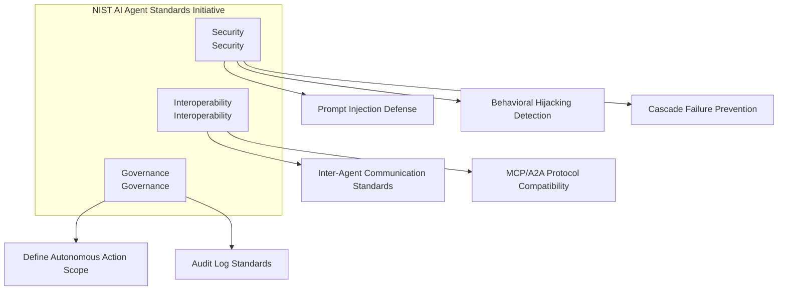
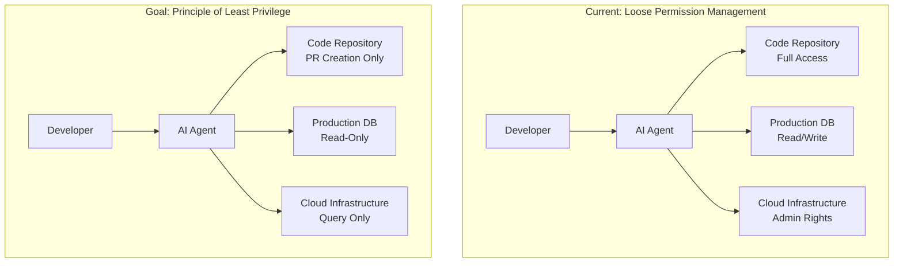
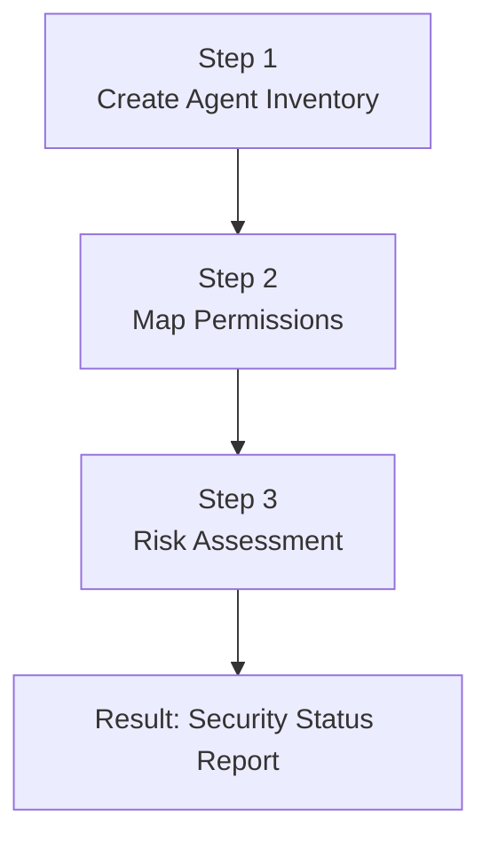
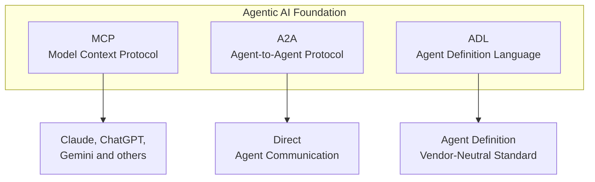

## Overview

In February 2026, NIST (National Institute of Standards and Technology) officially announced the <strong>AI Agent Standards Initiative</strong>. In an era where AI agents autonomously write code, send emails, and manage infrastructure, this represents the first official answer to the question: "Are these agents truly safe?"

Notably, the deadline for submitting comments on the <strong>AI Agent Security RFI</strong> is March 9, 2026, making now the optimal time for Engineering Managers to audit how their teams operate AI agents.

This article synthesizes the core content of the NIST initiative and presents an actionable security checklist that EMs and VPoEs can implement immediately.

## What is the NIST AI Agent Standards Initiative?

Led by NIST's CAISI (Center for AI Standards and Innovation), this initiative comprises three core pillars:



### Three Critical Security Threats

The security threats to AI agents that NIST specifically highlights are:

<strong>1. Prompt Injection</strong>

This attack injects malicious instructions into AI agents that process external data. For example, a web-crawling agent being forced to follow hidden instructions on a malicious webpage.

<strong>2. Behavioral Hijacking</strong>

This attack manipulates an agent's normal behavioral patterns, causing unintended actions. The February 2026 Cline npm publish incident is a prime example, where a coding agent automatically deployed malicious packages.

<strong>3. Cascade Failure</strong>

One agent's failure creates a chain reaction, paralyzing the entire system. This is particularly dangerous in multi-agent orchestration scenarios.

## Why Engineering Managers Must Pay Attention Now

### The Dangerous Expansion of Agent Permissions

In enterprise environments, AI agents often run with broader permissions than users. GitHub Copilot commits code, Slack bots send channel messages, and infrastructure agents provision servers. All these actions can bypass IAM (Identity and Access Management) systems.



### Rapidly Changing Regulatory Environment

NIST standards are likely to be reflected in future federal procurement requirements. With the EU AI Act rolling out in phases starting in 2026, AI agent security becomes a critical compliance area. Companies targeting the global market that don't prepare now will face significantly higher costs later.

## AI Agent Security Checklist for EMs

### Phase 1: Assess Current Status (1〜2 weeks)



<strong>Step 1 — Agent Inventory</strong>

Catalog all AI agents currently used by your team:

```yaml
# agent-inventory.yaml example
agents:
  - name: "GitHub Copilot"
    type: "Coding Assistant"
    scope: "Code generation, PR review"
    data_access: "Full source code"
    autonomous_actions: ["Code suggestion", "Auto-completion"]
    risk_level: "medium"

  - name: "Slack AI Bot"
    type: "Communication Agent"
    scope: "Message summary, notifications"
    data_access: "All channel messages"
    autonomous_actions: ["Message sending", "Channel summary"]
    risk_level: "high"

  - name: "Infrastructure Agent"
    type: "Infrastructure Automation"
    scope: "Server provisioning, monitoring"
    data_access: "AWS/GCP Admin Console"
    autonomous_actions: ["Scaling", "Deployment", "Rollback"]
    risk_level: "critical"
```

<strong>Step 2 — Permission Mapping</strong>

Audit what permissions each agent actually possesses. Pay special attention to the gap between "intended permissions" and "actual permissions."

<strong>Step 3 — Risk Assessment</strong>

Evaluate each agent's vulnerabilities against NIST's three threats: prompt injection, behavioral hijacking, and cascade failure.

### Phase 2: Build Guardrails (2〜4 weeks)

```typescript
// agent-guardrail.ts — Example security validation before agent execution
interface AgentAction {
  agentId: string;
  actionType: 'read' | 'write' | 'execute' | 'deploy';
  targetResource: string;
  reasoning: string;
  confidence: number;
}

interface GuardrailResult {
  allowed: boolean;
  reason: string;
  requiresHumanApproval: boolean;
}

function evaluateAction(action: AgentAction): GuardrailResult {
  // 1. Apply principle of least privilege
  if (action.actionType === 'deploy' && !isApprovedDeployer(action.agentId)) {
    return {
      allowed: false,
      reason: 'Agent does not have deployment permissions',
      requiresHumanApproval: true
    };
  }

  // 2. Validate confidence threshold
  if (action.confidence < 0.85) {
    return {
      allowed: false,
      reason: `Confidence ${action.confidence} below threshold 0.85`,
      requiresHumanApproval: true
    };
  }

  // 3. Detect anomalous behavior
  if (isAnomalousPattern(action)) {
    return {
      allowed: false,
      reason: 'Anomalous behavioral pattern detected',
      requiresHumanApproval: true
    };
  }

  return { allowed: true, reason: 'OK', requiresHumanApproval: false };
}
```

### Phase 3: Continuous Monitoring and Audit

<strong>Standardize Audit Logs</strong>

Agent audit logs recommended by NIST should include the following information:

```json
{
  "timestamp": "2026-03-06T09:30:00Z",
  "agent_id": "coding-assistant-v2",
  "action": "file_write",
  "target": "/src/api/auth.ts",
  "input_source": "user_prompt",
  "reasoning": "Modified authentication logic per user request",
  "confidence": 0.92,
  "human_approved": false,
  "outcome": "success",
  "data_accessed": ["source_code"],
  "external_calls": []
}
```

## Agentic AI Foundation and MCP Standardization

Parallel to the NIST initiative, the industry itself is rapidly standardizing.

Anthropic donated the <strong>Model Context Protocol (MCP)</strong> to the Linux Foundation's new <strong>Agentic AI Foundation (AAIF)</strong>. Jointly supported by OpenAI, Google, Microsoft, AWS, and Cloudflare, this foundation is establishing interoperability standards for agents.



As an EM, a critical point to note is that MCP has already reached 97 million downloads monthly, becoming the de facto industry standard. When designing your team's AI agent architecture, it's wise to include MCP compatibility as a baseline requirement.

## Practical Application: Three Things to Start Tomorrow

<strong>1. Agent Inventory Meeting (30 minutes)</strong>

Gather your entire team and answer the question: "What AI agents is our team using?" You'll likely discover many agents running informally.

<strong>2. Apply Principle of Least Privilege (1 hour)</strong>

Audit each agent's permissions and identify agents with excessive privileges. Immediately restrict permissions for agents with direct access to production environments.

<strong>3. Build Audit Log Pipeline (Half day)</strong>

Establish a logging pipeline that records all agent actions. Start by adding an agent-dedicated dashboard to your existing monitoring stack (Datadog, Grafana, etc.).

## Conclusion

The NIST AI Agent Standards Initiative is not merely a government guideline. It represents a critical turning point where AI agents are becoming core enterprise infrastructure, establishing baseline standards for security and governance.

As an EM or VPoE, our responsibilities are clear: identify the AI agents your team uses, apply the principle of least privilege, and maintain audit logs. These three actions alone can satisfy 70% of NIST standard requirements.

Waiting until later will cost many times more when regulations are fully implemented. Start with creating an agent inventory in your next team meeting.

## References

- [NIST AI Agent Standards Initiative Official Page](https://www.nist.gov/caisi/ai-agent-standards-initiative)
- [NIST RFI: Security Considerations for AI Agents](https://www.federalregister.gov/documents/2026/01/08/2026-00206/request-for-information-regarding-security-considerations-for-artificial-intelligence-agents)
- [Agentic AI Foundation — Linux Foundation](https://www.anthropic.com/news/donating-the-model-context-protocol-and-establishing-of-the-agentic-ai-foundation)
- [AI Agent Security in Enterprise 2026](https://www.agilesoftlabs.com/blog/2026/02/how-ai-agents-use-mcp-for-enterprise)
