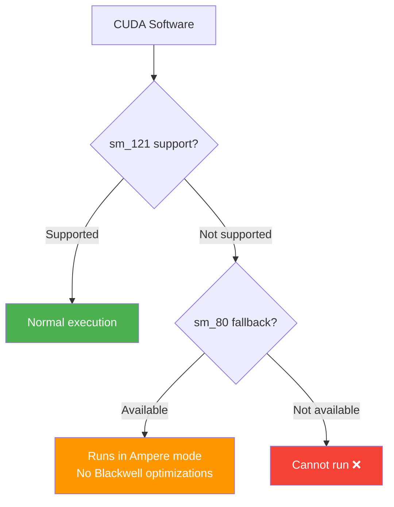

## Overview

NVIDIA DGX Spark was unveiled at CES 2025 as a "$3,000 personal AI supercomputer." With 128GB of unified memory and the Blackwell architecture, it was positioned as a desktop-grade AI workstation. However, real-world user reports paint a very different picture from the marketing.

A post on Reddit's r/LocalLLaMA community, where a user decided to return their DGX Spark after just one week of use, generated significant attention. The core issue was <strong>CUDA software compatibility</strong>.

## sm121: Neither Datacenter nor Gaming — A Special Snowflake Architecture

The biggest problem with the DGX Spark lies in its GPU architecture.

| Category | Architecture | SM Version | Features |
|----------|-------------|------------|----------|
| Datacenter Blackwell | GB200/B200 | sm_100 | tcgen05 tensor cores, full Blackwell |
| Gaming Blackwell | RTX 5090 etc. | sm_120 | Gaming optimized |
| <strong>DGX Spark</strong> | <strong>GB10</strong> | <strong>sm_121</strong> | <strong>Unique architecture, includes RT cores</strong> |
| Ampere | A100 etc. | sm_80 | 6-year-old architecture |

DGX Spark uses neither datacenter Blackwell (sm_100) nor gaming Blackwell (sm_120), but <strong>sm_121 — its own unique architecture</strong>. As a result, many CUDA software packages either don't work at all or fall back to sm_80 (Ampere) code paths.

## The Handheld Gaming Chip Repurposing Theory

A response from an official NVIDIA representative on the developer forums deepened suspicions:

> sm80-class kernels can execute on DGX Spark because Tensor Core behavior is very similar, particularly for GEMM/MMAs (closer to the GeForce Ampere-style MMA model). DGX Spark not has tcgen05 like jetson Thor or GB200, due die space with RT Cores and DLSS algorithm

Key takeaways from this response:

1. <strong>Tensor cores are not Blackwell-grade</strong>: No tcgen05 (Blackwell's 5th-gen tensor cores); closer to Ampere-style MMA model
2. <strong>RT cores and DLSS algorithm occupy die space</strong>: Why would an AI dev kit need gaming features?
3. <strong>Different design from Jetson Thor and GB200</strong>: Same Blackwell branding, completely different internals

These facts suggest that DGX Spark's GPU was originally <strong>designed for a handheld gaming device</strong> and repurposed as an AI workstation. The unified memory support on a gaming GPU further supports this hypothesis.

## The State of CUDA Software Compatibility

Reported compatibility issues include:

- <strong>Triton</strong>: Patched to fall back to sm_80 code paths ([GitHub Issue #8335](https://github.com/triton-lang/triton/issues/8335))
- <strong>Numerous CUDA libraries</strong>: Fail to recognize sm_121, resulting in build failures or runtime errors
- <strong>Blackwell-specific features</strong>: FP4/FP6 quantization and other Blackwell-exclusive features unavailable

Making matters worse, the NVIDIA forum representative cited <strong>non-existent software versions and releases</strong> while claiming issues had been resolved. This is suspected to be LLM hallucination, raising concerns about NVIDIA's customer support quality.

## Hardware Quality Issues

Beyond software compatibility, basic hardware problems have been reported:

- <strong>HDMI display output failures</strong>: Multiple cases of inability to output to 1080p 144Hz monitors
- <strong>Professional reviewers like ServeTheHome</strong> confirmed similar display issues
- For a product claiming an "out of the box" experience, having basic display connectivity issues is a serious quality concern

## Lessons for Consumers

The lessons from the DGX Spark case are clear:

1. <strong>Don't be fooled by marketing names</strong>: Even with "Blackwell" branding, it's a completely different product from datacenter Blackwell
2. <strong>Check the SM version</strong>: A GPU's actual compute capability is determined by its SM architecture version
3. <strong>Verify software ecosystem support</strong>: Whether your desired software actually runs matters more than hardware specs
4. <strong>Wait for early user reviews</strong>: Especially for new product categories, check real-world usage reviews before purchasing

## Comparison with Apple Silicon

A comparison with Apple Silicon (M4 Ultra, etc.), which uses a similar unified memory architecture, is also meaningful:

| Item | DGX Spark | Mac Studio (M4 Ultra) |
|------|-----------|----------------------|
| Memory | 128GB unified | Up to 512GB unified |
| Memory bandwidth | ~273GB/s | ~819GB/s |
| CUDA support | sm_121 (limited) | Not supported (uses Metal) |
| Software compatibility | Partial | Mature MLX ecosystem |
| Price | ~$3,000 | ~$4,000+ |

While Apple Silicon doesn't support CUDA, the MLX framework ecosystem is maturing rapidly, providing a more stable experience for local LLM inference.

## Conclusion

DGX Spark made an attractive promise of "the power of the CUDA ecosystem on your personal desktop," but the reality reveals a gap between marketing and truth: <strong>CUDA compatibility at 6-year-old Ampere levels</strong> and <strong>limited AI performance based on a gaming chip</strong>.

The consumer AI hardware market is still in its early stages. Until NVIDIA provides full software support for sm_121, purchasing a DGX Spark requires careful consideration. Before paying a premium for the "AI workstation" label, make sure to verify exactly what workloads you can actually run.

## References

- [Reddit r/LocalLLaMA - PSA: NVIDIA DGX Spark has terrible CUDA software](https://www.reddit.com/r/LocalLLaMA/comments/1r569eb/psa_nvidia_dgx_spark_has_terrible_cuda_software/)
- [Triton Issue #8335 - sm_121 compatibility patch](https://github.com/triton-lang/triton/issues/8335)
- [NVIDIA Developer Forum - DGX Spark sm121 Support Discussion](https://forums.developer.nvidia.com/t/dgx-spark-sm121-software-support-is-severely-lacking-official-roadmap-needed/357663)
