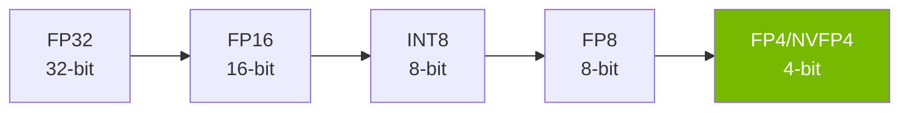
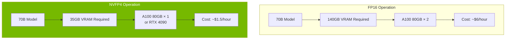
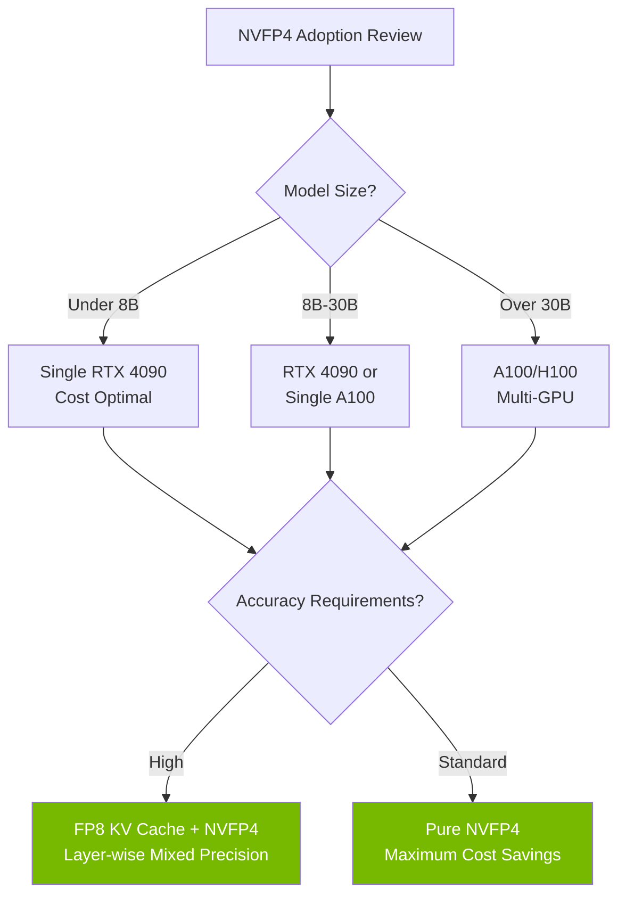

## Overview

LLM inference costs have become the biggest bottleneck for enterprise AI adoption. GPU memory usage, power consumption, and hardware investment — costs scale exponentially as models grow larger. NVIDIA's <strong>NVFP4 (4-bit floating point)</strong> quantization format has the potential to fundamentally change this equation.

The transition from FP32 (32-bit) to FP4 (4-bit) means <strong>8x memory reduction</strong> by simple arithmetic, and real-world benchmarks are achieving results close to this figure while minimizing accuracy loss.

This article analyzes NVFP4's technical principles, actual performance data, and its impact on LLM operational cost structures.

## What Is FP4 Quantization?

### The History of Bit Reduction

The evolution of LLM quantization follows this timeline:



At each stage, the number of bits used to represent model weights decreases, reducing memory usage and computational costs. The key question is <strong>how much accuracy can be preserved</strong>.

### NVFP4 Architecture

NVFP4 is a 4-bit floating-point format that NVIDIA supports at the hardware level starting from the Blackwell architecture. Unlike conventional INT4, it uses <strong>floating-point representation</strong> to maintain a wider dynamic range.

| Format | Bits | Memory vs FP32 | Dynamic Range | Hardware Support |
|--------|------|----------------|---------------|-----------------|
| FP32 | 32 | 1x | Very wide | All GPUs |
| FP16 | 16 | 2x | Wide | Most GPUs |
| FP8 | 8 | 4x | Moderate | Ada/Blackwell |
| NVFP4 | 4 | 8x | Moderate | Blackwell/Ada* |

*Ada Lovelace (RTX 4090, etc.) supported through community projects

### Microscaling (MX) Format

One of NVFP4's core innovations is <strong>Microscaling</strong> technology. This approach divides weights into small blocks and applies a separate scaling factor to each block.

```
Block size: 32 elements
Each block = [4-bit weights × 32] + [8-bit scale factor × 1]

Effective bits = 4 + (8/32) = 4.25 bits/element
```

This method enables precise calibration of value distributions within each block even under extreme bit reduction, achieving significantly better accuracy compared to INT4.

## Real-World Benchmarks: The AdaLLM Project

The <strong>AdaLLM</strong> project, which gained traction on Reddit's r/LocalLLaMA community, published results from running NVFP4 on RTX 4090 (Ada Lovelace) GPUs.

### Qwen3-8B NVFP4 Performance

| Batch Size | Total Tokens | Time (sec) | Throughput (tok/s) | VRAM (GB) |
|-----------|-------------|-----------|-------------------|----------|
| 1 | 128 | 3.39 | 37.79 | 7.55 |
| 4 | 512 | 3.44 | 148.87 | 7.55 |
| 8 | 1024 | 3.45 | 297.16 | 7.56 |
| 16 | 2048 | 4.36 | 469.34 | 7.56 |

### Gemma3-27B NVFP4 Performance

| Batch Size | Total Tokens | Time (sec) | Throughput (tok/s) | VRAM (GB) |
|-----------|-------------|-----------|-------------------|----------|
| 1 | 128 | 9.40 | 13.62 | 19.83 |
| 4 | 512 | 9.53 | 53.70 | 19.84 |

<strong>Key findings</strong>:
- Qwen3-8B: 2.4x VRAM reduction vs FP16, ~20-25% throughput loss
- Gemma3-27B (27B parameters): Fits on a single RTX 4090 GPU
- Throughput loss comes from <strong>compute efficiency</strong> rather than memory, so cost efficiency improves with larger batch sizes

## Cost Structure Transformation

### GPU Memory Savings Impact

Here's how FP4 quantization affects real operational costs across different scenarios.



### Cost Comparison Simulation

Estimated monthly operational costs for a 70B parameter model:

| Item | FP16 | NVFP4 | Reduction |
|------|------|-------|-----------|
| GPU Count | 2× A100 | 1× A100 | 50% |
| Hourly Cost | ~$6.00 | ~$1.50 | 75% |
| Monthly Cost (24/7) | ~$4,320 | ~$1,080 | 75% |
| Power Consumption | ~600W | ~300W | 50% |

Compared to FP32, memory savings of up to 8x are achievable. Even against FP16, cost reductions approach 4x.

## How Accuracy Is Preserved

### MXFP4 vs Traditional INT4

The paper "Bridging the Gap Between Promise and Performance for Microscaling FP4 Quantization" (2025) provides detailed analysis of accuracy preservation mechanisms in MXFP4/NVFP4 formats.

Key techniques:

1. <strong>Microscaling calibration</strong>: Independent scale factors for every 32 elements minimize value distribution distortion
2. <strong>FP8 KV cache</strong>: Using FP8 for Key-Value cache preserves attention computation accuracy
3. <strong>Layer-adaptive quantization</strong>: Sensitive layers maintain higher precision while less sensitive layers receive more aggressive quantization
4. <strong>Calibration data-based optimization</strong>: Quantization parameters are tuned to reflect actual input data distributions

### Quality Validation Results

In community benchmarks, NVFP4 models demonstrate:

- <strong>Perplexity increase</strong>: Within 1-3% of FP16
- <strong>Downstream tasks</strong>: Within 1-2% performance difference on MMLU, HellaSwag, etc.
- <strong>Coding benchmarks</strong>: Practical performance levels maintained on HumanEval

## Practical Implementation Guide

### Running NVFP4 Models with AdaLLM

```bash
# Installation
pip install git+https://github.com/BenChaliah/NVFP4-on-4090-vLLM.git

# Serve Qwen3-8B NVFP4 model
adallm serve nvidia/Qwen3-8B-NVFP4

# Enable FP8 GEMM path (optional)
export NVFP4_FP8=1
adallm serve nvidia/Qwen3-8B-NVFP4
```

### Supported Models

Currently supported NVFP4 models in AdaLLM:

- <strong>nvidia/Qwen3-8B-NVFP4</strong>: 8B parameters, 7.5GB VRAM on RTX 4090
- <strong>Gemma3-27B-it-NVFP4</strong>: 27B parameters, 19.8GB VRAM on RTX 4090
- <strong>Qwen3 MoE variants</strong>: Supported but optimization is still in progress

### Production Deployment Considerations



## Future Outlook

### Blackwell Architecture's Native FP4 Support

NVIDIA's Blackwell GPUs (B100, B200) provide <strong>native hardware-level FP4 support</strong>. Unlike the current software-based implementation on Ada Lovelace, Blackwell offers:

- Additional performance gains through dedicated FP4 tensor cores
- FP4 computation without throughput loss
- Larger models fitting on single GPUs

### Industry Impact

The widespread adoption of FP4 quantization will drive several key changes:

1. <strong>LLM service price drops</strong>: API-based LLM service pricing could fall to 1/4–1/8 of current levels
2. <strong>Edge device deployment</strong>: 70B models running on consumer GPUs will accelerate on-premises LLM adoption
3. <strong>Lower startup barriers</strong>: Initial investment costs for operating high-performance LLMs will decrease significantly
4. <strong>Environmental impact</strong>: Reduced GPU power consumption will shrink AI industry's carbon footprint

## Conclusion

NVIDIA's NVFP4 quantization technology has the potential to fundamentally transform LLM inference cost structures. Achieving 8x memory reduction versus FP32 and 4x versus FP16 while maintaining practical accuracy levels makes this not just an optimization but a <strong>paradigm shift</strong>.

The fact that community projects like AdaLLM have proven NVFP4 can run practically on RTX 4090 demonstrates that this technology delivers real value not only for data centers but also for individual developers and small teams.

As Blackwell architecture becomes widely available from 2026 onward, FP4 quantization is likely to become the new standard for LLM operations.

## References

- [AdaLLM: NVFP4-first inference on RTX 4090](https://github.com/BenChaliah/NVFP4-on-4090-vLLM) — GitHub
- [Bridging the Gap Between Promise and Performance for Microscaling FP4 Quantization](https://arxiv.org/abs/2509.17880) — arXiv
- [Reddit r/LocalLLaMA Community Discussion](https://www.reddit.com/r/LocalLLaMA/) — Benchmarks and user feedback
- [NVIDIA Blackwell Architecture](https://www.nvidia.com/en-us/data-center/technologies/blackwell-architecture/) — Official documentation
