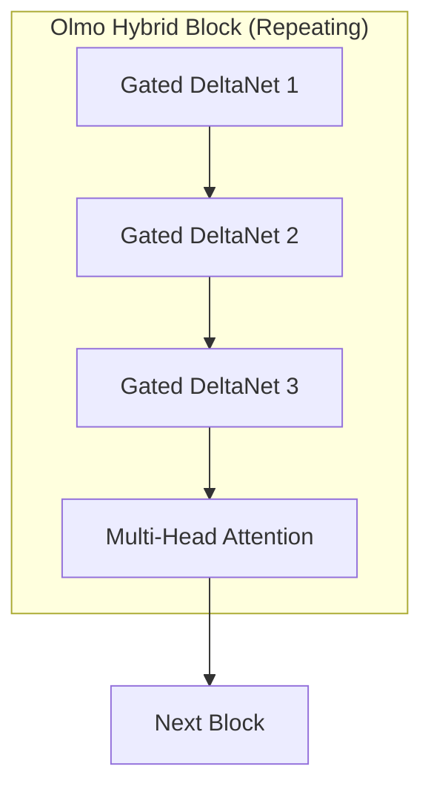

## Why a Hybrid Architecture

In March 2026, AI2 (Allen Institute for AI) unveiled Olmo Hybrid. This 7B-parameter model adopts a hybrid architecture that combines Transformer Attention layers with Linear RNN (Gated DeltaNet) layers.

The headline result is clear: <strong>on MMLU, Olmo Hybrid matches the accuracy of Olmo 3 while using 49% fewer tokens</strong>. That effectively translates to 2x data efficiency. It means the cost and time required for model training could be cut in half.

In this article, we analyze Olmo Hybrid's architectural design, benchmark results, theoretical foundations, and practical implications from an EM/CTO perspective.

## Architecture: The 3:1 DeltaNet-Attention Pattern

The core of Olmo Hybrid is its 3:1 pattern. Throughout the network, every three Gated DeltaNet sublayers are followed by one Multi-Head Attention sublayer in a repeating cycle.

- <strong>Gated DeltaNet (75%)</strong>: Specialized for state tracking. Linear complexity.
- <strong>Multi-Head Attention (25%)</strong>: Specialized for precise information recall.

## Benchmarks: Efficiency in Numbers

### Data Efficiency

| Benchmark | Token Reduction vs. Olmo 3 | Significance |
|---------|----------------------|------|
| MMLU | 49% reduction | Approximately 2x data efficiency |
| Common Crawl evaluation | 35% reduction | Efficient even on general text |

### Long-Context Processing

| Evaluation | Olmo Hybrid (DRoPE) | Olmo 3 |
|------|---------------------|--------|
| RULER 64K tokens | 85.0 | 70.9 |

### Training Throughput
There is no penalty in training speed. The efficiency gains come from the architecture itself.

## Training Infrastructure and Scale

- 7B parameters, pretrained on 6 trillion tokens
- 512 GPUs (NVIDIA H100 → HGX B200 migration)
- One of the first cases of B200-based training

## Theoretical Background: Why Hybrids Are Stronger

### Expressivity Analysis
- The hybrid model is more expressive than a Transformer alone
- The strengths of both architectures combine for a greater-than-the-sum-of-its-parts effect

### Scaling Laws
Efficiency gains increase with scale:

| Parameter Scale | Token Savings Multiplier |
|-------------|-------------|
| 1B | 〜1.3x |
| 7B | 〜1.5x |
| 70B (projected) | 〜1.9x |

## Fully Open Release
Models at every stage (Base, SFT, DPO), all weights, intermediate checkpoints, full training code, and the technical report are publicly available.

## Implications from an EM/CTO Perspective

1. Train higher-performing models on the same budget
2. Performance improvements at 64K tokens → expanded long-context use cases
3. Potential for 50% reduction in training costs
4. Maturation of the open-source ecosystem

## Looking Ahead
1. The era of pure Transformers is drawing to a close
2. Scaling laws favor hybrid architectures
3. Open-source models are becoming increasingly competitive

## References
- [AI2 Official Blog](https://allenai.org/blog/olmohybrid)
- [Technical Report](https://allenai.org/papers/olmo-hybrid)
- [Hugging Face Model](https://huggingface.co/allenai/Olmo-Hybrid-7B)
- [Lambda Training Case Study](https://lambda.ai/blog/open-model-open-metrics-how-lambda-and-the-olmo-team-trained-olmo-hybrid)
