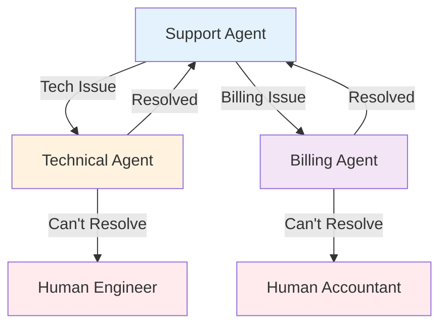

> <strong>Series: Mastering OpenAI AgentKit</strong> (1/2)
>
> 1. <strong>OpenAI AgentKit Complete Guide Part 1: Core Concepts and Getting Started</strong> ← Current article
> 2. [OpenAI AgentKit Complete Guide Part 2: Advanced Patterns and Real-World Applications](/en/blog/en/openai-agentkit-tutorial-part2)

On October 6, 2025, at OpenAI DevDay in San Francisco, Sam Altman announced something that reshapes how developers build. He called it <strong>AgentKit</strong>.

"Everything you need to build, deploy, and optimize agent workflows from prototype to production with way less friction." That one line from Altman tells you the ambition. This is not another API update. It is <strong>a new paradigm where AI sits at the center of your workflow</strong>.

I'll take the core concepts one at a time, then we write the first agent by hand. Every code block here is meant to actually run.

## Key Takeaways (TL;DR)

- 🎯 <strong>AgentKit = AI Workflow Platform</strong>: Competes with Zapier/n8n, but with AI reasoning at the core
- 🧩 <strong>4 Core Components</strong>: Agent Builder (visual), ChatKit (UI), Connector Registry (tools), Evals (performance)
- 🐍 <strong>Python SDK Included</strong>: Code-first development with `openai-agents` package
- 🔌 <strong>Native MCP Support</strong>: "USB-C for AI apps" standardizing tool integration
- 📊 <strong>Beta Status</strong>: Agent Builder currently in beta, billing starts November 1, 2025
- 💡 <strong>When to Use</strong>: AI-centric workflows, multi-agent collaboration, complex decision automation

## What is AgentKit?

### OpenAI's Strategic Shift

OpenAI is no longer just an "API provider." Through AgentKit, they're evolving into a <strong>platform company</strong>.

While traditional workflow automation tools (Zapier, n8n, Make) focused on <strong>"connecting APIs"</strong>, AgentKit creates <strong>"workflows where AI reasons and orchestrates"</strong>.


```mermaid
graph TB
    subgraph "Traditional Automation (Zapier/n8n)"
        A1[Event Trigger] --> A2[Simple Conditionals]
        A2 --> A3[API Call]
        A3 --> A4[Store Result]
    end

    subgraph "AI-Centric Automation (AgentKit)"
        B1[Natural Language Request] --> B2[AI Reasoning & Planning]
        B2 --> B3[Multi-Agent Collaboration]
        B3 --> B4[Dynamic Tool Selection]
        B4 --> B5[Guardrail Validation]
        B5 --> B6[Learning & Optimization]
    end

    style A2 fill:#e3f2fd
    style B2 fill:#fff3e0
    style B3 fill:#fff3e0
```

<strong>Core Difference</strong>:

- Traditional tools: Pre-defined <strong>rule-based flows</strong>
- AgentKit: AI <strong>understands context and decides</strong> in agentic flows

### 4 Core Components

AgentKit consists of four integrated systems:

#### 1️⃣ Agent Builder (Beta)

<strong>"Figma for AI Workflows"</strong>

- Drag-and-drop visual canvas
- No-code/low-code multi-agent system design
- Inline preview and testing
- Built-in versioning
- Sticky notes for team collaboration

<strong>When to Use</strong>:

- Collaborating with non-developers
- Visualizing complex workflows
- Rapid prototyping

#### 2️⃣ ChatKit

<strong>"Embeddable ChatGPT UI"</strong>

- Chat interface ready to drop into your app
- File upload support (1 GB free monthly)
- Integrates with Agent Builder workflows
- White-label customization

<strong>When to Use</strong>:

- Adding AI chat to SaaS products
- Building customer support bots
- Adding AI interface to internal tools

#### 3️⃣ Connector Registry

<strong>"Toolbox for Agents"</strong>

- Centralized tool and data management
- Model Context Protocol (MCP) server support
- Admin permission controls
- Secure tool integration

<strong>When to Use</strong>:

- Enterprise tool access control
- Adding custom tools via MCP servers
- Securely connecting external APIs

#### 4️⃣ Evals (Evaluation System)

<strong>"Agent Performance Dashboard"</strong>

- Trace grading (execution log evaluation)
- Dataset management
- Automated prompt optimization
- Real-time debugging

<strong>When to Use</strong>:

- Measuring agent performance
- Prompt A/B testing
- Production monitoring
- Cost optimization

## Core Concepts: Agents, Handoffs, Guardrails

To understand AgentKit's philosophy, you need to know three core principles:

### 1. Agents

<strong>Definition</strong>: LLMs with specific roles and tools

```python
from agents import Agent

agent = Agent(
    name="Customer Support Agent",
    instructions="""
    You are a customer support specialist for a SaaS company.
    Your role:
    - Answer product questions
    - Troubleshoot technical issues
    - Escalate to human if needed
    """,
    tools=[search_knowledge_base, create_ticket]
)
```

<strong>Core</strong>: Agents aren't just prompts. They're <strong>autonomous actors with roles, tools, and constraints</strong>.

### 2. Handoffs

<strong>Definition</strong>: Task delegation between agents

```python
from agents import Agent

support_agent = Agent(
    name="Support Agent",
    instructions="Handle basic inquiries",
    handoffs=["Technical Agent", "Billing Agent"]
)

technical_agent = Agent(
    name="Technical Agent",
    instructions="Resolve technical issues",
    handoffs=["Support Agent"]  # Can hand back
)
```

<strong>Usage Patterns</strong>:

- <strong>Hierarchical delegation</strong>: Manager → Specialist
- <strong>Peer collaboration</strong>: Agent-to-agent cooperation
- <strong>Escalation</strong>: AI → Human


```mermaid
graph TD
    A[Support Agent] -->|"Tech Issue"| B[Technical Agent]
    A -->|"Billing Issue"| C[Billing Agent]
    B -->|"Can't Resolve"| D[Human Engineer]
    C -->|"Can't Resolve"| E[Human Accountant]
    B -->|"Resolved"| A
    C -->|"Resolved"| A

    style A fill:#e3f2fd
    style B fill:#fff3e0
    style C fill:#f3e5f5
    style D fill:#ffebee
    style E fill:#ffebee
```

### 3. Guardrails

<strong>Definition</strong>: Input/output validation and safety mechanisms

```python
from agents import Agent, guardrails

agent = Agent(
    name="Content Generator",
    instructions="Generate marketing content",
    input_guardrails=[
        guardrails.no_pii,           # Block PII
        guardrails.content_filter    # Filter harmful content
    ],
    output_guardrails=[
        guardrails.brand_voice_check, # Verify brand tone
        guardrails.factual_accuracy   # Fact-check
    ]
)
```

<strong>Why Critical?</strong>:

- Ensures <strong>safety</strong> in production
- Prevents <strong>cost runaway</strong> (infinite loops, unnecessary API calls)
- <strong>Brand protection</strong> (blocks inappropriate responses)
- <strong>Compliance</strong> (regulatory adherence)

## Building Your First Agent: Step-by-Step Tutorial

### Prerequisites

#### 1. OpenAI Account and API Key

```bash
# 1. Sign up at https://platform.openai.com
# 2. Generate key in API Keys menu
# 3. Set as environment variable
export OPENAI_API_KEY=sk-proj-...
```

#### 2. Install Python SDK

```bash
# Requires Python 3.8+
pip install openai-agents
```

#### 3. Verify Installation

```python
from agents import Agent, Runner

print("✓ OpenAI Agents SDK installed")
```

### Tutorial 1: Simple Weather Agent

<strong>Goal</strong>: Build an agent that provides weather information for cities

#### Step 1: Define a Tool

```python
from agents.tools import function_tool

@function_tool
def get_weather(location: str) -> str:
    """
    Get current weather information for a location.

    Args:
        location: City name (e.g., "Seoul", "Tokyo")

    Returns:
        Weather description with temperature
    """
    # In production, call API (e.g., OpenWeatherMap)
    # Here we simulate
    weather_data = {
        "Seoul": "Clear, 22°C",
        "Tokyo": "Cloudy, 18°C",
        "New York": "Rainy, 15°C"
    }

    return weather_data.get(
        location,
        f"Weather information not found for {location}"
    )
```

<strong>Core</strong>: The `@function_tool` decorator converts a function into a tool the agent can use. The docstring teaches the agent how to use the tool.

#### Step 2: Create Agent

```python
from agents import Agent

weather_agent = Agent(
    name="Weather Assistant",
    instructions="""
    You are a helpful weather assistant.
    When users ask about weather, use the get_weather tool.
    Provide friendly, conversational responses.
    If a city isn't found, suggest nearby alternatives.
    """,
    tools=[get_weather]
)
```

#### Step 3: Run Agent

```python
from agents import Runner

# Synchronous execution
result = Runner.run_sync(
    weather_agent,
    "What's the weather in Seoul?"
)

print(result.final_output)
# Output: "The current weather in Seoul is clear with a temperature of 22°C!"
```

<strong>Async Execution</strong> (for production):

```python
import asyncio

async def main():
    result = await Runner.run(
        weather_agent,
        "What's the weather in Tokyo?"
    )
    print(result.final_output)

asyncio.run(main())
```

### Tutorial 2: Multi-Agent Customer Support System

<strong>Goal</strong>: Classify questions and route to appropriate specialist agents

#### Step 1: Define Specialist Agents

```python
from agents import Agent

# Technical support agent
technical_agent = Agent(
    name="Technical Support",
    instructions="""
    You are a technical support specialist.
    Help users with:
    - Login issues
    - API errors
    - Performance problems

    If the issue is urgent, handoff to Human Engineer.
    """,
    handoffs=["Triage Agent"]  # Can hand back
)

# Billing support agent
billing_agent = Agent(
    name="Billing Support",
    instructions="""
    You are a billing specialist.
    Help users with:
    - Payment issues
    - Subscription changes
    - Refund requests

    Always verify user identity before discussing billing.
    """,
    handoffs=["Triage Agent"]
)

# Product information agent
product_agent = Agent(
    name="Product Expert",
    instructions="""
    You are a product expert.
    Answer questions about:
    - Features and capabilities
    - Best practices
    - Use cases and examples

    Provide detailed, educational responses.
    """,
    handoffs=["Triage Agent"]
)
```

#### Step 2: Triage Agent

```python
triage_agent = Agent(
    name="Triage Agent",
    instructions="""
    You are the first point of contact for customer support.

    Your job:
    1. Greet the user warmly
    2. Understand their issue
    3. Route to the appropriate specialist:
       - Technical Support: login, errors, bugs
       - Billing Support: payments, subscriptions
       - Product Expert: features, how-to questions

    If unsure, ask clarifying questions.
    """,
    handoffs=["Technical Support", "Billing Support", "Product Expert"]
)
```

#### Step 3: Execute and Test

```python
# Test 1: Technical issue
result = Runner.run_sync(
    triage_agent,
    "I'm getting a 401 error when calling the API"
)
print(result.final_output)
# → Hands off to Technical Support agent

# Test 2: Billing issue
result = Runner.run_sync(
    triage_agent,
    "I was charged twice this month"
)
print(result.final_output)
# → Hands off to Billing Support agent

# Test 3: Product question
result = Runner.run_sync(
    triage_agent,
    "How do I integrate webhooks?"
)
print(result.final_output)
# → Hands off to Product Expert agent
```

#### Step 4: Manage Conversation History with Sessions

```python
from agents import Runner, Session

# Start new session
session = Session()

# Multi-turn conversation
turns = [
    "I need help with my account",
    "I can't log in",
    "It says invalid password",
    "Yes, I tried resetting it"
]

for user_message in turns:
    result = Runner.run_sync(
        triage_agent,
        user_message,
        session=session  # Pass session to maintain history
    )
    print(f"User: {user_message}")
    print(f"Agent: {result.final_output}\n")
```

<strong>Why Sessions Matter</strong>:

- Maintain conversation context (remember previous questions)
- Preserve history after handoffs
- In production, save sessions to database

## Agent Builder: Visual Development

Don't like code? Use Agent Builder's visual canvas.

### Accessing Agent Builder

1. Visit <https://platform.openai.com/agent-builder>
2. Log in with OpenAI account
3. Click "New Agent"

### Canvas UI Layout

```
┌────────────────────────────────────────────────┐
│  [New] [Save] [Deploy] [Preview]               │  ← Toolbar
├────────────────────────────────────────────────┤
│                                                │
│   ┌─────┐      ┌─────┐      ┌─────┐          │
│   │Agent│─────▶│Tool │─────▶│Agent│          │  ← Node-based workflow
│   │  A  │      │  X  │      │  B  │          │
│   └─────┘      └─────┘      └─────┘          │
│      │                          │             │
│      └──────┬──────────────────┘             │
│             ▼                                 │
│         ┌─────┐                               │
│         │Guard│                               │  ← Guardrails
│         │rail │                               │
│         └─────┘                               │
│                                                │
│  [Properties Panel] ─────────────────────────▶│  ← Settings panel
│  Name: Agent A                                │
│  Instructions: [Text input]                   │
│  Tools: [Select]                              │
│  Handoffs: [Select]                           │
└────────────────────────────────────────────────┘
```

### Creating Multi-Agent Visually

<strong>Scenario</strong>: Content generation workflow

1. <strong>Drag "Agent" node</strong> → "Content Planner"

   - Instructions: "Create content outlines based on topics"

2. <strong>Drag "Agent" node</strong> → "Content Writer"

   - Instructions: "Write blog posts from outlines"
   - Connect: Planner → Writer

3. <strong>Drag "Agent" node</strong> → "SEO Optimizer"

   - Instructions: "Optimize content for SEO"
   - Connect: Writer → SEO Optimizer

4. <strong>Drag "Guardrail" node</strong> → "Quality Check"

   - Type: Output Validation
   - Rules: Minimum 500 words, no plagiarism
   - Connect: SEO Optimizer → Quality Check

5. <strong>Click "Preview"</strong> → Test run

6. <strong>Click "Deploy"</strong> → Production deployment

### Visual vs Code: When to Use What?

| Criteria              | Agent Builder (Visual)         | Python SDK (Code)             |
| --------------------- | ------------------------------ | ----------------------------- |
| <strong>Learning Curve</strong>    | Low (intuitive)                | Medium (requires programming) |
| <strong>Flexibility</strong>       | Limited                        | Unlimited                     |
| <strong>Collaboration</strong>     | Excellent (includes non-devs)  | Fair (developer-centric)      |
| <strong>Version Control</strong>   | Built-in UI                    | Git integration               |
| <strong>Debugging</strong>         | Visual traces                  | Code-level debugging          |
| <strong>Production Deploy</strong> | One-click                      | CI/CD pipeline                |
| <strong>Recommended Use</strong>   | Prototypes, business workflows | Enterprise, complex logic     |

<strong>Best Practice</strong>: Prototype with visual → Productionize with code

## Model Context Protocol (MCP) Integration

### What is MCP?

<strong>"USB-C for AI Apps"</strong> - Connect tools and data sources in a standardized way

Traditional approach:

```
Agent ─┬─ Custom API 1 (custom code)
       ├─ Custom API 2 (another custom code)
       └─ Custom API 3 (yet another...)
```

MCP approach:

```
Agent ─── MCP Protocol ─┬─ MCP Server 1 (standardized)
                        ├─ MCP Server 2 (standardized)
                        └─ MCP Server 3 (standardized)
```

### Using MCP in AgentKit

#### 1. Add MCP Server

```python
from agents import Agent
from agents.mcp import MCPServer

# Connect MCP server
notion_server = MCPServer(
    url="http://localhost:3000/mcp/notion",
    capabilities=["read_database", "create_page"]
)

# Attach MCP server to agent
agent = Agent(
    name="Notion Assistant",
    instructions="Help users manage Notion databases",
    mcp_servers=[notion_server]
)
```

#### 2. Manage via Connector Registry

```python
from agents import ConnectorRegistry

# Register organization's MCP servers
registry = ConnectorRegistry()

registry.add_server(
    name="Company Notion",
    mcp_url="http://internal.mcp/notion",
    permissions=["read", "write"],
    allowed_teams=["marketing", "product"]
)

# Use registry in agent
agent = Agent(
    name="Marketing Agent",
    connector_registry=registry
)
```

<strong>Benefits</strong>:

- Tool reuse (same MCP server across agents)
- Centralized permission management
- Standardized error handling

### MCP Ecosystem

<strong>Major MCP Servers</strong>:

- Notion MCP
- Google Drive MCP
- Slack MCP
- GitHub MCP
- PostgreSQL MCP

<strong>Build Your Own</strong>: <https://modelcontextprotocol.io/docs>

## Deep Dive into Guardrails

### Why Are Guardrails Essential?

<strong>Real Production Incidents</strong>:

- Chatbot exposed customer PII
- Infinite loop caused $10,000 API bill
- Generated brand guideline violations
- Produced harmful content

<strong>Guardrails' Role</strong>: Prevent these incidents proactively

### Input Guardrails

<strong>Validate user input</strong>

```python
from agents import Agent, guardrails

agent = Agent(
    name="Customer Support",
    instructions="...",
    input_guardrails=[
        guardrails.no_pii(          # Block PII
            block_email=True,
            block_ssn=True,
            block_credit_card=True
        ),
        guardrails.content_filter(  # Filter harmful content
            hate_speech=True,
            harassment=True,
            self_harm=True
        ),
        guardrails.language_check(  # Check supported languages
            allowed_languages=["ko", "en", "ja"]
        )
    ]
)
```

<strong>Flow</strong>:

1. User input arrives
2. Guardrails execute sequentially
3. Block → Never reaches agent
4. Pass → Agent processes

### Output Guardrails

<strong>Validate agent response</strong>

```python
agent = Agent(
    name="Content Generator",
    instructions="...",
    output_guardrails=[
        guardrails.brand_voice(        # Verify brand tone
            tone="professional",
            avoid_words=["cheap", "worst", "scam"]
        ),
        guardrails.fact_check(          # Fact-check
            verify_statistics=True,
            verify_quotes=True
        ),
        guardrails.length_limit(        # Length constraint
            min_words=100,
            max_words=500
        ),
        guardrails.no_hallucination(    # Prevent hallucination
            require_citations=True
        )
    ]
)
```

<strong>Flow</strong>:

1. Agent generates response
2. Guardrails validate sequentially
3. Fail → Regenerate or return error
4. Pass → Send to user

### Creating Custom Guardrails

```python
from agents.guardrails import Guardrail

class CustomProfanityFilter(Guardrail):
    def __init__(self, banned_words: list[str]):
        self.banned_words = banned_words

    def validate(self, text: str) -> tuple[bool, str]:
        """
        Returns (is_valid, error_message)
        """
        for word in self.banned_words:
            if word.lower() in text.lower():
                return False, f"Contains banned word: {word}"
        return True, ""

# Usage
agent = Agent(
    name="Family-Friendly Bot",
    output_guardrails=[
        CustomProfanityFilter(
            banned_words=["profanity1", "profanity2", "banned"]
        )
    ]
)
```

### Guardrail Best Practices

1. <strong>Protect Input and Output</strong>: Bidirectional defense
2. <strong>Hierarchical Guardrails</strong>: Fast checks first, expensive checks later
3. <strong>Clear Error Messages</strong>: Tell users why blocked
4. <strong>Logging</strong>: Track guardrail blocks for improvement
5. <strong>Testing</strong>: Test guardrails with adversarial inputs

## Session and Conversation History Management

### Why Sessions Matter

For <strong>multi-turn conversations</strong> with agents, you need to remember previous context.

```python
# Without session (no context)
result1 = Runner.run_sync(agent, "My name is John")
result2 = Runner.run_sync(agent, "What's my name?")
# Answer: "I don't know your name"  ← Can't remember previous conversation

# With session (maintains context)
session = Session()
result1 = Runner.run_sync(agent, "My name is John", session=session)
result2 = Runner.run_sync(agent, "What's my name?", session=session)
# Answer: "Your name is John"  ← Remembers previous conversation
```

### Session Persistence

```python
from agents import Session
import json

# Create and use session
session = Session(user_id="user_123")
result = Runner.run_sync(agent, "Hello!", session=session)

# Save session as JSON
session_data = session.to_dict()
with open("session_user_123.json", "w") as f:
    json.dump(session_data, f)

# Restore session later
with open("session_user_123.json", "r") as f:
    session_data = json.load(f)

restored_session = Session.from_dict(session_data)
result = Runner.run_sync(agent, "What did we talk about?", session=restored_session)
```

<strong>Production Environment</strong>: Save sessions in Redis or PostgreSQL

```python
import redis

redis_client = redis.Redis(host='localhost', port=6379)

# Save session
redis_client.set(
    f"session:{user_id}",
    json.dumps(session.to_dict()),
    ex=3600  # Expire after 1 hour
)

# Load session
session_data = redis_client.get(f"session:{user_id}")
session = Session.from_dict(json.loads(session_data))
```

## Cost Optimization Strategies

AgentKit is powerful, but costs can escalate if used incorrectly.

### 1. Choose Appropriate Models

```python
# ❌ Inefficient: Use GPT-5 Pro for everything
expensive_agent = Agent(
    name="Simple Bot",
    model="gpt-5-pro",  # Very expensive
    instructions="Answer yes or no"
)

# ✅ Efficient: Match model to task
cheap_agent = Agent(
    name="Simple Bot",
    model="gpt-realtime-mini",  # Cheap and fast
    instructions="Answer yes or no"
)
```

<strong>Model Selection Guide</strong>:

- Simple classification/routing: `gpt-realtime-mini`
- General tasks: `gpt-4o`
- Complex reasoning: `gpt-5-pro`

### 2. Optimize Prompts

```python
# ❌ Inefficient: Long prompt
agent = Agent(
    instructions="""
    You are an extremely helpful, friendly, and knowledgeable assistant
    who loves to help users with all their questions and concerns.
    You always provide detailed, comprehensive answers that cover
    every possible angle and consideration...
    [500 words of unnecessary instructions]
    """
)

# ✅ Efficient: Concise prompt
agent = Agent(
    instructions="Answer user questions clearly and concisely."
)
```

<strong>Tokens = Cost</strong>: Shorter prompts = cheaper

### 3. Prevent Infinite Loops with Guardrails

```python
from agents import guardrails

agent = Agent(
    name="Research Agent",
    instructions="...",
    output_guardrails=[
        guardrails.max_iterations(5),      # Max 5 iterations
        guardrails.max_tool_calls(10),     # Max 10 tool calls
        guardrails.timeout_seconds(30)     # 30-second limit
    ]
)
```

### 4. Leverage Caching

```python
from agents import Agent, caching

agent = Agent(
    name="Product Expert",
    instructions="...",
    enable_caching=True  # Cache repeated questions
)

# First call: Full cost
result1 = Runner.run_sync(agent, "What is AgentKit?")

# Second call: Cached (free)
result2 = Runner.run_sync(agent, "What is AgentKit?")
```

### 5. Monitor with Evals

```python
from agents import Evals

evals = Evals()

# Set cost alerts
evals.set_alert(
    metric="cost_per_day",
    threshold=100.00,  # Alert if exceeds $100/day
    action="email"
)

# Detect anomalous patterns
evals.monitor(
    agent_name="Customer Support",
    anomaly_detection=True  # Detect sudden cost spikes
)
```

## Production Deployment Checklist

### Pre-Deployment Verification

#### ✅ Functionality Testing

- [ ] Test all handoff paths
- [ ] Verify edge case handling
- [ ] Validate error handling
- [ ] Test timeout scenarios

#### ✅ Safety

- [ ] Configure input guardrails
- [ ] Configure output guardrails
- [ ] Verify PII protection
- [ ] Compliance review (GDPR, CCPA, etc.)

#### ✅ Performance

- [ ] Measure response time (<3s target)
- [ ] Estimate costs (based on expected traffic)
- [ ] Load test concurrent requests
- [ ] Define caching strategy

#### ✅ Monitoring

- [ ] Set up Evals dashboard
- [ ] Define alert rules
- [ ] Build logging infrastructure
- [ ] Error tracking (Sentry, etc.)

#### ✅ Documentation

- [ ] Document agent behavior
- [ ] Create team onboarding guide
- [ ] API documentation (if using ChatKit)
- [ ] Incident response playbook

### Deployment Methods

#### Deploy from Agent Builder

1. Click "Deploy" in Agent Builder
2. Select deployment environment (Staging / Production)
3. Enter version tag (e.g., `v1.0.0`)
4. Click "Confirm Deploy"
5. Receive Webhook URL (for ChatKit integration)

#### Deploy with Python SDK

```python
# deploy.py
from agents import Agent, deploy

agent = Agent(
    name="Production Agent",
    instructions="..."
)

# Deploy to OpenAI Platform
deployment = deploy(
    agent=agent,
    environment="production",
    version="1.0.0"
)

print(f"Deployed at: {deployment.url}")
```

<strong>CI/CD Integration</strong>:

```yaml
# .github/workflows/deploy.yml
name: Deploy Agent
on:
  push:
    branches: [main]

jobs:
  deploy:
    runs-on: ubuntu-latest
    steps:
      - uses: actions/checkout@v2
      - name: Deploy to OpenAI
        run: |
          pip install openai-agents
          python deploy.py
        env:
          OPENAI_API_KEY: ${{ secrets.OPENAI_API_KEY }}
```

## Real-World Use Cases

### Case 1: Customer Support Automation (Clay)

<strong>Result</strong>: 10x growth

<strong>Implementation</strong>:

```python
support_system = Agent(
    name="Support Triage",
    instructions="Classify and route customer inquiries",
    handoffs=[
        "Tier 1 Support",   # General questions
        "Tier 2 Support",   # Technical issues
        "Sales Team",       # Sales inquiries
        "Human Agent"       # Complex cases
    ]
)
```

<strong>Outcomes</strong>:

- 80% auto-resolution rate
- Average response time: 5min → 30sec
- Customer satisfaction +15%

### Case 2: Content Generation Pipeline

<strong>Implementation</strong>:

```python
content_planner = Agent(
    name="Content Planner",
    instructions="Create SEO-optimized content outlines"
)

content_writer = Agent(
    name="Writer",
    instructions="Write engaging blog posts from outlines"
)

seo_optimizer = Agent(
    name="SEO Optimizer",
    instructions="Optimize for search engines"
)

# Workflow
result = Runner.run_sync(
    content_planner,
    "Create content about AgentKit tutorial",
    handoff_chain=[content_writer, seo_optimizer]
)
```

<strong>Outcomes</strong>:

- Content production speed 5x
- SEO score average 85+ maintained
- Writer burnout reduced

### Case 3: Research Assistant System

<strong>Implementation</strong>:

```python
@function_tool
def search_papers(query: str) -> list:
    """Search academic papers"""
    # Call arXiv, PubMed APIs
    pass

@function_tool
def extract_key_findings(paper_url: str) -> str:
    """Extract key findings from a paper"""
    pass

research_agent = Agent(
    name="Research Assistant",
    instructions="""
    Help researchers by:
    1. Finding relevant papers
    2. Extracting key findings
    3. Synthesizing information
    4. Suggesting future research directions
    """,
    tools=[search_papers, extract_key_findings]
)
```

<strong>Outcomes</strong>:

- Literature review time reduced 70%
- Broader research coverage
- Discovered missed important papers

## When to Use AgentKit, and When to Avoid It

AgentKit is not the right answer for every situation. Weigh these criteria before you commit.

### Good fits

- <strong>Teams already standardized on OpenAI models</strong>: If GPT-family models are your default and you want tracing, Evals, and guardrails inside one ecosystem, friction is lowest here.
- <strong>Workflows that need multi-agent routing</strong>: Handoffs are first-class citizens in the SDK, so the triage-to-specialist pattern takes far less code than rolling it yourself.
- <strong>Prototyping alongside non-developers</strong>: Agent Builder's visual canvas lets a PM or domain expert see and edit the flow directly.
- <strong>Connecting MCP tools in a standard way</strong>: The Connector Registry and native MCP support keep tool integration consistent. For building your own MCP server end to end, see [Building a Python MCP Server with FastMCP](/en/blog/en/fastmcp-python-mcp-server-build-guide-2026).

### Cases to avoid or approach carefully

- <strong>Non-OpenAI models at the core</strong>: If Anthropic, Google, or open-weight models are your primary engine, vendor lock-in is a real cost. A model-neutral framework is safer. If tool-call design is the crux, compare [The Complete Guide to Claude Agent SDK Tool Use](/en/blog/en/claude-agent-sdk-tool-use-complete-guide-2026); if type safety matters most, weigh [Pydantic AI Type-Safe Agent Tutorial](/en/blog/en/pydantic-ai-type-safe-agent-tutorial-2026).
- <strong>Simple single-call tasks</strong>: One classification or one summary makes the agent abstraction overkill. A direct Chat Completions call is cheaper and faster.
- <strong>High-traffic work under a hard cost ceiling</strong>: Agent loops have hard-to-predict token consumption. Even with guardrails capping iterations, validate cost with load tests up front.
- <strong>Production that can't absorb beta instability</strong>: Agent Builder is in beta and its API surface may shift. For systems under long-term contracts, keep it off the critical path until GA.

<strong>One-line takeaway</strong>: OpenAI-centric plus multi-agent plus fast iteration plays to its strengths; multi-vendor plus simple calls plus strict cost control means you should look at other options first.

## What Part 1 Covered, and What's Next

If you made it here, the three pillars — agents, handoffs, guardrails — plus your first running agent should feel familiar now. The rest is where real projects diverge.

<strong>Coming Next</strong>: [OpenAI AgentKit Complete Guide Part 2: Advanced Patterns and Real-World Applications](/en/blog/en/openai-agentkit-tutorial-part2) will cover:

- 🏗️ <strong>Production Architecture Patterns</strong>: Designing enterprise-grade multi-agent systems
- 🔧 <strong>Advanced Tool Integration</strong>: Building your own MCP servers, external API integration
- 📊 <strong>Performance Optimization</strong>: A/B testing and prompt optimization with Evals
- 🛡️ <strong>Security and Compliance</strong>: Production safety mechanisms
- 💼 <strong>Complete Case Studies</strong>: Three industry-specific full implementations

## Additional Resources

### Official Documentation (Primary Sources)

- OpenAI Agents SDK official docs: <https://openai.github.io/openai-agents-python/>
- OpenAI API developer docs (Platform): <https://platform.openai.com/docs>
- OpenAI Developers portal - Agents guide: <https://developers.openai.com/learn/agents>
- OpenAI Agents SDK GitHub repository: <https://github.com/openai/openai-agents-python>
- Model Context Protocol official docs: <https://modelcontextprotocol.io/>

### Community

- OpenAI Developer Forum: <https://community.openai.com/>
- AgentKit GitHub: <https://github.com/openai/openai-agents-python>
- Reddit: r/OpenAI

### Tutorial Videos

- OpenAI DevDay 2025 Keynote (YouTube)
- AgentKit Deep Dive (Official Channel)

---

<strong>Part 2 picks up from here.</strong> We'll dig deeper with real-world examples.

_Have questions or feedback? Leave a comment below. I reply to all comments!_
