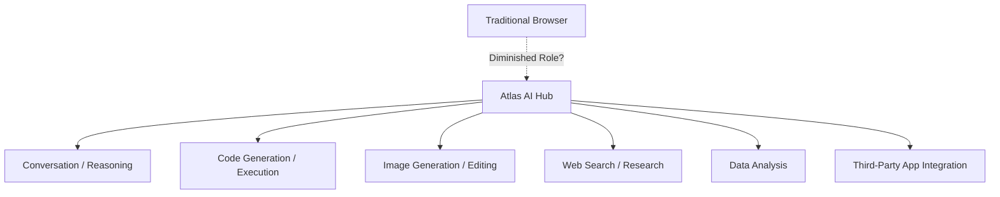
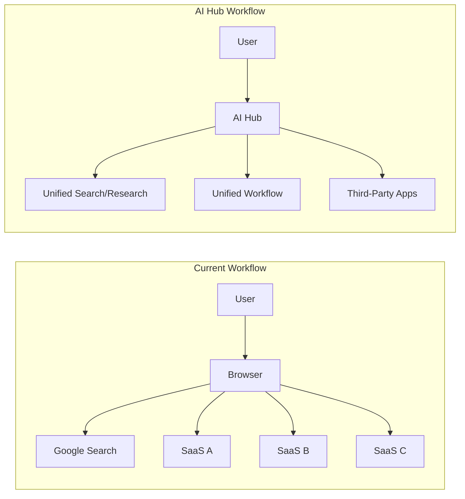

## Overview

News that OpenAI is developing a unified AI app hub codenamed <strong>Atlas</strong> has sparked intense discussion across the tech industry. The core question that analysts like Dan Shipper are asking is this — <strong>Will AI-native platforms fundamentally change the role of web browsers?</strong>

This article analyzes the Atlas concept, the context behind the emergence of AI app hubs, and the potential changes browsers may face.

## What Is Atlas?

OpenAI's Atlas is not simply an extension of ChatGPT. Its core vision is to bundle previously scattered AI capabilities — conversation, code generation, image creation, data analysis, and web search — into <strong>one unified platform</strong>.

Key features include:

- <strong>Multimodal integration</strong>: Process text, images, code, and data in a single interface
- <strong>App ecosystem</strong>: A full-fledged app store going beyond GPTs and plugins
- <strong>Context continuity</strong>: Unified workflows where context persists across tasks
- <strong>Agent-based</strong>: Understands user intent and automatically invokes the right tools

## Why an AI App Hub Now?

### 1. Browser Limitations Are Showing

Web browsers originated as <strong>document viewers</strong> designed in the 1990s. While they've evolved with tabs, bookmarks, and extensions, the fundamental paradigm hasn't changed.

| Aspect | Browser Paradigm | AI Hub Paradigm |
|--------|------------------|-----------------|
| Interaction | Enter URL → Render page | Express intent → Generate results |
| Discovery | Manual navigation | Automated information gathering |
| App integration | Manual tab switching | Unified workflow |
| Data utilization | Siloed per site | Cross-app context sharing |

### 2. The Age of AI Agents

2025–2026 marks the era when AI agents become truly practical. Claude's Computer Use, OpenAI's Operator, and Google's Mariner demonstrate <strong>AI directly operating computers</strong>.

In this environment, the act of opening a browser, searching manually, and switching between multiple sites feels increasingly inefficient.

### 3. The AI Version of Super Apps

In Asia, <strong>super apps</strong> like WeChat, LINE, and KakaoTalk have already partially replaced the browser's role. Atlas can be seen as an AI-native reinterpretation of this super app model.

## Is the Browser Really Being Demoted?

The short answer: <strong>not full replacement, but a shift in roles is inevitable</strong>.

### Where Browsers Remain Strong

- <strong>The open web</strong>: Uncensored, free access to information
- <strong>Standards-based ecosystem</strong>: The universal standards of HTML/CSS/JS
- <strong>Developer tools</strong>: Essential tools for web development and debugging
- <strong>Privacy</strong>: Resistance to entrusting all data to an AI hub

### Where AI Hubs Will Encroach

- <strong>Information search</strong>: Google search traffic is already declining due to AI answers
- <strong>Content consumption</strong>: New consumption patterns combining summarization, translation, and analysis
- <strong>Work automation</strong>: Consolidating tasks that used to require switching between multiple SaaS tools
- <strong>App discovery</strong>: Finding and using AI-based tools like an app store

## Implications for Developers

### 1. Rethinking Platform Strategy

If you build web-based SaaS, you need a strategy that also addresses AI hub platforms. Standards like MCP (Model Context Protocol) are already establishing themselves as interfaces for AI tool integration.

### 2. AI-Native UX Design

Think beyond URL-and-page-based design toward <strong>intent-and-result-based</strong> UX. The standard experience will be one where users say "analyze this data" and the system selects the right tools and presents results automatically.

### 3. Data Portability

As competition between AI hubs intensifies, <strong>portability</strong> — the ability to migrate user data and workflows — becomes a key differentiator.

## Competitive Landscape

Atlas isn't OpenAI's strategy alone. Here's how the major players are moving:

| Company | Product/Strategy | Focus |
|---------|-----------------|-------|
| OpenAI | Atlas | ChatGPT-based unified hub |
| Google | Gemini + Workspace | Deep integration with existing productivity tools |
| Anthropic | Claude + MCP | Open protocol-based tool integration |
| Apple | Apple Intelligence | Device-native AI integration |
| Microsoft | Copilot | Windows + Office ecosystem integration |

## Conclusion

The emergence of AI app hubs represented by OpenAI Atlas is not <strong>the death of the browser</strong> — it's <strong>the evolution of the computing interface</strong>.

Just as smartphones didn't replace PCs but claimed the position of primary computing device, AI hubs are likely to become <strong>the starting point for everyday digital work</strong> without fully replacing browsers.

As developers, we should approach this shift with two perspectives:

1. <strong>Opportunity</strong>: The chance to build new apps and services within the AI hub ecosystem
2. <strong>Vigilance</strong>: Protecting the value of the open web and standards to avoid lock-in to any single platform

The browser isn't being demoted — its <strong>role is being redefined</strong>.

## References

- [Dan Shipper on X — OpenAI Atlas Analysis](https://x.com/danshipper/status/2021615258540879936)
- [OpenAI Official Blog](https://openai.com/blog)
- [MCP (Model Context Protocol) Specification](https://modelcontextprotocol.io)
