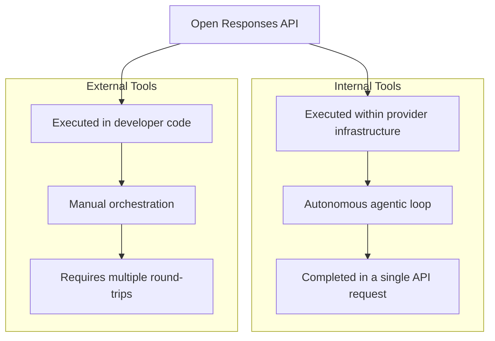
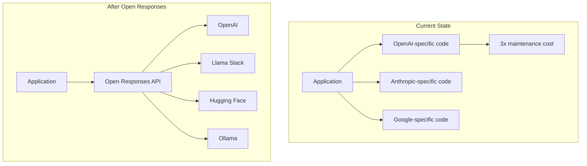

## Why Agentic AI Needs a "Standard" Right Now

As of March 2026, the agentic AI ecosystem is experiencing explosive growth. With countless frameworks competing — Anthropic's Claude Agent SDK (see [Anthropic Agent Skills Standard: Extending AI Agent Capabilities](/en/blog/en/anthropic-agent-skills-standard)), OpenAI's AgentKit, Google's Agent Development Kit, LangChain, CrewAI, and more — development teams have been given freedom of choice, but at the cost of severe fragmentation.

Each framework handles tool calling, response formats, and agent loop processing differently. Swapping models or running multiple models in parallel meant rewriting integration code from scratch every time. As one developer put it, it was a vicious cycle of <strong>"writing wrappers for wrappers for wrappers."</strong>

<strong>Open Responses</strong>, the spec OpenAI released in February 2026, takes this problem head-on. As a vendor-neutral open specification, it aims to standardize agentic AI workflows and dramatically reduce the cost of switching between providers.

## 3 Core Concepts of Open Responses

The Open Responses spec defines three core concepts.

### 1. Items — The Atomic Unit of Agent Interactions

Items are atomic units that represent model inputs, outputs, tool calls, and reasoning states. While the `messages` array in the traditional Chat Completions API only expressed text exchanges, Items represent every step of an agentic workflow in a type-safe manner.

```typescript
// Items type example
type Item =
  | { type: "message"; role: "user" | "assistant"; content: string }
  | { type: "function_call"; name: string; arguments: string; call_id: string }
  | { type: "function_call_output"; call_id: string; output: string }
  | { type: "reasoning"; content: string };  // Exposes the reasoning process
```

<strong>Key difference</strong>: The addition of `function_call`, `function_call_output`, and `reasoning` types enables structured tracking of an agent's tool usage and thought process.

### 2. Reasoning Visibility — Making Model Thinking Transparent

Open Responses exposes the model's reasoning process in a provider-controlled manner. Previously, each provider exposed reasoning in its own proprietary way (OpenAI's `reasoning_content`, Anthropic's `thinking` blocks, etc.), but Open Responses standardizes this into a unified `reasoning` Item type.

```json
{
  "type": "reasoning",
  "content": "The user requested inventory data, so I will first call the inventory API, analyze the results, and then provide a summary.",
  "provider_metadata": {
    "visibility": "full"
  }
}
```

This is critical for debugging and auditing agent decision-making processes in production environments.

### 3. Tool Execution Models — Internal vs. External Tool Execution

Open Responses clearly distinguishes two models of tool execution.



<strong>Internal Tools</strong>: Executed within the provider's infrastructure. The model autonomously repeats the cycle of reasoning, tool calling, result incorporation, and re-reasoning, returning only the final result as a single API response. This handles complex agentic workflows without multiple round-trips.

<strong>External Tools</strong>: Executed in the developer's application code. When the model requests a tool call, the developer runs it directly and passes the result back. This is suitable for security-sensitive operations or tasks that cannot be delegated to the provider.

## The Ecosystem: Already in Motion

The greatest strength of Open Responses is the broad ecosystem support it secured at launch.

| Partner | Type | Significance |
|---------|------|--------------|
| Hugging Face | Open-source hub | Standard API access for thousands of models |
| OpenRouter | Model router | Seamless switching between multiple providers |
| [Vercel](/en/blog/en/vercel-ai-sdk-claude-streaming-agent-2026) | Frontend platform | Frontend development standardization via AI SDK integration |
| LM Studio | Local inference | Same API for local models |
| Ollama | Local inference | Standardization in self-hosted environments |
| vLLM | Inference engine | Compatibility with high-performance inference servers |
| Red Hat / Llama Stack | Enterprise | Building enterprise agents on Llama models |

<strong>Notable</strong>: This list includes OpenAI's direct competitors (Hugging Face, Ollama, vLLM). This is a strong signal that Open Responses aims to be a true industry standard, not an OpenAI-exclusive spec.

## Practical Implementation Patterns

### Basic API Call

Transitioning from Chat Completions to the Responses API is straightforward.

```python
# Before: Chat Completions API
response = client.chat.completions.create(
    model="gpt-4o",
    messages=[
        {"role": "user", "content": "Analyze the current inventory status"}
    ],
    tools=[inventory_tool],
)

# After: Open Responses API
response = client.responses.create(
    model="gpt-4o",
    input="Analyze the current inventory status",
    tools=[inventory_tool],
)
# response.output_text contains the final result (after tool calls + analysis)
```

<strong>Key difference</strong>: With Chat Completions, developers had to implement a loop to manually execute tools and send results back when tool calls occurred. The Responses API handles this entire cycle automatically for internal tools.

### Tool Access Control Pattern

The tool access control pattern demonstrated in Red Hat's Llama Stack implementation is especially useful in production.

```python
# Per-state tool access control
tool_config = {
    "skip_all_tools": False,        # Disable all tools
    "skip_mcp_servers_only": False,  # Disable MCP servers only
    "allowed_tools": ["search", "calculator"],  # Allow specific tools only
}

response = client.responses.create(
    model=model,
    input=messages,
    tools=tools_to_use,
    **tool_config,
)
```

### Security: Per-Request Header Isolation

```python
# Pass per-user authentication to MCP servers
# without exposing user information to the agent itself
mcp_config = {
    "server_url": "https://api.internal/mcp",
    "headers": {
        "AUTHORITATIVE_USER_ID": current_user.id,
        "Authorization": f"Bearer {user_token}",
    }
}
```

This pattern ensures that even if the agent malfunctions, it cannot access other users' data.

## The EM/CTO Perspective: Why This Matters

### 1. Escaping Vendor Lock-In — Making Multi-Model Strategy a Reality

Many engineering teams today face the problem of "we started with GPT-4o but want to switch to Claude, and now we have to rewrite all our integration code." Open Responses fundamentally solves this problem.



<strong>Cost reduction impact</strong>: Consolidating provider-specific integration code into a single standard interface can reduce integration layer maintenance costs by 60〜80%.

### 2. Gradual Migration Strategy

Adopting Open Responses allows for gradual migration rather than a big-bang switchover.

<strong>Phase 1 (1〜2 weeks)</strong>: Apply the Responses API only to new features
- Keep existing Chat Completions code as-is
- Develop only new agentic features with the Responses API

<strong>Phase 2 (1〜2 months)</strong>: Migrate core workflows
- Sequentially migrate workflows with frequent tool calls first
- Compare performance benchmarks (round-trip count, response time)

<strong>Phase 3 (quarterly)</strong>: Enable multi-provider support
- Implement automatic provider switching logic via OpenRouter or a custom proxy
- Dynamic routing based on cost, performance, and availability

### 3. Observability and Governance

Reasoning Visibility is not just a debugging tool — it is <strong>core infrastructure for AI governance</strong>.

- <strong>Audit trails</strong>: Structurally record why an agent made a specific decision
- <strong>Regulatory compliance</strong>: Ensure transparency in AI decision-making for regulated industries like finance and healthcare
- <strong>Quality assurance</strong>: Quantitatively evaluate agent judgment quality by analyzing reasoning processes

## Chat Completions vs. Responses API Comparison

| Category | Chat Completions | Responses API |
|----------|------------------|---------------|
| Tool call handling | Developer implements loop | Automatic for internal tools |
| Reasoning visibility | Varies by provider | Standardized `reasoning` type |
| Multimodal | Requires separate configuration | Native support |
| Streaming | Text-based | Event-based streaming |
| Provider switching | Requires code rewrite | Change endpoint only |
| Agentic loop | Manual implementation | Built into framework |

<strong>OpenAI's official stance</strong>: The Chat Completions API will continue to be supported, but the Responses API is recommended for all new projects.

## Remaining Challenges and Practical Considerations

### What About Anthropic and Google?

Currently, neither Anthropic nor Google has officially joined as Open Responses spec partners. For the open-source model dominance trend and multi-provider strategy, see [OpenRouter Weekly TOP5: 4 Out of 5 Are Open Source — The End of the Proprietary Model Era](/en/blog/en/openrouter-oss-dominance). Both companies have their own agent frameworks (Claude Agent SDK, Google ADK), and it remains uncertain whether they will adopt Open Responses or push their own proprietary standards.

That said, as evidenced by the recent case where over 30 OpenAI and Anthropic employees jointly collaborated on a Department of Defense lawsuit, cooperation and competition coexist in the AI industry. If the industry's need for standardization grows, there is a reasonable chance they will join.

### Production Readiness

Open Responses is still in its early stages. While the spec documentation, schema, and conformance testing tools are available at [openresponses.org](https://openresponses.org), large-scale production validation cases remain limited. For early adopter teams, applying it to new projects first and validating stability is the most pragmatic approach.

## Conclusion: Action Items for Engineering Leaders

The emergence of the Open Responses spec signals that the agentic AI ecosystem is transitioning from a "framework proliferation era" to a "standardization era." This is an attempt to provide a common language for agentic AI workflows, much like HTTP unified the web.

What engineering leaders should do now:

1. <strong>Review the spec</strong>: Check the spec documentation at [openresponses.org](https://openresponses.org) and evaluate compatibility with your team's current agentic workflows
2. <strong>Run a pilot project</strong>: Implement one new agentic feature with the Responses API and compare development productivity against existing Chat Completions-based approaches
3. <strong>Develop a multi-provider strategy</strong>: Review architectures that minimize provider switching costs using OpenRouter, Llama Stack, and similar tools
4. <strong>Invest in team capabilities</strong>: As agentic AI development evolves from simple API calls to workflow design, invest in strengthening your team's agent design skills

Standardization of agentic AI is just beginning. Teams that get on board early will secure a competitive advantage.

## References

- [Open Responses Specification — openresponses.org](https://openresponses.org)
- [InfoQ: Open Responses Specification Enables Unified Agentic LLM Workflows](https://www.infoq.com/news/2026/02/openai-open-responses/)
- [Red Hat: Automate AI agents with the Responses API in Llama Stack](https://developers.redhat.com/articles/2026/03/09/automate-ai-agents-responses-api-llama-stack)
- [OpenAI: Migrate to the Responses API](https://developers.openai.com/api/docs/guides/migrate-to-responses/)
- [OpenAI: New tools for building agents](https://openai.com/index/new-tools-for-building-agents/)
