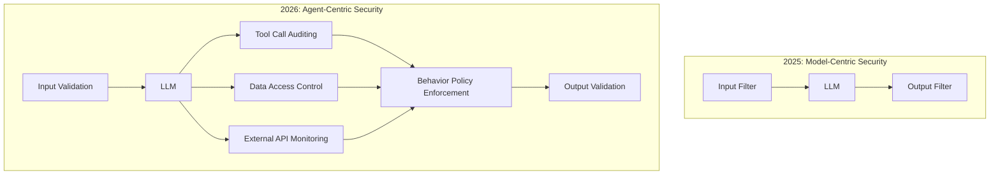
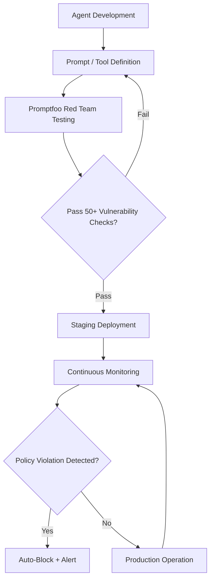
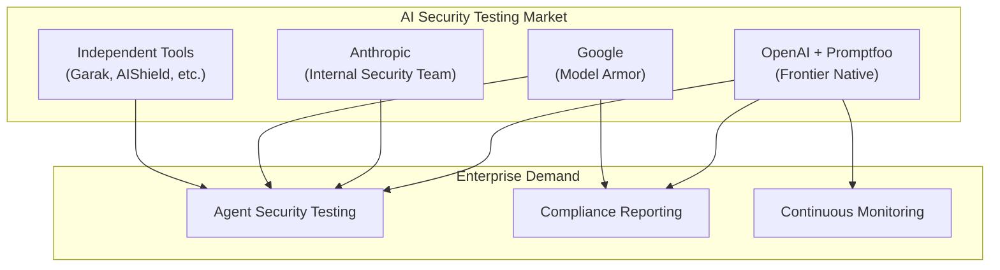

On March 9, 2026, OpenAI announced its acquisition of Promptfoo, an AI security testing platform. The open-source tool — already used by more than 25% of Fortune 500 companies and backed by a developer community of 350,000 — will be integrated into OpenAI's enterprise platform, Frontier. This acquisition signals more than a typical corporate deal: it marks a growing industry consensus that <strong>security pipelines are now a requirement, not an option, for AI agents</strong>.

## What Is Promptfoo?

Promptfoo is an AI security platform founded in 2024 by Ian Webster and Michael D'Angelo. What started as a simple prompt evaluation tool has since evolved into a comprehensive security framework for red-team testing and vulnerability scanning across AI systems.

### Core Capabilities

```yaml
# Promptfoo's primary feature areas
Red Teaming:
  - Automated testing across 50+ vulnerability types
  - Dynamic attack generation (ML-based, not static jailbreak lists)
  - Business-logic-aware custom test scenarios

Vulnerability Scanning:
  - Prompt injection
  - Guardrail bypass
  - Data exfiltration
  - SSRF attacks
  - Sensitive information exposure
  - BOLA vulnerabilities

Enterprise:
  - CI/CD pipeline integration
  - SSO / audit logging
  - Continuous production monitoring
  - On-premises deployment support
  - NIST AI Risk Management Framework alignment
```

What stands out is Promptfoo's approach to red teaming. Rather than cycling through a static list of known jailbreaks, <strong>ML-trained agents generate dynamic, application-specific attacks tailored to the target system</strong>. This far more accurately simulates how real adversaries behave.

## Why This Acquisition Matters

### 1. A Paradigm Shift in AI Agent Security

Through 2025, AI security largely focused on "model safety" — aligning models with RLHF, adding output filters, and configuring guardrails. But in 2026, AI agents <strong>call tools, access data, and interact with external systems</strong>. The [attack surface](/en/blog/en/ai-coding-secrets-sprawl-mcp-config-security) has fundamentally changed.



### 2. Already Embedded in 25% of the Fortune 500

It's hard to frame this as just another startup acquisition when <strong>roughly 127 Fortune 500 companies</strong> already rely on Promptfoo as part of their AI development lifecycle. For OpenAI, this is a strategic move to deepen its foothold in the enterprise market.

### 3. Native Integration with the Frontier Platform

Frontier, OpenAI's enterprise platform, is where companies build and operate AI coworkers. When Promptfoo's security testing becomes natively integrated into Frontier, teams will get:

- A single pipeline covering <strong>development → security testing → deployment</strong>
- Automated red-team testing before any agent ships to production
- Continuous security monitoring in live environments
- Real-time detection of policy-violating behavior

## The AI Agent DevSecOps Pipeline

This acquisition is accelerating the emergence of a DevSecOps-style pipeline for AI agent development — mirroring what the software industry built for traditional applications.



### Comparing Traditional and AI Agent DevSecOps

| Area | Traditional DevSecOps | AI Agent DevSecOps |
|------|-----------------------|--------------------|
| Code Scanning | SAST / DAST | Prompt injection scanning |
| Vulnerability Testing | Penetration testing | AI red-team testing |
| Access Control | RBAC / ABAC | Tool call permission policies |
| Continuous Monitoring | WAF / IDS | Behavior policy monitoring |
| Compliance | SOC 2 / ISO 27001 | NIST AI RMF |
| Incident Response | SIEM alerts | Automated agent blocking |

## What EMs and CTOs Should Start Doing Now

### 1. Add AI Security Testing to Your CI/CD Pipeline

Promptfoo already supports CI/CD integration. If your team is shipping AI agents, you can start today.

```yaml
# .github/workflows/ai-security-test.yml
name: AI Agent Security Test
on:
  pull_request:
    paths:
      - 'agents/**'
      - 'prompts/**'

jobs:
  security-test:
    runs-on: ubuntu-latest
    steps:
      - uses: actions/checkout@v4

      - name: Install Promptfoo
        run: npm install -g promptfoo

      - name: Run Red Team Tests
        run: |
          promptfoo redteam run \
            --config agents/config.yaml \
            --output results/security-report.json

      - name: Check Results
        run: |
          promptfoo redteam report \
            --input results/security-report.json \
            --fail-on-vulnerability
```

### 2. Document Your Agent Behavior Policies

Define explicitly which tools an agent is allowed to call, which data it can access, and what actions are forbidden.

```yaml
# agent-policy.yaml
agent: customer-support-bot
version: "1.0"

allowed_tools:
  - knowledge_base_search
  - ticket_create
  - ticket_update

forbidden_actions:
  - Transmit customer PII to external systems
  - Approve refunds exceeding $500
  - Use internal system administrator privileges

data_access:
  allowed:
    - customer_tickets
    - product_catalog
  denied:
    - employee_records
    - financial_reports

escalation_triggers:
  - Legal dispute-related requests
  - Personal data deletion requests
  - Security incident reports
```

### 3. Establish Security Testing Benchmarks

Using the [NIST AI Risk Management Framework](/en/blog/en/nist-ai-agent-security-standards) as a foundation, define security testing thresholds that fit your team's context.

| Test Category | Minimum Threshold | Recommended Threshold |
|---------------|-------------------|-----------------------|
| Prompt Injection | 90% block rate | 99% block rate |
| Guardrail Bypass | 95% block rate | 99.5% block rate |
| Data Exfiltration Prevention | 100% blocked | 100% blocked |
| Tool Abuse Detection | 85% detection rate | 95% detection rate |
| Policy Violation Detection | 90% detection rate | 98% detection rate |

## Impact on the Open-Source Ecosystem

OpenAI has committed to maintaining Promptfoo as an open-source project. Today, 130,000 monthly active users and 350,000 developers rely on Promptfoo across multiple model providers — GPT, Claude, Gemini, Llama, and more.

This carries two implications:

1. <strong>Democratized security testing</strong>: Not just large enterprises, but startups and individual developers will be able to run AI agent security tests
2. <strong>Vendor neutrality going forward</strong>: It remains to be seen whether support for competing models like Claude and Gemini will continue under OpenAI ownership

The long-term fate of open-source projects acquired by major AI labs deserves close attention. The key challenge will be maintaining community trust while differentiating the enterprise Frontier experience in meaningful ways.

## Competitive Landscape



With this acquisition, OpenAI has secured the strongest position in the AI agent security testing space. How the other players respond will be one of the defining storylines of the AI security market in the second half of 2026.

## Conclusion: Essential Infrastructure for the Agent Era

This acquisition sends a clear message: <strong>if you're deploying AI agents to production, security testing is not optional — it's mandatory</strong>.

If you're an Engineering Manager or CTO, here are three things to start on right now:

1. <strong>Map the attack surface of your current AI agents.</strong> Build an inventory of every tool they can call and every dataset they can access.
2. <strong>Introduce Promptfoo CLI to your team.</strong> It's open source, so there's no cost to getting started. Run your first red-team test in five minutes with `npx promptfoo@latest redteam init`.
3. <strong>Manage agent behavior policies as code.</strong> Write human-readable YAML policy files and validate them automatically in CI/CD.

As AI agents grow more capable, the infrastructure required to operate them safely becomes equally critical. The Promptfoo acquisition is a milestone confirming that this infrastructure is now becoming the industry standard.

## References

- [OpenAI Official Announcement: Acquiring Promptfoo](https://openai.com/index/openai-to-acquire-promptfoo/)
- [TechCrunch: OpenAI acquires Promptfoo to secure its AI agents](https://techcrunch.com/2026/03/09/openai-acquires-promptfoo-to-secure-its-ai-agents/)
- [Promptfoo Official Site](https://www.promptfoo.dev/)
- [Promptfoo GitHub Repository](https://github.com/promptfoo/promptfoo)
- [NIST AI Risk Management Framework](https://www.nist.gov/artificial-intelligence/risk-management-framework)
