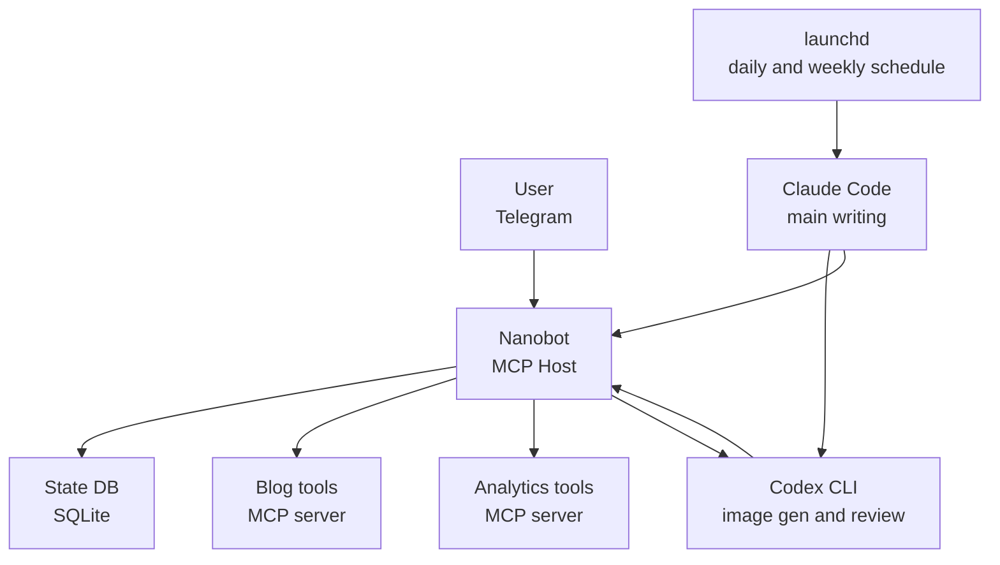

I got an email from Anthropic on the morning of April 4th. The notice said I could no longer use third-party tools like OpenClaw with my Claude Pro subscription. The exact wording was something like "OAuth tokens issued through subscriptions cannot be used in external tools," but for an OpenClaw user that's basically the same thing ([VentureBeat coverage](https://venturebeat.com/technology/anthropic-cuts-off-the-ability-to-use-claude-subscriptions-with-openclaw-and)).

As someone who literally wrote a Codex migration guide for OpenClaw users back in February, I sat there a bit stunned. That earlier post had the tone of "Claude and Gemini ToS keep shifting, so install Codex as a backup." Two months later, the backup had become the main thing. And then on April 24th, GPT-5.5 dropped ([OpenAI announcement](https://openai.com/index/introducing-gpt-5-5/)) and the ground shifted again.

My automation stack now looks like this. Claude plus launchd is the main engine. Codex handles the heavier work — image generation and reviews. Nanobot plus Telegram covers state management and the small jobs in between. OpenClaw is gone, cleanly. Three rounds of migration in a single month taught me a few things, and I want to write them down before I forget.

## First escape — just survive with launchd

The first thing I did after the OAuth notice was kill OpenClaw. The hard part wasn't shutting it down. It was figuring out where to move the cron jobs that lived inside it.

My OpenClaw setup had three schedulers buried in it: a daily blog publish, a daily wrap-up check, and a weekly strategy review. They weren't actually cron jobs, they ran on OpenClaw's own scheduler. Lose the tool, lose the schedules. I ran them by hand for about a week. Way too much manual work.

So I moved everything to macOS launchd. The choice came down to two things. First, no extra daemon to install. launchd is more OS-native than cron. Second, I didn't want to get tied to another external tool. Having migrated once already, I picked the thinnest possible layer this time.

```xml
<!-- ~/Library/LaunchAgents/net.jangwook.daily-post.plist -->
<plist version="1.0">
  <dict>
    <key>Label</key>
    <string>net.jangwook.daily-post</string>
    <key>ProgramArguments</key>
    <array>
      <string>/bin/zsh</string>
      <string>-lc</string>
      <string>cd /path/to/blog && claude code --command "/write-post-auto"</string>
    </array>
    <key>StartCalendarInterval</key>
    <dict>
      <key>Hour</key><integer>15</integer>
      <key>Minute</key><integer>23</integer>
    </dict>
  </dict>
</plist>
```

Register it with `launchctl load`, check it's alive with `launchctl list | grep jangwook`. Done. I moved every OpenClaw schedule to launchd in about an hour. It just worked, surprisingly. And it's still running as I write this. This is the one layer I haven't touched again through the whole migration.

The trap with bundled tools like OpenClaw shows up here. Multi-agent, channels, scheduler all in one box, very convenient at first. But when the box breaks, the perfectly fine things inside it fall out too. Scheduling on launchd was already enough for me, and if it was already enough, I should have used launchd from the start. That realization came late.

I had been putting off launchd because someone said it was fussier than cron. Turns out a single plist file was the whole deal. It comes back automatically after a macOS reboot, it shows up in system logs cleanly. Both of those beat cron. The one annoyance is having to run `launchctl unload && load` after editing the plist. Other than that, it's easier to debug than the OpenClaw scheduler ever was. At least I know where the logs go.

## Channels was a stopgap, and that stopgap dragged on too long

Anthropic announced Claude Code Channels in March. You send a message from Telegram and Claude on your local terminal answers. The UX was almost identical to the OpenClaw Telegram channel I had been using. I treated it as a temporary bridge. The reasoning was simple: if I can still reach Claude through Telegram without OpenClaw, the immediate pain of the OAuth cutoff drops a lot.

It actually worked well. While out and about, I'd send "run today's analytics report" from Telegram, the Mac mini at home would pick it up, do the work, and send results back to Telegram. I lived this way for almost a month. It's exactly what I wrote up in my [Channels review](/en/blog/en/claude-code-channels-telegram-bridge).

The problem with Channels is that it's a message-response model. There's no state. Ask "where did the backfill job from last night get to," and Channels has no idea that backfill job exists. Every interaction starts a fresh session from zero. OpenClaw kept context per channel; Channels does not.

This piled up over a month and the irritation accumulated. Specifically: at 2 AM I'd ping Telegram for the backfill progress, and Channels would reply "which backfill job are you referring to?" The fifth time I got that answer, I almost threw my laptop.

The conclusion crystallized. Keep Telegram as the channel, but put a state management layer behind it. A stateless channel is a messenger for humans, not an automation interface. Right around then, the GPT-5.5 announcement landed, so I went ahead and signed up for Codex separately.

## The 30 minutes I spent reinstalling OpenClaw on top of Codex

When GPT-5.5 dropped on April 24th ([OpenAI announcement](https://openai.com/index/introducing-gpt-5-5/)), I was honestly a little excited. The "Codex as backup" line from my own migration guide was about to become the actual main scenario. Pricing doubled ([apidog breakdown](https://apidog.com/blog/gpt-5-5-pricing/), input $5/M, output $30/M), which annoyed me, but the better token efficiency offset some of that.

After signing up for Codex, the first thing I did, embarrassingly, was reinstall OpenClaw. The thinking was: "Codex doesn't have the ToS problem, so if I just plug Codex into OpenClaw, I can keep my old workflow exactly." I regretted it within 30 minutes. To be fair, OpenClaw installed fine and the Codex adapter attached without drama. The trouble was everything after.

OpenClaw is heavy not because of its model dependencies. It's heavy because it carries 50+ integrations at once, plus its own scheduler, its own channel manager, its own node graph. The runtime that holds all of this up has to be on at all times. Keeping that runtime hot just to call Codex was overkill. I watched the memory usage on my Mac mini, sighed for a while, and uninstalled it that same night.

This isn't OpenClaw's fault. I was using OpenClaw wrong. OpenClaw is a tool for orchestrating [channel integrations and multi-agent routing](https://docs.openclaw.ai/concepts/multi-agent) in one place. What I actually used it for was "write posts with Claude, get results on Telegram." I was carrying 100% of the weight while using maybe 5% of the features.

Please don't read this as me saying OpenClaw is a bad tool. I still stand by everything I wrote in the [OpenClaw installation guide](/en/blog/en/openclaw-installation-tutorial). Multi-model support, the channel system, the node graph — all real. They just weren't things my work needed.

## After switching to Nanobot

I ran into Nanobot by accident. It's an [open-source MCP host](https://github.com/nanobot-ai/nanobot) by Obot AI ([official intro](https://obot.ai/blog/introducing-nanobot-a-new-framework-for-turning-mcp-servers-into-ai-agents/)). It's written in Go, it's in alpha, and the codebase is small. Genuinely small. Follow the README and you basically get one binary plus a single YAML file.

The config looks like this.

```yaml
# nanobot.yaml
agents:
  blog-ops:
    model: gpt-5.5
    instructions: |
      You are the operations assistant for the jangwook.net blog.
      Receive Telegram requests and route them to the right MCP tools.
    tools:
      - blog-publisher
      - analytics-reader
      - codex-handoff

mcpServers:
  blog-publisher:
    command: node
    args: [./scripts/mcp-blog-publisher.js]
  analytics-reader:
    command: python3
    args: [./scripts/mcp-ga.py]
  codex-handoff:
    command: bash
    args: [./scripts/codex-bridge.sh]
```

I had it wired to my Telegram bot within an hour of installing. To be exact: a message comes in from Telegram, Nanobot receives it, routes it to MCP tool calls (the blog publisher script, the analytics script, and so on), and pushes the result back to Telegram. End-to-end, it does what I had on OpenClaw. The weight is what's different.

Two things I like about Nanobot.

<strong>I can read the code</strong>. That's the first one. OpenClaw had grown past the point where I could keep up. Tracing where something got stuck meant digging through Discord or searching GitHub Issues. With Nanobot, I can skim the entire main branch in 30 minutes. That ends up being a surprisingly important safety net when you're running an alpha tool in production. Having "I can patch this myself if it breaks" as a live option is very different from not having it.

<strong>It's light</strong>. That's the second one. Running in the background on the Mac mini, it barely uses memory. Probably because it's a single Go binary. Tasks that used to spin the fan when OpenClaw was on are quiet under Nanobot. I can take the laptop to a cafe and not stress about battery.

## Telegram is the status board, Codex is the worker

The current shape, drawn out, looks like this.



Nanobot is what links the two worlds in the middle. On one side, launchd-driven scheduled jobs (Claude does the main writing, Codex handles images and reviews). On the other, ad-hoc requests coming in over Telegram. Nanobot takes both, writes state into SQLite, and pushes progress back to Telegram.

Telegram's role changed in the process. During the Channels period, it was a command line. You sent a command, got an answer back. Now it's a status board. I can check from Telegram how far last night's publish job got, how many hours until the next scheduled run, whether the last build succeeded. I rarely send commands anymore. The scheduled jobs run themselves, and I just watch the output.

Codex's role got clearer too. Claude writes the post, and when the writing is done Codex picks up two tasks: hero image generation and code review. The improved token efficiency in GPT-5.5 shows here. The same review job comes back noticeably faster than it did on 5.4. I don't have a real benchmark, this is just my subjective sense.

I should talk about pricing. GPT-5.5 lands at $5/M input and $30/M output, exactly double 5.4. That made me grumpy at first. Then I ran it for a week and pulled the bill. It came out roughly the same as the 5.4 era. OpenAI's "fewer tokens for the same result" line wasn't only marketing. The same code review job that used to average around 12k tokens on 5.4 now sits at 6 to 7k on 5.5. Price doubled, token usage halved, so the actual bill stayed flat. It's more expensive per token, but it's not broken pricing.

That's based on my workflow though. If you're using Codex inside an IDE for autocomplete, the token math will look different. Code review is short input plus short output, which is exactly the case where token efficiency improvements pay off the most.

## Nanobot's limits, honestly

If you read this far you might think I'm calling Nanobot the obvious winner. Not quite. Almost a month in, two clear limitations have surfaced.

<strong>First, no multi-agent</strong>. Nanobot is fundamentally an MCP host. One LLM calling tools. The pattern of "multiple agents talking to each other and dividing the work" isn't there. OpenClaw solved that beautifully with its node graph. About 90% of my workflow is "one agent, several tools," so Nanobot covers it, but the remaining 10% occasionally stings.

<strong>Second, almost no UI</strong>. There's a chat UI on localhost:8080, but don't expect anything like the OpenClaw integrated dashboard. Alpha-stage stuff. Telegram is effectively my dashboard, and that's not because I prefer it, it's because there's no other option. If someone next to me asks "show me your status," I don't have a screen to point at.

The third limit is more subtle. <strong>Nanobot is alpha and can break at any time</strong>. The [release page](https://github.com/nanobot-ai/nanobot/releases) on GitHub shows frequent changes. I bumped a 0.x version once and the MCP handshake compatibility broke, which cost me an hour of debugging. That's the price of running alpha tools. It isn't Nanobot's fault.

## So is OpenClaw done — no, I just wasn't a good fit for it

The takeaway here isn't "Nanobot is better than OpenClaw." It's that the weight of a tool has to match the complexity of the work. My work was Nanobot-sized while I was running OpenClaw, and it took me two months to notice.

There are clear cases where OpenClaw fits. Here's the rule I'd offer. If you have a workflow where agents need to exchange messages, the messages have to be free-form text, and the workflow runs repeatedly rather than once, then a heavy orchestrator like OpenClaw is the right answer. Node graphs, channels, multi-agent context — building all that yourself is a serious project.

The question I never asked was "is my workflow actually that complex?" The answer was no. Claude writes posts, Codex generates images, both write results to SQLite, Telegram displays the state. There's no agent-to-agent dialogue. There's nothing to message back and forth. For a workflow like this, the entire OpenClaw runtime is overkill.

One more thing. Codex getting better mattered a lot in this decision. Back in the GPT-5.4 era, a "one LLM with several tools" structure like Nanobot would have been weak. The model picked the wrong tool too often. 5.5 is visibly better there. As tool-call accuracy goes up, the reason to split into multiple agents goes down. One smart person needs fewer meetings than five average ones.

Honestly, one more confession. This whole migration started from a single OAuth cutoff. If Anthropic hadn't shipped that policy, I'd still be tied to OpenClaw. The inertia of "it works, why change it" usually gives way only under outside pressure. The irony is that the shock made my automation stack lighter and clearer. From Anthropic's side, the goal was probably to claw back subsidy costs, not to reorganize anyone's workflow. It ended up helping me anyway.

Next month I'm planning to read the Nanobot codebase more carefully. How an MCP host puts tool-call results back into context, how it handles state. The fact that it's alpha makes it more interesting, not less. Mature tools stop being worth opening up. If I end up needing to send a patch upstream, that's probably its own blog post.
