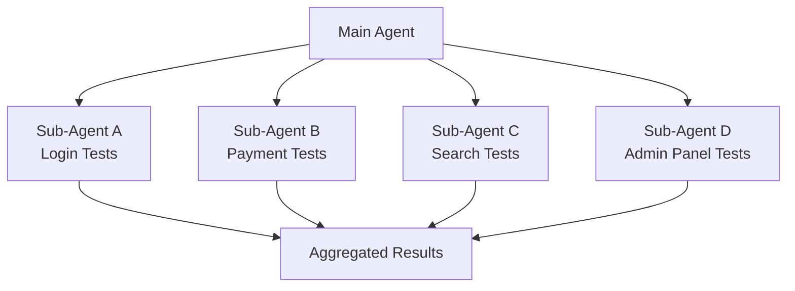
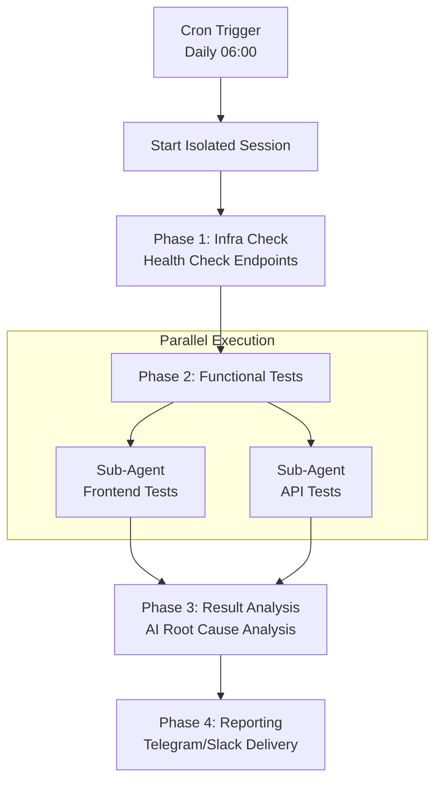

## Overview

Traditional E2E testing tools like Selenium, Cypress, and Playwright rely on CSS selectors and imperative code to write tests. When the UI changes, selectors break, and you end up modifying dozens of test files.

<strong>OpenClaw</strong> solves this problem with a fundamentally different approach. An AI agent understands web pages through an accessibility tree, interprets test scenarios written in natural language, and executes them. Browser automation, device management, cron scheduling, and multi-agent orchestration are all unified within a single platform.

This article analyzes OpenClaw's core features from an E2E testing perspective and walks through how to build a real test automation system.

## Understanding OpenClaw's Architecture

OpenClaw adopts a <strong>Gateway-centric architecture</strong>. The Gateway is a single long-running process that manages all messaging channels and the WebSocket control plane.

```mermaid
graph TD
    subgraph Messaging Channels
        WA[WhatsApp] ~~~ TG[Telegram] ~~~ SL[Slack]
    end
    subgraph Gateway
        GW[Gateway Process]
        GW --> Agent[Agent Engine]
        GW --> Cron[Cron Scheduler]
    end
    subgraph Execution Environment
        Agent --> Browser[Browser Control]
        Agent --> Nodes[Node Devices]
        Agent --> SubAgent[Sub-Agents]
        Agent --> Canvas[Canvas UI]
    end
    Messaging Channels --> GW
    SubAgent --> Report[Result Reporting]
    Report --> Messaging Channels
```

Here is the role of each component from an E2E testing perspective:

| Component | Role | Use in Testing |
|-----------|------|----------------|
| <strong>Gateway</strong> | Unified control plane | Central hub for test infrastructure |
| <strong>Browser</strong> | Chromium-based web automation | Web app functional and UI testing |
| <strong>Nodes</strong> | Device control (macOS/iOS/Android) | Cross-platform testing |
| <strong>Cron</strong> | Scheduling engine | Triggers for scheduled test runs |
| <strong>Sub-agents</strong> | Parallel agent execution | Test suite parallelization |
| <strong>Canvas</strong> | Visual workspace | UI regression testing and result dashboards |

## Browser Automation: Accessibility Tree-Based Testing

### Snapshots and the Ref System

At the core of OpenClaw's browser automation is <strong>snapshot-based interaction</strong>. Instead of CSS selectors, it uses the accessibility tree, so it can locate semantically identical elements even when the UI structure changes.

```bash
# Generate an AI snapshot — assigns numeric refs to page elements
openclaw browser snapshot

# Interact using refs
openclaw browser click 12          # Click element at ref=12
openclaw browser type 23 "hello"   # Type text into ref=23

# Filter to only interactive elements
openclaw browser snapshot --interactive
openclaw browser click e12         # Click using role-based ref
```

The key advantage of this approach is <strong>self-healing</strong>. Even if a button's class name changes from `btn-primary` to `button-main`, the accessibility tree still identifies it as the same "Submit" button.

### Login Flow Test Example

You pass the test scenario to the agent in natural language:

```bash
openclaw agent --message "Test the login flow in this order:
  1. Navigate to https://myapp.com/login
  2. Enter test@example.com in the email field
  3. Enter password123 in the password field
  4. Click the login button
  5. Verify redirect to the dashboard URL
  6. Verify the welcome message is displayed on the dashboard
  Report results with screenshots."
```

Internally, the agent executes tool calls like the following:

```bash
browser open https://myapp.com/login
browser snapshot --interactive
browser type <email-ref> "test@example.com"
browser type <password-ref> "password123"
browser click <submit-ref>
browser wait --url "**/dashboard" --timeout-ms 10000
browser snapshot
# → AI analyzes the snapshot to verify dashboard elements
```

### State Management and Environment Configuration

Environment configuration is essential in E2E testing. OpenClaw provides a rich state management API:

```bash
# Set authentication session via cookies
openclaw browser cookies set session abc123 --url "https://myapp.com"

# Device emulation
openclaw browser set device "iPhone 14"

# Network condition testing
openclaw browser set offline on              # Offline mode
openclaw browser set headers --json '{"X-Debug":"1"}'  # Custom headers

# Localization testing
openclaw browser set geo 37.7749 -122.4194   # San Francisco
openclaw browser set locale en-US
openclaw browser set timezone America/New_York
```

### Wait Functionality

Multiple strategies are supported for waiting on asynchronous UI changes:

```bash
# Composite condition wait
openclaw browser wait "#main" \
  --url "**/dashboard" \
  --load networkidle \
  --fn "window.ready===true" \
  --timeout-ms 15000
```

You can combine text, URL patterns (globs), network idle state, JavaScript conditions, and CSS selectors to build precise wait logic.

### Remote Browser Integration

In CI/CD environments, you can connect to remote browsers such as Browserless:

```json5
{
  browser: {
    enabled: true,
    defaultProfile: "browserless",
    profiles: {
      browserless: {
        cdpUrl: "https://production-sfo.browserless.io?token=<API_KEY>",
      },
    },
  },
}
```

## Nodes: Cross-Platform Device Testing

### Node Types and Capabilities

Nodes are companion devices that connect to the Gateway via WebSocket.

| Node Type | Supported Features |
|-----------|-------------------|
| <strong>macOS App</strong> | Canvas, Camera, Screen Recording, System Run |
| <strong>iOS App</strong> | Canvas, Camera, Location |
| <strong>Android App</strong> | Canvas, Camera, Chat, Location, SMS, Screen Recording |
| <strong>Headless</strong> | System Run, System Which |

### Multi-Node Test Pipeline

```bash
# Node A (Server): Start the test environment
openclaw nodes run --node "Server" -- docker compose up -d

# Node B (Desktop): Run browser tests
openclaw browser open https://server-node:3000
openclaw browser snapshot

# Node C (Mobile): Capture real device UI
openclaw nodes camera snap --node "iPhone" --facing front

# Node D (Build Server): Run unit tests
openclaw nodes run --node "Build Node" -- npm test
```

### Physical Device Verification

Using the camera feature, you can verify physical states such as checking LED indicators on IoT devices or validating physical UI changes:

```bash
# Capture physical state via camera
openclaw nodes camera snap --node "IoT-Monitor" --facing back

# Record UI flow via screen recording
openclaw nodes screen record --node "Android-Test" --duration 10s --fps 10
```

## Cron: Scheduled Test Execution

### Schedule Types

| Type | Description | Example |
|------|-------------|---------|
| `at` | One-time execution | Smoke test 5 minutes after deployment |
| `every` | Fixed interval | Health check every 30 minutes |
| `cron` | 5-field expression + timezone | Full test suite daily at 07:00 |

### Pattern 1: Daily Morning Full E2E Test

```bash
openclaw cron add \
  --name "Daily E2E Suite" \
  --cron "0 6 * * *" \
  --tz "Asia/Tokyo" \
  --session isolated \
  --message "Run the full E2E test suite:
    1. Navigate to https://myapp.com and check load time
    2. Verify the login flow
    3. Test core business logic
    4. Validate API responses
    5. Summarize results with screenshots" \
  --model "anthropic/claude-sonnet-4-5" \
  --deliver \
  --channel telegram \
  --to "DevTeam"
```

The key here is `--session isolated`. Running in an isolated session prevents contamination of the main agent's context.

### Pattern 2: Post-Deployment Smoke Test

```bash
openclaw cron add \
  --name "Post-Deploy Smoke" \
  --at "5m" \
  --session isolated \
  --message "Post-deployment smoke test:
    1. Verify health check endpoint response
    2. Confirm main page loads normally
    3. Check that login works" \
  --deliver \
  --channel slack \
  --to "channel:C_DEPLOYMENTS" \
  --delete-after-run
```

The `--delete-after-run` flag automatically removes the cron job after a single execution.

### Pattern 3: Weekly Deep Analysis

```bash
openclaw cron add \
  --name "Weekly Deep Test" \
  --cron "0 2 * * 0" \
  --tz "Asia/Tokyo" \
  --session isolated \
  --message "Weekly deep E2E test:
    1. Verify all user flows
    2. Collect performance metrics
    3. Run accessibility checks
    4. Verify cross-browser compatibility
    5. Analyze changes compared to last week" \
  --model "anthropic/claude-opus-4-5" \
  --thinking high \
  --deliver
```

For deep analysis, use `claude-opus-4-5` with the `--thinking high` option to enable deeper reasoning.

### Cron vs. Heartbeat

| Criteria | Heartbeat | Cron |
|----------|-----------|------|
| Precise timing | Approximate (~30 min intervals) | Exact time |
| Session isolation | No (main session) | Yes (isolated) |
| Model override | No | Yes |
| Cost efficiency | Good (batch processing) | Moderate (per-job cost) |

<strong>Recommendation</strong>: Use cron (isolated) for scheduled E2E tests and heartbeat for lightweight status monitoring.

## Test Orchestration with Sub-Agents

### Parallel Test Execution

Sub-agents are agents that run independently in the background. They execute multiple tests concurrently and automatically report results upon completion.



Concurrency control configuration:

```json5
{
  agents: {
    defaults: {
      subagents: {
        maxConcurrent: 8,  // Maximum concurrent executions
      },
    },
  },
}
```

### Phased Verification Pipeline

In practice, you often need a <strong>phased pipeline</strong> rather than simple parallelism:



### Multi-Agent Environment Configuration

You can target different environments per agent:

```json5
{
  agents: {
    list: [
      {
        id: "staging-tester",
        name: "Staging Tester",
        workspace: "~/.openclaw/workspace-staging",
        model: "anthropic/claude-sonnet-4-5",
      },
      {
        id: "prod-tester",
        name: "Production Tester",
        workspace: "~/.openclaw/workspace-prod",
        model: "anthropic/claude-opus-4-5",
      },
    ],
  },
  bindings: [
    { agentId: "staging-tester", match: { channel: "slack", peer: { kind: "channel", id: "C_STAGING" } } },
    { agentId: "prod-tester", match: { channel: "telegram" } },
  ],
}
```

## Canvas: UI Verification and Result Dashboards

### Visual Regression Testing

Canvas is an agent-controlled visual workspace built into the macOS app:

```bash
# Load the target URL
openclaw nodes canvas present --node <id> --target https://myapp.com

# Capture the current state
openclaw nodes canvas snapshot --node <id> --format png --max-width 1200

# Verify DOM with JavaScript
openclaw nodes canvas eval --node <id> --js "document.querySelectorAll('.error').length"
```

The AI agent analyzes captured snapshots to verify layout changes, missing visual elements, color consistency, and more.

### Test Result Dashboard

You can build a real-time test dashboard through the A2UI (Agent-to-UI) protocol:

```bash
cat > /tmp/test-dashboard.jsonl <<'EOF'
{"surfaceUpdate":{"surfaceId":"dashboard","components":[
  {"id":"root","component":{"Column":{"children":{"explicitList":["header","results"]}}}},
  {"id":"header","component":{"Text":{"text":{"literalString":"E2E Test Dashboard"},"usageHint":"h1"}}},
  {"id":"results","component":{"Text":{"text":{"literalString":"✅ 45 passed | ❌ 2 failed | ⏭ 3 skipped"},"usageHint":"body"}}}
]}}
{"beginRendering":{"surfaceId":"dashboard","root":"root"}}
EOF

openclaw nodes canvas a2ui push --jsonl /tmp/test-dashboard.jsonl --node <id>
```

You can also trigger agent execution from within the Canvas to re-run tests directly from the dashboard.

## Practical Use Patterns

### Daily SaaS Health Check

```bash
openclaw cron add \
  --name "SaaS Health Check" \
  --cron "0 7 * * *" \
  --tz "Asia/Tokyo" \
  --session isolated \
  --message "SaaS health check:
    1. Open in browser and check load time
    2. Log in with test account
    3. Verify core dashboard widgets load
    4. Validate API health check responses
    5. Report immediately if issues found; brief summary if all clear
    Include screenshots with the report." \
  --deliver \
  --channel telegram
```

### Cross-Device Testing

```bash
# Emulation-based testing
openclaw browser set device "iPhone 14"
openclaw browser open https://myapp.com
openclaw browser screenshot --full-page

openclaw browser set device "iPad Pro"
openclaw browser open https://myapp.com
openclaw browser screenshot --full-page

# Real iOS device (Node)
openclaw nodes canvas present --node "iPhone" --target https://myapp.com
openclaw nodes canvas snapshot --node "iPhone" --format png
```

### Accessibility Testing

```bash
# Accessibility tree snapshot
openclaw browser snapshot --format aria

# Request accessibility analysis from the AI agent
openclaw agent --message "Analyze the ARIA snapshot to:
  1. Find WCAG 2.1 AA violations
  2. Verify keyboard navigation support
  3. Check screen reader compatibility
  4. Provide improvement recommendations"
```

### Performance Monitoring

```bash
openclaw cron add \
  --name "Performance Monitor" \
  --cron "*/15 * * * *" \
  --session isolated \
  --message "Performance measurement:
    1. Navigate to the site and measure load time
    2. Check for console errors
    3. Inspect network request latency
    4. Run JS evaluation for Core Web Vitals
    Only report if issues are found." \
  --model "anthropic/claude-sonnet-4-5"
```

## Limitations and Considerations

### Technical Limitations

| Limitation | Description | Workaround |
|-----------|-------------|------------|
| No CSS selectors | Cannot use CSS selectors directly in actions | Use snapshot ref-based access |
| Ref instability | Refs are invalidated on page navigation | Re-run snapshot before each action |
| AI non-determinism | Same test may produce different results | Clearly specify key verification points |
| Foreground requirement | Camera/Canvas require the app to be in the foreground | Use headless nodes |

### Cost Optimization

- Use `claude-sonnet-4-5` (the more affordable model) for routine tests
- Reserve `claude-opus-4-5` for deep analysis only
- Batch lightweight checks with heartbeat
- Set `maxConcurrent` appropriately when running sub-agents in parallel

### Security Considerations

- Browser profiles may contain login sessions, so treat them as sensitive data
- The `evaluate` function runs arbitrary JS in the page context, so watch out for prompt injection
- Protect remote CDP endpoints with tunneling
- Configure the exec tool's security mode (`deny`/`allowlist`/`full`) appropriately

## Getting Started

```bash
# 1. Install and configure the Gateway
openclaw onboard --install-daemon

# 2. Enable the browser
openclaw config set browser.enabled true

# 3. Register your first smoke test cron job
openclaw cron add \
  --name "Smoke Test" \
  --cron "0 7 * * *" \
  --tz "Asia/Tokyo" \
  --session isolated \
  --message "Navigate to https://myapp.com and verify the main page loads correctly." \
  --deliver

# 4. Pair nodes (if device testing is needed)
openclaw nodes status
openclaw devices approve <requestId>

# 5. As the test suite grows, parallelize with sub-agents
# 6. Configure reporting channels via Telegram/Slack
```

## Conclusion

The key advantages of using OpenClaw for E2E testing are as follows:

1. <strong>Natural-language test definitions</strong> -- Describe scenarios in plain language instead of writing test code
2. <strong>Self-healing</strong> -- Resilient to UI changes thanks to accessibility tree-based element identification
3. <strong>Cross-platform</strong> -- Test web, iOS, Android, and server environments from a single system
4. <strong>Intelligent reporting</strong> -- AI analyzes results and infers root causes before reporting
5. <strong>Flexible scheduling</strong> -- Cron and heartbeat support a variety of test cadences

Rather than fully replacing traditional testing tools, OpenClaw excels in scenarios like <strong>smoke tests, visual regression tests, and cross-device verification</strong>. For high-volume repetitive tests or complex business logic validation, complementing it with existing tools is the right approach.

## References

- [OpenClaw Official Documentation](https://docs.openclaw.ai)
- [Browser Tool Documentation](https://docs.openclaw.ai/tools/browser)
- [Nodes Documentation](https://docs.openclaw.ai/nodes)
- [Cron Jobs Documentation](https://docs.openclaw.ai/automation/cron-jobs)
- [Sub-Agents Documentation](https://docs.openclaw.ai/tools/subagents)
- [Canvas (macOS)](https://docs.openclaw.ai/platforms/mac/canvas)
