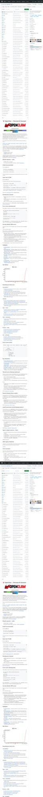
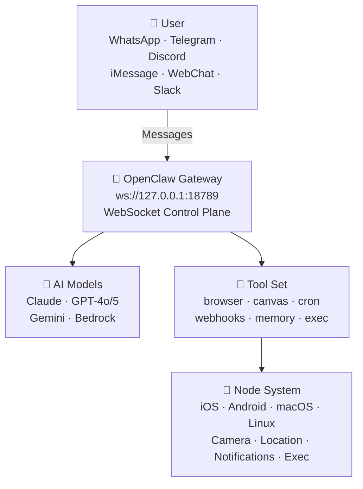

> 📚 **Series: Mastering OpenClaw**
> - **Part 1: Introduction (this post)** — What is OpenClaw and why is it special?
> - [Part 2: Tutorial](/en/blog/en/openclaw-installation-tutorial/) — From installation to your first conversation
> - [Part 3: Practical Usage](/en/blog/en/openclaw-practical-usage/) — Skills, automation, and advanced workflows

---

## 🤖 The Age of AI Assistants — Why OpenClaw?

ChatGPT, Claude, Gemini… Chances are you've already used at least one AI chatbot. But have you ever thought:

> "Can I use this AI directly in **my Telegram**?"  
> "What if AI could control **my phone's camera**?"  
> "I'm not comfortable with my data sitting on someone else's server…"  
> "Can I freely switch between multiple AI models?"

There's a project built precisely to solve these problems. Meet **OpenClaw** 🦞.

Today, I'll walk you through what OpenClaw is, what makes it special, and who it's the perfect fit for!

---

## 🦞 What is OpenClaw?

**OpenClaw** is an open-source **personal AI assistant platform**.

In simple terms, it's a system that lets you **attach your own AI assistant to the messengers you already use** — Telegram, WhatsApp, Discord, and more. You pick and connect AI models yourself, add various tools and skills, and build your own workflows.

| Item | Details |
|---|---|
| **License** | MIT (completely free to use) |
| **GitHub** | [github.com/openclaw/openclaw](https://github.com/openclaw/openclaw) |
| **Official Docs** | [docs.openclaw.ai](https://docs.openclaw.ai) |
| **Creators** | Peter Steinberger ([@steipete](https://twitter.com/steipete)), Mario Zechner (Pi creator) |
| **Skill Marketplace** | [ClawHub](https://clawhub.com) |
| **Community** | Discord — [discord.gg/clawd](https://discord.gg/clawd) |

Since it's MIT-licensed, individuals and companies alike can freely use and modify it. The community is actively growing, so if you have questions, hop into the Discord! 💬

### Exploring the GitHub Repository

Below is the main page of OpenClaw's GitHub repository. The README provides an overview of the project structure and a quick-start guide.



---

## ✨ Key Features

### 📱 Multi-Channel — Chat with AI from Anywhere

One of OpenClaw's biggest draws is its **channel diversity**.

- **WhatsApp** — WhatsApp Web protocol integration via Baileys
- **Telegram** — grammY-based Bot API (DM + groups)
- **Discord** — discord.js-based Bot API (DM + server channels)
- **iMessage** — macOS imsg CLI integration
- **Mattermost** — Bot integration via plugin
- **Slack, Signal, MS Teams** — Additional plugins
- **WebChat** — Local chat UI accessible directly from your browser

No need to install separate apps — you can use your AI assistant **right from the messengers you already use**. Just message the AI like you'd message a friend on Telegram.

### 💻 Multi-Platform

- **macOS** — Native app + menubar companion
- **iOS** — Node app with pairing + Canvas surface
- **Android** — Node app with Canvas + Chat + Camera
- **Windows** — Native support (WSL2 compatible too)
- **Linux** — Native + server deployment

Virtually all major platforms are supported.

### 🏗️ Gateway Architecture

The heart of OpenClaw is the **Gateway**. It operates as a single control plane, connecting all channels and tools through `ws://127.0.0.1:18789`.

The Gateway's core responsibilities:
- **Channel connection management** — Owns WebSocket connections for all messenger channels
- **Agent bridge** — RPC communication with the Pi coding agent
- **Tool routing** — Relays tool calls for browser, file system, cron, and more
- **Session management** — DMs route to a shared `main` session; groups get isolated sessions
- **Canvas host** — Serves node WebView UIs at `http://<gateway>:18793`
- **Dashboard** — Browser-based Control UI at `http://127.0.0.1:18789/` for configuration

### 🧠 Multi-Model AI Support

- **Anthropic Claude** (Opus, Sonnet, Haiku)
- **OpenAI** (GPT-4o, GPT-5, o1, etc.)
- **Google Gemini**
- **Amazon Bedrock** for model access
- **Subscription Auth** — Claude Pro/Max, ChatGPT/Codex OAuth integration

You're not locked into a single model. Switch freely based on your needs — assign cheaper models for cron jobs and high-performance models for critical analyses. **Model routing** makes this effortless.

### 🔧 Powerful Tool Set

OpenClaw's built-in tools aren't just plugins — they're **the means through which the agent actually interacts with the world**.

| Tool | Description |
|---|---|
| 🌐 `browser` | AI directly browses and manipulates web pages (incl. Chrome extension relay) |
| 🎨 `canvas` | Agent-controlled visual workspace — renders UI on node WebViews |
| ⏰ `cron` | Built-in Gateway scheduler for one-off reminders to recurring tasks |
| 🔗 `webhooks` | Real-time integration with external services (GitHub, Gmail, etc.) |
| 🧠 `memory_search` | Natural-language search over past conversations and stored info |
| 💬 `message` | Send, edit, and react to messages across channels |
| 📱 `nodes` | Remote control of iOS/Android/macOS devices |
| 🖥️ `exec` | Shell command execution (PTY support, security approval system) |
| 📝 `read`/`write`/`edit` | Direct file system manipulation |
| 🔍 `web_search`/`web_fetch` | Web search and page content extraction |
| 🎤 `tts` | Text-to-speech conversion |

### 🛒 Skills System & ClawHub

OpenClaw features a skills system compatible with the **AgentSkills format**, letting you install skills created by others from the **ClawHub marketplace** or share your own.


Skills are loaded from three locations (in priority order):
1. **Workspace skills** (`<workspace>/skills/`) — Highest priority
2. **Managed skills** (`~/.openclaw/skills/`) — Shared across all agents
3. **Bundled skills** — Default skills included in the OpenClaw package

Installing a skill takes just one line:
```bash
npx clawhub@latest install <skill-name>
```

### 📲 Node System

Connect iOS, Android, and macOS devices as **nodes** to let AI interact with the physical world:

| Feature | Description |
|---|---|
| 📷 Camera snap | Capture from front/rear cameras |
| 🎬 Camera clip | Record short video clips |
| 🖥️ Screen recording | Capture the current screen |
| 🔔 Push notifications | Send system/overlay/auto notifications |
| 📍 Location | GPS location query (coarse/balanced/precise) |
| 📱 SMS | Send SMS from Android nodes |
| ⌨️ Command execution | Run shell commands on the node host (Exec approval required) |

Nodes connect via Gateway WebSocket and must go through **pairing approval** before activation. Your phone becomes the AI's eyes and ears!

### 🤖 Multi-Agent System

OpenClaw can run **multiple agents simultaneously** from a single Gateway.

- **Per-agent workspaces** — Each agent gets its own isolated workspace
- **Per-agent sandboxes** — Docker-based isolated execution environments
- **Per-agent tool restrictions** — Block `exec` for certain agents while allowing only `read`
- **Binding rules** — WhatsApp Group A → work agent, Telegram DM → personal agent
- **Sub-agents** — Main agent delegates background tasks to sub-agents

### 🎙️ Voice Wake + Talk Mode

Chat with AI **using just your voice** — no keyboard needed. Trigger it with the macOS app's wake word feature, then continue with natural conversation in Talk Mode.

---

## 🏛️ Architecture at a Glance



Core principles:
- **Loopback-first**: Gateway WS binds to localhost by default
- **One Gateway, one host**: Prevents WhatsApp Web session ownership conflicts
- **Token-based auth**: Token required for non-local bindings
- **Tailscale/VPN**: SSH tunnel or Tailnet recommended for remote access

---

## 🆚 How Is It Different from Other AI Assistants?

| Comparison | ChatGPT / Claude Apps | **OpenClaw** |
|---|---|---|
| Hosting | Cloud (third-party servers) | **Self-hosted** (your own computer) |
| Data Privacy | Stored on their servers | **Stored locally only** 🔒 |
| Channels | Dedicated app/web only | **Telegram, Discord, and other existing messengers** |
| AI Models | That company's models only | **Claude, GPT, Gemini — free choice** |
| Extensibility | Limited (plugin store) | **Skills, webhooks, cron, MCP, custom tools** |
| Device Control | ❌ Not possible | ✅ **Camera, screen, location, command execution** |
| Automation | ❌ Not possible | ✅ **Cron, heartbeats, webhooks** |
| Multi-Agent | ❌ Not possible | ✅ **Per-agent routing, sandboxes** |
| Open Source | ❌ | ✅ **MIT License** |

The core difference in one line:

> **"Not borrowing someone else's service — an AI assistant running on your infrastructure, by your rules."**

---

## 🎯 Who Is OpenClaw For?

- 🔐 **Privacy-conscious users** — All data stays on your computer
- 🛠️ **Automation-loving developers** — Infinite extensibility with cron, webhooks, skills, and MCP
- 📱 **Multi-messenger users** — Same AI assistant whether you're on Telegram or Discord
- 🤓 **Hands-on AI enthusiasts** — It's open source, so you can understand it at the code level
- 🏠 **Home automation fans** — IoT-like capabilities through the Node system
- 👨‍💼 **Team leads looking to adopt AI** — Role-based AI operations via multi-agent
- 🔧 **Those wanting AI in existing workflows** — Easy integration with webhooks, n8n, Make, etc.

On the flip side, if you're satisfied with "occasionally asking questions on ChatGPT's web interface," you probably don't need OpenClaw. OpenClaw is built for **people who want to deeply integrate AI into their lives**.

---

## 🌍 Project Ecosystem

OpenClaw isn't a standalone project — it's an **ecosystem** composed of multiple components:

| Component | Role |
|---|---|
| **OpenClaw Gateway** | Core runtime — channel, tool, and agent management |
| **Pi** | Coding agent engine — communicates with Gateway via RPC mode |
| **ClawHub** | Skill registry — search, install, update, and share |
| **OpenClaw.app** | macOS desktop app — menubar + Voice Wake |
| **OpenClaw iOS** | iPhone/iPad node app — Canvas + Camera |
| **OpenClaw Android** | Android node app — Canvas + Chat + Camera |
| **Official Docs** | docs.openclaw.ai — comprehensive guide |

---

## 📢 Coming Up Next

In this post, we explored what OpenClaw is and what makes it special.

In **[Part 2: Tutorial](/en/blog/en/openclaw-installation-tutorial/)**, we'll walk through **installing and configuring OpenClaw** step by step!

- Installing Node.js & Gateway onboarding
- Connecting and pairing a Telegram channel
- Starting your first AI conversation
- Understanding the workspace file structure

> 🦞 **"Seeing is believing — running is knowing."** — Let's fire it up in the next post!

---

*If you found this post helpful, please share it! Questions are welcome in the [Discord community](https://discord.gg/clawd).* 🙌
