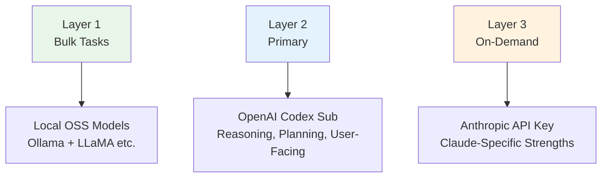

## What Triggered This

In early 2026, Anthropic (Claude) and Google (Gemini) updated their Terms of Service. The key question: <strong>can you use subscription plan (Pro/Max) OAuth with third-party tools like OpenClaw?</strong>

Many OpenClaw users had been connecting Claude Pro or Gemini Advanced via OAuth to run their agents. After the ToS changes, uncertainty spread — "Is this still okay?" — and the community began searching for alternatives.

The short answer: <strong>OpenAI's ChatGPT Plus/Pro subscription includes Codex OAuth, which explicitly permits third-party integration.</strong> This guide walks through the actual migration process and what to watch out for.

## Before You Switch

Check three things before jumping in.

- <strong>Prompt compatibility</strong>: Claude and GPT-5.x-Codex respond differently to the same prompts. Expect to spend a few days tuning `SOUL.md` and `AGENTS.md`
- <strong>Different strengths</strong>: Codex excels at code generation and tool use. For natural prose — essays, social posts — Claude consistently gets higher marks from the community
- <strong>The API key option</strong>: If you want to keep Claude, the API key approach (`console.anthropic.com`) is still fully legal. Just be aware that running Opus agent loops can easily exceed $100/month

## Migration Steps (4 Steps, ~15 Minutes)

This is the community-verified procedure.

### Step 1: Backup

Back up your entire OpenClaw configuration first.

```bash
cd ~
tar -czf openclaw-backup.tgz .openclaw
```

This single command captures channel settings, memory, cron jobs, and auth credentials.

### Step 2: Run the Onboarding Wizard

```bash
openclaw onboard --auth-choice openai-codex
```

The wizard asks a few questions. Follow the table below.

| Screen | Choice | Why |
|--------|--------|-----|
| "This is risky" warning | <strong>Proceed</strong> | It's informing you about behavioral differences — nothing more |
| Setup mode | <strong>Quickstart</strong> | Uses defaults for fast setup |
| Existing values | <strong>⚠️ Always choose "Use existing values"</strong> | "Reset" wipes your channels, memory, and cron configs |

When the browser opens, log in with your ChatGPT account and authorize.

<strong>🔴 Important</strong>: Once authorized, <strong>close the terminal wizard immediately.</strong> Running it to completion with existing settings can trigger unwanted overwrites.

### Step 3: Set the Default Model

```bash
openclaw models set openai-codex/gpt-5.3-codex
```

### Step 4: Verify

```bash
openclaw models status --plain
```

If `primary` shows `openai-codex/gpt-5.3-codex`, you're done.

## Removing Anthropic Auth (Optional)

To cleanly remove the previous provider's credentials:

```bash
# Remove fallback models
openclaw models fallbacks clear

# Remove auth order
openclaw models auth order clear --provider anthropic

# Clean environment variables (~/.openclaw/.env)
# Delete: ANTHROPIC_API_KEY=...

# Restart and verify
openclaw gateway restart
openclaw doctor
```

## Per-Agent Model Settings — The Easy-to-Miss Part

This is the most common post-migration mistake. <strong>`openclaw models set` only changes the global default.</strong> Any agent with an explicit model override keeps using the old model.

Check `agents.list` in your `openclaw.json`:

```json
{
  "agents": {
    "defaults": {
      "model": {
        "primary": "openai-codex/gpt-5.3-codex"  // ← Global (updated)
      }
    },
    "list": [
      {
        "id": "branding",
        "model": {
          "primary": "anthropic/claude-opus-4-6"  // ← Still Claude
        }
      }
    ]
  }
}
```

Two ways to fix this:

```bash
# Option 1: Override per cron job
openclaw cron edit <cron-id> --model "openai-codex/gpt-5.3-codex"

# Option 2: Delete the agent's model block → falls back to global default
```

For a full switch, deleting per-agent `model` blocks is the simplest approach.

## The Layer Strategy — Community-Recommended Architecture

Instead of going all-in on one provider, the community has converged on a <strong>layer strategy</strong> that distributes workloads by model strength.



| Layer | Purpose | Model | Billing |
|-------|---------|-------|---------|
| <strong>Layer 1</strong> | File processing, exploration | Local OSS (Ollama + LLaMA) | Free (electricity only) |
| <strong>Layer 2</strong> | Reasoning, planning, user-facing | OpenAI Codex subscription | Monthly |
| <strong>Layer 3</strong> | When Claude's strengths matter | Anthropic API key | Per-token |

The payoff: when a provider changes policy, <strong>you update one line in your config</strong> — not your entire workflow.

## What to Expect After Switching

Common observations from users who've made the switch:

- <strong>Prompt tuning is unavoidable</strong>: Budget a few days to adjust `SOUL.md` and `AGENTS.md` until things stabilize
- <strong>Code and tool use are noticeably stronger</strong>: Codex delivers measurably better results for code generation and tool calls
- <strong>Natural writing takes a step back</strong>: Essays and social media posts feel less polished compared to Claude
- <strong>Stability is a real advantage</strong>: OAuth auth is reliable, and you can run agent loops without tracking token burn

## If You Want to Keep Claude

The API key approach works independently of ToS restrictions on subscription OAuth.

```bash
openclaw onboard --auth-choice anthropic
```

Generate an API key at `console.anthropic.com` and pay per token. For Opus agent loops, monthly costs frequently exceed $100 — keep an eye on usage.

## Comparison at a Glance

| Aspect | Claude Sub OAuth | Codex Sub OAuth | Claude API Key |
|--------|-----------------|-----------------|----------------|
| ToS Risk | ⚠️ Uncertain | ✅ Explicitly allowed | ✅ Legal |
| Monthly Cost | Subscription | Subscription | Usage-based |
| Writing Quality | ⭐⭐⭐ | ⭐⭐ | ⭐⭐⭐ |
| Code/Tools | ⭐⭐ | ⭐⭐⭐ | ⭐⭐ |
| Migration Effort | — | Easy (~15 min) | Easy |

The most important takeaway: <strong>don't lock yourself into a single provider.</strong> OpenClaw's config-driven architecture lets you swap providers with minimal friction — use that to your advantage.

## References

- [OpenClaw Docs — Provider Setup](https://docs.openclaw.ai/providers/openai)
- [OpenClaw Discord Community](https://discord.com/invite/clawd)
- [OpenAI Codex Auth Guide](https://docs.openclaw.ai/cli/index)
