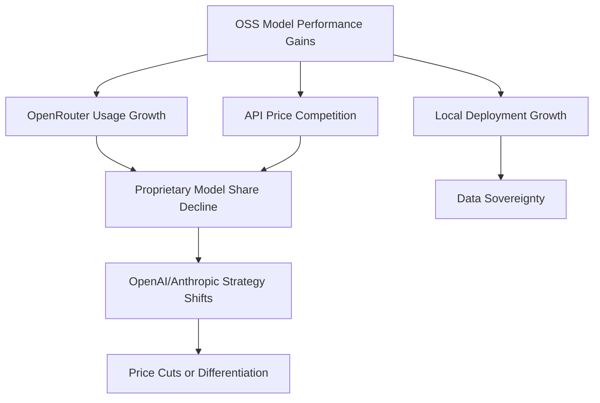

## Overview

A remarkable shift has been observed in <strong>OpenRouter</strong>'s weekly usage rankings. <strong>Four out of the top five models are open source</strong>. Qwen3-Coder, DeepSeek R2, MiniMax M2.5, and others have taken over the leaderboard, signaling that the long-assumed dominance of proprietary models is crumbling.

This article analyzes the structural reasons why open-source models have surpassed proprietary ones in actual usage on OpenRouter.

## OpenRouter Weekly Rankings: What Changed

### TOP 5 Composition

According to data shared on Reddit's r/LocalLLaMA community, the OpenRouter weekly usage TOP 5 is as follows:

| Rank | Model | Type | Key Feature |
|------|-------|------|-------------|
| 1 | Qwen3-Coder | 🟢 OSS | Alibaba's coding-specialized model |
| 2 | DeepSeek R2 | 🟢 OSS | Reasoning-focused large model |
| 3 | MiniMax M2.5 | 🟢 OSS | Cost-efficient general-purpose model |
| 4 | GPT-4.1 | 🔵 Proprietary | OpenAI's flagship |
| 5 | Llama 4 Maverick | 🟢 OSS | Meta's open-source large model |

The fact that 4 out of 5 are open source carries meaning beyond mere numbers — these are <strong>real developers paying real money making this choice</strong>.

### Why OpenRouter Matters

OpenRouter provides access to various AI models through a single API. Users select models themselves and pay based on actual token usage. This ranking therefore reflects <strong>real-world usage preferences, not marketing or benchmarks</strong>.

## 5 Reasons Open-Source Models Are Winning

### 1. Overwhelming Cost Efficiency

Open-source models benefit from active competition among API providers, resulting in significantly lower costs for equivalent performance. Qwen3-Coder offers similar coding performance to GPT-4.1 at <strong>roughly 1/10th the price</strong>.

```
Cost Comparison (per 1M tokens, estimated):
┌─────────────────┬──────────┬──────────┐
│ Model           │ Input    │ Output   │
├─────────────────┼──────────┼──────────┤
│ GPT-4.1         │ $2.00    │ $8.00    │
│ Qwen3-Coder     │ $0.20    │ $0.60    │
│ DeepSeek R2     │ $0.30    │ $1.20    │
│ MiniMax M2.5    │ $0.15    │ $0.60    │
└─────────────────┴──────────┴──────────┘
```

### 2. The Performance Gap Has Vanished

Until 2024, GPT-4 held an overwhelming performance advantage. Through 2025-2026, open-source model capabilities improved dramatically:

- <strong>Qwen3-Coder</strong>: Matches or exceeds GPT-4.1 on coding benchmarks
- <strong>DeepSeek R2</strong>: Top-tier performance in math and reasoning with strong Chain-of-Thought capabilities
- <strong>MiniMax M2.5</strong>: Best cost-to-performance ratio for general tasks

### 3. Transparency and Customizability

Open-source models with public weights enable:

- <strong>Fine-tuning</strong>: Custom optimization for specific domains
- <strong>Local deployment</strong>: Ensuring data privacy
- <strong>Architecture understanding</strong>: Verifying model behavior
- <strong>Self-hosting</strong>: Building vendor-independent infrastructure

### 4. Aggressive Open-Source Strategy from Chinese AI Companies

Chinese AI companies like Alibaba (Qwen), DeepSeek, and MiniMax have adopted a strategy of releasing their best models as open source:

- <strong>Ecosystem preemption</strong>: Capturing developer communities
- <strong>API revenue model</strong>: Attracting users with open source, monetizing via cloud APIs
- <strong>Global influence expansion</strong>: Differentiating from Western proprietary models

### 5. Community-Driven Optimization

Open-source models are rapidly optimized by the community after release:

- <strong>Quantization</strong>: Cost reduction via GGUF, GPTQ, AWQ formats
- <strong>Inference optimization</strong>: High-performance engines like vLLM and TensorRT-LLM
- <strong>Adapter sharing</strong>: Domain specialization through LoRA adapters

## Remaining Strengths of Proprietary Models

Despite the open-source surge, proprietary models still hold advantages in certain areas:

- <strong>Multimodal integration</strong>: Vision and voice capabilities of GPT-4o, Gemini
- <strong>Enterprise support</strong>: SLAs, compliance, technical support
- <strong>Safety filtering</strong>: Enterprise-grade safety guardrails
- <strong>Cutting-edge research</strong>: New architectural innovations still originate from major labs

However, even these advantages are being rapidly caught up by the open-source community.

## Industry Impact



### Implications for Developers

1. <strong>Adopt multi-model strategies</strong>: Avoid single-vendor lock-in using routers like OpenRouter
2. <strong>Optimize costs</strong>: Select the best model per task (coding → Qwen3-Coder, reasoning → DeepSeek R2)
3. <strong>Consider local deployment</strong>: Self-host open-source models for sensitive data processing
4. <strong>Engage with the community</strong>: Share and leverage quantization and fine-tuning results

## Conclusion

Four open-source models occupying the OpenRouter weekly TOP 5 is not a momentary blip. It's a <strong>paradigm shift</strong> driven by five structural factors: cost efficiency, performance parity, customizability, aggressive Chinese corporate strategies, and community optimization.

Proprietary models won't disappear, but the equation "best performance = proprietary" has already been broken. The future AI ecosystem is entering an era where <strong>practicality and cost efficiency are the core criteria for model selection</strong>.

## References

- [Reddit r/LocalLLaMA — 4 of the top 5 most used models on OpenRouter this week are Open Source](https://www.reddit.com/r/LocalLLaMA/comments/1r6g14s/4_of_the_top_5_most_used_models_on_openrouter/)
- [OpenRouter Rankings](https://openrouter.ai/rankings)
- [Qwen3-Coder Official Page](https://huggingface.co/Qwen)
- [DeepSeek Official Site](https://www.deepseek.com/)
