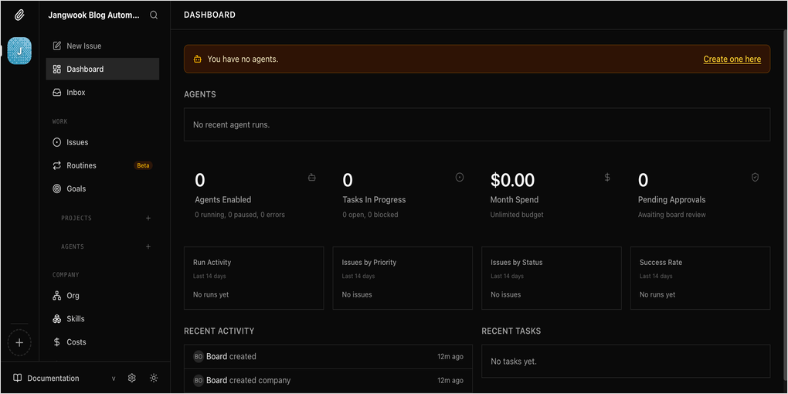
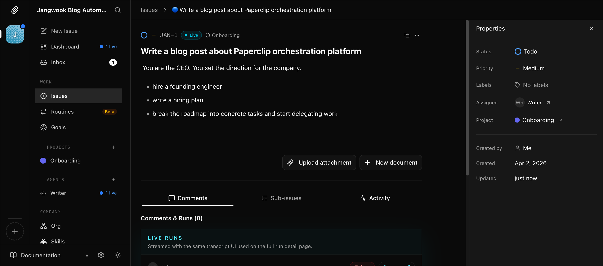
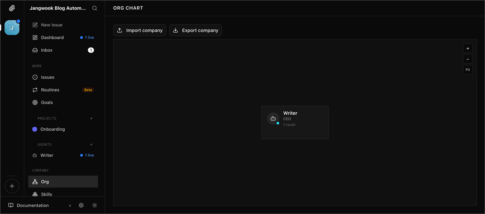
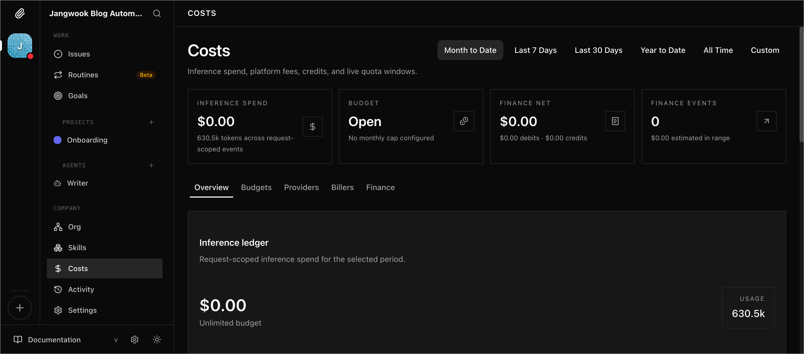

Have you ever had 20 Claude Code terminals open at once? I have. When you're writing blog posts in four languages while running a research agent, an image generation agent, and a translation agent simultaneously, there comes a point where you start losing track of who's doing what. Distinguishing them by terminal tab names has its limits, and costs vary so much that calculating the monthly total becomes a chore.

[Paperclip](https://github.com/paperclipai/paperclip) tackles this problem head-on. The tagline is provocative: "Open-source orchestration for zero-human companies." The idea is to manage agents as employees and groups of agents as companies.

I installed it and gave it a spin.

## Installation: Easier Than Expected

```bash
git clone https://github.com/paperclipai/paperclip.git
cd paperclip
pnpm install
pnpm build
pnpm dev:once
```

All you need is Node 20+ and pnpm 9.x. The build takes about 30 seconds, and on launch, a built-in PostgreSQL instance starts automatically. I appreciated not needing a separate database setup. If you don't set `DATABASE_URL`, it uses a local embedded Postgres; for production, you can connect an external Postgres instance.

Navigate to `http://127.0.0.1:3100` and you'll see the onboarding wizard.

## Onboarding: A 4-Step Wizard

Company, Agent, Task, Launch. That's the flow.

You enter a company name and mission, create an agent, assign a task, and run it. In my case, I created a company called "Jangwook Blog Automation" and hired a Claude Code agent named "Writer."

There's a wide variety of agent adapters. Claude Code and Codex are marked as "Recommended," and expanding the list reveals Gemini CLI, OpenCode, Pi, Cursor, Hermes Agent, and OpenClaw Gateway. The README says "If it can receive a heartbeat, it's hired" -- and seeing the range of supported runtimes, that doesn't seem like an exaggeration.

## Dashboard: Heavily Inspired by Linear



My first thought upon seeing the dashboard was "Is this Linear?" The dark theme, sidebar navigation, and issue tracker layout all feel familiar. That's not a bad thing -- it means developers can get up to speed immediately.

Here's the sidebar structure:
- <strong>WORK</strong>: Issues, Routines (Beta), Goals
- <strong>PROJECTS</strong>: Issues grouped by project
- <strong>AGENTS</strong>: Agent list + real-time status
- <strong>COMPANY</strong>: Org, Skills, Costs, Activity, Settings

It looks like a task manager, but underneath there are org charts, budgets, and governance. The README puts it well: "It looks like a task manager -- but under the hood it has org charts, budgets, governance."

## Running It: Real-Time Streaming Was Impressive

After creating a task and hitting Launch, the Writer agent immediately started calling Claude Code. A "1 live" indicator appeared in the sidebar, and STDOUT streamed in real time on the issue page.



In my case, the execution ended with a "failed" status. The reason was straightforward -- running inside `_sandbox/`, the Claude Code API key configuration didn't seem to be set up correctly. This isn't Paperclip's fault; since the agent adapter calls the local CLI, the environment has to be configured properly. There's an "Adapter environment check" test button during onboarding, but the fact that you can pass the test and still fail on actual tasks is a bit disappointing.

## Org Chart: Agents Displayed as Employee Cards



Each agent is displayed as a card with a name, title, and number of assigned issues. When you create multiple agents, you can set up a hierarchy. A CEO agent delegates tasks to a CTO agent, who then delegates to engineer agents, and so on.

Honestly, it's overkill when you're only using one agent. Paperclip's team acknowledges this too -- the README explicitly states "Not for single agents." It starts making sense when you're managing three or more agents simultaneously.

## Cost Management: A Feature I Genuinely Needed



The Costs page is quite detailed. You can view Inference Spend, Budget, Finance Net, and Finance Events by period (Month to Date, Last 7 Days, Last 30 Days, etc.), and set per-agent token budgets.

The question I ask most when writing my blog is "How much did I spend on agents this month?" -- and right now, I have to dig through terminal logs one by one to calculate it. Having a single dashboard that shows all of this is clearly valuable.

## My Verdict

<strong>The Good:</strong>

Installation is simple thanks to the built-in PostgreSQL. One `pnpm dev:once` command and the server is up. The UI polish is high, and if you're familiar with Linear, there's virtually no learning curve. The variety of agent adapters means you can manage not just Claude Code but also Codex, Cursor, and Gemini CLI under one roof. The Routines (Beta) feature even enables scheduled execution.

<strong>The Not-So-Good:</strong>

There's no reason to use this if you're only running one agent. It means learning yet another task manager, and with just 1〜2 agents, managing them directly from the terminal is faster. Also, the "zero-human company" tagline is a stretch from reality. In my experience, when an agent fails, a human still has to debug it, and task definitions still require a human. This is a "tool for managing agents," not yet a "tool that replaces humans."

One more thing: you need to understand that Paperclip is <strong>not</strong> an agent framework or a prompt manager. It doesn't create agents for you -- it organizes agents that already exist. It only makes sense if you already have CLI agents like Claude Code or Codex up and running.

## Who Should Use This

- People managing 5+ Claude Code terminals simultaneously
- People who want to track per-agent costs and set budgets
- Teams deploying multiple agents (Claude + Codex + Cursor, etc.) on a single project

I haven't adopted it yet. My blog automation pipeline runs well enough with a single Claude Code instance, so I plan to revisit Paperclip when the time comes to run three or more agents simultaneously. At that point, I'd probably register Writer, Researcher, and SEO Optimizer as separate agents and orchestrate them through Paperclip.

What I want to try next: setting up the Routines feature to automatically run trend research every morning. If that works out, I'll write a follow-up post about it.
