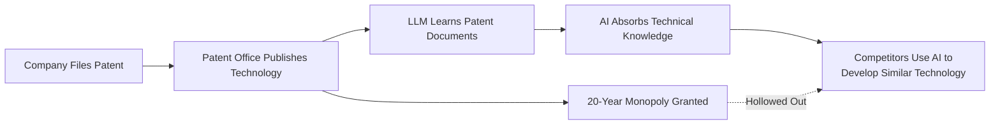
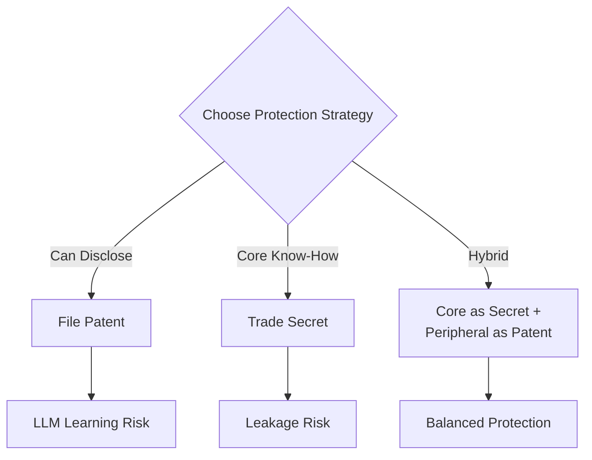

## Overview

Mark Cuban made a thought-provoking observation on X (formerly Twitter): <strong>"When you publish a patent, it becomes training material for LLMs."</strong> The patent system is built on a social contract — disclose your technology in exchange for a monopoly. But as LLMs consume published patent documents at scale, this fundamental premise is beginning to crumble.

This article analyzes how patent strategy must evolve in the LLM era, starting from Cuban's insight.

## Mark Cuban's Core Argument

Cuban's argument can be summarized as follows:

1. <strong>Patents are public documents</strong>: Filing with a patent office means detailed technical disclosure
2. <strong>LLMs learn from public data</strong>: Patent documents are included in training datasets
3. <strong>AI ends up "knowing" patented technology</strong>: The monopoly right exists, but the technical knowledge itself is absorbed by AI

This goes beyond simple patent infringement — it means <strong>the fundamental value exchange of the patent system is breaking down</strong>.

## Why the Patent System's Premise Is Shaking

### The Traditional Social Contract

The patent system has operated on the following premise for over 200 years:

| Inventor Side | Society Side |
|---------------|-------------|
| Disclose technology in detail | Grant 20-year monopoly |
| Describe at an enabling level | Free practice after expiry |
| Contribute to technological progress | Provide foundation for follow-on invention |

### How LLMs Change the Rules

In the LLM era, this contract's balance tips dramatically:

- <strong>Learning speed</strong>: AI learns in seconds what human engineers take years to read
- <strong>Abstraction ability</strong>: AI extracts core ideas from patents and applies them in modified forms
- <strong>Scale problem</strong>: Millions of patents learned simultaneously, discovering connections between technologies
- <strong>Legal gray zone</strong>: Unclear whether development based on AI-learned knowledge constitutes patent infringement

### What's Already Happening

This problem is already materializing in several areas:

1. <strong>Code generation AI</strong>: GitHub Copilot generating code similar to patented algorithms
2. <strong>Drug discovery AI</strong>: AI trained on published pharmaceutical patents designing similar compounds
3. <strong>Hardware design</strong>: AI trained on semiconductor patents assisting with circuit design

## How Companies Should Rethink Patent Strategy

### 1. Revival of Trade Secret Strategy

Protecting through trade secrets instead of patents is gaining renewed attention.

<strong>Advantages</strong>:
- LLMs cannot learn it (it's not public)
- No time limit (20 years vs. perpetual)
- No filing costs

<strong>Disadvantages</strong>:
- Vulnerable to reverse engineering
- Cannot prevent independent invention
- Risk of leakage through employee turnover

### 2. Strengthening Defensive Patent Strategy

Using patents as <strong>defensive tools</strong> rather than offensive weapons:

- <strong>Patent pools</strong>: Industry-wide patent sharing for mutual deterrence
- <strong>Defensive publication</strong>: Publishing technology as prior art instead of patenting, preventing competitors from patenting
- <strong>Cross-licensing</strong>: Mutual technology exchange through reciprocal licenses

### 3. AI-Era Patent Drafting

Approaches to writing patents that are harder for LLMs to fully learn:

- <strong>Separate core know-how</strong>: Include only minimal information in patents, protect implementation details as trade secrets
- <strong>Control abstraction levels</strong>: Write broad claims but strategically craft specifications
- <strong>Multi-layer protection</strong>: Protect a single technology with a combination of patents and trade secrets

### 4. Legal Responses to Restrict AI Learning

Legal and policy-level responses are also needed:

- <strong>Legislation restricting AI training on patent data</strong>: Under discussion in some countries
- <strong>robots.txt-style patent protection</strong>: Adding learning-restriction metadata to patent databases
- <strong>Patentability of AI-generated inventions</strong>: Whether patents can be granted for AI-created inventions

## Industry Impact Analysis

| Industry | Impact Level | Key Risk | Recommended Strategy |
|----------|-------------|----------|---------------------|
| Pharma/Biotech | Very High | Compound patents used for AI drug discovery | Trade secret + patent hybrid |
| Semiconductors | High | Circuit design patents used in AI-assisted design | Keep core processes as trade secrets |
| Software | Medium | Algorithm patents affecting code generation | Open source + service model pivot |
| Manufacturing | Medium | Structural patents used in CAD automation | Maintain manufacturing know-how secrecy |

## Conclusion

Mark Cuban's observation isn't mere concern — it's a call for <strong>fundamental re-examination of the patent system</strong>. In an era where LLMs absorb all public knowledge, the 200-year-old social contract of "disclosure equals monopoly" may no longer serve its intended purpose.

Companies should immediately consider three things:

1. <strong>Assess LLM exposure of their current patent portfolio</strong>
2. <strong>Redesign the optimal mix of trade secrets and patents</strong>
3. <strong>Develop an IP strategy roadmap suited for the AI era</strong>

The paradigm of patent strategy is shifting. Only companies that adapt quickly will maintain their technological edge.

## References

- [Mark Cuban's X Post](https://x.com/mcuban/status/2020857921928581592) — Original post on patent disclosure and LLM learning
- [WIPO — AI and Intellectual Property](https://www.wipo.int/about-ip/en/artificial_intelligence/) — World Intellectual Property Organization's AI policy discussions
- [USPTO — AI-Related Patent Guidelines](https://www.uspto.gov/initiatives/artificial-intelligence) — U.S. Patent Office guidance on AI inventions
