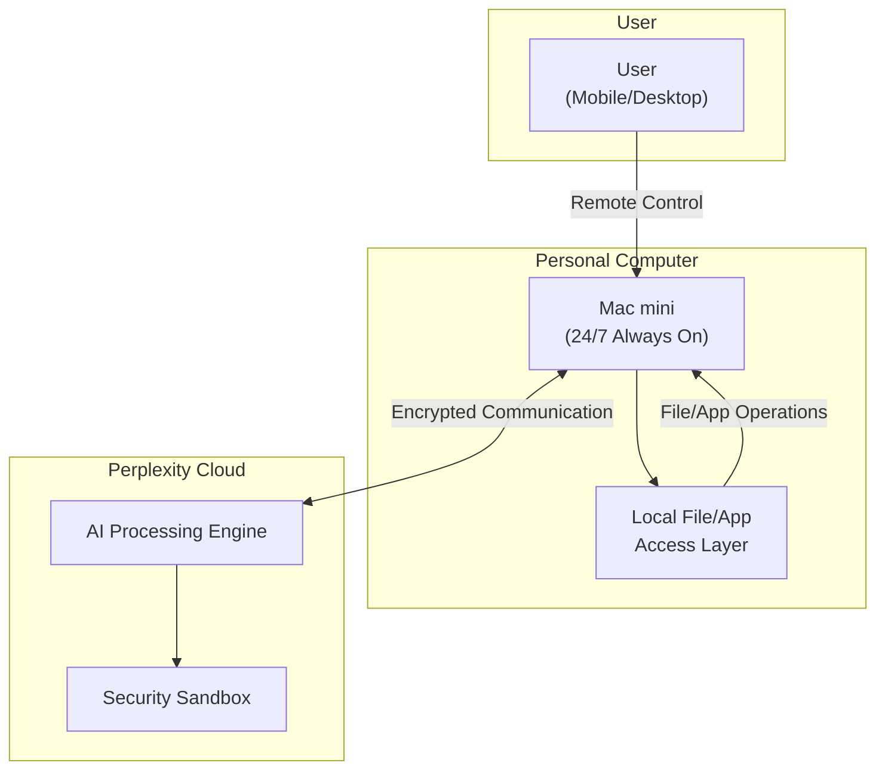
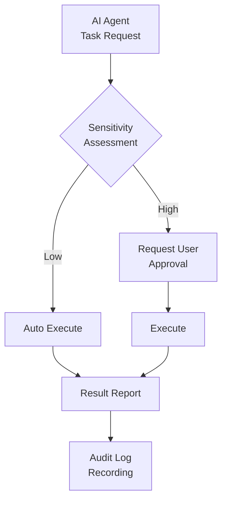

## 'Everything is Computer' — AI Is the Computer

On March 11, 2026, Perplexity unveiled its <strong>'Everything is Computer'</strong> vision, launching three products simultaneously: Computer, Personal Computer, and Computer for Enterprise. The core message was simple — AI is no longer a 'tool' but rather a 'computer that works on your behalf.'

This article analyzes the impact Perplexity Computer will have on development teams and organizations from an EM (Engineering Manager) perspective.

## Perplexity Computer Product Line Analysis

### 1. Computer — Cloud AI Agent

The base product, Computer, is an AI agent that runs in Perplexity's cloud. It performs tasks like web browsing, code execution, and data analysis on behalf of the user.

### 2. Personal Computer — 24/7 Always-On AI Proxy

<strong>The most noteworthy product</strong> is Personal Computer. It runs continuously on a dedicated Mac mini, functioning as a digital proxy that accesses your files and apps to handle tasks around the clock.

Key features:

- <strong>Always on</strong>: Runs 24/7 on a Mac mini, continuing work even while you sleep
- <strong>Local access</strong>: Direct access to the Mac's file system and applications
- <strong>Remote control</strong>: Controllable from anywhere on any device
- <strong>Security model</strong>: Sensitive actions require user approval, all actions are logged, kill switch built in
- <strong>Pricing</strong>: $200/month subscription

### 3. Computer for Enterprise — Organization-Level AI Agent

The Enterprise version is designed for <strong>teams and organizations</strong>, not individuals. It integrates directly with business software like Snowflake, Salesforce, and HubSpot, and can collaborate through Slack DMs and channels.

<strong>Key result</strong>: In an internal test covering over 16,000 queries, using institutional benchmarks from McKinsey, Harvard, MIT, and BCG, the system <strong>completed 3.25 years of work in just 4 weeks</strong>, saving approximately $1.6 million in labor costs.

Security infrastructure:

- SOC 2 Type II certification
- SAML SSO
- Audit logs
- Admin controls
- Tasks executed in isolated cloud environments

## 4 Weeks = 3.25 Years: What the Numbers Mean

Let's break down Perplexity's Enterprise test results.

| Metric | Value |
|---|---|
| Queries processed | 16,000+ |
| Equivalent work time | 3.25 years (~6,760 hours) |
| Actual time spent | 4 weeks (~672 hours) |
| Productivity multiplier | <strong>~10x</strong> |
| Labor cost savings | $1.6M |

From an EM's perspective, these numbers suggest two things.

<strong>First, automation of repetitive analytical work</strong>. Tasks like financial data lookups, market analysis, and report generation can be handled by AI agents. Team members are freed from these repetitive tasks to focus on higher-value decision-making.

<strong>Second, the emergence of 'AI headcount'</strong>. At $200/month, it's comparable to hiring a junior analyst who works 24 hours a day. Add 2 AI agents to a 10-person team, and you can potentially achieve the output of a 12-person team.

## 3 Key Points EMs Should Watch

### 1. Governance Model — Balancing Trust and Control

Perplexity Computer introduces an interesting governance model.

The key concept is <strong>Graduated Authority</strong>. Low-risk tasks are executed automatically, while sensitive tasks require approval. All actions are logged, and a kill switch enables immediate termination.

This pattern aligns with the principles proposed by Galileo's Agent Control (an open-source AI agent governance platform released on March 13). In enterprise AI agent operations, <strong>centralized policy management</strong> and <strong>runtime mitigation</strong> are becoming industry standards.

### 2. How 'Always-On AI' Transforms Work Patterns

Having AI agents operate around the clock means <strong>maximizing asynchronous work</strong>.

- <strong>AS-IS</strong>: Work → Leave office → Continue the next day
- <strong>TO-BE</strong>: Assign tasks → Leave office → AI works overnight → Review results in the morning

Once this pattern becomes viable, team throughput increases dramatically. However, EMs will need new management capabilities.

- <strong>Task decomposition skills</strong>: The ability to distinguish between tasks that can be delegated to AI and tasks that require human involvement
- <strong>Output review skills</strong>: The ability to quickly verify the quality of AI-generated outputs
- <strong>Asynchronous orchestration</strong>: Managing AI agent task queues and adjusting priorities

### 3. Cost-Benefit Analysis

| Comparison | Junior Developer | Perplexity Personal Computer |
|---|---|---|
| Monthly cost | $4,000-$6,000 | $200 |
| Available hours | 8 hours/day | 24 hours/day |
| Task scope | Broad | Specialized in analysis/research/automation |
| Judgment | High | Limited (supervision required) |
| Growth potential | Unlimited | Dependent on model updates |

AI agents are not meant to <strong>replace</strong> junior developers but serve as tools for team <strong>augmentation</strong>. Instead of assigning repetitive tasks to junior developers, let AI agents handle them and guide junior developers toward solving higher-level problems.

## Competitive Landscape and Market Outlook

Perplexity Computer does not exist in a vacuum. The 'always-on AI agent' market is forming rapidly.

| Product | Features | Approach |
|---|---|---|
| Perplexity Personal Computer | Mac mini-based 24/7 agent | Dedicated hardware + cloud AI |
| OpenClaw | Open-source AI assistant (210K stars) | Runs on your own hardware |
| Anthropic Claude | MCP-based tool integration agent | API + protocol standardization |
| OpenAI Codex | Coding-specialized agent | Cloud only |

Gartner predicts that <strong>40% of enterprise apps will feature AI agents by the end of 2026</strong> (up sharply from less than 5% in 2025). Always-on AI agents are at the forefront of this trend.

## Considerations for Adoption

There's no need to adopt Perplexity Computer right away. However, the following preparations are essential.

1. <strong>Catalog AI-delegatable tasks</strong>: List out the repetitive research, analysis, and report generation tasks performed within your team.
2. <strong>Design a governance framework</strong>: Define what level of authority AI agents should have and which tasks require human approval.
3. <strong>Design asynchronous workflows</strong>: Build processes for delegating tasks to AI agents and reviewing their outputs.
4. <strong>Review security policies</strong>: Examine security policies for local file access, cloud data transmission, and audit log management.

## Conclusion

The launch of Perplexity Computer marks a watershed moment where AI agents evolve from 'conversational tools' to 'always-on task processors.' A digital proxy that works 24 hours a day for $200/month, an enterprise agent that completes 3.25 years of work in 4 weeks — these numbers are no longer science fiction.

What matters for EMs and CTOs is not the technology itself but <strong>the strategy for integrating it into their teams</strong>. Organizations that design governance models, build asynchronous workflows, and clearly define the roles of AI and humans will come out ahead.

## References

- [Perplexity: Everything is Computer](https://www.perplexity.ai/hub/blog/everything-is-computer)
- [Computer for Enterprise](https://www.perplexity.ai/hub/blog/computer-for-enterprise)
- [Perplexity Personal Computer — 9to5Mac](https://9to5mac.com/2026/03/11/perplexitys-personal-computer-is-a-cloud-based-ai-agent-running-on-mac-mini/)
- [Enterprise 3.25 Years in 4 Weeks — PYMNTS](https://www.pymnts.com/news/artificial-intelligence/2026/perplexity-computer-enterprise-completed-3-years-work-4-weeks/)
- [Gartner AI Agent Prediction](https://www.gartner.com/en/newsroom/press-releases/2025-08-26-gartner-predicts-40-percent-of-enterprise-apps-will-feature-task-specific-ai-agents-by-2026-up-from-less-than-5-percent-in-2025)
