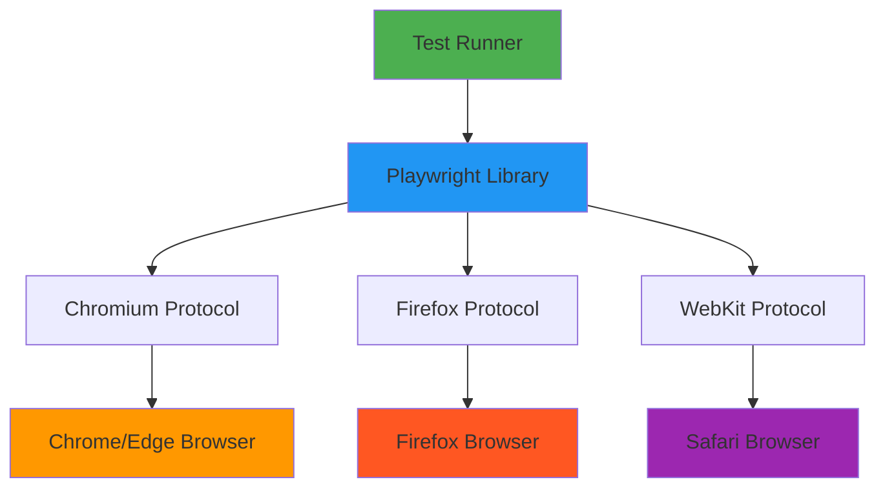

End-to-end (E2E) testing has long been the bottleneck in modern web development. While unit and integration tests are relatively straightforward to write and maintain, E2E tests often suffer from flakiness, slow execution, and maintenance overhead. Enter Playwright with AI-powered test generation—a paradigm shift that transforms how we approach browser automation and testing.

In this comprehensive guide, we'll explore how to leverage Playwright's cutting-edge features alongside AI tools to build robust, maintainable E2E test suites that actually work in production.

## The Problem with Traditional E2E Testing

Before diving into solutions, let's acknowledge the pain points:

- <strong>Flaky tests</strong>: Tests that pass sometimes and fail other times
- <strong>Slow feedback loops</strong>: Waiting minutes for test results
- <strong>Brittle selectors</strong>: Tests breaking when UI changes
- <strong>Maintenance burden</strong>: Spending more time fixing tests than writing features
- <strong>Poor developer experience</strong>: Debugging failures in headless browsers

Playwright addresses these challenges through intelligent defaults, powerful APIs, and most importantly—AI-powered tooling that helps you write better tests faster.

## Core Playwright Concepts

### Architecture Overview

Playwright operates fundamentally differently from older tools like Selenium:



<strong>Key Differentiators</strong>:

1. <strong>Direct browser control</strong>: Uses native browser automation protocols (CDP for Chromium, custom protocols for Firefox/WebKit)
2. <strong>Auto-wait mechanism</strong>: Automatically waits for elements to be actionable before interacting
3. <strong>Web-first assertions</strong>: Built-in assertions that retry until conditions are met
4. <strong>Network interception</strong>: Full control over network requests and responses
5. <strong>Browser contexts</strong>: Isolated test environments without full browser restarts

### The Auto-Wait Revolution

One of Playwright's most powerful features is automatic waiting. Consider this comparison:

```typescript
// Selenium-style (manual waits - BAD)
await driver.wait(until.elementLocated(By.css('.submit-button')), 10000);
const button = await driver.findElement(By.css('.submit-button'));
await driver.wait(until.elementIsVisible(button), 5000);
await driver.wait(until.elementIsEnabled(button), 5000);
await button.click();

// Playwright (auto-wait - GOOD)
await page.click('.submit-button');
```

Playwright automatically waits for:
- Element to be attached to DOM
- Element to be visible
- Element to be stable (not animating)
- Element to receive events (not covered by another element)
- Element to be enabled

## AI-Powered Test Generation

### Playwright Codegen: Record and Generate

Playwright's Codegen is not just a recorder—it's an intelligent test generator that understands modern web patterns:

```bash
# Basic codegen with browser
npx playwright codegen https://example.com

# Generate tests in specific language
npx playwright codegen --target typescript https://example.com

# Save directly to file
npx playwright codegen -o tests/example.spec.ts https://example.com

# Test against mobile viewport
npx playwright codegen --device="iPhone 13" https://example.com

# With authentication state preserved
npx playwright codegen --save-storage=auth.json https://example.com
```

<strong>What Codegen Does Intelligently</strong>:

1. <strong>Smart selector generation</strong>: Prefers accessible attributes (ARIA, data-testid) over brittle CSS
2. <strong>Action recording</strong>: Captures clicks, typing, navigation, file uploads
3. <strong>Assertion suggestions</strong>: Proposes relevant assertions based on context
4. <strong>Network handling</strong>: Detects API calls and suggests network mocking opportunities

### Playwright MCP: Claude Integration

The Playwright Model Context Protocol (MCP) integration brings LLM intelligence to test automation:

```typescript
// Example: AI-generated test from natural language
// Prompt: "Test user login with valid credentials"

import { test, expect } from '@playwright/test';

test('user login with valid credentials', async ({ page }) => {
  // Navigate to login page
  await page.goto('https://example.com/login');

  // AI understands form structure
  await page.getByLabel('Email').fill('user@example.com');
  await page.getByLabel('Password').fill('SecurePass123!');

  // AI identifies submit button semantically
  await page.getByRole('button', { name: /sign in|log in/i }).click();

  // AI suggests relevant assertion
  await expect(page.getByText('Welcome back')).toBeVisible();
  await expect(page).toHaveURL(/dashboard/);
});
```

<strong>MCP Capabilities</strong>:

- Natural language to test conversion
- Semantic understanding of UI patterns
- Context-aware selector generation
- Test maintenance through refactoring suggestions
- Anomaly detection in test results

## Step-by-Step Implementation Guide

### 1. Project Setup

```bash
# Initialize new Node.js project
npm init -y

# Install Playwright with browsers
npm install -D @playwright/test
npx playwright install

# Project structure
mkdir -p tests/{auth,e2e,visual}
mkdir -p fixtures
mkdir -p utils
```

<strong>Configuration</strong> (`playwright.config.ts`):

```typescript
import { defineConfig, devices } from '@playwright/test';

export default defineConfig({
  // Test directory
  testDir: './tests',

  // Parallel execution
  fullyParallel: true,
  workers: process.env.CI ? 1 : undefined,

  // Retry strategy
  retries: process.env.CI ? 2 : 0,

  // Reporter configuration
  reporter: [
    ['html'],
    ['json', { outputFile: 'test-results.json' }],
    ['junit', { outputFile: 'junit.xml' }]
  ],

  // Global test configuration
  use: {
    // Base URL for navigation
    baseURL: 'http://localhost:3000',

    // Screenshot on failure
    screenshot: 'only-on-failure',

    // Video on retry
    video: 'retain-on-failure',

    // Trace on retry
    trace: 'on-first-retry',

    // Action timeout
    actionTimeout: 10000,
  },

  // Browser projects
  projects: [
    // Desktop browsers
    {
      name: 'chromium',
      use: { ...devices['Desktop Chrome'] },
    },
    {
      name: 'firefox',
      use: { ...devices['Desktop Firefox'] },
    },
    {
      name: 'webkit',
      use: { ...devices['Desktop Safari'] },
    },

    // Mobile emulation
    {
      name: 'mobile-chrome',
      use: { ...devices['Pixel 5'] },
    },
    {
      name: 'mobile-safari',
      use: { ...devices['iPhone 13'] },
    },
  ],

  // Development server
  webServer: {
    command: 'npm run dev',
    url: 'http://localhost:3000',
    reuseExistingServer: !process.env.CI,
    timeout: 120000,
  },
});
```

### 2. Authentication Fixture

Reusable authentication state to avoid logging in for every test:

```typescript
// fixtures/auth.fixture.ts
import { test as base } from '@playwright/test';
import path from 'path';

const authFile = path.join(__dirname, '../.auth/user.json');

export const test = base.extend<{}, { authenticatedContext: void }>({
  // Worker-scoped fixture (runs once per worker)
  authenticatedContext: [async ({ browser }, use) => {
    const context = await browser.newContext();
    const page = await context.newPage();

    // Perform authentication
    await page.goto('/login');
    await page.getByLabel('Email').fill('test@example.com');
    await page.getByLabel('Password').fill('TestPass123!');
    await page.getByRole('button', { name: 'Sign in' }).click();

    // Wait for authentication to complete
    await page.waitForURL('/dashboard');

    // Save authentication state
    await page.context().storageState({ path: authFile });
    await context.close();

    await use();
  }, { scope: 'worker' }],

  // Use authenticated state in tests
  page: async ({ context }, use) => {
    // Load authenticated state
    const authContext = await context.browser()?.newContext({
      storageState: authFile,
    });

    const page = await authContext!.newPage();
    await use(page);
    await authContext!.close();
  },
});
```

<strong>Usage</strong>:

```typescript
// tests/dashboard.spec.ts
import { test } from '../fixtures/auth.fixture';
import { expect } from '@playwright/test';

test.describe('Dashboard', () => {
  test('displays user profile', async ({ page }) => {
    // Already authenticated via fixture
    await page.goto('/dashboard');
    await expect(page.getByRole('heading', { name: 'Dashboard' })).toBeVisible();
  });
});
```

### 3. Page Object Model

Organize selectors and actions in reusable page objects:

```typescript
// pages/checkout.page.ts
import { Page, Locator, expect } from '@playwright/test';

export class CheckoutPage {
  readonly page: Page;
  readonly emailInput: Locator;
  readonly cardNumberInput: Locator;
  readonly expiryInput: Locator;
  readonly cvcInput: Locator;
  readonly submitButton: Locator;
  readonly successMessage: Locator;

  constructor(page: Page) {
    this.page = page;
    this.emailInput = page.getByLabel('Email');
    this.cardNumberInput = page.getByLabel('Card number');
    this.expiryInput = page.getByLabel('Expiration date');
    this.cvcInput = page.getByLabel('CVC');
    this.submitButton = page.getByRole('button', { name: 'Complete purchase' });
    this.successMessage = page.getByText('Payment successful');
  }

  async goto() {
    await this.page.goto('/checkout');
  }

  async fillPaymentDetails(details: {
    email: string;
    cardNumber: string;
    expiry: string;
    cvc: string;
  }) {
    await this.emailInput.fill(details.email);
    await this.cardNumberInput.fill(details.cardNumber);
    await this.expiryInput.fill(details.expiry);
    await this.cvcInput.fill(details.cvc);
  }

  async submitPayment() {
    await this.submitButton.click();
  }

  async verifySuccess() {
    await expect(this.successMessage).toBeVisible();
  }
}
```

<strong>Usage</strong>:

```typescript
// tests/e2e/checkout.spec.ts
import { test } from '@playwright/test';
import { CheckoutPage } from '../../pages/checkout.page';

test('complete checkout flow', async ({ page }) => {
  const checkout = new CheckoutPage(page);

  await checkout.goto();
  await checkout.fillPaymentDetails({
    email: 'test@example.com',
    cardNumber: '4242424242424242',
    expiry: '12/25',
    cvc: '123',
  });
  await checkout.submitPayment();
  await checkout.verifySuccess();
});
```

### 4. Network Mocking

Control API responses for predictable tests:

```typescript
// tests/api-mock.spec.ts
import { test, expect } from '@playwright/test';

test('handle API error gracefully', async ({ page }) => {
  // Mock API endpoint to return error
  await page.route('**/api/users', route => {
    route.fulfill({
      status: 500,
      contentType: 'application/json',
      body: JSON.stringify({ error: 'Internal Server Error' }),
    });
  });

  await page.goto('/users');

  // Verify error UI
  await expect(page.getByText('Failed to load users')).toBeVisible();
  await expect(page.getByRole('button', { name: 'Retry' })).toBeVisible();
});

test('test with mocked data', async ({ page }) => {
  // Mock successful response with custom data
  await page.route('**/api/products', route => {
    route.fulfill({
      status: 200,
      contentType: 'application/json',
      body: JSON.stringify({
        products: [
          { id: 1, name: 'Test Product', price: 99.99 },
          { id: 2, name: 'Another Product', price: 149.99 },
        ],
      }),
    });
  });

  await page.goto('/products');

  // Verify mocked data is displayed
  await expect(page.getByText('Test Product')).toBeVisible();
  await expect(page.getByText('$99.99')).toBeVisible();
});
```

### 5. Visual Regression Testing

Detect unintended visual changes:

```typescript
// tests/visual/homepage.spec.ts
import { test, expect } from '@playwright/test';

test('homepage visual regression', async ({ page }) => {
  await page.goto('/');

  // Full page screenshot comparison
  await expect(page).toHaveScreenshot('homepage.png', {
    fullPage: true,
    // Allow 5% difference for anti-aliasing
    maxDiffPixelRatio: 0.05,
  });
});

test('component visual regression', async ({ page }) => {
  await page.goto('/');

  // Screenshot specific component
  const header = page.getByRole('banner');
  await expect(header).toHaveScreenshot('header.png');

  // Test mobile viewport
  await page.setViewportSize({ width: 375, height: 667 });
  await expect(header).toHaveScreenshot('header-mobile.png');
});

test('visual regression with interactions', async ({ page }) => {
  await page.goto('/products');

  // Hover state
  const productCard = page.getByTestId('product-card').first();
  await productCard.hover();
  await expect(productCard).toHaveScreenshot('product-card-hover.png');

  // Focus state
  const searchInput = page.getByRole('searchbox');
  await searchInput.focus();
  await expect(searchInput).toHaveScreenshot('search-input-focus.png');
});
```

## GitHub Actions CI/CD Integration

Complete workflow for automated testing:

```yaml
# .github/workflows/playwright.yml
name: Playwright Tests

on:
  push:
    branches: [main, develop]
  pull_request:
    branches: [main]

jobs:
  test:
    timeout-minutes: 60
    runs-on: ubuntu-latest

    strategy:
      matrix:
        # Run tests in parallel across multiple shards
        shard: [1, 2, 3, 4]

    steps:
      - name: Checkout code
        uses: actions/checkout@v4

      - name: Setup Node.js
        uses: actions/setup-node@v4
        with:
          node-version: '20'
          cache: 'npm'

      - name: Install dependencies
        run: npm ci

      - name: Install Playwright Browsers
        run: npx playwright install --with-deps

      - name: Run Playwright tests
        run: npx playwright test --shard=${{ matrix.shard }}/${{ strategy.job-total }}
        env:
          CI: true

      - name: Upload test results
        if: always()
        uses: actions/upload-artifact@v4
        with:
          name: playwright-report-${{ matrix.shard }}
          path: playwright-report/
          retention-days: 30

      - name: Upload test traces
        if: failure()
        uses: actions/upload-artifact@v4
        with:
          name: playwright-traces-${{ matrix.shard }}
          path: test-results/
          retention-days: 30

  # Merge reports from all shards
  merge-reports:
    if: always()
    needs: [test]
    runs-on: ubuntu-latest

    steps:
      - name: Checkout code
        uses: actions/checkout@v4

      - name: Setup Node.js
        uses: actions/setup-node@v4
        with:
          node-version: '20'

      - name: Download all reports
        uses: actions/download-artifact@v4
        with:
          path: all-reports/

      - name: Merge HTML reports
        run: npx playwright merge-reports --reporter html all-reports/playwright-report-*

      - name: Upload merged report
        uses: actions/upload-artifact@v4
        with:
          name: playwright-report-merged
          path: playwright-report/
          retention-days: 30

      - name: Deploy report to GitHub Pages
        if: github.ref == 'refs/heads/main'
        uses: peaceiris/actions-gh-pages@v3
        with:
          github_token: ${{ secrets.GITHUB_TOKEN }}
          publish_dir: ./playwright-report
```

<strong>Advanced Features</strong>:

```yaml
# Visual regression testing with Playwright
- name: Run visual regression tests
  run: npx playwright test --grep @visual

# Update screenshots (run manually)
- name: Update snapshots
  if: github.event_name == 'workflow_dispatch'
  run: npx playwright test --update-snapshots

# Run tests against staging environment
- name: Test staging deployment
  run: npx playwright test
  env:
    BASE_URL: https://staging.example.com
```

## Advanced Patterns and Best Practices

### 1. Test Data Management

```typescript
// utils/test-data.ts
import { faker } from '@faker-js/faker';

export class TestDataFactory {
  static createUser() {
    return {
      email: faker.internet.email(),
      password: faker.internet.password({ length: 12 }),
      firstName: faker.person.firstName(),
      lastName: faker.person.lastName(),
    };
  }

  static createProduct() {
    return {
      name: faker.commerce.productName(),
      price: parseFloat(faker.commerce.price()),
      description: faker.commerce.productDescription(),
    };
  }
}

// Usage in tests
test('user registration', async ({ page }) => {
  const user = TestDataFactory.createUser();
  await page.goto('/register');
  await page.getByLabel('Email').fill(user.email);
  await page.getByLabel('Password').fill(user.password);
  // ...
});
```

### 2. Custom Assertions

```typescript
// utils/custom-matchers.ts
import { expect } from '@playwright/test';

expect.extend({
  async toHaveLoadedWithin(page: Page, maxTime: number) {
    const loadTime = await page.evaluate(() => {
      return performance.timing.loadEventEnd - performance.timing.navigationStart;
    });

    return {
      pass: loadTime <= maxTime,
      message: () => `Expected page to load within ${maxTime}ms, but took ${loadTime}ms`,
    };
  },

  async toBeAccessible(locator: Locator) {
    const violations = await locator.evaluate(async (element) => {
      // Use axe-core for accessibility testing
      const { default: axe } = await import('axe-core');
      const results = await axe.run(element);
      return results.violations;
    });

    return {
      pass: violations.length === 0,
      message: () => `Found ${violations.length} accessibility violations`,
    };
  },
});
```

### 3. Performance Testing

```typescript
// tests/performance.spec.ts
import { test, expect } from '@playwright/test';

test('measure page performance', async ({ page }) => {
  await page.goto('/');

  const metrics = await page.evaluate(() => {
    const navigation = performance.getEntriesByType('navigation')[0] as PerformanceNavigationTiming;
    return {
      domContentLoaded: navigation.domContentLoadedEventEnd - navigation.domContentLoadedEventStart,
      loadComplete: navigation.loadEventEnd - navigation.loadEventStart,
      firstPaint: performance.getEntriesByType('paint')[0]?.startTime,
      firstContentfulPaint: performance.getEntriesByType('paint')[1]?.startTime,
    };
  });

  // Assert performance budgets
  expect(metrics.domContentLoaded).toBeLessThan(1000);
  expect(metrics.loadComplete).toBeLessThan(2000);
  expect(metrics.firstContentfulPaint).toBeLessThan(1500);
});

test('measure Core Web Vitals', async ({ page }) => {
  await page.goto('/');

  const webVitals = await page.evaluate(() => {
    return new Promise((resolve) => {
      let lcp = 0;
      let fid = 0;
      let cls = 0;

      new PerformanceObserver((list) => {
        for (const entry of list.getEntries()) {
          if (entry.entryType === 'largest-contentful-paint') {
            lcp = entry.startTime;
          }
        }
      }).observe({ entryTypes: ['largest-contentful-paint'] });

      new PerformanceObserver((list) => {
        for (const entry of list.getEntries()) {
          if (entry.entryType === 'first-input') {
            fid = entry.processingStart - entry.startTime;
          }
        }
      }).observe({ entryTypes: ['first-input'] });

      new PerformanceObserver((list) => {
        for (const entry of list.getEntries()) {
          if (!entry.hadRecentInput) {
            cls += entry.value;
          }
        }
      }).observe({ entryTypes: ['layout-shift'] });

      setTimeout(() => resolve({ lcp, fid, cls }), 5000);
    });
  });

  expect(webVitals.lcp).toBeLessThan(2500); // Good LCP
  expect(webVitals.fid).toBeLessThan(100);  // Good FID
  expect(webVitals.cls).toBeLessThan(0.1);  // Good CLS
});
```

### 4. Parallel Testing Best Practices

```typescript
// playwright.config.ts - Optimal parallelization
export default defineConfig({
  // Run tests in parallel within files
  fullyParallel: true,

  // Worker configuration
  workers: process.env.CI
    ? 4  // Fixed workers in CI
    : '50%',  // 50% of CPU cores locally

  // Timeout configuration
  timeout: 30000,
  expect: {
    timeout: 5000,
  },

  // Global setup for parallel tests
  globalSetup: require.resolve('./global-setup.ts'),
  globalTeardown: require.resolve('./global-teardown.ts'),
});

// global-setup.ts
import { chromium, FullConfig } from '@playwright/test';

async function globalSetup(config: FullConfig) {
  // Start test database
  // Seed test data
  // Start mock servers

  const browser = await chromium.launch();
  const page = await browser.newPage();

  // Setup authentication for all workers
  await page.goto('http://localhost:3000/login');
  await page.getByLabel('Email').fill('test@example.com');
  await page.getByLabel('Password').fill('password');
  await page.getByRole('button', { name: 'Sign in' }).click();

  await page.context().storageState({ path: '.auth/user.json' });
  await browser.close();
}

export default globalSetup;
```

## Common Pitfalls and Solutions

### 1. Flaky Tests

<strong>Problem</strong>: Tests that fail intermittently

<strong>Solutions</strong>:

```typescript
// BAD: Hard-coded waits
await page.click('.button');
await page.waitForTimeout(5000); // Brittle!
await expect(page.getByText('Success')).toBeVisible();

// GOOD: Web-first assertions with auto-retry
await page.click('.button');
await expect(page.getByText('Success')).toBeVisible({ timeout: 10000 });

// BETTER: Wait for specific network events
await Promise.all([
  page.waitForResponse(response =>
    response.url().includes('/api/submit') && response.status() === 200
  ),
  page.click('.button'),
]);
await expect(page.getByText('Success')).toBeVisible();
```

### 2. Slow Tests

<strong>Problem</strong>: Tests taking too long to execute

<strong>Solutions</strong>:

```typescript
// Use browser context instead of full browser instances
test.describe.parallel('User tests', () => {
  test('test 1', async ({ browser }) => {
    const context = await browser.newContext();
    const page = await context.newPage();
    // ... test logic
    await context.close();
  });
});

// Disable unnecessary resources
await page.route('**/*.{png,jpg,jpeg,svg,webp}', route => route.abort());
await page.route('**/*analytics*.js', route => route.abort());

// Use authentication state instead of logging in every time
test.use({ storageState: '.auth/user.json' });
```

### 3. Brittle Selectors

<strong>Problem</strong>: Tests break when UI changes

<strong>Solutions</strong>:

```typescript
// BAD: Fragile CSS selectors
await page.click('.container > div:nth-child(2) > button.submit');

// GOOD: Semantic selectors
await page.getByRole('button', { name: 'Submit' }).click();
await page.getByLabel('Email').fill('test@example.com');
await page.getByTestId('submit-form').click();

// BEST: Combine strategies with priority
await page.getByTestId('submit-button').or(
  page.getByRole('button', { name: /submit/i })
).click();
```

## Real-World Example: Complete E2E Test Suite

```typescript
// tests/e2e/shopping-flow.spec.ts
import { test, expect } from '@playwright/test';
import { HomePage } from '../../pages/home.page';
import { ProductPage } from '../../pages/product.page';
import { CartPage } from '../../pages/cart.page';
import { CheckoutPage } from '../../pages/checkout.page';

test.describe('Complete Shopping Flow', () => {
  let home: HomePage;
  let product: ProductPage;
  let cart: CartPage;
  let checkout: CheckoutPage;

  test.beforeEach(async ({ page }) => {
    home = new HomePage(page);
    product = new ProductPage(page);
    cart = new CartPage(page);
    checkout = new CheckoutPage(page);
  });

  test('end-to-end purchase flow', async ({ page }) => {
    // Step 1: Navigate to homepage
    await home.goto();
    await expect(page).toHaveTitle(/Shop/);

    // Step 2: Search for product
    await home.searchFor('laptop');
    await expect(home.searchResults).toHaveCount.greaterThan(0);

    // Step 3: Select product
    await home.selectFirstResult();
    await expect(product.productTitle).toBeVisible();

    // Step 4: Add to cart
    const price = await product.getPrice();
    await product.addToCart();
    await expect(product.cartBadge).toHaveText('1');

    // Step 5: Go to cart
    await product.goToCart();
    await expect(cart.cartItems).toHaveCount(1);
    await expect(cart.subtotal).toHaveText(price);

    // Step 6: Proceed to checkout
    await cart.proceedToCheckout();

    // Step 7: Fill shipping information
    await checkout.fillShippingInfo({
      firstName: 'John',
      lastName: 'Doe',
      address: '123 Test St',
      city: 'San Francisco',
      state: 'CA',
      zip: '94105',
    });

    // Step 8: Fill payment information
    await checkout.fillPaymentInfo({
      cardNumber: '4242424242424242',
      expiry: '12/25',
      cvc: '123',
    });

    // Step 9: Submit order
    await Promise.all([
      page.waitForResponse(response =>
        response.url().includes('/api/orders') && response.status() === 201
      ),
      checkout.submitOrder(),
    ]);

    // Step 10: Verify success
    await expect(page).toHaveURL(/order-confirmation/);
    await expect(page.getByText('Order confirmed')).toBeVisible();

    // Step 11: Verify order details
    const orderNumber = await page.getByTestId('order-number').textContent();
    expect(orderNumber).toMatch(/^ORD-\d{8}$/);
  });

  test('handles out-of-stock items', async ({ page }) => {
    // Mock API to return out-of-stock
    await page.route('**/api/products/*', route => {
      route.fulfill({
        status: 200,
        body: JSON.stringify({ ...productData, inStock: false }),
      });
    });

    await product.goto('/products/123');
    await expect(product.addToCartButton).toBeDisabled();
    await expect(page.getByText('Out of stock')).toBeVisible();
  });

  test('preserves cart across sessions', async ({ page, context }) => {
    await home.goto();
    await home.searchFor('laptop');
    await home.selectFirstResult();
    await product.addToCart();

    // Close page and create new one (simulate browser restart)
    await page.close();
    const newPage = await context.newPage();
    const newCart = new CartPage(newPage);

    await newCart.goto();
    await expect(newCart.cartItems).toHaveCount(1);
  });
});
```

## Conclusion

Playwright combined with AI-powered tooling represents the future of E2E testing. By leveraging:

- <strong>Intelligent auto-wait mechanisms</strong> that eliminate flaky tests
- <strong>AI-powered test generation</strong> via Codegen and MCP
- <strong>Robust selector strategies</strong> using semantic locators
- <strong>Comprehensive CI/CD integration</strong> with parallel execution
- <strong>Visual regression testing</strong> for design consistency
- <strong>Performance monitoring</strong> integrated into test suites

You can build test suites that are fast, reliable, and actually maintainable in production.

The key is starting simple: begin with critical user flows, establish patterns through page objects, and gradually expand coverage. Let AI assist with boilerplate generation while you focus on test logic and business scenarios.

Modern E2E testing isn't about achieving 100% coverage—it's about testing the right things in the right way. Playwright gives you the tools; AI gives you the speed; best practices give you the confidence.

## References

1. <strong>Playwright Official Documentation</strong>
   - [Playwright.dev](https://playwright.dev/)
   - [Best Practices Guide](https://playwright.dev/docs/best-practices)
   - [API Reference](https://playwright.dev/docs/api/class-playwright)

2. <strong>AI Testing Tools</strong>
   - [Playwright MCP Server](https://github.com/executeautomation/mcp-playwright)
   - [Playwright Codegen](https://playwright.dev/docs/codegen)
   - [Claude MCP Documentation](https://modelcontextprotocol.io/)

3. <strong>Community Resources</strong>
   - [Playwright Discord Community](https://discord.com/invite/playwright-807756831384403968)
   - [Awesome Playwright](https://github.com/mxschmitt/awesome-playwright)
   - [Playwright Solutions](https://github.com/microsoft/playwright/tree/main/examples)

4. <strong>Advanced Topics</strong>
   - [Visual Regression Testing with Playwright](https://playwright.dev/docs/test-snapshots)
   - [Web-First Assertions](https://playwright.dev/docs/test-assertions)
   - [Trace Viewer](https://playwright.dev/docs/trace-viewer)
   - [Component Testing](https://playwright.dev/docs/test-components)

5. <strong>Production Examples</strong>
   - [GitHub uses Playwright](https://github.blog/2021-11-18-moving-from-jest-to-playwright/)
   - [Microsoft E2E Testing Strategy](https://devblogs.microsoft.com/microsoft365dev/end-to-end-testing-with-playwright/)
   - [Stripe Testing Practices](https://stripe.com/blog/fast-secure-builds-with-playwright)
