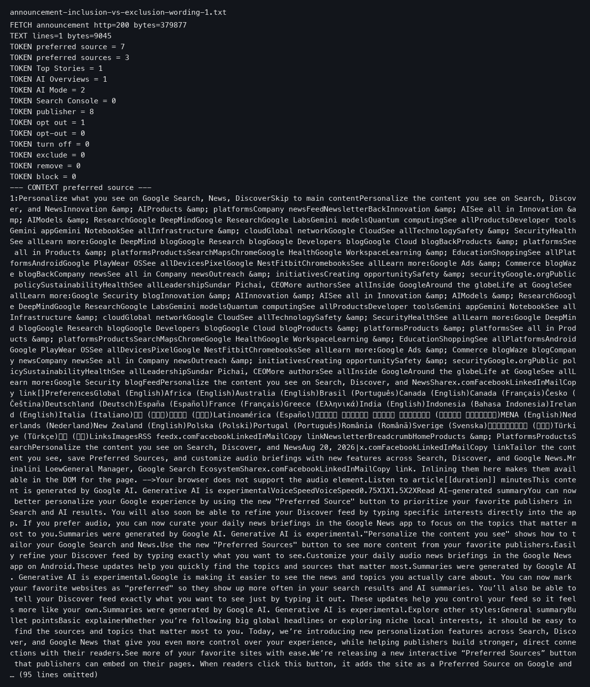
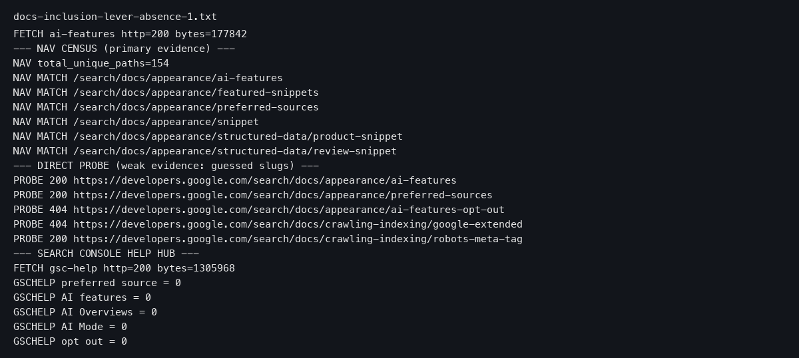
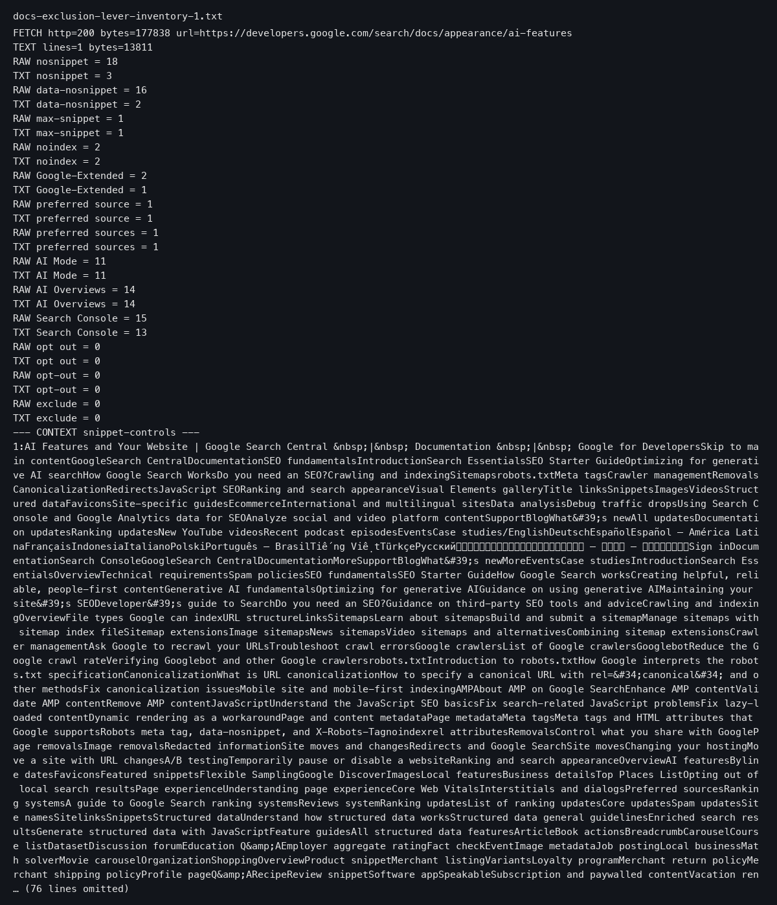
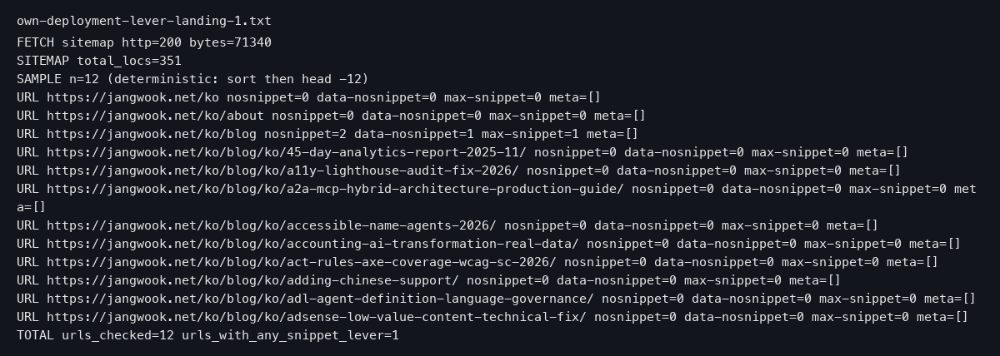

If you run a website or post anything online, Google now treats two opposite wishes very differently. The wish to be shown — "put my site in AI answers and label it as a preferred source" — got a product. It came with a launch announcement, a dedicated documentation page, and copy-paste button code, all on the same day. The opposite wish — "keep my site out of AI answers" — got one sentence in a developer document. That one sentence names four controls and nothing else.

The one thing to remember: getting in is something Google built for you; getting out is something you must build for yourself. So if you want to know which direction Google treats as the default, don't read the fine print — count the pages.

## The announcement gave the opt-in side a full product

On August 20, 2026, Google announced a feature called Preferred Sources. In plain terms, Preferred Sources lets a reader pick your site as a favorite. When they do, your content gets a "preferred" badge in AI Mode and AI Overviews. These are Google features that answer a question with an AI-written summary instead of a plain list of links.

To see how much Google invested in this "get in" direction, we counted the words in the announcement itself. We fetched the announcement page and counted how many times each key phrase appeared. The phrase "preferred source" appeared 7 times — 4 of them in its singular form. It also mentioned Top Stories once, AI Overviews once, and AI Mode twice.

What did not appear? The practical vocabulary of leaving. The only "opt out" in the whole announcement was in a newsletter sign-up line — "You may opt out at any time" — which has nothing to do with search visibility. In other words, the announcement speaks the language of invitation, not the language of exit.

> If you're a publisher, you can find the new "Preferred Source" button code in our Google Search Central documentation to get started.
> — [Personalize search and discover news with preferred sources](https://blog.google/products-and-platforms/products/search/personalize-search-discover-news/)

Notice where that sentence sends publishers: not to a settings screen, but to a documentation page with ready-made code. Google wrote the invitation and also gave you everything you need to accept it.

## The dedicated document the inclusion side received the same day

An announcement is only as good as what stands behind it, so we checked whether the "get in" direction has a real home. Think of it like a store: a flyer is nice, but is there an actual service desk?

There is. Google's developer help site — called Search Central, the place where Google publishes its rules and instructions for website owners — lists 154 paths in its left-hand navigation. One of them is a dedicated page just for Preferred Sources. When we opened it, the page returned a normal success response, and it carried a "last updated" stamp of August 20, 2026 UTC, the worldwide time standard Google uses — the exact same day as the announcement.

So on a single day, the inclusion lever received three things: a launch post, a dedicated page inside the official documentation, and button code to place on your site. That is a full product launch: a post, a page in the official docs, and ready-to-paste code, all on day one.

For anyone publishing online, the practical effect is that the "get in" path requires almost no research. You follow a link from the announcement, copy the code, and you are in motion the same afternoon.

## One sentence is the whole official way out

Now turn the sign around and ask the opposite question: how does a site ask to be left out of AI answers?

The answer lives in a developer document about Google's AI search features. It is a single sentence, and it names four controls:

> To limit the information shown from your pages in Search, use nosnippet, data-nosnippet, max-snippet, or noindex controls.
> — [AI features / Google Search Central](https://developers.google.com/search/docs/appearance/ai-features)

What are these four words? They are instructions you place on your pages, each one telling Google to show less of a page. A "snippet" is the short text preview Google shows under a link. nosnippet means "don't show that preview." data-nosnippet means "don't show this particular part." max-snippet means "you may show a preview, but only up to a length I set." noindex is the strongest one — it means "leave this page out of your results entirely."

That is the whole exit door. To see how thin it really is, we counted the words on that developer page. In the body of the text, each of the four control names appeared exactly once — 4 mentions total, all packed into that one sentence. The words "opt out," "opt-out," and "exclude" appeared 0 times.

The same page also says there are "no additional technical requirements" for AI features. Read those two facts together and you get the full picture: qualifying for AI answers requires nothing extra, and refusing AI answers requires one sentence naming four snippet controls. Qualifying for AI answers needs no extra setup. Leaving needs a technical instruction that many site owners never hear about.

If your team ever asks "how do we keep our content out of AI answers?", the official answer fits on a sticky note. And someone on your team has to find it and place the instructions on your pages.

## The directive we searched for across 12 of our own URLs — and found 0 times

An instruction that exists in a document only matters if it actually lands on real pages. So we checked our own house.

We took a sample of 12 URLs from our own site's sitemap — the list of pages a website hands to search engines, like a table of contents of the whole site. On each of the 12 pages, we looked for the kind of instruction Google reads: a small hidden label inside the page (a "meta tag") addressed to Google's crawler that could carry a snippet control.

The result: all 12 pages had no such label at all. That is 0 out of 12. The instruction that would remove or shrink our pages in AI answers was not planted anywhere in our own deployment.

What did we find instead? We had set three lines in our robots.txt — a text file where a site tells crawlers which areas they may or may not visit. We had blocked a crawler called Google-Extended, and set a content-signal line saying our content may be searched but not used for AI training. Both are honest choices. But as you'll see next, neither one removes our site from AI answers in search. We felt like we had an exit strategy, but we did not actually have an exit.

## The official separation between the AI blocklist and search inclusion

This is the trap worth nailing down, because many site owners (ours included, until we checked) believe blocking Google-Extended keeps them out of AI answers. It does not — Google says so in its own words.

Google-Extended is a named address that a Google crawler looks for. Site owners can use it to limit how their content is used for AI training and for grounding — feeding facts to an AI model — in some of Google's other systems. Here is how the developer document handles it:

> To limit AI training and grounding in some of Google's other systems, read more about Google-Extended.
> — [AI features / Google Search Central](https://developers.google.com/search/docs/appearance/ai-features)

Note the phrasing: "Google's other systems." The AI answers built into Search are deliberately not in that list. And the Google-Extended page states the separation outright:

> Google-Extended does not impact a site's inclusion in Google Search nor is it used as a ranking signal in Google Search.
> — [Google-Extended / Google Search Central](https://developers.google.com/search/docs/crawling-indexing/google-common-crawlers)

So the mechanism behind the whole asymmetry becomes visible. Google defines AI Overviews and AI Mode as features inside Search. Because they are inside Search, controlling them is folded into the old, long-established snippet controls — the four names in that one sentence. Anything meant for "other systems" gets pushed to Google-Extended, which officially has no effect on search inclusion. Exit gets absorbed into an existing rule. Entry gets built as a new product. The length of each document reflects that decision.

A fair objection deserves an honest hearing. Someone might say: one sentence is not a scandal. The four controls — nosnippet and noindex among them — are years-old, battle-tested standards that Google has documented for a long time. If Google treats AI features as part of Search, folding their controls into snippet controls is consistent design, not neglect. And if a site owner never uses those controls, that is their choice, not a missing lever. Within its own logic, this argument is correct. But it cannot explain the calendar. On the very same day, the inclusion lever received a dedicated page, button code, and a launch post; the exit received one sentence containing 4 tokens, and that sentence's instructions were planted on 0 of the 12 real URLs we measured. The asymmetry is not a reading of intent. It is a number.

## Two items to put on your team's checklist

Whatever your goal, the fix for the gap between belief and reality is the same: measure. Two line items cover it.

**If you want your content out of AI answers**, add this to your checklist for publishing a page update: pick a sample of URLs from your sitemap, open each page, and count whether the "don't show this page's preview" instruction is actually present. Ours was 0 out of 12 — a strategy we believed in but had never planted. Also pin a quote in your team wiki: Google's official words that Google-Extended does not affect inclusion in Google Search, so nobody mistakes "we blocked the AI crawler" for "we opted out."

**If you want your content in AI answers more often**, the asymmetry works in your favor. Confirm your pages carry no snippet-blocking instructions — leaving them off is what keeps you eligible, since Google says there are no extra technical requirements — and then follow the registration flow Google opened on announcement day: the Preferred Sources page in Search Central, with the button code ready to copy.

Either way, write the check down where the next deploy can see it. A checklist item survives staff changes; a memory of "I think we handle that" does not.

## What this article could not verify

Every number here is a snapshot of August 20–21, 2026, and documentation pages get updated, so these counts are only valid for that date, not for later. We also did not measure three things: whether the actual Search Console screen — Google's dashboard for website owners — exposes any switch we could not see without a logged-in session, whether the snippet controls truly change which pages AI Overviews cites as sources, and how other websites deploy these instructions — our landing measurement covers only our own 12-URL sample, not the web at large. Next check worth doing: repeat the same counts on a fresh date, and see whether the one-sentence exit has grown a page of its own.

And here is the condition under which this entire judgment is wrong: if Google's official explanation changes — the day "keep my content out of AI answers" gets its own dedicated guide and sign-up steps like the inclusion side, or the day the claim that the AI blocklist token has nothing to do with AI answers is reversed — count this article's argument as outdated.

## References

1. [AI features / Google Search Central](https://developers.google.com/search/docs/appearance/ai-features) — Google
2. [Google-Extended / Google Search Central (google-common-crawlers)](https://developers.google.com/search/docs/crawling-indexing/google-common-crawlers) — Google
3. [Preferred sources / Google Search Central](https://developers.google.com/search/docs/appearance/preferred-sources) — Google
4. [Personalize search and discover news with preferred sources / Google blog 발표문 (Aug 20, 2026)](https://blog.google/products-and-platforms/products/search/personalize-search-discover-news/) — Google