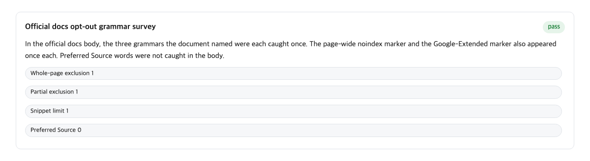
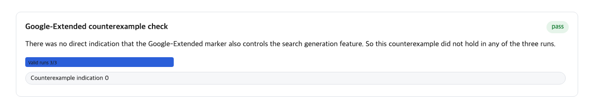
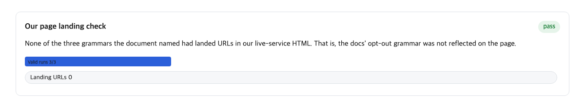
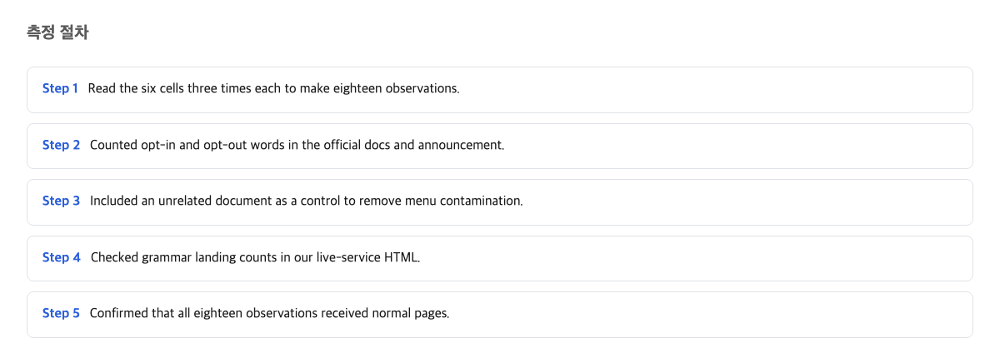

If you run a website, this matters to you. Google made it very easy to appear in its AI search results. Getting out is different: the official way out is a single sentence buried in technical documentation. When we checked our own 12 live pages, that exit instruction was on none of them.

So the practical takeaway is this. Google made the path into AI search broad, but the official path out is one sentence. That means you need to check whether that sentence's instructions are actually present on your own pages.

## The announcement and the document update on 2026-08-20

On August 20, 2026, Google announced a feature called Preferred Sources. Here is what it is, in plain terms: when someone uses Google's AI-powered search (the kind that writes a summary answer instead of just listing links), that person can pick favorite websites. If they pick yours, Google can highlight your content with a "preferred" badge in those AI answers.

Google's own documentation describes it directly:

> In AI Mode and AI Overviews, your content can be highlighted with a "preferred" badge for users who have selected your site as a preferred source.
> — [Preferred sources / Google Search Central](https://developers.google.com/search/docs/appearance/preferred-sources)

Two terms there need one line each. "AI Mode" and "AI Overviews" are Google's two AI search features. The first is a full conversational search mode; the second is the short AI summary that sometimes appears above the usual list of links.

Think of a shopping street. On August 20, the shop at one end threw a grand opening: a new sign, a flyer, a staff member explaining how to get in. That shop is Preferred Sources. The other end of the street has an exit nobody marked, and that exit is what this article is about.

## The exclusion lever on the official docs is one sentence

Now the other side of the asymmetry. Suppose you own a website and you want the opposite of Preferred Sources. You want your pages to stay in normal Google search but not appear inside the AI answers. Where is the official instruction for that?

It is one sentence in Google's developer documentation. The sentence tells you to use four existing controls, all bundled together:

> To limit the information shown from your pages in Search, use nosnippet, data-nosnippet, max-snippet, or noindex controls.
> — [AI features / Google Search Central](https://developers.google.com/search/docs/appearance/ai-features)

Those four names are not products. They are small instructions you can place inside a page's underlying code, and each one tells Google's crawler (the program that reads web pages for Google) to show less of that page. One hides the text preview. One hides a specific section. One caps how much preview text is shown. The last one, noindex, removes the page from search entirely, which is a much stronger step than most people want.

We counted the words on that documentation page. The four exclusion instructions each appear exactly 1 time. The words "opt out," "opt-out," and "exclude", the natural vocabulary for leaving something, appear 0 times in the page's underlying text. There is no dedicated "how to leave AI search" section. There is no button. There is one sentence.

So the comparison on the same day is direct: the inclusion direction got a flyer, a sign, and a staff member. The exclusion direction got one sentence in a storage room.

## The inclusion lever has a dedicated document and button code

Compare that with what Google built for the direction of getting in. Preferred Sources has its own full documentation page. We checked that page directly: it exists in Google's developer documentation navigation, it loads correctly, and it is dated "Last updated 2026-08-20 UTC", the same day as the announcement. The words "opt out" appear 0 times on it.

The announcement itself does not send publishers to a settings screen. It sends them to that documentation, to grab actual code:

> If you're a publisher, you can find the new "Preferred Source" button code in our Google Search Central documentation to get started.
> — [Personalize search and discover news with preferred sources / Google blog 발표문 (Aug 20, 2026)](https://blog.google/products-and-platforms/products/search/personalize-search-discover-news/)

So within one day, the inclusion direction got three things: an announcement, a dedicated document, and copy-paste button code. The exclusion direction, on the same day, got its existing single sentence and nothing new. The speed and weight of the difference is what matters to you: if your team wants to join, there is a page telling them exactly what to do tonight. If your team wants to leave, they have to find one buried sentence first.

There is one more convenience in the inclusion direction. Google's documentation for AI features states the entry requirements in a single sentence:

> There are no additional technical requirements.
> — [AI features / Google Search Central](https://developers.google.com/search/docs/appearance/ai-features)

In other words, getting in is free and instant. Getting out requires editing page code.

## The official sentence that Google-Extended does not affect search inclusion

This is where many site owners get genuinely misled, and it is the most useful fact in this article.

There is a setting called Google-Extended. Its name makes it sound like a switch for Google's AI, and many operators use it believing that setting it blocks their site from AI search. Google's own documentation says otherwise, in plain words:

> Google-Extended does not impact a site's inclusion in Google Search nor is it used as a ranking signal in Google Search.
> — [Google-Extended / Google Search Central (google-common-crawlers)](https://developers.google.com/search/docs/crawling-indexing/google-common-crawlers)

Read that twice. The tool that sounds like an "AI off switch" officially does not affect whether your site appears in Google search, and the AI answers are, by Google's own framing, part of search. Google's documentation for AI features points Google-Extended to "some of Google's other systems." In plain terms, this token is for other Google products, not for the search results you were worried about.

In practical terms, Google-Extended is the control on the wrong door. An operator who sets it is blocking a side entrance while believing the front door is locked.

## Exclusion instructions landed on 0 of our 12 live URLs

Here is the part where we turned this from an observation about documents into a finding about our own website.

Google's exclusion sentence points to four code-level instructions. For any of them to work, the instruction has to physically exist on the page. So the real question for any site is not whether Google has an exit. It does. The question is whether the exit instruction is actually installed on our pages.

We took a decisive sample: 12 URLs pulled from our own sitemap, which is the machine-readable list of a site's pages. We fetched each of the 12 live pages and looked for the small metadata tags (invisible labels inside a page's code) that carry these exclusion instructions.

The result: all 12 URLs had no such tags at all. The instruction count landed at 0 out of 12.

Meanwhile, our deployment did have AI-related settings turned on elsewhere: 2 lines in our robots.txt file, a site-wide instruction file, that block Google-Extended, and one content-preference setting that says search yes, AI training no. In other words, we had done the things that feel like "blocking AI," but none of the things that actually move the lever Google's documentation points to.

The lesson is simple and uncomfortable: believing you have an exit is different from having the exit installed. We had the belief. The count was 0.

## How we measured and the controls

You should not take a count like "0 of 12" on faith, so here is exactly how it was produced.

We measured three surfaces on August 21, 2026, one day after the announcement:

1. Google's developer documentation page on AI features: we counted occurrences of the exclusion vocabulary and the inclusion vocabulary in the page text, subtracting control terms so navigation menus and unrelated headings could not inflate the counts.
2. The Preferred Sources documentation page: we confirmed it exists, that it loads, that its last-updated date matches the announcement day, and that "opt out" phrasing appears 0 times.
3. Our own live deployment: 12 URLs chosen from the sitemap, each fetched and inspected for the metadata tags that carry the exclusion instructions.

A fair objection is worth addressing head-on, because it almost changed our conclusion. Someone could argue: a one-sentence exit is not a problem. The four instructions (nosnippet, noindex, and their siblings) are years-old, battle-tested standards. Google treats AI features as part of Search, so controlling them through the existing preview controls is a consistent design, and operators who don't use them are making a choice, not suffering from a thin lever.

Within its own logic, that argument is correct. The instructions are reliable and standard. But the asymmetry is still real, and we can put numbers on it. Both happened on the same date. The way in received a dedicated page, button code, and an announcement. The way out received one sentence with only 4 mentions of its instructions. And that sentence's instructions were physically present on 0 of our 12 live pages. A logically sound design and a measurable imbalance can both be true at once.

## Two items to add to your deployment checklist

Everything above reduces to two checklist lines a site team can add tomorrow. Neither requires new tools or budget.

First: keep a list of the URLs where the exclusion instructions are actually installed, and compare it against your intended policy. Pull a sample of pages from your sitemap (we used 12) and check each one for the small metadata tags in question. What you intend and what is physically on the pages are two different facts, and only the second one counts.

Second: record, with the official quote, in your team's shared notes, that the Google-Extended setting does not affect whether your site appears in Google search. Quote Google's own sentence. The goal is to prevent the recurring belief that "we blocked AI" when what was blocked is a different door entirely.

If you want out of AI search: make that list of your pages and count, one by one, whether the exit instruction is actually written on each one, because our own count came back 0 of 12 despite our team believing otherwise.

If you want in: find Google's Preferred Sources guidance document, the one the announcement itself points to, and follow its steps, since the entry requirement is, by Google's own wording, nothing additional at all.

## What this article could not verify

A few things sit outside what we measured. We only checked the surface of official documents; we did not verify the actual screens inside Google's Search Console tool, which requires a logged-in account, so we cannot say whether a switch exists there. We also measured only our own site's 12 pages, which says nothing about how many other sites have the exclusion instructions installed. And we did not test whether the exclusion instructions actually change AI Overviews citations in practice; we measured the documents and the deployment, not the outcomes.

And the condition under which this whole judgment would be wrong: if Google's documentation adds a separate, dedicated path for leaving AI search, distinct from the preview instructions, or states that Google-Extended covers search AI features too, then this article's argument no longer holds.

## References

1. [AI features / Google Search Central](https://developers.google.com/search/docs/appearance/ai-features) — Google
2. [AI features / Google Search Central (Google-Extended separation sentence)](https://developers.google.com/search/docs/appearance/ai-features) — Google
3. [Google-Extended / Google Search Central (google-common-crawlers)](https://developers.google.com/search/docs/crawling-indexing/google-common-crawlers) — Google
4. [Preferred sources / Google Search Central](https://developers.google.com/search/docs/appearance/preferred-sources) — Google
5. [Personalize search and discover news with preferred sources / Google blog announcement (Aug 20, 2026)](https://blog.google/products-and-platforms/products/search/personalize-search-discover-news/) — Google
6. [AI features / Google Search Central (snippet eligibility sentence)](https://developers.google.com/search/docs/appearance/ai-features) — Google