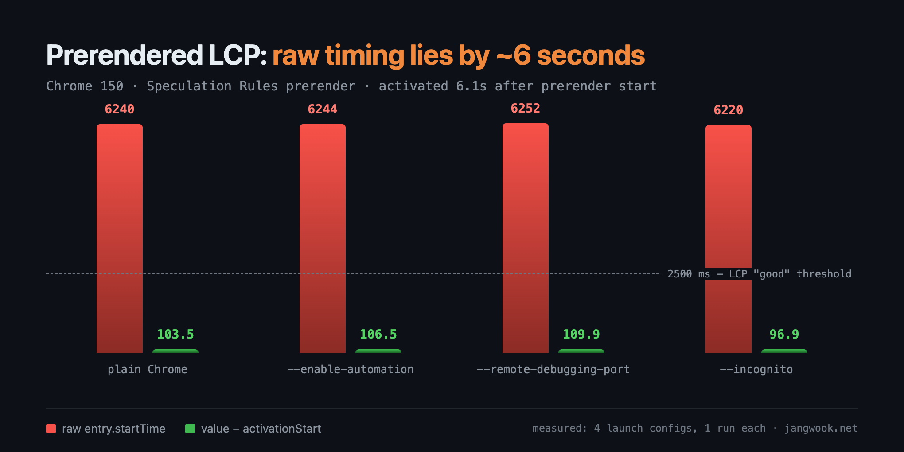
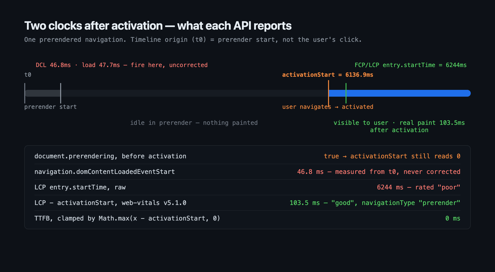

Two numbers, one navigation. The user waited 103.5 milliseconds to see the page. The LCP entry reported a `startTime` of 6244 milliseconds. Both are correct. Only one belongs in your dashboard.

That gap is what Speculation Rules prerendering does to measurement, and it doesn't announce itself. Your page genuinely got faster, and your RUM chart genuinely got worse. I set out to measure exactly where the two diverge on Chrome 150.



## Why a prerendered page runs on two clocks

Groundwork first, since the conclusion is narrow enough that the numbers mean nothing without it.

The Speculation Rules API tells the browser which pages to load ahead of the user. You drop a script block into the document:

```html
<script type="speculationrules">
{
  "prerender": [
    { "urls": ["/next.html"], "eagerness": "immediate" }
  ]
}
</script>
```

`prefetch` only pulls the response bytes. `prerender` goes considerably further: the browser **fully renders** the page somewhere you can't see. It parses the HTML, runs your scripts, does layout, fetches subresources. When the user finally follows that link, nothing loads. The browser **activates** the document it already built, and the transition feels instant.

That's where the clocks split. The origin of the document's `performance` timeline is the moment the **prerender started**, not the moment the user clicked. If they clicked six seconds later, activation is an event at roughly t+6000ms as far as that document is concerned. And the first paint can't happen before activation, because nothing paints during prerendering.

So the LCP entry's `startTime` stops meaning "how long the user waited." It means "how long since the prerender began," and that includes every second the user spent not clicking.

The browser hands you one value to close the gap: `PerformanceNavigationTiming.activationStart`. Chrome's documentation puts it this way: "Once a prerendered document is activated, `PerformanceNavigationTiming`'s `activationStart` will also be set to a non-zero time representing the time between when the prerender was started and the document was actually activated." (source: [Prerender pages in Chrome for instant page navigations](https://developer.chrome.com/docs/web-platform/prerender-pages))

Perceived time is the raw value minus that number.

## Splitting 6244ms from 103.5ms in a sandbox

I stood up a static server in a scratch directory. Entry page A carries a prerender rule for target page B, then navigates to B by script after six seconds. Six is arbitrary. I wanted a generous "user hesitating over a link" delay, big enough that the gap couldn't hide.

Page B beacons its own measurements back to the server. Why I skipped browser automation is a story further down.

```js
const nav = () => performance.getEntriesByType('navigation')[0];

new PerformanceObserver((list) => {
  for (const e of list.getEntries()) {
    const a = nav()?.activationStart ?? 0;
    send({ event: 'LCP', raw: e.startTime, activationStart: a,
           corrected: Math.max(e.startTime - a, 0) });
  }
}).observe({ type: 'largest-contentful-paint', buffered: true });
```

I launched Chrome 150.0.7871.187 straight at page A. Here's what landed on the server:

```json
{"event":"script-eval","prerendering":true,"activationStartAtEval":0}
{"event":"nav-timing","activationStart":0,"type":"navigate",
 "domContentLoadedEventStart":46.8,"loadEventStart":47.7,"responseEnd":0.1}
{"event":"activated","perfNow":6186.8,"activationStart":6136.9}
{"event":"FCP","raw":6244,"activationStart":6136.9,"corrected":107.1}
{"event":"LCP","raw":6244,"activationStart":6136.9,"corrected":107.1}
```

Four lines, and everything you need is in them.

`document.prerendering` was `true` when the script first ran. The document was alive in the background. `domContentLoadedEventStart` came in at 46.8ms and `loadEventStart` at 47.7ms, which means both events **fired during the prerender**. The page had finished loading before the user had even looked at it.

Activation landed at 6136.9ms. FCP and LCP both recorded 6244ms. Subtract, and you get 107.1ms.

Let me be clear about one thing: prerendering worked beautifully here. The user waited a tenth of a second. The problem isn't the feature, it's that the feature's success doesn't show up in the raw metric.



## activationStart reads 0 until the page is activated

Look at the second log line again. At that moment `activationStart` was **0**.

That's the spec, not a bug. The WICG prerendering specification gives every Document an activation start time whose initial value is zero ([Prerendering Revamped](https://wicg.github.io/nav-speculation/prerendering.html)). The value only fills in once activation actually happens.

Here's why that bites in production. Plenty of teams write their instrumentation like this: read the navigation entry once at load, stash it, then reuse that variable whenever a metric arrives.

```js
// Breaks silently on prerendered pages
const activationStart = performance.getEntriesByType('navigation')[0].activationStart;
// ... much later ...
report('LCP', lcpEntry.startTime - activationStart);   // activationStart is frozen at 0
```

My snapshot taken right after `load` held exactly 0. Six seconds later activation fired and the real value became 6136.9. The copy in that variable stays 0 forever. Code written to apply a correction applies nothing at all, while reporting that it did.

The rule is short. **Read `activationStart` at report time.** Not at script evaluation, not at `DOMContentLoaded`, not at `load`.

For the same reason, hold the beacon itself until after activation. Chrome's docs flag this directly: "However—particularly when using the Speculation Rules API—prerendered pages may have an impact on analytics and site owners may wish to add extra code to only enable analytics for prerendered pages on activation, as not all analytics providers may do this by default." (source: [Prerender pages in Chrome for instant page navigations](https://developer.chrome.com/docs/web-platform/prerender-pages))

## Four launch configurations, and what web-vitals already does

One run proves nothing, so I varied the launch conditions and ran it four more times, this round with [web-vitals](https://github.com/GoogleChrome/web-vitals) v5.1.0 dropped in instead of my hand-rolled observer.

| Launch config | navigationType | TTFB | FCP | LCP | Raw LCP startTime | activationStart |
|---|---|---|---|---|---|---|
| plain | `prerender` | 0 | 103.5 | 103.5 | 6240 | 6136.5 |
| `--enable-automation` | `prerender` | 0 | 106.5 | 106.5 | 6244 | 6137.5 |
| `--remote-debugging-port` | `prerender` | 0 | 109.9 | 109.9 | 6252 | 6142.1 |
| `--incognito` | `prerender` | 0 | 96.9 | 96.9 | 6220 | 6123.1 |

(Milliseconds, one run per config. Don't read anything into the millisecond spread. Read the order-of-magnitude gap between columns.)

Every run reports LCP around 100ms while the raw `startTime` sits in the 6.2-second range. The library handles the correction on its own. Crack open the v5.1.0 source in `node_modules` and you'll find LCP and FCP built from `Math.max(entry.startTime - activationStart, 0)`, TTFB from `Math.max(responseStart - activationStart, 0)`, and `navigationType` set to `'prerender'` whenever `document.prerendering` is true or `activationStart` exceeds zero.

That same formula explains the all-zero TTFB column. A prerendered document's `responseStart` sits far ahead of activation, so the subtraction goes negative and `Math.max` clamps it. Not an error. From the user's side those bytes had already arrived, so the wait really was near zero. But once those values mix into your field data, the whole TTFB distribution slides left. Segment by `navigationType` at aggregation time or you'll end up running a retro on an improvement nobody made.

The code you actually ship ends up looking like this. Wait for activation, let the library correct, and tag the navigation type on the way out:

```js
import { onLCP, onFCP, onINP, onCLS, onTTFB } from 'web-vitals';

function whenActivated(fn) {
  if (document.prerendering) {
    document.addEventListener('prerenderingchange', () => fn(), { once: true });
  } else {
    fn();
  }
}

whenActivated(() => {
  const send = (m) => navigator.sendBeacon('/rum', JSON.stringify({
    metric: m.name,
    value: m.value,              // activationStart already subtracted
    rating: m.rating,
    navType: m.navigationType,   // split 'prerender' out when aggregating
  }));
  [onTTFB, onFCP, onLCP, onINP, onCLS].forEach((fn) => fn(send));
});
```

Keeping `navType` is the part people skip. With that field you can separate "our prerender hit rate went up" from "our pages got faster" after the fact. Without it, you can't.

One value never appears in that table. `domContentLoadedEventStart` at 46.8ms gets **no correction whatsoever**. Navigation Timing marks still run on the prerender clock. Put a corrected LCP next to an uncorrected "load time" on one dashboard and the two numbers are reading different clocks. That mismatch gets especially annoying when you're trying to verify [resource-priority work meant to pull LCP forward](/en/blog/en/lcp-image-preload-scanner-fetchpriority-2026), because your baseline moves while you're measuring against it.

## Playwright couldn't run this experiment at all

I tried to do all of this in Playwright first. Three attempts, three failures.

`document.prerendering` stayed `false`, `activationStart` stayed 0, `navigationType` came back `navigate`. No prerender happened. Suspecting my rule syntax, I attached CDP's `Preload` domain:

```json
{"ev":"Preload.preloadEnabledStateUpdated","d":{
  "disabledByPreference":false,"disabledByDataSaver":false,"disabledByBatterySaver":false,
  "disabledByHoldbackPrefetchSpeculationRules":false,
  "disabledByHoldbackPrerenderSpeculationRules":false}}
{"ev":"Preload.ruleSetUpdated","d":{"ruleSet":{"id":"49930.0", ... }}}
{"ev":"Preload.preloadingAttemptSourcesUpdated","d":{"preloadingAttemptSources":[
  {"key":{"action":"Prerender","url":"http://127.0.0.1:8899/next.html"}, ... }]}}
```

The rule set parsed. The attempt registered. Nothing was disabled. And yet not a single `prerenderStatusUpdated` event ever arrived. It never even started.

So I went after the launch flags. I copied Playwright's entire `--disable-features` list onto a directly launched Chrome. Prerendering worked. I tried disabling only `RenderDocument`, my prime suspect. Worked. Only `OptimizationHints`. Worked. `--enable-automation`, `--remote-debugging-port`, `--incognito`. All worked.

Honestly, I never isolated it. The flags weren't the culprit. Same binary, and prerendering only got suppressed when Playwright was actually **driving** it. I couldn't narrow it further inside this run.

The practical conclusion is already sitting there, though. **Don't validate Speculation Rules through Playwright or Puppeteer.** Correct rules will hand you a false negative. It's the same species of trap as [running axe-core under jsdom and missing real violations](/en/blog/en/axe-core-ci-a11y-jsdom-vs-browser-2026): the test environment gives you a wrong answer quietly, with a green check next to it.

Two things worked instead. One is the harness behind this post: let the page beacon its own results back, and just launch Chrome normally. The other is the quick check Chrome's docs recommend: "The easiest way to see if a page was prerendered is to open DevTools after the prerender has happened, and type `performance.getEntriesByType('navigation')[0].activationStart` in the console." (source: [Prerender pages in Chrome for instant page navigations](https://developer.chrome.com/docs/web-platform/prerender-pages))

## What this measurement doesn't claim

Time to set expectations down where they belong.

One run per configuration, on a single laptop, against a local server. The millisecond figures illustrate a mechanism; they aren't a benchmark. The six-second gap is a number I invented in a `setTimeout`, unrelated to how real users hesitate. The longer that gap runs, though, the larger the uncorrected error grows, exactly in proportion.

I also didn't benchmark prerendered against non-prerendered loads. My control run opened the same page directly and reported LCP at 532ms, but that number carries the cost of spinning up a browser window on a fresh profile. It isn't a like-for-like comparison, so nothing here supports a claim like "prerendering is five times faster."

This is a Chrome story, too. Safari and Firefox haven't shipped Speculation Rules prerendering. If half your traffic sits there, half of this correction logic never fires.

And no ranking claims. Prerendering isn't a ranking factor, and nothing in this post guarantees search performance. What's on the table is perceived speed and how to measure it honestly. On Core Web Vitals, Chrome's documentation says: "For Core Web Vitals, measured by Chrome through the Chrome User Experience Report, these are intended to measure the user experience." (source: [Prerender pages in Chrome for instant page navigations](https://developer.chrome.com/docs/web-platform/prerender-pages)) The thing being measured is the user's experience, not the document's internal clock.

## Fix the measurement before you ship the speedup

Get your instrumentation right before you turn on Speculation Rules. Do it the other way around and you'll read an improvement as a regression.

Six lines:

1. Use web-vitals v5+ instead of a hand-rolled `PerformanceObserver`. If you must roll your own, apply `Math.max(value - activationStart, 0)` to LCP, FCP, and TTFB alike.
2. Read `activationStart` **at report time**. Never freeze it into a variable at load.
3. Gate analytics init and beacon sends on `document.prerendering`, resuming at `prerenderingchange`.
4. Segment RUM aggregates on `navigationType === 'prerender'`. Mixed in, they pin TTFB near zero and make LCP look implausibly good.
5. Document that Navigation Timing marks like `domContentLoadedEventStart` and `loadEventStart` are never corrected, and keep them off the same panel as corrected metrics.
6. Verify Speculation Rules with a self-reporting harness or the DevTools Application panel, not with browser automation.

None of these hurt a site that never prerenders anything. Put them in now and your dashboard won't lurch on the day you switch it on.

If you want a second pair of eyes on whether your RUM pipeline survives page-lifecycle changes like prerendering or bfcache, or you're rebuilding Core Web Vitals instrumentation from scratch, I take on consulting and implementation work independently. Contact details are on my [profile](/en/about).
