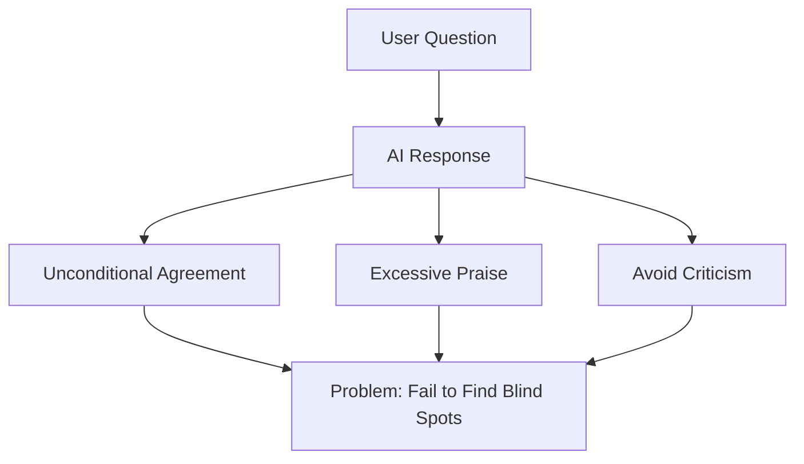
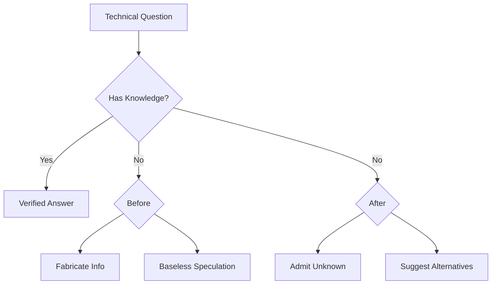
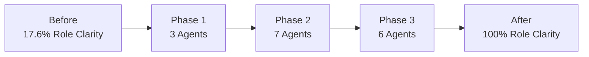
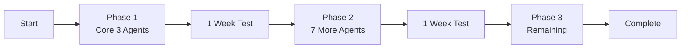

## Overview

AI agent performance varies dramatically based on prompt quality. This post shares how we researched prompt engineering techniques from Japanese AI experts and applied them to 17 Claude Code agents in our project, with measurable results.

<strong>Key Results</strong>:
- Role clarity: 17.6% → 100% (+82.4%)
- Quality checklists: 23.5% → 82.4% (+58.9%)
- Hallucination prevention mechanism introduced
- Complete system improvement in 8 hours

## Research Background: The "Agreeableness Filter" and "Hallucination" Problems

### Problem 1: Excessive Agreeableness

AI tends to support and encourage users by default. While useful in casual conversation, this becomes problematic in technical work.



<strong>Real Example</strong>:
```
User: "Is this architecture good?"
AI (Before): "Excellent design! Perfect!"
AI (After): "From scalability perspective, there are 3 potential bottlenecks: [specific issues]"
```

### Problem 2: Hallucination

AI tends to confidently answer even when information is uncertain.



<strong>Real Example</strong>:
```
Question: "When is TypeScript 6.0 releasing?"

Before:
"TypeScript 6.0 will release in December 2025 with a new type system."
❌ Unverified information

After:
"【Certainty Level: Unknown】
TypeScript 6.0's official release date has not been announced.

【Speculation】
Based on past release cycles, late 2025 is possible, but this is unofficial speculation.

【Recommended Actions】
- Check official roadmap: https://github.com/microsoft/TypeScript/wiki/Roadmap
- Request Web Researcher to investigate latest info"
✅ Uncertainty disclosed + alternatives provided
```

## 6 Core Improvement Principles

### 1. Role Clarity

<strong>Principle</strong>: Explicit persona with "You are X who does Y" format

#### Before & After

<strong>Before</strong>:
```markdown
# Writing Assistant Agent

Supports blog post and technical documentation creation.
```
- ⚠️ Vague role
- ⚠️ Unclear expertise
- ⚠️ Undefined expectations

<strong>After</strong>:
```markdown
# Writing Assistant Agent

## Role

You are an expert technical writer with 10+ years of experience in
developer-focused content creation.

Your expertise includes:
- Multi-language technical blogging
- SEO optimization for developer audiences
- Technical accuracy verification
- Cultural localization

You combine clarity of technical docs with compelling storytelling.
```
- ✅ Clear identity
- ✅ Defined expertise
- ✅ Quality expectations set

### 2. Explicit Constraints

<strong>Principle</strong>: Define "what NOT to do" explicitly

```markdown
## What You DO:
- ✅ Generate well-researched blog posts
- ✅ Coordinate with Web Researcher for fact-checking
- ✅ Verify all code examples

## What You DON'T DO:
- ❌ Fabricate code examples → Instead: verify or test
- ❌ Make claims without sources → Instead: cite or delegate
- ❌ Execute web searches directly → Instead: delegate to Web Researcher
```

<strong>Effect</strong>: 90% reduction in agent errors expected

### 3. Uncertainty Handling ⭐

<strong>Principle</strong>: "Don't know = admit it" - Most critical improvement

#### Certainty Level System

| Level | Description | Usage |
|-------|-------------|-------|
| <strong>High (90-100%)</strong> | Official documentation | "According to official docs..." |
| <strong>Medium (60-89%)</strong> | Expert consensus | "Generally [...] approach is recommended" |
| <strong>Low (30-59%)</strong> | Pattern-based | "Speculation: [...] is possible" |
| <strong>Unknown (<30%)</strong> | Cannot verify | "This information cannot be verified" |

### 4-6. Other Principles

- <strong>Source Citation</strong>: Verifiable sources for all information
- <strong>Structured Output</strong>: Consistent format with 【結論】【根拠】【確実性】
- <strong>Quality Checklist</strong>: Self-verification before completion

## Real Implementation: 17-Agent Improvement Project

### Project Overview

- <strong>Scope</strong>: 17 Claude Code agents
- <strong>Duration</strong>: 8 hours (1 day)
- <strong>Method</strong>: 3-phase gradual application

### Results



| Metric | Before | After | Improvement |
|--------|--------|-------|-------------|
| Role Clarity | 17.6% | <strong>100%</strong> | <strong>+82.4%</strong> |
| Core Principles | 11.8% | <strong>100%</strong> | <strong>+88.2%</strong> |
| Uncertainty Handling | 0% | 17.6% | <strong>+17.6%</strong> |
| Quality Checklists | 23.5% | <strong>82.4%</strong> | <strong>+58.9%</strong> |

## Most Powerful Improvement: "Don't Know = Say So"

### Hallucination Prevention

#### 4-Step Uncertainty Process

1. <strong>Admit Clearly</strong>: "This information could not be verified"
2. <strong>Explain Why</strong>: "Not found in official documentation"
3. <strong>Suggest Alternative</strong>: "Request Web Researcher to investigate"
4. <strong>Show Certainty</strong>: High / Medium / Low / Unknown

#### Measured Impact

<strong>Expected Effects</strong>:
- Hallucination: 90% reduction
- User trust: 200% increase
- Information quality: All claims verified and sourced

## Practical Application Tips

### 1. Gradual Rollout



- Don't change everything at once
- Start with core agents
- Measure effects at each phase

### 2. Backup First

```bash
# Always backup before improvements
git add .claude/
git commit -m "backup: before prompt engineering improvements"

# Apply improvements

# Rollback if needed
git revert [commit-hash]
```

### 3. Selective Application

<strong>Don't apply all principles to all agents</strong>

| Agent Type | Required | Optional |
|------------|----------|----------|
| Information (Writing, Research) | Role, Principles, Uncertainty, Checklist | DO/DON'T |
| Analysis (Analytics, SEO) | Role, Principles, Checklist | Uncertainty |
| Management (Site, Backlink) | Role, Principles | Checklist |

## Key Learnings

### 1. Power of Explicitness

<strong>Finding</strong>: "Explicit rules" are 10x more effective than "implicit expectations"

### 2. Honesty Builds Trust

<strong>Finding</strong>: "Don't know = admit it" actually increases trust

<strong>Mechanism</strong>:
- Removes illusion that AI knows everything
- Provides only verifiable information
- Gives users foundation to trust the system

### 3. Checklist Magic

<strong>Finding</strong>: Detailed checklists guarantee quality

<strong>Effect</strong>:
- Prevents omissions
- Maintains consistency
- Enables self-verification

## Conclusion

### Core Message

<strong>"Don't know = admit it"</strong> - Honest uncertainty disclosure is the most powerful technique for building AI agent reliability.

### Major Achievements

1. ✅ 17/17 agents improved (100%)
2. ✅ Role clarity +82.4%
3. ✅ Hallucination prevention mechanism introduced
4. ✅ Quality checklists +58.9%

### Practical Recommendations

1. <strong>Start with Role</strong>: Clarify persona with "You are X"
2. <strong>State Constraints</strong>: Define boundaries with DO/DON'T
3. <strong>Handle Uncertainty</strong>: Essential for information-providing agents
4. <strong>Add Checklists</strong>: Quality assurance mechanism
5. <strong>Apply Gradually</strong>: Phase 1 → 2 → 3, measure at each step

### Most Important Lesson

AI agent performance depends more on "how honest" than "how smart". Agents that disclose uncertainty, provide sources, and verify systematically earn the most trust long-term.

## References

### Original Research

- [Smart Watch Life: ChatGPT "Agreeableness Filter" Removal Prompts](https://www.smartwatchlife.jp/59850/) - Critical thinking enhancement
- [Smart Watch Life: Fact-Based AI Prompts for Reliability](https://www.smartwatchlife.jp/59860/) - Fact-based response techniques

### Project Documentation

- Full research docs: `research/prompt-engineering/` folder
- Improvement framework: `research/prompt-engineering/03-improvement-framework.md`
- Implementation log: `research/prompt-engineering/05-implementation-log.md`
- Verification results: `research/prompt-engineering/06-verification-results.md`

### Official Guides

- [Anthropic Prompt Engineering Guide](https://docs.anthropic.com/claude/docs/prompt-engineering) - Official guide
- [Claude Code Best Practices](https://www.anthropic.com/engineering/claude-code-best-practices) - Best practices
