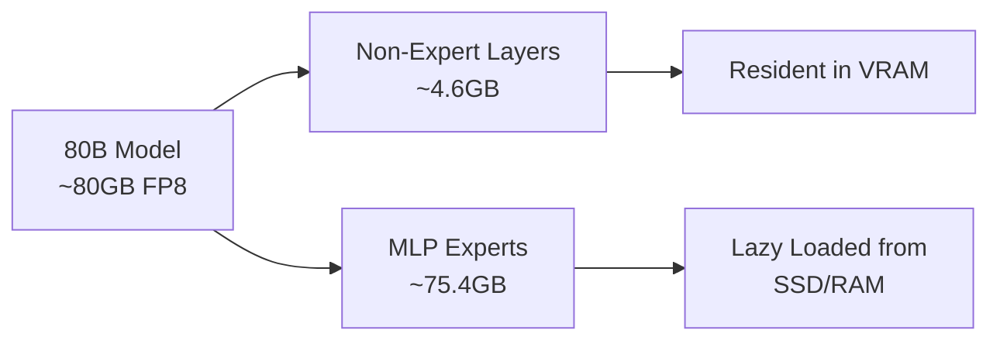

## Overview

What if you could run an 80B parameter coding-specialized model on a laptop GPU with just 8GB VRAM? A developer named <strong>nalexand</strong> from Reddit's r/LocalLLaMA community released a project that makes this possible. They successfully ran Qwen3-Coder-Next 80B on an RTX 3070Ti (8GB VRAM) at <strong>1.2 tokens/s</strong>.

This article analyzes the project's core technologies — FP8 quantization, expert lazy loading, and cache optimization strategies — and examines the practical implications and limitations of running large LLMs on consumer GPUs.

## The Core Challenge: Fitting 80B into 8GB

### Why It Seems Impossible

Qwen3-Coder-Next is an 80B parameter model. Even with FP8 quantization, the model size reaches approximately <strong>80GB</strong>. In an 8GB VRAM + 32GB RAM environment, loading the entire model into memory is simply impossible.

### First Attempt: Disk Offloading

The developer first tried disk offloading using `device="auto"` with Hugging Face's <strong>accelerate</strong> library. The results were dismal:

- Speed: <strong>1 token / 255 seconds</strong>
- Practically unusable

This was a textbook case of disk I/O bottlenecks destroying inference performance.

## The Solution: Expert Lazy Loading + Cache Optimization

### Leveraging MoE Architecture Characteristics

The key insight came from analyzing the model structure. Most large tensors in the 80B model are concentrated in <strong>MLP experts</strong>, while the remaining components fit within approximately <strong>4.6GB</strong> — well within VRAM capacity.



### Custom Lazy Loading System

The developer built a <strong>custom lazy loading</strong> system for MLP experts:

- <strong>2-tier cache</strong>: VRAM cache + Pinned RAM cache
- <strong>Cache hit rate</strong>: Up to 85%
- <strong>Speed improvement</strong>: 255s/token → 1.2 tokens/s (<strong>~300x speedup</strong>)

### Cache Parameter Tuning

```python
# VRAM cache size (each 18 units ≈ ~3GB)
self.max_gpu_cache = 18

# RAM cache size (based on pinnable memory)
self.max_ram_cache = 100
```

| GPU | Recommended max_gpu_cache | Expected Cache Hit Rate |
|-----|--------------------------|------------------------|
| RTX 3070Ti (8GB) | 18 | ~85% |
| RTX 5090 (32GB) | 120 | >85% |

## Tech Stack and Installation

### Requirements

- <strong>Model</strong>: `Qwen/Qwen3-Coder-Next-FP8` (download from Hugging Face)
- <strong>GPU</strong>: 8GB+ VRAM
- <strong>RAM</strong>: 32GB+ (pinnable memory is typically 1/2 of total RAM)
- <strong>Storage</strong>: Fast NVMe SSD recommended (PCIe 5.0 RAID 0 up to 30GB/s)

### Installation Steps

```bash
# 1. Download the model
hf-download Qwen/Qwen3-Coder-Next-FP8

# 2. Replace the modeling file in transformers library
# Replace transformers/models/qwen3_next/modeling_qwen3_next.py

# 3. Extract MLP experts
python extract_mlp.py

# 4. Run the chatbot
python coder_80b_next_chat.py
```

## Real-World Performance Benchmarks

Here are the cache warmup test results shared by the developer:

| Prompt | Tokens | Time | Speed |
|--------|--------|------|-------|
| First "hi" | 11 | 21.25s | 0.52 t/s |
| Second "hi" | 26 | 25.36s | 1.03 t/s |
| "all good" | 50 | 41.70s | 1.20 t/s |
| Long response (807 tokens) | 807 | 668.81s | 1.21 t/s |

After cache warmup, the system consistently maintains <strong>~1.2 t/s</strong>. The first request is slower due to cache misses, but subsequent requests benefit from higher cache hit rates.

## Practicality and Limitations

### Advantages

- <strong>Cost</strong>: Run an 80B coding model locally without cloud API costs
- <strong>Privacy</strong>: Code never leaves your machine
- <strong>Offline</strong>: Works without internet connection

### Limitations

- <strong>Speed</strong>: 1.2 t/s is insufficient for real-time coding assistance (Claude and GPT APIs deliver 30-80 t/s)
- <strong>Initial latency</strong>: Cache warmup takes time
- <strong>Installation complexity</strong>: Requires manual modification of transformers library files
- <strong>Memory requirements</strong>: 32GB RAM is still needed

### Future Outlook

| GPU | VRAM | Expected Speed |
|-----|------|---------------|
| RTX 3070Ti | 8GB | ~1.2 t/s (confirmed) |
| RTX 4090 | 24GB | 5-10 t/s (estimated) |
| RTX 5090 | 32GB | 20+ t/s (developer's estimate) |

With the RTX 5090's 32GB VRAM and high memory bandwidth, setting `max_gpu_cache=120` could potentially achieve 20+ t/s.

## The Frontier of Local LLM Coding

This project embodies the local LLM community's spirit of making the impossible possible. Developer <strong>nalexand</strong> has previously optimized various large models for low-spec GPUs, including LTX-2, Wan2.2, HeartMula, and ACE-Step 1.5.

Key takeaways:

1. <strong>Model structure analysis is the starting point for optimization</strong>: Understanding expert distribution in MoE models enables selective loading
2. <strong>Multi-tier caching is essential</strong>: A VRAM → Pinned RAM → SSD caching strategy achieved a 300x speedup
3. <strong>Hardware evolution narrows the gap</strong>: Next-generation GPUs may reach practical speeds

## Conclusion

Running Qwen3-Coder-Next 80B on 8GB VRAM is a technically impressive achievement. While the current 1.2 t/s speed is insufficient for real-time coding assistance, advances in next-generation GPUs and optimization techniques are bringing large coding model execution on consumer hardware increasingly closer to reality.

Developers interested in local LLMs should check out [nalexand's GitHub repository](https://github.com/nalexand/Qwen3-Coder-OPTIMIZED) and experiment with their own hardware.

## References

- [Qwen3-Coder-OPTIMIZED GitHub](https://github.com/nalexand/Qwen3-Coder-OPTIMIZED)
- [Reddit r/LocalLLaMA Original Post](https://www.reddit.com/r/LocalLLaMA/comments/1r5m4vl/how_to_run_qwen3codernext_80b_parameters_model_on/)
- [Qwen3-Coder-Next-FP8 Model (Hugging Face)](https://huggingface.co/Qwen/Qwen3-Coder-Next-FP8)
