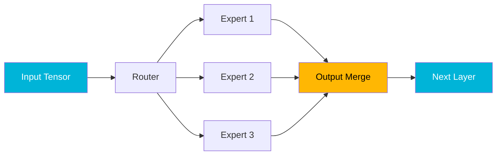

## Overview

llama.cpp core developer <strong>ggerganov</strong> has published [PR #19375](https://github.com/ggml-org/llama.cpp/pull/19375), optimizing the compute graph for the Qwen3 Coder Next model. By eliminating unnecessary tensor copy operations and restructuring inference paths at the graph level, this optimization achieves <strong>up to 38% speedup on M2 Ultra</strong> and <strong>up to 38% on DGX Spark</strong>. With over 177 points on Reddit r/LocalLLaMA, let's examine the core of this optimization.

## Core Idea: Graph-Level Optimization

The core idea is straightforward: <strong>remove unnecessary tensor copy operations</strong> from the ggml compute graph.

Qwen3 Coder Next uses a MoE (Mixture of Experts) architecture where routers select which experts to activate and combine their outputs. The original implementation inserted excessive intermediate tensor copies for safety. ggerganov kept only the truly necessary copies and removed the rest.

## Benchmark Results

### M2 Ultra Performance

Benchmarks for the Qwen3 Coder Next 80B.A3B model across different quantization levels.

#### Q4_0 Quantization

| Test | Baseline (t/s) | Optimized (t/s) | Speedup |
|------|----------------|-----------------|---------|
| pp1 (single token) | 37.92 | 51.99 | <strong>1.37x</strong> |
| pp8 (8-token batch) | 137.75 | 176.36 | <strong>1.28x</strong> |
| pp512 (prompt) | 930.70 | 1125.73 | <strong>1.21x</strong> |
| pp2048 (long prompt) | 1049.91 | 1352.31 | <strong>1.29x</strong> |
| tg32 (generation) | 38.02 | 50.39 | <strong>1.33x</strong> |

#### Q4_K_M Quantization

| Test | Baseline (t/s) | Optimized (t/s) | Speedup |
|------|----------------|-----------------|---------|
| pp1 | 34.00 | 46.47 | <strong>1.37x</strong> |
| pp2048 | 977.30 | 1232.47 | <strong>1.26x</strong> |
| tg32 | 34.63 | 46.43 | <strong>1.34x</strong> |

#### Q8_0 Quantization

| Test | Baseline (t/s) | Optimized (t/s) | Speedup |
|------|----------------|-----------------|---------|
| pp1 | 34.38 | 43.98 | <strong>1.28x</strong> |
| pp2048 | 1047.39 | 1338.82 | <strong>1.28x</strong> |
| tg32 | 33.75 | 43.78 | <strong>1.30x</strong> |

### DGX Spark Performance

Significant improvements are also observed on the NVIDIA DGX Spark.

| Quant | Test | Baseline (t/s) | Optimized (t/s) | Speedup |
|-------|------|----------------|-----------------|---------|
| Q4_0 | pp512 | 1055.58 | 1161.67 | <strong>1.10x</strong> |
| Q4_0 | pp2048 | 1059.00 | 1324.66 | <strong>1.25x</strong> |
| Q4_0 | tg32 | 43.11 | 59.58 | <strong>1.38x</strong> |
| Q8_0 | pp2048 | 1009.43 | 1246.61 | <strong>1.23x</strong> |
| Q8_0 | tg32 | 31.13 | 39.68 | <strong>1.27x</strong> |

Notably, the DGX Spark achieves a <strong>38% speedup</strong> in tg32 (token generation) with Q4_0 quantization.

## Technical Background: Related Backend Optimizations

This PR doesn't exist in isolation. For graph optimization to be effective, each backend (Metal, CUDA, Vulkan) needs to handle non-contiguous tensors directly.

### Metal (Apple Silicon)

- <strong>Adaptive CPU/GPU interleave</strong> ([#19369](https://github.com/ggml-org/llama.cpp/pull/19369)): Dynamic workload distribution based on node count
- <strong>Binary kernel consolidation</strong> ([#19390](https://github.com/ggml-org/llama.cpp/pull/19390)): Duplicate kernel code removal
- <strong>Unary ops consolidation</strong> ([#19490](https://github.com/ggml-org/llama.cpp/pull/19490)): Improved unary operation handling
- <strong>Non-contiguous L2 norm support</strong> ([#19502](https://github.com/ggml-org/llama.cpp/pull/19502))
- <strong>Concurrency improvements</strong> ([#19555](https://github.com/ggml-org/llama.cpp/pull/19555))

### CUDA (NVIDIA GPU)

- <strong>Non-contiguous tensor PAD extension</strong> ([#19429](https://github.com/ggml-org/llama.cpp/pull/19429))
- <strong>CUDA graphs enabled</strong> ([#19521](https://github.com/ggml-org/llama.cpp/pull/19521)): For Qwen3 Next-style architectures
- <strong>Prevent cgraph mutation for fused ADDs</strong> ([#19566](https://github.com/ggml-org/llama.cpp/pull/19566))

### Vulkan

- <strong>L2_NORM contiguous row support</strong> ([#19604](https://github.com/ggml-org/llama.cpp/pull/19604))
- <strong>GGML_OP_SET support</strong> ([#19584](https://github.com/ggml-org/llama.cpp/pull/19584))

## Caveat: BF16 Tensor Issue

Some GGUF files may incorrectly contain 1D BF16 tensors. These can hurt performance on backends like Metal. [#19606](https://github.com/ggml-org/llama.cpp/pull/19606) fixes this by storing `ffn_gate_inp_shexp` tensors as F32.

## What's Next

ggerganov has outlined further optimizations:

1. <strong>Qwen3 family code deduplication</strong> ([#19597](https://github.com/ggml-org/llama.cpp/pull/19597)): Sharing delta-net graphs
2. <strong>`ggml_build_forward_select()` utilization</strong>: Making the graph constant for further optimization
3. <strong>Dedicated delta net ggml op</strong> ([#19504](https://github.com/ggml-org/llama.cpp/pull/19504)): More efficient kernel execution

## Impact for Local LLM Users

Here's what this optimization means in practice:

- <strong>Apple Silicon users</strong>: Run the 80B MoE model at ~50 t/s on M2 Ultra for tg32. That's more than enough for real-time conversation.
- <strong>NVIDIA GPU users</strong>: 20–38% speedup on DGX Spark. CUDA graph support promises further improvements.
- <strong>Quantization choice</strong>: Q4_0 shows the largest gains, but Q4_K_M and Q8_0 also deliver consistent 20–37% improvements.
- <strong>No code changes needed</strong>: Simply update llama.cpp to the latest version.

## Conclusion

ggerganov's graph-level optimization significantly improves MoE model inference performance in llama.cpp. Rather than optimizing individual kernels, the approach of <strong>restructuring the compute graph itself</strong> is impressive. Combined with parallel efforts to expand non-contiguous tensor support across multiple backends (Metal, CUDA, Vulkan), this pushes the boundaries of local LLM inference performance.

If you're running MoE models like Qwen3 Coder Next locally, update llama.cpp to the latest version and experience the speedup immediately.

## References

- [PR #19375: models : optimizing qwen3next graph](https://github.com/ggml-org/llama.cpp/pull/19375)
- [Reddit r/LocalLLaMA Discussion](https://www.reddit.com/r/LocalLLaMA/)
- [llama.cpp GitHub Repository](https://github.com/ggml-org/llama.cpp)
