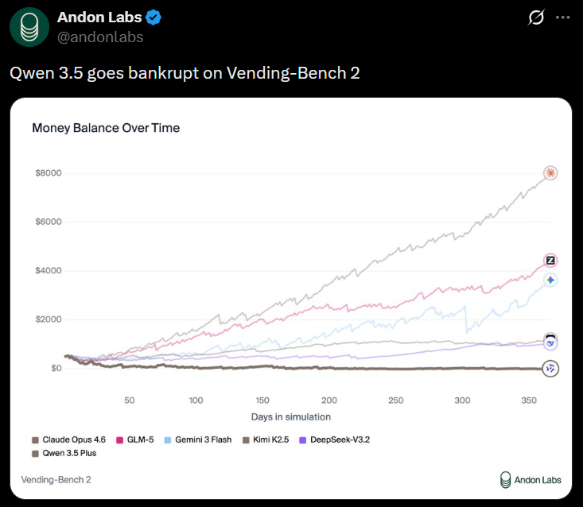
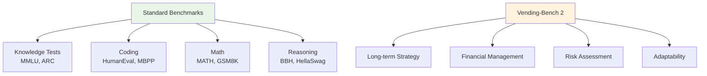
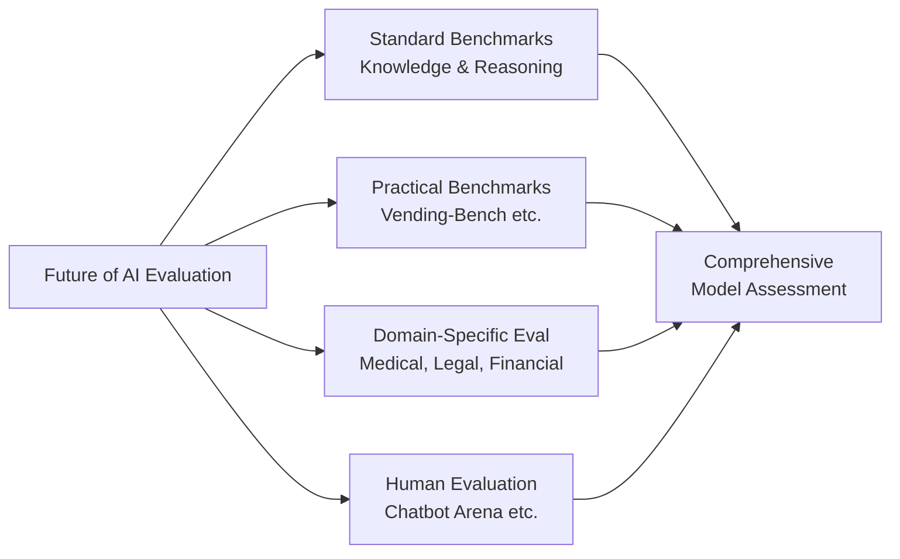

## Overview

Alibaba's large language model <strong>Qwen 3.5 Plus</strong> consistently ranks at the top of standard benchmarks like MMLU, HumanEval, and MATH. However, on <strong>Vending-Bench 2</strong>, a non-standard benchmark developed by Andon Labs, the model delivered a shocking result: <strong>bankruptcy</strong>. This finding garnered over 595 upvotes on Reddit's r/LocalLLaMA, sparking a broader discussion about how we evaluate AI models.

## What Is Vending-Bench 2?

Vending-Bench 2 is a <strong>vending machine business simulation benchmark</strong> developed by Andon Labs. It tasks AI models with running a virtual vending machine business over approximately 365 days, comprehensively measuring <strong>financial management, decision-making, and strategic planning</strong> capabilities.

Unlike traditional benchmarks, it measures practical abilities such as:

- <strong>Long-term strategic thinking</strong>: Continuous business decisions over a full year
- <strong>Financial risk management</strong>: Balancing profitability with sustainability
- <strong>Adaptability</strong>: Responding to changing simulation conditions
- <strong>Applied reasoning</strong>: Not just knowledge, but the ability to apply it

## Shocking Results: Qwen 3.5 Finishes Last with Bankruptcy

The chart above shows each model's performance over the 365-day simulation:

| Rank | Model | Final Balance (Approx.) |
|------|-------|------------------------|
| 1st | GLM-5 | ~$8,000+ |
| 2nd | Gemini 3 Flash | ~$4,000–$4,500 |
| 3rd | Kimi K2.5 | ~$3,500–$4,000 |
| 4th | Claude Opus 4.6 | ~$2,000–$2,500 |
| 5th | DeepSeek-V3.2 | ~$200–$500 |
| 6th | <strong>Qwen 3.5 Plus</strong> | <strong>~$0 (Bankrupt)</strong> |

A model that ranks among the best on standard benchmarks finished <strong>dead last</strong> with zero balance — a truly stunning result.

## Why Does This Discrepancy Exist?

### The Limits of Standard Benchmarks

Standard benchmarks excel at measuring <strong>static knowledge and isolated tasks</strong>. However, they fail to capture:

- <strong>Consistency in multi-step decision-making</strong>
- <strong>Judgment under uncertainty</strong>
- <strong>Strategic thinking that accounts for long-term outcomes</strong>
- <strong>Trade-off evaluation and selection</strong>

### The Benchmark Optimization Problem

In AI development, improving standard benchmark scores has become a key metric. This leads to a phenomenon known as <strong>"benchmark hacking"</strong>:

1. <strong>Overfitting risk</strong>: Specializing in patterns similar to benchmark tests
2. <strong>Reduced generalization</strong>: Sacrificing ability to handle unexpected tasks
3. <strong>Gap between apparent and real-world performance</strong>: Great numbers, poor practical utility

## Community Reaction

The Reddit r/LocalLLaMA discussion featured notable perspectives:

- <strong>"Active parameters ≠ intelligence"</strong>: Model size alone doesn't determine capability
- <strong>Architecture matters</strong>: MoE (Mixture of Experts) routing efficiency significantly impacts results
- <strong>Training data quality</strong>: Not just quantity, but quality and diversity matter

GLM-5's dominant performance at over $8,000 profit is also noteworthy. Models that rank below Qwen 3.5 on standard benchmarks can dramatically outperform it on practical tasks.

## The Future of AI Evaluation

### The Need for Multi-Dimensional Assessment

These results clearly demonstrate that <strong>no single benchmark should determine a model's overall capability</strong>:

1. <strong>Multi-dimensional evaluation</strong>: Assessing knowledge, reasoning, practical application, and creativity
2. <strong>Real-world simulations</strong>: Expanding practical benchmarks like Vending-Bench
3. <strong>Domain-specific evaluation</strong>: Specialized testing aligned with intended use cases
4. <strong>Continuous monitoring</strong>: Evaluation across varied conditions, not just one-time tests

## Conclusion

Qwen 3.5 Plus's bankruptcy on Vending-Bench 2 is a stark reminder of <strong>the dangers of benchmark-obsessed AI evaluation</strong>. The fact that a top-ranking model on standard benchmarks can finish last in a practical scenario underscores the need to look beyond numbers when choosing AI models.

Measuring AI's true capabilities requires not just standardized tests but <strong>diverse benchmarks that reflect real-world complexity</strong>.

## References

- [Reddit r/LocalLLaMA — Qwen 3.5 goes bankrupt on Vending-Bench 2](https://www.reddit.com/r/LocalLLaMA/comments/1r6ghty/qwen_35_goes_bankrupt_on_vendingbench_2/)
- [Andon Labs](https://andonlabs.com/)
