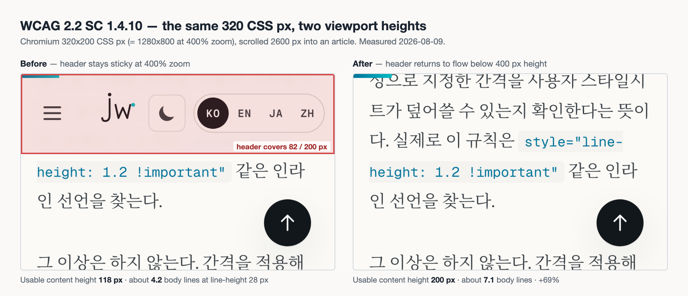

Everyone tests reflow the same way. Drag the window to 320px, look for a horizontal scrollbar, move on. I've done it that way for years, and the habit has a blind spot baked into it.

400% zoom doesn't only squeeze the width. On a 1280x800 laptop it produces a viewport of 320x200 CSS px. The 320 is the number we all check. The 200 is the number nobody checks, and it's where my own site was quietly awful.

So I ran three conditions side by side over 16 pages, holding the width at 320 and varying only the height. The horizontal answer came back identical all three times. The vertical answer did not.

## Where 320 and 256 come from

Reflow is Success Criterion 1.4.10 in WCAG 2.2, Level AA. Here is the normative text, from the [W3C's WCAG 2.2 Recommendation](https://www.w3.org/TR/WCAG22/#reflow):

> Content can be presented without loss of information or functionality, and without requiring scrolling in two dimensions for:
>
> - Vertical scrolling content at a width equivalent to 320 CSS pixels;
> - Horizontal scrolling content at a height equivalent to 256 CSS pixels.
>
> Except for parts of the content which require two-dimensional layout for usage or meaning.

The operative phrase is "requiring scrolling in two dimensions." The question is not whether something sticks out horizontally. It is whether *reading* forces you to scroll both ways. That distinction later decided the fate of 24 elements in my sample.

The [Understanding document](https://www.w3.org/WAI/WCAG22/Understanding/reflow.html) says where 320 comes from:

> 320 CSS pixels is equivalent to a starting viewport width of 1280 CSS pixels wide at 400% zoom.

So 320px is not a number about small phones. It's a number about a person who zooms a 1280px window to 400% because they need the text bigger. The same document gives the vertical-writing equivalent: "256 CSS pixels is equivalent to a starting viewport height of 1024 CSS pixels at 400% zoom."

Follow that arithmetic one step further and you get the premise of this post. If 400% zoom takes the width from 1280 to 320, the same zoom takes the height from 800 to 200. The criterion only puts a number on width because that's where loss shows up in vertically scrolling content, not because the height stays put. A sideways-only window drag skips that half entirely.

There's an exception clause too, and the Understanding document is unusually concrete about it:

> Examples of content which requires two-dimensional layout are images required for understanding (such as maps and diagrams), video, games, presentations, data tables (not individual cells), and interfaces where it is necessary to keep toolbars in view while manipulating content.

Data tables are exempt. Individual cells are not. Worth remembering before you go reformatting every table on the site.

## Running all three conditions at once

I measured the build output. `npm run build` produces 1,366 HTML files in `dist/`, and I sampled 16 URLs from it: four language homepages, listing pages, five article pages, and a handful of static pages. A local static server served them to Chromium via Playwright 1.57.0. Node 22.22, `deviceScaleFactor` pinned to 1, motion set to `reduce`.

Three conditions, all 320 wide:

| Condition | Viewport | What it stands in for |
|---|---|---|
| `narrow` | 320 x 844 | a narrow phone |
| `floor` | 320 x 256 | the height floor named in the criterion |
| `zoom400` | 320 x 200 | a 1280x800 screen at 400% zoom |

Two things came out of every page. First, how many pixels the document's `scrollWidth` exceeded `innerWidth`, which is page-level horizontal overflow. Second, how much vertical space `position: sticky` and `position: fixed` elements occupied at the top and bottom edges, and what was left over.

The baseline:

| Condition | Pages with horizontal scroll | Max overflow | Median usable height | Usable ratio |
|---|---|---|---|---|
| 320 x 844 | 16 / 16 | 17 px | 762 px | 90.3% |
| 320 x 256 | 16 / 16 | 17 px | 174 px | 68.0% |
| 320 x 200 | 16 / 16 | 17 px | 118 px | 59.0% |

Look at the horizontal columns. Not merely similar. Identical. Same pages, same distribution of overflow values (fourteen at 2px, one at 10px, one at 17px). I measured three times and got the same answer three times.

That's a useful result rather than a wasted one. It says the horizontal verdict for 1.4.10 does not depend on viewport height, so if width is all you care about, one condition will do. Which means the value of running three conditions lives entirely in the other column: 90.3% versus 59.0%, a gap of 31 points.

## 24 of the 43 overflows weren't failures

Drop to the element level and the picture gets messy. Across the sample, 43 elements had a right edge outside the viewport. The worst offender was a `code` element in one article, sticking out 585px. That page's page-level overflow was 2px.

The reason is boring: the `code` lives inside a `pre` with `overflow-x` set. The `pre` absorbs the scroll, so the page doesn't move sideways. This is exactly what "requiring scrolling in two dimensions" is protecting. The reader pans inside a code block; they don't pan the page.

So the audit script climbs the ancestor chain:

```js
let inScrollContainer = null;
for (let p = el.parentElement; p && p !== document.body; p = p.parentElement) {
  const pcs = getComputedStyle(p);
  if ((pcs.overflowX === 'auto' || pcs.overflowX === 'scroll' || pcs.overflowX === 'hidden')
    && p.scrollWidth > p.clientWidth + 1) {
    inScrollContainer = p.tagName.toLowerCase() + ':' + pcs.overflowX;
    break;
  }
}
```

That single check split 43 into 24 and 19. The absorbed 24 were eighteen `code` elements inside `pre`, plus six `thead`/`tbody` inside table wrappers. The remaining 19 were genuinely pushing the page sideways.

Run a reflow audit element-by-element and all 24 land on your list. You'll then spend an afternoon "fixing" code blocks that were never broken. The unit of judgement is the scroll container, not the element.

One honest caveat: classifying the wrapped tables as absorbed overlaps with the criterion's own exception clause, so there's judgement in it. Understanding names data tables as exempt, so the direction is right, but my script is not rendering a spec verdict.

## Three ways a page actually gets pushed sideways

The surviving 19 sorted cleanly into three kinds. Different causes, different fixes.

<strong>One: the header control row.</strong> The same element overflowed by 2px on all 16 pages: the theme toggle and language switcher cluster on the right. At 320px, subtracting 16px of `nav` padding on each side leaves 288px, and the intrinsic widths of the brand mark, menu button and right-hand controls came to 290. Fourteen of the sixteen observed overflows trace back to this one spot.

<strong>Two: an unbreakable string.</strong> Two cards on the contact page overflowed by 10px each. Each card holds an email address as a single unbroken token, and that token shoved the card out of its 288px track. Measured card width: 314px.

<strong>Three: a multi-column grid that never collapses.</strong> The `.before-after` block on the improvement-history page overflowed by 17px. It uses `grid-template-columns: 1fr auto 1fr` to line up before, arrow, after. There is no narrow-width escape hatch, so it insists on three columns at 320px too.

The taxonomy earns its keep because the fixes diverge. The first is a padding tweak. The third is one media query. The second was not that simple.

## `break-word` doesn't fix it, and the spec says so

A long email address stretching its container is a familiar bug, so I reached for Tailwind's `break-words` without thinking. Re-measured. Card still 314px, overflow still 10px.

That isn't a Tailwind bug. It's how [CSS Text Module Level 3](https://www.w3.org/TR/css-text-3/#overflow-wrap-property) defines the value:

> As for `anywhere` except that soft wrap opportunities introduced by `break-word` are *not* considered when calculating min-content intrinsic sizes.

And the line immediately above it, for `anywhere`:

> Soft wrap opportunities introduced by `anywhere` *are considered* when calculating min-content intrinsic sizes.

Grid and flex items default to `min-width: auto`, which follows the min-content size of their contents. Since `break-word`'s wrap opportunities don't count toward that number, the track keeps sizing itself to the full unbroken address. The text visibly wraps. The box does not shrink. It's a great way to convince yourself you fixed something.

Before touching the blog, I isolated it. Four cards in a 288px grid track, same email address, different treatments:

| Treatment | Measured card width |
|---|---|
| none | 304 px |
| `overflow-wrap: break-word` | 304 px |
| `overflow-wrap: anywhere` | 288 px |
| `min-width: 0` on the item + `break-word` | 288 px |

Exactly what the spec says. `break-word` moves nothing; `anywhere` and `min-width: 0` snap the card to the track. I shipped `overflow-wrap: anywhere`.

What makes this trap annoying is how quiet the failure is. You applied a style, the text wraps, something visibly changed. Only the page overflow stayed put. Same family of trap as the one in my [1.4.12 letter-spacing run](/en/blog/en/text-spacing-1412-clamp-audit-2026), where the metric couldn't see the failure. Here the remedy couldn't reach the cause.

## What 400% zoom really changes

That's the horizontal story. The reason for running three conditions is vertical.

The sticky header measures 82px. On an 844px viewport that's 9.7% and nobody notices. On a 200px viewport it's 41%. What's left is 118px, and with a body line-height of 28px, a reader gets a little over four lines per screen.



Both shots are the same viewport on the same article, scrolled 2,600px in. Left is the old behaviour, right is after the fix.

To be clear: this is not a 1.4.10 failure. The criterion judges two-dimensional scrolling, and a header consuming vertical space isn't on that list. You can pass and still hand someone four lines.

I'd still fix it. If 320 is a number derived from zoom users, then the 200 that same zoom produces belongs to the same people. Accommodating them on width while ignoring height is incoherent. And note that the exception list includes "interfaces where it is necessary to keep toolbars in view while manipulating content". A UI like that has grounds to hold screen space when you're operating on content. A blog header isn't that. Nobody needs the language switcher hovering while they read a paragraph.

## Fixed, then measured again

Four changes.

```css
/* Header.astro: the 2px control-row overflow at 320px */
@media (max-width: 400px) {
  .site-header > nav { padding-inline: 0.75rem; }
  .site-header__row { gap: 0.5rem; }
}

/* Header.astro: give the height back on short viewports */
@media (max-height: 400px) {
  .site-header { position: static; }
}
```

```css
/* improvement-history: unstack at narrow widths, turn the arrow */
@media (max-width: 480px) {
  .before-after { grid-template-columns: 1fr; gap: 0.5rem; }
  .arrow { transform: rotate(90deg); }
}
```

Plus `overflow-wrap: anywhere` on the email address.

The fourth one has a wrinkle. When I fixed [focus obscured by that same sticky header](/en/blog/en/focus-not-obscured-sticky-header-scroll-padding-2026) last month, I set `scroll-padding-top` to 96px so focused elements land below the 82px bar. Leave that at 96px on a viewport where the header no longer sticks, and you throw away nearly half of a 200px screen as scroll padding. A value added for one success criterion becomes dead weight under another one's conditions.

```css
@media (max-height: 400px) {
  html {
    --header-height: 0px;
    scroll-padding-top: 1rem;
  }
}
```

Rebuilt, reran the same script against the same 16 URLs.

| Condition | Pages with horizontal scroll (before → after) | Max overflow | Usable ratio (before → after) |
|---|---|---|---|
| 320 x 844 | 16 → 0 | 17 → 0 px | 90.3% → 90.3% |
| 320 x 256 | 16 → 0 | 17 → 0 px | 68.0% → 100.0% |
| 320 x 200 | 16 → 0 | 17 → 0 px | 59.0% → 100.0% |

Usable height at 400% zoom went from 118px to 200px. In lines, 4.2 to 7.1, up 69%. The 90.3% at 844px is unchanged on purpose. At that height I want the header sticky, and the media query is cut to say so.

## Automated checkers don't look here

`axe-core` 4.13.0 ships 105 rules. None carries a `wcag1410` tag. The near-misses are different animals: `meta-viewport` checks that you haven't disabled zoom (1.4.4), and `scrollable-region-focusable` checks that keyboards can reach scrollable regions (2.1.1).

That's expected. Reflow can only be decided by changing the viewport and re-rendering, which is not how a rule engine that walks the DOM once operates. I'd already inventoried which criteria fall outside automated reach [when I counted rule coverage](/en/blog/en/act-rules-axe-coverage-wcag-sc-2026). But "outside automated reach" means measure it yourself, not skip it. Today's script is about a hundred lines and took under a minute to cover 16 pages in three conditions.

## The two pages that "passed" on the first run

On the first run, two of the sixteen came back with 0px overflow and 100% usable height. Lovely numbers. I nearly wrote a sentence about some pages already being clean.

Those two URLs didn't exist. The local server returned 404, the 404 body has no header, so there was nothing to overflow and no sticky element to measure. A perfect score, generated by measuring nothing.

The script now asserts on the response:

```js
const resp = await page.goto(`http://localhost:${port}${u}`, { waitUntil: 'networkidle' });
if (!resp || resp.status() !== 200) {
  throw new Error(`${u} returned ${resp ? resp.status() : 'no response'} fix the sample URL`);
}
```

This is generally the shape of a measurement tool lying to you. The number doesn't look wrong enough to investigate; it looks good enough to skip past. If your audit script carries a hand-written URL list, a status assertion isn't optional.

## What this run doesn't answer

One macOS machine, one Chromium build. I did not check other engines.

Emulation is not literal browser zoom. I set a 320x200 viewport; I did not turn the zoom control to 400%. Layout should be the same, and layout is what 1.4.10 judges, but device pixel ratio and `srcset` selection differ between the two. If you care about which image variant loads, measure with real zoom.

Sixteen pages out of 1,366. I picked for template coverage rather than volume, and only five of them were articles. Since scroll-container classification drives the element-level numbers, article-heavy sampling could move them.

Horizontal writing only. The criterion's second clause, horizontally scrolling content at a height of 256 CSS px, applies to vertical writing modes, and nothing on my site uses `writing-mode: vertical-rl`, so there was nothing to measure. A site that does needs that axis checked separately.

And I didn't measure overlap-type content loss. This script sees document-level horizontal overflow and fixed-element vertical occupancy. That's all.

## An afternoon's checklist

1. Pull 10–20 URLs per template from the build output. Mix home, listing, article, and a static page with a form on it.
2. Assert the response is 200 before measuring. This stops you from auditing a 404 and calling it a pass.
3. Measure horizontal overflow at one 320px-wide condition. Any height. All three give the same answer.
4. Filter overflowing elements by whether an ancestor is a real horizontal scroll container. Don't fix the filtered ones.
5. Sort what's left into three buckets: intrinsic width of a control row, unbreakable long strings, multi-column grids that never collapse.
6. For long strings use `overflow-wrap: anywhere`. `break-word` won't shrink min-content.
7. Run one extra pass at 200px height. Compute what percentage of the viewport your sticky and fixed elements consume.
8. Above 30%, consider returning them to flow with `@media (max-height: ...)`. If you set `scroll-padding-top` for a sticky header, shrink that too.

Steps 7 and 8 aren't part of the 1.4.10 verdict. They tell you, pass or fail, how many lines a zoom user is actually left with. Mine was 4.2.

400% zoom usually sits on the last line of an accessibility checklist and usually gets cleared by eyeballing it once. Turning that line into measured numbers and a script you can rerun is work I'll take. One route in: the [contact page](/en/contact/).

---

*Sources: the W3C's [WCAG 2.2 Success Criterion 1.4.10 Reflow](https://www.w3.org/TR/WCAG22/#reflow) (W3C Recommendation, 12 December 2024), [Understanding SC 1.4.10](https://www.w3.org/WAI/WCAG22/Understanding/reflow.html), and [CSS Text Module Level 3](https://www.w3.org/TR/css-text-3/#overflow-wrap-property) (Candidate Recommendation) — all primary. The criterion text and both `overflow-wrap` definitions are quoted verbatim, with the source link immediately preceding each quote. Measurement setup: the jangwook.net production build (1,366 HTML files), 16 sampled URLs, viewports 320×844, 320×256 and 320×200, Playwright 1.57.0 with headless Chromium, Node 22.22, `deviceScaleFactor` 1, local static server, measured 9 August 2026. Script: `scripts/audit-reflow.mjs`; raw data in `data/reflow-audit.json` and `data/reflow-audit-after.json`. Setting a viewport is not the same as operating the browser's zoom control, so device pixel ratio and `srcset` selection may differ from real 400% zoom. Every number here comes from this engine and this sample; none of it is a claim about other sites' failure rates or other rendering engines. Overlap-type content loss and vertical writing modes were not measured.*
